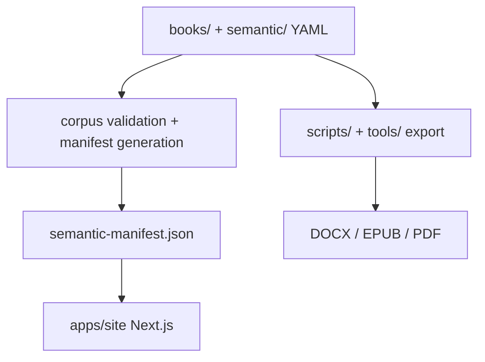

# After Certainty

After Certainty is an open intellectual commons about thinking and acting when simple answers stop working.

This repository holds the project’s books and essays, a semantic graph of concepts, patterns, situations, thinkers, sources, songs, and relationships, curated questions and trails, interactive experiences, and the tooling that publishes manuscripts and powers the public website.

## Visit the project

The best starting point for reading and exploring is the live site:

**[https://www.after-certainty.com](https://www.after-certainty.com)**

- [Start Here](https://www.after-certainty.com/start)
- [Books](https://www.after-certainty.com/explore/books)
- [Explore / Observatory](https://www.after-certainty.com/explore?view=observatory)
- [Questions](https://www.after-certainty.com/questions) · [Trails](https://www.after-certainty.com/trails)
- [Listen](https://www.after-certainty.com/listen) · [Games](https://www.after-certainty.com/games) · [Podcast](https://www.after-certainty.com/podcast)

## What is in this repository?

| Path | Role |
|------|------|
| [`books/`](books/) | Published manuscripts (`index.md` + `book.yml` + chapters) |
| [`semantic/`](semantic/) | Semantic graph YAML (concepts, patterns, thinkers, sources, songs, trails, …) |
| [`apps/site/`](apps/site/) | Next.js public website |
| [`scripts/`](scripts/) · [`tools/`](tools/) | Publishing, manifest, and corpus tooling |
| [`schema/`](schema/) | Validated content and manifest schemas |
| [`docs/`](docs/) | Architecture, operations, roadmaps, and contributor guidance |
| [`upcoming/`](upcoming/) | Scaffolds and portfolio status before promotion into `books/` |
| [`packages/corpus-tasks/`](packages/corpus-tasks/) | npm/Turbo wrappers for covers and manifest generation |

## Choose your path

| I want to… | Start here |
|------------|------------|
| Read or explore After Certainty | [www.after-certainty.com](https://www.after-certainty.com) |
| Understand the corpus / semantic model | [`docs/corpus/`](docs/corpus/) · [`docs/semantic-manifest-contract.md`](docs/semantic-manifest-contract.md) |
| Work on the website | [`apps/site/README.md`](apps/site/README.md) |
| Publish or export a book | [`docs/publishing/book-export-pipeline.md`](docs/publishing/book-export-pipeline.md) |
| Contribute | [`CONTRIBUTING.md`](CONTRIBUTING.md) |
| Understand deployment / CI | [`docs/site-deploy.md`](docs/site-deploy.md) · [`docs/task-orchestration.md`](docs/task-orchestration.md) |
| Review security guidance | [`SECURITY.md`](SECURITY.md) · [`docs/security/`](docs/security/) |
| See all technical docs | [`docs/README.md`](docs/README.md) |
| Check remaining product work | [`docs/roadmaps/remaining-product-roadmap.md`](docs/roadmaps/remaining-product-roadmap.md) |

## Quick developer setup

Requires **Python 3.12.3** (floor: 3.12+) with [uv](https://github.com/astral-sh/uv), and **Node 22.22.2+**.

Optional: install [mise](https://mise.jdx.dev) and run `mise install` from the repo root to pin Python **3.12.3** and Node **22.22.2** (see [`mise.toml`](mise.toml)). Task discovery: `mise tasks`.

```bash
uv sync --frozen
npm ci
npm run corpus:build-manifest          # or: mise run manifest:build
npm run site:install-local-manifest    # or: mise run manifest:install
npm run site:dev:local                 # http://localhost:3000
# or: npm run site:dev:watch           # regenerate manifest on corpus changes
```

Useful checks: `mise run check` (or `make check`) · `npm run site:test` · `npm run site:lint`.

Orchestration map (mise / npm / Make / Turbo): [`docs/task-orchestration.md`](docs/task-orchestration.md).

Cursor Cloud PATH and runtime notes: [`AGENTS.md`](AGENTS.md). Full site setup: [`apps/site/README.md`](apps/site/README.md).

## Repository architecture

Books and semantic YAML are the source of truth. Validation and generation produce a **semantic manifest**. The website consumes that manifest; the publishing pipeline exports manuscripts independently.



Deeper maps: [`docs/task-orchestration.md`](docs/task-orchestration.md) · [`docs/semantic-manifest-contract.md`](docs/semantic-manifest-contract.md) · [`docs/README.md`](docs/README.md).

## Books / corpus

Manuscripts live under [`books/`](books/). For reading order and title-pair distinctions, see [`docs/series-guide.md`](docs/series-guide.md) and [`docs/portfolio-reader-map.md`](docs/portfolio-reader-map.md). For a complete repository path list, see [`docs/corpus/books.md`](docs/corpus/books.md). The live catalog is on the [website](https://www.after-certainty.com/explore/books).

Editorial portfolio status: [`upcoming/docs/portfolio-status.md`](upcoming/docs/portfolio-status.md).

## License

Unless otherwise noted, original content in this repository is licensed under [**Creative Commons Attribution-ShareAlike 4.0 International** (CC BY-SA 4.0)](https://creativecommons.org/licenses/by-sa/4.0/) — you may share and adapt the material provided you give appropriate credit and distribute derivatives under the same license. See [`LICENSE`](LICENSE) for the full legal terms.

## Security

See [`SECURITY.md`](SECURITY.md) and [`docs/security/`](docs/security/) for the threat model, credential-free Cursor setup, and the manual GitHub settings checklist. Prefer `uv sync --frozen` so CI and local installs match `uv.lock`.
