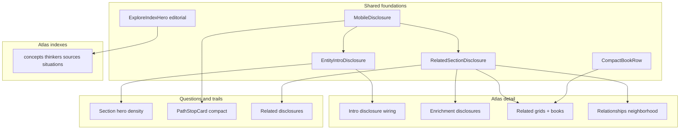
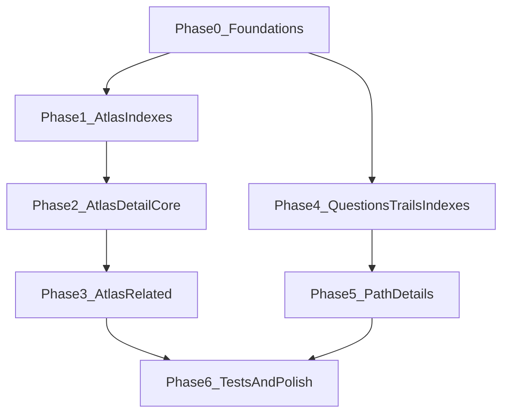

# Explore discovery mobile redesign

**Status:** Active specialized site plan (Phases 0–6 planned; not yet implemented)  
**Created:** 2026-08-03  
**Location:** `apps/site/docs/roadmaps/explore-discovery-mobile-redesign.md`  
**Authority:** Specialized UX/product plan. Does **not** replace [`docs/roadmaps/remaining-product-roadmap.md`](../../../../docs/roadmaps/remaining-product-roadmap.md). Unfinished follow-ups that become cross-layer backlog should be linked from the remaining-product roadmap.

**Document role:** Audit of remaining discovery surfaces (concepts, thinkers, sources, situations, questions, reader trails) against the completed Books and Patterns mobile redesign goals; inventory of reusable primitives; phased implementation roadmap.

**Precedents (complete):**

- Books: [`books-reader-redesign.md`](books-reader-redesign.md) (Phases A–G)
- Patterns: [`patterns-mobile-redesign.md`](patterns-mobile-redesign.md) (Phases 1–6)

> **Evidence rule:** Live routes, semantic data, and tests override planning-time snapshots. Invented counts, fabricated fields, and mockup-only copy are **not** corpus truth. Preserve After Certainty visual identity (typography, textures, colors, content hierarchy) while adopting mobile density and interaction. No Drive mockups exist for these surfaces — Books/Patterns principles are the design source.

---

## Design principles

- Compact, information-dense mobile layouts; restrained padding
- Progressive disclosure for long prose without removing meaningful content
- Reuse Books / Patterns mobile accordion, list-row, and disclosure primitives before inventing new ones
- Shared markup + responsive classes; avoid separate mobile/desktop content trees
- Accessible touch targets (~44px / `min-h-11`), keyboard behavior, `motion-reduce`
- Strong mobile performance (sized covers, lazy below-fold images, minimize hydration)
- Server-rendered semantic content for SEO; disclosure toggles visibility, does not fetch prose
- No URL changes; preserve metadata, JSON-LD, breadcrumbs, and inbound links
- No entity-specific hard coding in generic components; no corpus edits merely for UI convenience

---

## Locked approach decisions

1. **One plan, two cohorts** — Atlas pages share Explore browse chrome and catalog/detail templates; questions and trails share path chrome outside `(browse)`. Implementation phases follow that split (atlas can ship before path work, and vice versa after Phase 0 foundations).
2. **Hero density** — Atlas indexes adopt `ExploreIndexHero` `density="editorial"` + real `countLabel` (Patterns precedent). Questions/trails densify their existing `Section` heroes (reduce mobile vertical padding; keep brand hierarchy) — they do **not** switch to `ExploreIndexHero`.
3. **No Patterns-style item accordions on paginated catalogs** — Concepts, thinkers, and sources already use compact `ExploreCatalogCard` + search/pagination. Density gains come from hero, spacing, and detail disclosure — not accordion rows. Situations (smaller flat grid, no search) get the same hero/spacing treatment and keep cards unless inventory shows overflow.
4. **Generalize Patterns disclosure, don’t fork** — Extract a shared intro teaser from `PatternIntroDisclosure` for long entity definitions/summaries; apply existing `RelatedSectionDisclosure` + `CompactBookRow` to atlas related sections and enrichment blocks.
5. **Thinker provenance stays separate** — PROVENANCE-002–004 in the product roadmap (concept coverage panel, JSON-LD `knowsAbout`, thinkers-by-concept filter) are content/metadata features, not this UX density plan. Note them as adjacent; do not absorb them here.
6. **Footer out of scope** — Compact mobile footer already shipped site-wide in Patterns Phase 5.

---

## A. Current-state inventory

### A.1 Routes

| Surface | Route | Page / content file |
| --- | --- | --- |
| Concepts index | `/explore/concepts` | `app/explore/(browse)/concepts/page.tsx` |
| Concept detail | `/explore/concepts/[slug]` | `app/explore/(browse)/concepts/[slug]/page.tsx` |
| Thinkers index | `/explore/thinkers` | `app/explore/(browse)/thinkers/page.tsx` |
| Thinker detail | `/explore/thinkers/[slug]` | `app/explore/(browse)/thinkers/[slug]/page.tsx` |
| Sources index | `/explore/sources` | `app/explore/(browse)/sources/page.tsx` |
| Source detail | `/explore/sources/[slug]` | `app/explore/(browse)/sources/[slug]/page.tsx` |
| Situations index | `/explore/situations` | `app/explore/(browse)/situations/page.tsx` |
| Situation detail | `/explore/situations/[slug]` | `app/explore/(browse)/situations/[slug]/page.tsx` |
| Questions index | `/questions` | `app/questions/page.tsx` → `QuestionsIndexContent` |
| Question detail | `/questions/[slug]` | `app/questions/[slug]/page.tsx` |
| Trails index | `/trails` (+ optional `?theme=`) | `app/trails/page.tsx` → `TrailsIndexContent` |
| Trail detail | `/trails/[slug]` | `app/trails/[slug]/page.tsx` |

**Path helpers:** Atlas routes via `explorePaths` in `apps/site/lib/graph/explorePaths.ts`. Questions/trails use absolute `/questions` and `/trails`.

**Browse chrome:** `app/explore/(browse)/layout.tsx` → `ExploreLayout` (sidebar + `Container`) for atlas surfaces.  
**Path chrome:** Questions/trails use root `SiteShell` only (no Explore sidebar).  
**Site chrome:** `SiteShell` → `SiteHeader` / `#main` / `SiteFooter` (footer already compact on mobile).

### A.2 Atlas indexes stack

| Concern | Implementation | Mobile pressure |
| --- | --- | --- |
| Hero | `ExploreIndexHero` at **default** density | ~52vh / up to 600px; full-bleed image backdrop crowds first viewport |
| Count | Match counts live in search/result chrome only (concepts/thinkers/sources); situations have none in hero | Patterns already show count in editorial hero |
| Search | `ExploreIndexSearch` + pagination (concepts, thinkers, sources) | Situations: flat grid, no search |
| Cards | `ConceptCard` / `ThinkerCard` / `SourceCard` / `SituationCard` → `ExploreCatalogCard` (`layout="responsive"`) | Compact below `md` already; still lose first viewport to tall hero |
| Section padding | `py-10 md:py-20` (or similar) | Generous below hero vs explore density tokens |

**Key files:**

- `apps/site/components/explore/explore-hero.tsx` (`default` \| `compact` \| `editorial`)
- `apps/site/components/explore/explore-catalog-card.tsx`
- `apps/site/components/explore/concept-card.tsx` (and thinker/source/situation siblings)
- `apps/site/components/explore/explore-index-search.tsx`
- `apps/site/components/explore/explore-index-pagination.tsx`
- `apps/site/styles/tokens.css` (`--explore-*` density tokens)

### A.3 Atlas detail stacks

**Concepts** (`concepts/[slug]/page.tsx`) — densest atlas detail:

1. Breadcrumb + eyebrow + `h1`
2. Full definition always expanded (`getConceptFullDefinition` + `LinkifiedText`)
3. Optional `SemanticGroundingDisclosure`
4. `ExploreEntityDetailActions` + `ExploreAdjacentNav`
5. `ExploreEnrichmentSections` (recognition, questions, counterbalances, trajectory, manifestations)
6. `RelatedTrailsSection` / `RelatedChaptersSection`
7. `RelatedContentGrid` stacks (concepts, patterns, books, thinkers & sources) — all open
8. `SemanticRelationshipsSection`
9. `GraphNeighborhoodCards` (neighbors not already shown)

**Thinkers** — summary + why-this-matters always open; related works/concepts/patterns/books via `RelatedContentGrid`; no enrichment/relationships/neighborhood sections today.

**Sources** — display body + why-this-matters; creator thinker chips; related grids; optional “Intellectual lineage” relationships block.

**Situations** — summary always open; enrichment section; related patterns/concepts/books grids.

**Mobile pressure (all):** Long intro prose before related content; related grids fully expanded; enrichment blocks stack with large `gap-14`; section padding still desktop-generous on small screens.

### A.4 Questions & trails indexes

| Concern | Implementation | Mobile pressure |
| --- | --- | --- |
| Hero | Custom `Section` + `Container` (`py-16 md:py-24`) | Tall text hero; trails also includes comparative lede paragraph |
| Featured | 4-up grid (`sm:2` / `lg:4`) | Cards compete with hero for first viewport |
| Jump nav | Family anchors (questions) / theme filter links (trails, `?theme=`) | Already `min-h-11`; chrome is fine |
| Groups | Family / theme `Section`s with `py-14 md:py-20` | Generous vertical rhythm |

**Key files:**

- `apps/site/components/questions/questions-index-content.tsx`
- `apps/site/components/questions/question-card.tsx`
- `apps/site/components/trails/trails-index-content.tsx`
- `apps/site/components/trails/trail-card.tsx`

### A.5 Question & trail detail / path stops

| Concern | Implementation | Mobile pressure |
| --- | --- | --- |
| Intro | Orientation / summary / themes in `py-14 md:py-20` sections | Long orientation before path |
| Path | `QuestionPath` / `TrailPath` → `PathStopList` → `PathStopCard` | Cards use `p-6 md:p-8` with full description + why-this-follows always expanded |
| Progress | Local `ac` path progress in `PathStopList` | Resume chrome OK; keep on mobile |
| Related | Related question/trail card grids + continue-exploring lists | Fully expanded below path |

**Key files:**

- `apps/site/app/questions/[slug]/page.tsx`
- `apps/site/app/trails/[slug]/page.tsx`
- `apps/site/components/paths/path-stop-list.tsx`
- `apps/site/components/paths/path-stop-card.tsx`

### A.6 Reuse candidates (Books / Patterns)

| Existing | Path | Reuse role |
| --- | --- | --- |
| `ExploreIndexHero` `editorial` | `components/explore/explore-hero.tsx` | Atlas index first-viewport density + `countLabel` |
| `MobileDisclosure` / `MobileDisclosureGroup` | `components/ui/mobile-disclosure.tsx` | Shared ARIA / `min-h-11` / `alwaysOpenFromMd` |
| `RelatedSectionDisclosure` | `components/explore/related-section-disclosure.tsx` | Collapse related / enrichment / neighborhood on mobile with counts |
| `PatternIntroDisclosure` | `components/explore/pattern-intro-disclosure.tsx` | Template for entity-agnostic intro teaser |
| `CompactBookRow` | `components/explore/compact-book-row.tsx` | Related books on atlas detail |
| Explore density tokens | `styles/tokens.css` | Section / row spacing parity |
| `ExploreAdjacentNav` | `components/explore/explore-adjacent-nav.tsx` | Already densified for Patterns; verify 320px wrap |
| Compact `SiteFooter` | `components/layout/site-footer.tsx` | Already shipped — do not reopen |
| Vitest / Playwright conventions | `*.test.tsx`, `e2e/patterns-mobile.spec.ts` | Phase 6 test patterns |

### A.7 Breakpoints and responsive conventions

- Tailwind v4 defaults; site habit: **`md` (768px)** as the mobile / desktop split.
- Mobile-only behaviors target `< md`; desktop keeps fuller layouts via shared markup + responsive utilities — not duplicated page trees.

**Mobile-only (planned):**

- Editorial / denser atlas heroes
- Collapsed introductory definitions / orientations
- Collapsed related / enrichment / neighborhood sections with counts
- Compact related-book rows
- Denser path-stop cards
- Reduced section spacing on questions/trails

**Shared across viewports:**

- URLs, metadata, JSON-LD, breadcrumbs
- Data loaders and field helpers
- Search/pagination query params (`q`, `page`, `theme`)
- Heading hierarchy and link destinations
- Observatory / continue-exploring destinations
- Local path progress behavior

### A.8 Adjacent product work (out of scope)

| Item | Where tracked | Relationship |
| --- | --- | --- |
| Thinker concept coverage panel | PROVENANCE-002 | May land on thinker detail; coordinate spacing only |
| JSON-LD `knowsAbout` | PROVENANCE-003 | SEO — no mobile layout dependency |
| Thinkers-by-concept filter | PROVENANCE-004 | Index filter after concept links exist |
| Personal / collaborative trails | Deferred in product roadmap | Do not add auth or “add to trail” |
| Books / Patterns mobile redesign | Complete specialized plans | Reuse primitives; do not reopen |

### A.9 Testing stack

| Layer | Tool | Location / notes |
| --- | --- | --- |
| Unit / component | Vitest + Testing Library + user-event | Colocated `*.test.ts(x)` under `apps/site` |
| E2E | Playwright | `apps/site/e2e/` (`explore-indexes.spec.ts`, `trails.spec.ts`, `patterns-mobile.spec.ts`) |
| Corpus (repo) | pytest | `/workspace/tests/` — not for React UI |

Suggested visual widths: **320 / 375 / 390 / 430 / tablet / `md+`**.

---

## B. Target UX mapping

### B.1 Atlas indexes (concepts, thinkers, sources, situations)

| Area | Existing | Proposed | Data source | Mobile | Desktop |
| --- | --- | --- | --- | --- | --- |
| Hero | `ExploreIndexHero` default | `density="editorial"` + `countLabel` from real catalog length | Static lede + `items.length` (or filtered total when searching — prefer unfiltered catalog count in hero) | Text-first, short first viewport | Image-backed editorial plane from `md` (existing editorial behavior) |
| Catalog chrome | Search + pagination | Keep; optionally tighter top margin under hero | Existing browse helpers | Unchanged behavior | Unchanged |
| Cards | Responsive compact/detailed | Keep `ExploreCatalogCard` responsive; no item accordions | Entity fields already on cards | Compact cards | Detailed cards |
| Situations | Flat grid, no search | Same hero treatment; keep cards | `graph.situations` | Dense grid under short hero | Unchanged |
| Section spacing | `py-10 md:py-20` | Align mobile padding with explore density tokens | Tokens | Tighter | Keep roomier `md:` |

### B.2 Atlas detail

| Area | Existing | Proposed | Data source | Mobile | Desktop |
| --- | --- | --- | --- | --- | --- |
| Intro prose | Always expanded | Entity intro disclosure: teaser + “Read full …”; full prose in DOM | Definition / summary / body fields; teaser = first sentence(s) or shortDefinition when authored | Collapsed default when prose is long | Always open from `md` |
| Header spacing | `pt-10 md:pt-14` | Tighter mobile tokens | — | Dense | Unchanged intent |
| Enrichment | Full stack open | Collapse behind `RelatedSectionDisclosure` (per block or single group with counts) | `ExploreEnrichmentSections` fields | Collapsed default | Open from `md` |
| Related grids | Always open | `RelatedSectionDisclosure` + count | Related content helpers | Collapsed default | Open / grid |
| Related books | `BookCard` / catalog cards in grid | Prefer `CompactBookRow` when covers resolve | `related.books` + cover helpers | List rows | Grid or list OK |
| Relationships / neighborhood | Always open (concepts; sources lineage) | Collapse on mobile with counts | Relationship helpers / neighborhood | Collapsed default | Open |
| Prev / next | `ExploreAdjacentNav` | Keep densified wrap-safe behavior | Index-order adjacent helpers | Side-by-side, wrap | Same |
| Observatory CTA | `ExploreEntityDetailActions` | Keep reachable; do not bury | Focus href helpers | Compact placement | Unchanged intent |

**Intro disclosure threshold:** Apply when authored prose exceeds a short teaser (e.g. more than ~280 characters or more than two sentences). Short summaries stay always visible with no toggle chrome.

### B.3 Questions & trails indexes

| Area | Existing | Proposed | Data source | Mobile | Desktop |
| --- | --- | --- | --- | --- | --- |
| Hero | Tall `Section` padding | Reduce mobile `py-*`; keep eyebrow, title, one supporting lede | Static copy | Dense editorial | Roomier OK |
| Trails comparative lede | Extra paragraph under hero | Keep content; tighten spacing so featured row arrives sooner | Static | Shorter gap | Unchanged |
| Featured grid | `mt-10` + large cards | Slightly denser card chrome / gaps; no card removal | Featured flags | Visible after short hero | Unchanged |
| Family / theme nav | Chip row | Keep `min-h-11`; optional denser padding | Families / themes | Unchanged URLs | Unchanged |
| Theme filter | `?theme=` links | Densify chrome only; preserve URLs | `slugifyTheme` | Unchanged | Unchanged |

### B.4 Question & trail detail / path stops

| Area | Existing | Proposed | Data source | Mobile | Desktop |
| --- | --- | --- | --- | --- | --- |
| Orientation / summary | Always expanded | Intro disclosure for long orientation/summary | Authored fields | Teaser + expand | Always open from `md` |
| Path stop cards | Large padded cards, full body | Compact mobile list-row density (`p-4` / tighter type); retain order, badges, why-this-follows, excerpt, CTA, local progress | `EnrichedPathStop` | Dense rows | Roomier cards OK |
| Related questions / trails | Full card grids | Collapse behind disclosure with counts | Related IDs | Collapsed default | Open |
| Continue exploring | Link list | Keep; tighten section padding | Static destinations | Reachable | Unchanged |

---

## C. Proposed component architecture

Prefer **direct reuse → small generalization → shared primitive**. Avoid abstractions invented only for naming symmetry.

### C.1 Likely components and helpers

| Piece | Role | Notes |
| --- | --- | --- |
| `EntityIntroDisclosure` (name flexible) | Generalize `PatternIntroDisclosure` | Props: `teaser`, `expandLabel`, `regionLabel`, `children`; Patterns may adopt or keep thin wrapper |
| `RelatedSectionDisclosure` | Already exists | Wire into `RelatedContentGrid` call sites or wrap grids at page level |
| Enrichment collapse | Wrap `SignalList` / enrichment blocks | Prefer reuse of `RelatedSectionDisclosure` over new accordion |
| `CompactBookRow` | Related books | Atlas detail parity with Patterns Phase 4 |
| `PathStopCard` compact styles | Mobile density | Shared markup; `md:` roomier padding |
| Atlas index pages | Opt into `editorial` + `countLabel` | Four page files; no new route components |

### C.2 SSR, SEO, and JavaScript

- Disclosure bodies remain in **server-rendered HTML** and toggle with `hidden` / CSS (Books/Patterns pattern).
- Never make essential prose client-fetched or client-only.
- Preserve `generateMetadata`, `JsonLd`, breadcrumbs, and canonical URLs.
- Avoid nested interactive controls: disclosure toggle is a button; entity links remain separate links inside panels.
- Keep `q` / `page` / `theme` query contracts unchanged.

### C.3 Performance

- Related book covers: reserved dimensions via `--explore-cover-list-*`, small `sizes`, lazy below-fold.
- Prefer not mounting heavy client trees beyond disclosure state.
- Teaser + metadata must remain readable with no-JS for essential thesis content.

---

## D. Phased implementation plan

### Phase 0 — Shared foundations

**Objective:** Entity-agnostic intro disclosure + any thin helpers needed so atlas and path phases can wire without forking Patterns code. This roadmap document is the Phase 0 planning artifact; implementation PRs start by shipping the shared primitive(s).

| | |
| --- | --- |
| **Depends on** | Nothing (Books/Patterns primitives already shipped) |
| **Ship independently** | Yes (low visual change if pages not yet wired) |
| **Likely files** | `components/explore/entity-intro-disclosure.tsx` (or generalize `pattern-intro-disclosure.tsx`), tests; optional `RelatedContentGrid` disclosure prop; `styles/tokens.css` only if new density tokens are required |
| **Status** | Planned |

**Implementation steps:**

1. Extract or generalize intro disclosure matching `PatternIntroDisclosure` (teaser + expand label + `alwaysOpenFromMd` + SSR children).
2. Confirm `RelatedSectionDisclosure` / `CompactBookRow` / editorial hero APIs cover atlas needs without new primitives.
3. Document count-label copy conventions (`N concepts`, `N thinkers`, …) using real catalog lengths.
4. Keep Patterns behavior stable (thin wrapper or shared component with identical UX).

**Risks:** Over-abstraction; breaking Patterns intro tests.  
**Acceptance:**

- Unit tests for expand/collapse + keyboard + `aria-expanded` / `aria-controls`
- Patterns detail still passes existing tests if refactored onto shared primitive
- No atlas/path visual change until Phases 1+

### Phase 1 — Atlas indexes

**Objective:** Editorial heroes + count labels + tighter catalog section spacing for concepts, thinkers, sources, and situations.

| | |
| --- | --- |
| **Depends on** | Phase 0 optional (hero already exists; can ship without intro disclosure) |
| **Ship independently** | Yes |
| **Likely files** | `concepts/page.tsx`, `thinkers/page.tsx`, `sources/page.tsx`, `situations/page.tsx`; possibly section class tokens |
| **Status** | Planned |

**Implementation steps:**

1. Set `density="editorial"` and real `countLabel` on each atlas index hero.
2. Tighten mobile section padding under heroes toward explore density tokens.
3. Leave search, pagination, and card components behaviorally unchanged.
4. Situations: hero + spacing only; keep flat card grid.

**Acceptance:**

- Several catalog cards visible within the first mobile viewport on each index
- No oversized default hero
- Desktop (`md+`) remains acceptable; no URL / SEO changes
- E2E smoke: concepts (and preferably one other atlas index) @ 390px

### Phase 2 — Atlas detail core

**Objective:** Intro disclosure for long prose; denser detail headers; collapse enrichment on mobile.

| | |
| --- | --- |
| **Depends on** | Phase 0 (intro disclosure) |
| **Ship independently** | Yes after Phase 0 |
| **Likely files** | `concepts/[slug]/page.tsx`, `thinkers/[slug]/page.tsx`, `sources/[slug]/page.tsx`, `situations/[slug]/page.tsx`, `explore-enrichment-sections.tsx` |
| **Status** | Planned |

**Implementation steps:**

1. Wire entity intro disclosure for long definitions/summaries/bodies; short prose stays always visible.
2. Tighten mobile header section spacing.
3. Collapse enrichment blocks behind disclosures with counts (or one grouped enrichment disclosure).
4. Omit empty shells; do not invent at-a-glance fields.

**Acceptance:**

- Core thesis / title visible quickly on mobile
- Full definition remains in DOM / expandable
- Enrichment not painting a long stack by default on mobile
- Desktop always-open enrichment / intro from `md`

### Phase 3 — Atlas related / graph chrome

**Objective:** Collapse related grids, books rows, relationships, and neighborhood on mobile.

| | |
| --- | --- |
| **Depends on** | Phase 2 recommended (same detail pages); can overlap carefully |
| **Ship independently** | Prefer after Phase 2 |
| **Likely files** | Detail pages above; `related-content-grid.tsx` / wrappers; `related-books` via `CompactBookRow`; `semantic-relationships-section.tsx`; `graph-neighborhood-cards.tsx` |
| **Status** | Planned |

**Implementation steps:**

1. Wrap each related grid in `RelatedSectionDisclosure` with accurate counts.
2. Prefer `CompactBookRow` for related books when covers exist (Patterns parity).
3. Collapse relationships and neighborhood sections on mobile by default.
4. Verify `ExploreAdjacentNav` at 320px (no overflow).

**Acceptance:**

- Related sections collapsed with counts on mobile; open from `md`
- Related books readable as compact rows
- No horizontal overflow @ 320px
- Observatory CTA still reachable

### Phase 4 — Questions & trails indexes

**Objective:** Denser editorial path indexes without changing IA or URLs.

| | |
| --- | --- |
| **Depends on** | Phase 0 optional |
| **Ship independently** | Yes (parallel to atlas Phases 1–3 after Phase 0) |
| **Likely files** | `questions-index-content.tsx`, `trails-index-content.tsx`, optional card density tweaks |
| **Status** | Planned |

**Implementation steps:**

1. Reduce mobile hero / section vertical padding; keep one job per section.
2. Bring featured row into earlier viewports without removing featured content.
3. Keep family jump links and theme filter URLs; densify chip chrome only if needed.
4. Preserve trails upcoming section and cross-links to questions/search.

**Acceptance:**

- Featured row + first group readable without endless scroll past hero @ 390px
- `?theme=` and family anchors unchanged
- Desktop spacing remains comfortable

### Phase 5 — Question & trail detail / path stops

**Objective:** Progressive disclosure for orientation; compact path stops; collapsed related sections.

| | |
| --- | --- |
| **Depends on** | Phase 0 (intro disclosure); Phase 4 recommended |
| **Ship independently** | Prefer after Phase 4 |
| **Likely files** | `questions/[slug]/page.tsx`, `trails/[slug]/page.tsx`, `path-stop-card.tsx`, related trails/questions sections |
| **Status** | Planned |

**Implementation steps:**

1. Intro disclosure for long orientation/summary on mobile.
2. Compact `PathStopCard` mobile layout (list-row density); retain stop order, badges, why-this-follows, excerpt, CTA, local progress.
3. Collapse related questions / related trails behind disclosure with counts.
4. Do not add personal-trail or auth features.

**Acceptance:**

- Path stops usable in first few mobile viewports after title
- Progress resume / clear still works
- Related sections collapsed on mobile with counts
- No URL / SEO / analytics event contract breakage

### Phase 6 — Testing and polish

**Objective:** Vitest + Playwright coverage; spacing polish; mark phases complete in this doc.

| | |
| --- | --- |
| **Depends on** | Phases 1–5 (as shipped) |
| **Ship independently** | Finalizing PR(s) |
| **Likely files** | New/extended `e2e/*-mobile.spec.ts`, component tests, this roadmap checkboxes |
| **Status** | Planned |

**Implementation steps:**

1. Vitest for `EntityIntroDisclosure` and any new wrappers.
2. Playwright @ 390 and overflow @ 320: one atlas index, one rich atlas detail (concept), questions index/detail, trails index/detail.
3. Desktop smoke for the same routes.
4. Spacing polish; update this document’s phase statuses and completion checklist.

**Acceptance:**

- CI green for unit + E2E suites touched
- No horizontal overflow @ 320 on covered routes
- Roadmap statuses reflect shipped reality

---

## E. Decisions locked (summary)

| Decision | Choice | Rationale |
| --- | --- | --- |
| Scope | Six surfaces in one specialized plan | Shared design goals; two architectural cohorts |
| Atlas heroes | `editorial` + real counts | Patterns precedent; denser than Books `compact` library hero |
| Catalog rows | Keep compact cards; no item accordions | Paginated search indexes ≠ Patterns grouped language list |
| Situations | Hero/spacing; keep cards | Small set; overflow unlikely |
| Intro prose | Shared disclosure generalized from Patterns | SSR, SEO, no duplicate trees |
| Related stacks | `RelatedSectionDisclosure` + `CompactBookRow` | Already shipped for Patterns |
| Path heroes | Densify `Section` heroes; not `ExploreIndexHero` | Outside Explore browse; different brand job |
| Path stops | Compact mobile card density | Preserve path semantics and local progress |
| Footer | Out of scope | Patterns Phase 5 complete |
| Provenance features | Out of scope | Product roadmap PROVENANCE-002–004 |

---

## F. Non-goals

- Separate mobile site or route forks
- Replacing global search with page-local search on questions/trails
- Personal reading trails / accounts / collaborative trails
- Absorbing thinker concept-panel / JSON-LD provenance backlog
- Pixel-perfect Drive mockups (none exist; principles are the design source)
- Reopening Books or Patterns completed work
- Reopening site footer redesign
- Corpus edits merely for UI convenience
- Fabricated at-a-glance or count fields

---

## G. Completion checklist

Update as implementation phases land.

### Phase 0

- [ ] Shared entity intro disclosure shipped (or Patterns intro generalized) with unit tests
- [ ] Reuse of `RelatedSectionDisclosure` / `CompactBookRow` / editorial hero confirmed in this plan

### Phase 1

- [ ] Concepts / thinkers / sources / situations indexes use editorial hero + real count labels
- [ ] Several catalog cards visible in the first mobile viewport
- [ ] Search/pagination/`q`/`page` unchanged

### Phase 2

- [ ] Long atlas intro prose uses mobile disclosure; short prose stays always visible
- [ ] Enrichment collapsed on mobile with counts (where enrichment exists)
- [ ] Desktop intro/enrichment open from `md`

### Phase 3

- [ ] Related grids collapsed with counts on mobile
- [ ] Related books use compact rows when covers exist
- [ ] Relationships / neighborhood collapsed on mobile where present
- [ ] No overflow @ 320px on atlas detail

### Phase 4

- [ ] Questions and trails index heroes denser on mobile
- [ ] Featured content reachable without oversized first viewport
- [ ] Theme filter and family anchors unchanged

### Phase 5

- [ ] Orientation/summary progressive disclosure on path details
- [ ] Path stop cards denser on mobile; progress retained
- [ ] Related questions/trails collapsed with counts on mobile

### Phase 6

- [ ] Vitest coverage for shared disclosure wrappers
- [ ] Playwright mobile coverage for atlas + questions + trails samples
- [ ] This roadmap statuses updated to complete

### Cross-cutting

- [ ] Real corpus data only; no fabricated fields
- [ ] Inbound URLs and legacy redirects intact
- [ ] Metadata, structured data, and breadcrumbs behave as today
- [ ] After Certainty visual identity preserved

---

## Executive summary

1. **Phases:** Foundations → Atlas indexes → Atlas detail core → Atlas related → Questions/trails indexes → Path details → Testing/polish
2. **Reuse from Books/Patterns:** `ExploreIndexHero` editorial density, `MobileDisclosure`, `RelatedSectionDisclosure`, `CompactBookRow`, `PatternIntroDisclosure` generalization, explore density tokens, Vitest/Playwright conventions
3. **Two cohorts:** Atlas (Explore browse) and editorial paths (questions/trails) share principles but not the same chrome
4. **Highest-risk decisions:** Intro teaser derivation without inventing fields; path-stop density without losing why-this-follows; avoiding catalog accordion overreach
5. **Out of scope:** Footer, Books/Patterns reopen, provenance product items, personal trails

---

## Constraints (do not violate during implementation)

- Do not modify corpus content merely to make the UI easier unless a genuine data-model gap is discovered and separately approved
- Do not remove meaningful entity or path content
- Do not hard-code entity-specific copy into generic components
- Do not duplicate major page content for separate mobile and desktop trees without documenting why
- Do not alter URLs or break existing inbound links
- Preserve metadata, structured data, breadcrumbs, and SEO behavior
- Preserve the current visual identity
- Keep implementation incremental and reviewable per phase
- Target `apps/site` in this monorepo — not the archived `after-certainty-site` repository
- Do not absorb PROVENANCE-002–004 or deferred personal-trail work into this plan
