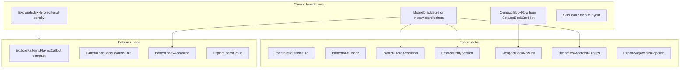

# Patterns index and Pattern detail mobile redesign

**Status:** Phase 1 complete — Phases 2–6 pending  
**Created:** 2026-08-03  
**Location:** `apps/site/docs/roadmaps/patterns-mobile-redesign.md`  
**Authority:** Specialized UX/product plan. Does **not** replace [`docs/roadmaps/remaining-product-roadmap.md`](../../../../docs/roadmaps/remaining-product-roadmap.md). Unfinished follow-ups that become cross-layer backlog should be linked from the remaining-product roadmap.

**Document role:** Audit of current Patterns index / Pattern detail / shared chrome against redesign mockups; inventory of reusable Books mobile patterns; phased implementation roadmap.

**Mockups (directional, not pixel-perfect):**

- Patterns index: [Drive mockup](https://drive.google.com/file/d/15sOKYWs1KJMShQnbaYhkT1fUJNSUKklY/view)
- Pattern detail: [Drive mockup](https://drive.google.com/file/d/1S85C_3F60vz5j_3fAJm8rev_4mKlrcuX/view)

> **Evidence rule:** Live routes, semantic data, and tests override planning-time snapshots. Mockup copy, invented pattern counts, and fabricated fields are **not** corpus truth. Preserve After Certainty visual identity (typography, textures, colors, content hierarchy) while adopting mobile density and interaction.

---

## Design principles

- Compact, information-dense mobile layouts; restrained padding
- Progressive disclosure for long prose without removing meaningful content
- Reuse Books mobile accordion / list-row patterns before inventing new primitives
- Shared markup + responsive classes; avoid separate mobile/desktop content trees
- Accessible touch targets (~44px / `min-h-11`), keyboard behavior, `motion-reduce`
- Strong mobile performance (sized covers, lazy below-fold images, minimize hydration)
- Server-rendered semantic content for SEO; disclosure toggles visibility, does not fetch prose
- No URL changes; preserve metadata, JSON-LD, breadcrumbs, and inbound links
- No pattern-specific hard coding in generic components; no corpus edits merely for UI convenience

---

## A. Current-state inventory

### A.1 Routes

| Surface | Route | Page file |
| --- | --- | --- |
| Patterns index | `/explore/patterns` (+ optional `?force=`) | `apps/site/app/explore/(browse)/patterns/page.tsx` |
| Pattern detail | `/explore/patterns/[slug]` | `apps/site/app/explore/(browse)/patterns/[slug]/page.tsx` |
| Pattern JSON-LD API | `/api/json-ld/patterns/[slug]` | `apps/site/app/api/json-ld/patterns/[slug]/route.ts` |
| Books index (reuse reference) | `/explore/books` | `apps/site/app/explore/(browse)/books/(catalog)/page.tsx` |
| Legacy redirects | `/patterns`, `/patterns/:slug` | `apps/site/lib/seo/legacy-redirects.ts` → explore equivalents |

**Path helpers:** `explorePaths.patterns = "/explore/patterns"` in `apps/site/lib/graph/explorePaths.ts`. Force filter links use `/explore/patterns?force=<slug>` (no dedicated force routes).

**Browse chrome:** `app/explore/(browse)/layout.tsx` → `ExploreLayout` (sidebar + `Container`).  
**Site chrome:** `SiteShell` → `SiteHeader` / `#main` / `SiteFooter` (`apps/site/components/layout/`).

### A.2 Patterns index stack

| Concern | Implementation | Mobile pressure |
| --- | --- | --- |
| Hero | `ExploreIndexHero` at **default** density | ~52vh / up to 600px; full-bleed image backdrop |
| Lede | Static structures copy | No pattern count in hero |
| Video | `ExplorePatternsPlaylistCallout` | Bordered block; not a compact horizontal card |
| Master / forces | Inline “Master pattern” link + force filter chips | Not a featured card |
| Groups | `ExploreIndexGroup` | Pattern Language `defaultOpen`; Portfolio collapsed on mobile |
| Cards | `PatternCard` → `ExploreCatalogCard` | Compact cards still tall; blurb is full composed `summary` |

**Key files:**

- `apps/site/components/explore/explore-hero.tsx`
- `apps/site/components/explore/explore-patterns-playlist-callout.tsx`
- `apps/site/components/explore/explore-index-group.tsx`
- `apps/site/components/explore/pattern-card.tsx`
- `apps/site/components/explore/explore-catalog-card.tsx`
- `apps/site/lib/explore/pattern-language.ts`
- `apps/site/lib/explore/explore-patterns-order.ts`

### A.3 Pattern detail stack (render order today)

1. `JsonLd` (`buildPatternPageJsonLd`)
2. `BreadcrumbTrail` + role eyebrow + `h1` + full `summary` via `LinkifiedText`
3. `PatternLanguageContext` (long force lists on master)
4. `ExplorePatternNarrative` (setup / problem / forces[] / observation / example)
5. `SemanticGroundingDisclosure` (when grounding present)
6. `ExploreEntityDetailActions` (Observatory deep-link)
7. `ExplorePatternMedia` (YouTube / infographic / Medium)
8. `ExploreAdjacentNav` (prev/next in title sort order)
9. `ExploreEnrichmentSections` (recognition, questions, counterbalances, trajectory, manifestations)
10. `RelatedTrailsSection` / `RelatedChaptersSection`
11. `RelatedContentGrid` — concepts + books (`BookCard` with near-full-width covers on mobile)
12. `SemanticRelationshipsSection` — tensions + outgoing/incoming `RelationshipCard` grids

**Key files:**

- `apps/site/app/explore/(browse)/patterns/[slug]/page.tsx`
- `apps/site/components/explore/pattern-language-context.tsx`
- `apps/site/components/explore/explore-pattern-narrative.tsx`
- `apps/site/components/explore/related-content-grid.tsx`
- `apps/site/components/explore/book-card.tsx`
- `apps/site/components/explore/semantic-relationships-section.tsx`
- `apps/site/components/explore/relationship-list.tsx`
- `apps/site/components/explore/relationship-card.tsx`
- `apps/site/components/explore/explore-adjacent-nav.tsx`

### A.4 Books index reuse candidates

| Existing | Path | Reuse role |
| --- | --- | --- |
| `ExploreIndexGroup` | `components/explore/explore-index-group.tsx` | Group accordion already on Patterns |
| `BooksShelfSection` accordion ARIA | `components/books/books-shelf-section.tsx` | Reference for item-level disclosure (`aria-expanded`, `aria-controls`, `role="region"`, `min-h-11`, `motion-reduce`) |
| `CatalogBookCard` `layout="list"` | `components/books/catalog-book-card.tsx` | Horizontal thumbnail + text row; needs `Book`-shaped adapter for Pattern detail |
| Density tokens | `styles/tokens.css` (`--books-section-y*`, `--books-row-*`, `--books-cover-list-*`) | Generalize or mirror as explore/pattern tokens |
| `ExploreIndexHero` `density="compact"` | `components/explore/explore-hero.tsx` | Books baseline (~34vh); Patterns needs denser **editorial** mobile mode |
| Books plan precedent | `apps/site/docs/roadmaps/books-reader-redesign.md` | Phased UX plan + test conventions |

**Books accordion open policy:** Multi-open at group/shelf level (each section owns local `useState`). Item-level pattern rows in this redesign use **single-open within a group** for density; group-level behavior stays multi-open like Books.

### A.5 Shared chrome and primitives

| Piece | Path | Notes |
| --- | --- | --- |
| Header | `components/layout/site-header.tsx` | Sticky; desktop nav + `MobileNav` drawer |
| Mobile nav | `components/layout/mobile-nav.tsx` | Portal dialog; Escape; body scroll lock |
| Footer | `components/layout/site-footer.tsx` | Tall mobile column (~11 “Together” links + Elsewhere + license + semantic date) |
| UI kit | `components/ui/{card,section,container,button-link,linkified-text}.tsx` | **No** Accordion / Chip / Collapsible primitives |
| Disclosure patterns | Custom accordions; native `
` | `SemanticGroundingDisclosure`, catalog filters, observatory panels |

### A.6 Radix UI

| Package | Status |
| --- | --- |
| `@radix-ui/react-dialog` `^1.1.23` | Installed; used by native reader `ReaderDrawer` |
| `@radix-ui/react-accordion` | **Not installed** |
| `@radix-ui/react-collapsible` | **Not installed** |

**Decision:** Do **not** add `@radix-ui/react-accordion`. Extend the proven Books / `ExploreIndexGroup` pattern (button + `aria-expanded` / `aria-controls` + `role="region"` + chevron with `motion-reduce:transition-none`).

### A.7 Data model and content-shape constraints

**Pipeline:** `semantic/patterns/*.yml` (43 files) → `tools/generate_semantic_manifest.py` → `apps/site/data/local-semantic-manifest.json` → `getExploreSemanticGraph()` / `buildGraphIndex()`.

**Schema / types:**

- YAML schema: `schema/semantic/pattern-entry.schema.json`
- Site types: `apps/site/types/semanticGraph.ts` (`Pattern`, `OrganizingForce`, `SemanticEnrichment`)
- Zod: `apps/site/lib/graph/schemas.ts` (`patternSchema`)
- Contract: `docs/after-certainty-pattern-language.md`, `docs/semantic-manifest-contract.md`

**Important field facts:**

- There are **no** first-class `description`, `whyItMatters`, or `warningSigns` fields.
- Manifest `summary` is composed from setup + problem + forces + observation + example (often 400–660 chars) — poor fit for card blurbs without field picks or truncation.
- YAML `forces: string[]` = Alexander-style tension bullets — **not** Perception / Power / Time / Contact.
- Organizing forces are separate entities (`semantic/forces/*.yml`) linked by `organizingForce` + relationship edges.
- Pattern Language set (13): `patternRole` (`master` \| `supporting`), plus `organizingForce` + `realityDynamic` on the 12 supporting patterns.
- Portfolio (~30): richer enrichment; no `patternRole` / force / realityDynamic.
- `obscuring` / `corrective` are **entity** `realityDynamic` values, not relationship predicates.
- Relationships live in `semantic/relationships.yml` (grounds, organizes, expresses, enables, …) and surface via `relationshipsForConcept`.
- Cycle prose lives in UI (`PatternLanguageContext`), not a schema field.
- Master pattern is discovered via `getMasterPattern(index)` (`patternRole === "master"`) — currently Reality Answers Back; do not hard-code its title into generic components.

**At-a-glance derivation (graceful omit if missing):**

| Slot | Preferred source | Fallback |
| --- | --- | --- |
| What it does | `observation` | First sentence of composed `summary` / `setup` |
| Why it matters | `problem` | Omit card |
| Key risk | `recognitionSignals[0]` or `trajectory.failureModes[0]` / `earlySignals[0]` | Omit (do not invent from dynamic label alone) |
| Counterbalance | `counterbalances[0]` | Strong coverage (43/43) |

**Coverage gaps that affect UI:** ~13 Pattern Language patterns often lack `recognitionSignals`; one pattern (`meaning-forms-early`) lacks `problem` / `observation`. Components must degrade without empty shells.

### A.8 Breakpoints and responsive conventions

- Tailwind v4 defaults; theme tokens in `apps/site/app/globals.css` (`@theme inline`).
- Site habit: **`md` (768px)** as the mobile / desktop split (Books shelves, Explore index groups, header nav, `atmosphere.css` `@media (max-width: 768px)`).
- Mobile-only behaviors target `< md`; desktop keeps fuller layouts via shared markup + responsive utility classes (`md:hidden` / `hidden md:block`), not duplicated page trees.

**Mobile-only (planned):**

- Editorial / non-tall hero
- Collapsed introductory description
- Compact pattern item accordions
- Compact horizontal related-book rows
- Condensed footer
- Reduced section spacing

**Shared across viewports:**

- URLs, metadata, JSON-LD, breadcrumbs
- Data loaders and field helpers
- Master / force / relationship semantics
- Heading hierarchy and link destinations
- Observatory deep-links

### A.9 Testing stack

| Layer | Tool | Location / notes |
| --- | --- | --- |
| Unit / component | Vitest + Testing Library + user-event | Colocated `*.test.ts(x)` under `apps/site` |
| E2E | Playwright | `apps/site/e2e/` (e.g. `explore-indexes.spec.ts`, `books-catalog.spec.ts`) |
| Corpus (repo) | pytest | `/workspace/tests/` — not for React UI |

Suggested visual widths: **320 / 375 / 390 / 430 / tablet / `md+`**.

---

## B. Mockup-to-code mapping

### B.1 Patterns index

| Mockup area | Existing | Proposed | Data source | Mobile | Desktop |
| --- | --- | --- | --- | --- | --- |
| Compact hero | `ExploreIndexHero` default | `density="editorial"` (or equivalent Patterns intro): eyebrow “Structures”, title “Patterns”, short lede, pattern count; no tall backdrop | Static copy + `patterns.length` | Text-first, short first viewport | May keep compact image hero or same editorial block |
| Video callout | `ExplorePatternsPlaylistCallout` | Compact horizontal card: “Video” eyebrow, short title, play/nav affordance; whole card (or clear target) interactive | `booksWithPatternsPlaylist` / playlist URLs | Dense row | Same or slightly roomier |
| Master-pattern card | Inline master link + force chips | Featured card: “After Certainty Pattern Language” eyebrow, “Master pattern” label, title, Perception/Power/Time/Contact chips, CTA to detail | `getMasterPattern`, `forcesInCycleOrder` | Compact card | Same card acceptable |
| Pattern list | `PatternCard` grid inside `ExploreIndexGroup` | Item accordion rows: relationship/type eyebrow, title, chevron; expand: short description, why-it-matters / secondary field when available, “View pattern” link | `patternRole` / `realityDynamic`, `observation` / `problem` / `recognitionSignals` via preview helper | Accordion; single-open within group | Card grid via `md:` (current or denser) |
| Pattern Language group | `ExploreIndexGroup` `defaultOpen` | Keep prominent and open by default | `isPatternLanguagePattern` | Open group + item accordions | Always-visible section |
| Portfolio patterns | `ExploreIndexGroup` closed | **Keep collapsed inline group** (least disruptive); when opened, same item accordion — no new filtered page | `!isPatternLanguagePattern` | Collapsed by default | Always-visible section |

**Portfolio decision:** Keep inline expand via existing `ExploreIndexGroup` (already closed on mobile). Do not add a filtered destination or navigation-only treatment. When opened, use item accordions so ~30 full cards do not paint expanded by default.

**Force-filter mode (`?force=`):** Retain; when active, show supporting patterns for that force. Prefer the same compact accordion rows on mobile rather than reverting to tall cards.

### B.2 Pattern detail

| Mockup area | Existing | Proposed | Data source | Mobile | Desktop |
| --- | --- | --- | --- | --- | --- |
| Compact intro | Full `summary` always expanded | Breadcrumb, classification eyebrow, title, 1–2 sentence teaser, “Read full description” disclosure | Teaser from `observation` or first sentences; full `summary` / narrative in DOM | Collapsed by default | Expanded or always visible |
| Pattern-language summary | `PatternLanguageContext` list | Compact card: level/type, master, organizing-force chips, cycle summary for master | Role, force, master, `forcesInCycleOrder` | Compact | May keep richer block |
| At a glance | None | Two-column card grid; omit empty slots | Derivation table in A.7 | Compact grid | Optional same |
| Pattern language by force | Master’s long force sections | Accordions: force name + one-line summary; expand: description, related patterns, Observatory link | Forces + `supportingPatternsForForce` | Accordion | Fuller list OK |
| Related concepts | `RelatedContentGrid` / `ConceptCard` | Collapsible section with count; compact cards (eyebrow, title, concise description, “View concept”) | `relatedContentForPattern` → concepts | Collapsed default | Open or grid |
| Related books | `BookCard` full-width cover | Compact horizontal rows: thumbnail left, title/subtitle, optional short description, “View book” | `related.books` + `resolveBookCover` | List thumbs | Grid or list |
| Dynamics | `RelationshipCard` grids | Grouped Outgoing / Incoming accordion groups; rows keep relationship label, counterparty, concise sentence, Observatory link | `relationshipsForConcept` | Accordion groups | Denser lists OK |
| Prev / next | `ExploreAdjacentNav` | Compact side-by-side cards; long titles wrap; no overflow | `explorePatternAdjacentInIndexOrder` | Side-by-side | Same |
| Observatory CTA | `ExploreEntityDetailActions` | Keep reachable; do not bury under density | `exploreObservatoryFocusHref` | Compact placement | Unchanged intent |
| Footer | `SiteFooter` tall list | Compact mobile footer (site-wide) | `siteConfig`, manifest `generatedAt` | Wrapping link row/grid | Fuller layout retained |

**Semantic distinctions to preserve in dynamics UI:** grounds, expresses, enables, obscuring/corrective (as pattern dynamics / labels where applicable), incoming, outgoing — do **not** flatten into an undifferentiated list.

---

## C. Proposed component architecture

Prefer **direct reuse → small generalization → shared primitive**. Avoid abstractions invented only to match suggested names.

### C.1 Likely components and helpers

| Piece | Role | Notes |
| --- | --- | --- |
| `MobileDisclosure` / `IndexAccordionItem` | Shared chevron + ARIA | Extract from `ExploreIndexGroup` / `BooksShelfSection`; support controlled single-open parent |
| `ExploreIndexHero` `editorial` density | Compact text-first intro + optional count | Avoid separate mobile/desktop content trees |
| `PatternLanguageFeatureCard` | Master summary on index | Data-driven via `getMasterPattern` |
| `PatternIndexAccordion` | Collapsed rows + preview expand | Expanded body ≠ full detail page |
| `patternPreviewFields()` | Short description + secondary field | `lib/explore/`; real fields only |
| `PatternAtAGlance` + `patternAtAGlance()` | Two-column summaries | Omit missing slots |
| `PatternForceAccordion` | Force rows on master detail | Refactor from `PatternLanguageContext` |
| `CompactBookRow` | Thumbnail + text horizontal row | Accept `Book` (or thin VM); Books keep `CatalogBookCard` |
| Related section wrapper | Collapsible heading + count | Wraps existing concept presentation |
| `SiteFooter` responsive restructure | Compact mobile / fuller desktop | Site-wide, not Patterns-only |

### C.2 SSR, SEO, and JavaScript

- Expanded accordion / disclosure bodies remain in **server-rendered HTML** and toggle with `hidden` / CSS (Books pattern).
- Intro teaser disclosure may use native `
` (zero JS) or the shared client disclosure.
- Never make essential prose client-fetched or client-only.
- Preserve `generateMetadata`, `JsonLd`, breadcrumbs, and canonical URLs.
- Avoid nested interactive controls: accordion toggle is a button; “View pattern/concept/book” and Observatory links are separate links inside the panel.

### C.3 Performance

- Related book covers: reserved width/height (`--books-cover-list-*` or shared tokens), `next/image` with small `sizes` (~56px), `object-contain`, natural cover aspect, meaningful `alt` (or empty alt when title is adjacent and decorative cover is intentional — match Books list convention carefully).
- Lazy-load below-the-fold images; keep hero priority only when a hero image remains.
- Prefer not mounting heavy client trees for every collapsed row beyond the disclosure state itself.
- Do not solve page length by hiding content in a way that breaks no-JS readability of essential thesis content (teaser + metadata must remain).

---

## D. Phased implementation plan

### Phase 1 — Shared mobile foundations

**Objective:** Disclosure/accordion primitive, density tokens, reusable horizontal book row — without redesigning Patterns pages yet.

| | |
| --- | --- |
| **Depends on** | Nothing |
| **Ship independently** | Yes (low visual change if Patterns not yet wired) |
| **Likely files** | `components/ui/mobile-disclosure.tsx`, `components/ui/disclosure-chevron.tsx`, `components/explore/compact-book-row.tsx`, `styles/tokens.css`; light chevron reuse in `explore-index-group.tsx` / `books-shelf-section.tsx` / `catalog-book-card.tsx` |
| **Status** | Complete |

**Implementation steps:**

1. Extract shared mobile disclosure matching Books ARIA / `min-h-11` / focus rings / `motion-reduce`.
2. Add single-open controller for sibling items (pattern rows).
3. Add `CompactBookRow` using cover list tokens, `next/image`, reserved dimensions, no layout shift.
4. Defer full footer visual rewrite to Phase 5 if riskier; document the target layout here.

**Footer note (deferred to Phase 5):** Keep `SiteFooter` structure unchanged in Phase 1. Target mobile layout later: identity + short description; essential links in a compact wrapping row/small grid; social icons; corpus/semantic date; license — without reproducing the full desktop sitemap as a tall column. Desktop retains the fuller two-column layout.

**Shipped primitives (Phase 1):**

- `MobileDisclosure` / `MobileDisclosureGroup` — `aria-expanded` + `aria-controls` + `role="region"`; `type="single"` for item rows; `type="multiple"` for Books-style groups
- `DisclosureChevron` — shared down/right chevron with `motion-reduce`
- `CompactBookRow` — `Book`-shaped horizontal row; cover box via `--explore-cover-list-*` (aliases of books list tokens)
- Explore density tokens: `--explore-row-py`, `--explore-cover-list-w`, `--explore-cover-list-h`

**Risks:** Over-abstraction; premature footer changes affecting all pages.  
**Acceptance:**

- Unit tests for expand/collapse + keyboard + `aria-expanded` / `aria-controls`
- CompactBookRow stable layout (no CLS from missing dimensions)
- Patterns pages unchanged or opt-in only

### Phase 2 — Patterns index

**Objective:** Compact editorial hero, video card, master card, pattern item accordions, portfolio collapsed treatment.

| | |
| --- | --- |
| **Depends on** | Phase 1 disclosure |
| **Ship independently** | Yes |
| **Likely files** | `patterns/page.tsx`, `explore-hero.tsx`, `explore-patterns-playlist-callout.tsx`, new master card + pattern accordion, `pattern-card.tsx` / preview helper, `e2e/explore-indexes.spec.ts` |

**Implementation steps:**

1. Editorial/compact hero + pattern count (eyebrow Structures / title Patterns).
2. Compact video callout card with clear interactive target.
3. Master featured card with organizing-force chips linking `?force=`.
4. Replace mobile `PatternCard` grid with item accordions inside `ExploreIndexGroup`.
5. Keep Portfolio group collapsed; same accordion when opened.
6. Desktop: retain card grid via `md:` (shared data, responsive presentation).
7. Keep `?force=` filter mode usable with compact rows.

**Risks:** Composed `summary` too long for previews — use `patternPreviewFields()`; force-filter regression.  
**Acceptance:**

- No oversized mobile hero
- Several patterns visible within first few viewports at ~390px
- Collapsed rows significantly shorter than current cards
- Portfolio not expanded by default on mobile
- Keyboard-accessible accordions
- URLs unchanged

### Phase 3 — Pattern detail core

**Objective:** Compact intro, long-description disclosure, pattern-language summary, at-a-glance, force accordions.

| | |
| --- | --- |
| **Depends on** | Phase 1 disclosure |
| **Ship independently** | Yes (can follow or parallel Phase 2 once foundations land) |
| **Likely files** | `patterns/[slug]/page.tsx`, `pattern-language-context.tsx`, `explore-pattern-narrative.tsx`, new intro/glance/force components, `lib/explore/pattern-at-a-glance.ts` (+ tests) |

**Implementation steps:**

1. Compact intro: breadcrumb, classification, title, 1–2 sentence teaser.
2. “Read full description” — full summary/narrative remains in the document; collapsed by default below `md`.
3. Compact pattern-language summary card (cycle line for master, e.g. Perception → Power → Time → Contact → Perception, derived from force order — not hard-coded master prose).
4. At-a-glance two-column grid with graceful omission.
5. Force sections → accordions on mobile (name + one-line; expand for detail + related patterns + Observatory).

**Risks:** SEO if content removed from HTML — keep SSR; inconsistent fields — omit slots; do not duplicate master-only copy into generic components.  
**Acceptance:**

- Core thesis visible quickly on mobile
- Long prose available via progressive disclosure
- No empty glance cards
- Metadata / JSON-LD / breadcrumbs unchanged
- Works for master, supporting, and thin-metadata patterns

### Phase 4 — Pattern detail relationships

**Objective:** Related concepts, compact related books, incoming/outgoing dynamics, prev/next, Observatory CTA.

| | |
| --- | --- |
| **Depends on** | Phase 1 CompactBookRow + disclosure; ideally after Phase 3 |
| **Ship independently** | Yes with Phase 3 |
| **Likely files** | `related-content-grid.tsx` / callers, `book-card.tsx` usage sites, `semantic-relationships-section.tsx`, `relationship-list.tsx`, `relationship-card.tsx`, `explore-adjacent-nav.tsx`, Observatory action placement |

**Implementation steps:**

1. Related concepts collapsible section with count + compact cards.
2. Related books → `CompactBookRow` (thumbnail left; natural aspect; responsive sizing; alt text).
3. Outgoing / Incoming dynamics as accordion groups; preserve relationship verb labels and semantic distinctions.
4. Compact prev/next; long titles wrap; no horizontal overflow at 320px.
5. Observatory CTA remains reachable.

**Risks:** Flattening relationship types; nested interactive controls (toggle vs links).  
**Acceptance:**

- Grouped dynamics with verb distinctions preserved
- Related books no longer use near-full-width covers
- Concepts collapsed with count on mobile
- Prev/next wrap cleanly at 320px

### Phase 5 — Footer and cross-page polish

**Objective:** Compact mobile footer site-wide; spacing normalization; desktop regression fixes.

| | |
| --- | --- |
| **Depends on** | Phases 2–4 mostly done for spacing context |
| **Ship independently** | Yes (site-wide) |
| **Likely files** | `site-footer.tsx`, atmosphere footer classes, pattern page spacing, touch-target / contrast pass |

**Implementation steps:**

1. Compact mobile footer retaining: After Certainty identity, brief description, essential nav links, social icons, corpus/semantic-data date, license.
2. Remove unnecessary vertical gaps; reduce repeated headings; arrange links in a compact wrapping row or small grid; keep touch targets accessible.
3. Desktop footer retains a fuller usable layout.
4. Normalize Patterns page spacing; regression-check Books index and other Explore indexes.

**Risks:** Link discoverability if over-culled; site-wide visual blast radius.  
**Acceptance:**

- Substantially shorter mobile footer
- Desktop footer usable
- No horizontal scroll
- Touch targets remain adequate

### Phase 6 — Testing and cleanup

**Objective:** Automated coverage, a11y/responsive verification, remove superseded styles, performance sanity.

| | |
| --- | --- |
| **Depends on** | Phases 1–5 |
| **Ship independently** | Final PR or stacked with last phase |

**Implementation steps:**

1. **Vitest:** preview / at-a-glance helpers; accordion ARIA; pattern with missing optional metadata; CompactBookRow; force accordion labels.
2. **Playwright:** Patterns index + master detail + supporting detail @ 390px; accordion open/closed; related concepts collapsed/expanded; related books with one and multiple books; long titles; footer mobile + desktop; no overflow @ 320px.
3. **Manual:** keyboard paths, reduced-motion, contrast, screen-reader disclosure labels, focus visibility.
4. Remove superseded styles/components; verify `next/image` sizes / lazy loading; Lighthouse sanity on index + one detail.
5. Update this roadmap status + `docs/roadmaps/README.md` inventory classification when complete.

**Test matrix (minimum):**

| Case | Coverage |
| --- | --- |
| Patterns index @ 320 / 375 / 390 / 430 | E2E + manual |
| Master pattern detail | E2E |
| Supporting pattern detail | E2E |
| Pattern with missing optional metadata | Unit + spot E2E |
| Pattern accordion open/closed | Unit + E2E |
| Related concepts collapsed/expanded | E2E |
| Related books 1 and N | E2E |
| Long pattern / book titles | E2E / component |
| Prev/next wrapping | E2E @ 320 |
| Footer mobile + desktop | E2E / manual |
| Keyboard interaction | Unit + manual |
| `prefers-reduced-motion` | Manual / component class assertions |
| No horizontal overflow | E2E @ 320 |

**Acceptance:** Section F checklist green; CI lint + Vitest + Playwright pass for touched surfaces.

---

## E. Risks and decisions

| Decision | Committed default | Rationale |
| --- | --- | --- |
| Accordion content rendering | Server-rendered HTML; CSS / `hidden` toggle | Matches Books; preserves SEO and no-JS thesis access |
| Radix Accordion | **Do not add** | Custom disclosure already proven; only Dialog is installed |
| At-a-glance content | Derive from existing fields; omit empty slots; no corpus edits for UI convenience | Schema has no dedicated glance fields; coverage uneven |
| Portfolio patterns | **Collapsed inline `ExploreIndexGroup`**; item accordions when opened | Least disruptive IA; already closed on mobile; avoids new routes |
| Desktop design change | Minimal — responsive presentation of the same content | Mobile-first redesign must not regress desktop |
| Footer redesign | **Site-wide** compact mobile layout in `SiteFooter` | Footer is shared chrome; mockups show density site-wide |
| Book cards | **Lower-level `CompactBookRow`** accepting `Book` / thin VM | Pattern detail should not depend on `CatalogBookView` |
| Hero | New **editorial** density for Patterns mobile (beyond Books `compact`) | Mockups want text-first intro, not a shorter image hero alone |
| Single-open policy | Item-level single-open within a group; group-level multi-open | Density for pattern rows; Books precedent for groups |
| URLs / SEO | No URL changes; preserve JSON-LD, breadcrumbs, metadata | Inbound links and search indexing |
| Content duplication | No separate mobile/desktop content trees unless proven necessary | Maintainability and SEO |
| Master pattern copy | Always via `getMasterPattern` / graph data | Avoid hard-coding Reality Answers Back into generics |

**Highest-risk items for implementation:**

1. At-a-glance field gaps across Pattern Language vs portfolio populations
2. Editorial hero vs retaining any image-backed Explore hero on desktop
3. Site-wide footer blast radius
4. Keeping SSR disclosure without duplicating large content trees or harming hydration cost

---

## F. Acceptance checklist

Success means all of the following:

- [ ] The Patterns index no longer begins with an oversized mobile hero
- [ ] Several patterns are visible within the first few mobile viewports
- [ ] Collapsed pattern rows are significantly shorter than the current cards
- [ ] Pattern detail pages present the core thesis quickly
- [ ] Long prose is available through progressive disclosure and remains in the document
- [ ] Organizing-force information is scannable
- [ ] Related books no longer use near-full-width covers
- [ ] Incoming and outgoing relationships are meaningfully grouped (verb distinctions preserved)
- [ ] The footer is substantially shorter on mobile
- [ ] Desktop layouts are not regressed
- [ ] No horizontal scrolling occurs at 320px
- [ ] Accordions are accessible by keyboard and screen reader (`aria-expanded` / `aria-controls`, focus states)
- [ ] The redesign uses real corpus data rather than pattern-specific hard coding
- [ ] Inbound `/explore/patterns` and `/explore/patterns/[slug]` (and legacy redirects) remain intact
- [ ] Metadata, structured data, and breadcrumbs behave as today

---

## Executive summary

1. **Phases:** Foundations → Patterns index → Detail core → Detail relationships → Footer/polish → Testing/cleanup
2. **Reuse from Books:** `ExploreIndexGroup`, shelf accordion ARIA pattern, `CatalogBookCard` list sizing/tokens, `ExploreIndexHero` density concept, Vitest/Playwright conventions
3. **Radix:** Accordion dependency **not** needed; keep Dialog-only
4. **Highest-risk decisions:** at-a-glance field gaps; editorial hero; site-wide footer; SSR disclosure without duplicate trees
5. **Recommended first implementation phase after this docs PR:** Phase 1 — shared disclosure primitive + `CompactBookRow`

---

## Constraints (do not violate during implementation)

- Do not modify corpus content merely to make the UI easier unless a genuine data-model gap is discovered and separately approved
- Do not remove meaningful Pattern content
- Do not hard-code the master pattern’s text into generic components
- Do not duplicate major page content for separate mobile and desktop trees without documenting why
- Do not alter URLs or break existing inbound links
- Preserve metadata, structured data, breadcrumbs, and SEO behavior
- Preserve the current visual identity
- Keep implementation incremental and reviewable per phase
- Target `apps/site` in this monorepo — not the archived `after-certainty-site` repository
