# Boundary Conditions — Developmental Revision Plan

**Manuscript:** [`books/boundary-conditions/manuscript/`](books/boundary-conditions/manuscript/) (~72,860 words, 25 chapters)  
**Planning canon:** [`act-chapter-index.md`](books/boundary-conditions/docs/act-chapter-index.md), [`recalibration.md`](books/boundary-conditions/docs/recalibration.md), [`beta-reader-feedback-2026.md`](books/boundary-conditions/docs/beta-reader-feedback-2026.md)  
**Editorial guardrails:** [`chapter-edit-pass.md`](books/boundary-conditions/docs/chapter-edit-pass.md), [`voice-spec.md`](books/boundary-conditions/docs/voice-spec.md)

**First implementation step (after approval):** Create branch `revision/boundary-conditions-developmental` from current `main`, add this plan as [`books/boundary-conditions/docs/developmental-revision-plan.md`](books/boundary-conditions/docs/developmental-revision-plan.md), and perform all manuscript edits on that branch only.

### Author feedback incorporated (plan iteration)

| Topic | Adjustment |
|-------|------------|
| Ch 7–8 compression | **15–20%** on duplicates only; preserve institutional accumulation / coordination fatigue |
| Caleb mistake | **Subtle** fallout—Warren edits quietly, Priya corrects, Caleb embarrassed; no Legal panic or liability drama |
| Daniel arc | **Five chapters only:** 6, 10, 15, 20, 25—no scattered instrumentation |
| Aphorisms | **Cadence intuition**, not per-page quotas; clustering allowed under pressure |
| Ch 14 outburst | **Articulate while emotional**—interruptions/clips/repeat/abandon; not stammering or incoherence |
| Thematic payoff | **New §4b:** one quiet redistribution scene (Ch 18 or 19)—**imperfect**, not magically healthy |

---

## Diagnostic summary

The novel is structurally sound: incident machinery, authorization truth, institutional self-protection, reliable-person insight, recalibration, and Act V return all land. Beta feedback ([`beta-reader-feedback-2026.md`](books/boundary-conditions/docs/beta-reader-feedback-2026.md)) confirms the form—**coordination as drama**, not tech thriller.

Remaining work is **refinement, not reinvention**:

| Pressure | Where it shows | Fix type |
|----------|----------------|----------|
| Operational loop fatigue | Ch **7–9**, **12–14** | **15–20%** trim of *duplicate* cycles only; preserve accumulation fatigue |
| Caleb competence curve | Acts I–III | One **institutional** misjudgment with **subtle** routing fallout |
| Hadley as calibrator | Ch **6–16** strong; rarely wrong | Two humanizing beats (subtle unfairness / fear) |
| Nate lucidity | Ch **12–16**, **24** | Dramatic irony + **one quiet redistribution scene** (Ch 18/19) |
| Aphorism cadence | Acts I–III especially | Break **predictability**, not quality—intuition, not quotas |
| Daniel continuity | Sparse by design | **Five** distinct echoes: Ch **6, 10, 15, 20, 25**—not scattered instrumentation |

```mermaid
flowchart TB
  subgraph problem [Reader experience today]
    A6[Ch6 Map widens]
    A7[Ch7 Translator grind]
    A8[Ch8 Local corners]
    A9[Ch9 Mitigation sprawl]
    A10[Ch10 Father - breath]
    A11[Ch11 Family peak]
    A12[Ch12 Name problem]
    A13[Ch13 Paper fear]
    A14[Ch14 Duplicate setup then outburst]
  end
  subgraph target [Target experience]
    B6[Ch6 Keep - trim coda]
    B7[Ch7 Trim duplicates - keep exhaustion]
    B8[Ch8 Trim dupes - keep boundary war]
    B9[Ch9 Owen dinner + template - fix timeline]
    B10[Ch10 Preserve]
    B11[Ch11 End on Sunday - cut Monday rehash]
    B12[Ch12 Open at Isaac]
    B13[Ch13 Design meeting once]
    B14[Ch14 Outburst early - fallout forward]
  end
  A6 --> A7 --> A8 --> A9 --> A10 --> A11 --> A12 --> A13 --> A14
  B6 --> B7 --> B9 --> B10 --> B11 --> B12 --> B13 --> B14
```



---

## 1. Middle structural compression (Ch 6–14)

**Principle:** Do not cut technical realism—and **do not sanitize institutional drag**. The book works because readers gradually feel coordination fatigue, endless translation, repeating taxonomy fights, and organizational accumulation. Compression targets **chapter-level repetition** (“this chapter is repeating”), not **experiential exhaustion** (“God, this is exhausting”).

**Target for Ch 7–9 (and related Act III dupes):** **~15–20%** word reduction from **duplicate set-pieces only**—not 40–50%. Keep enough on-page stalls, bridges, and taxonomy fights that the system still feels **messier than Nate’s competence**.

**Secondary principle:** Change altitude only where the **same beat appears twice** (design meeting, bridge-bot, exec draft v1–v3, Monday rehash after Ch 11)—not by summarizing whole meeting classes into notebook bullets.

### Chapter 6 — Investigation Widens
[`chapter-06-investigation-widens.md`](books/boundary-conditions/manuscript/act-2-coordination/chapter-06-investigation-widens.md) (~2,828 w)

**Why pacing slows:** Variant board walk + theory list **re-state** morning chaos; Tuesday coda extends past Hadley landing.

| Keep | Compress / summarize |
|------|---------------------|
| Priya blast-radius diagram, variant 5, Mara cohort beat | Second theory-multiply pass (L167–179 area) |
| Caleb table discipline | **Tuesday opener** — fold into Ch 7 opening or one paragraph |

**Tactic:** End on home beat (Hadley / “barely counts”) **without** new work morning—operational close, not thesis close.

---

### Chapter 7 — Connective Tissue (highest leverage, light touch)
[`chapter-07-connective-tissue.md`](books/boundary-conditions/manuscript/act-2-coordination/chapter-07-connective-tissue.md) (~3,110 w) → target **~2,500–2,650 w** (~15–18%)

**Why pacing slows:** Calendar inventory **tells** workload; **~6×** “stall until Nate arrives” (reader learns pattern by beat three); bridge-without-Nate duplicates Ch 8; Saturday exec paragraphs duplicate Ch 12.

**Trim (duplicates only):**
- Shorten opening calendar list—keep it, but cut ~30% of enumerated meetings that do not advance a **new** stall type.
- Remove **one** repeated “stall until Nate” scene (e.g. Tue Product **or** Thu Engineering—**keep both genres on page**, cut the second instance of the *same* argument).
- Remove **second** bridge-without-Nate beat if Ch 8 keeps one.
- Saturday five-paragraph merge → **one** Warren paragraph beat if Ch 12 retains exec-draft work.

**Do not trim:**
- Legal nine o’clock stall (full scene).
- Hadley pipe speech; Caleb lunch “synthesis vs ops”; Nate refuses Owen tiebreaker.
- The **felt** week of translation—DM counts, cold coffee, hallway recruitment.

**Avoid:** Replacing multiple on-page meetings with notebook summaries—that makes the org feel **cleaner than it should**.

**Optional altitude tweak (light):** Section breaks (*Monday / Wednesday / Friday*) instead of full restructure—preserves accumulation, signals time passing.

---

### Chapter 8 — Local Boundaries (keep standalone; ~15% trim)
[`chapter-08-local-boundaries.md`](books/boundary-conditions/manuscript/act-2-coordination/chapter-08-local-boundaries.md) (~2,984 w) → target **~2,500–2,550 w**

**Why pacing slows:** Email/ticket montage (L187–227) reads like log export; Friday bridge overlaps Ch 7 seam fight; Monday working group **re-argues** Friday without new decision; summary-bot scene **duplicates** Ch 7.

**Trim (duplicates only):**
- **Do not merge Ch 7 + Ch 8**—two chapters of boundary war help accumulation land.
- Shorten ticket montage by ~40%—keep **two** representative “not our service” threads, cut the rest.
- Tighten Monday working group to **one decisive hour**—keep “sponsorship is not signatory” and empty seam; cut repeated director speeches already heard Friday.
- **Remove** duplicate evening bridge-bot scene only (keep Caleb “locally correct globally stuck”).

**Keep full:** Friday bridge turf war; Priya “bridge collapse is a materials problem”; Nate refuses Warren lead; Owen empty column.

**Add (small):** Caleb institutional misjudgment beat (see §2)—best host remains this chapter.

---

### Chapter 9 — Mitigation Sprawl
[`chapter-09-mitigation-sprawl.md`](books/boundary-conditions/manuscript/act-2-coordination/chapter-09-mitigation-sprawl.md) (~3,080 w)

**Why pacing slows:** Options A–G inventory upfront (useful but long); Option B row fight **replays** Ch 8 signatory chain; half-fixes thesis states known truth; **chronology disorder** (Fri/Sun/Mon).

**Keep:** Owen dinner (humanizes Product); row B green / seam still empty; “legitimate counts twice.”

**Light trim (~10–15%):** Tighten options A–G front matter (~20% shorter)—**keep** option fatigue **on page**; cut only redundant restatements of half-fix thesis. Yellow-until-signatory: keep **two** instances if they show **different** teams, not the same fight twice.

**Fix:** Re-order timestamps so Sunday couch follows Friday bridge linearly.

---

### Chapters 10–11 — Do not compress heavily
[`chapter-10-fathers-decline.md`](books/boundary-conditions/manuscript/act-2-coordination/chapter-10-fathers-decline.md), [`chapter-11-family-routes-to-nate.md`](books/boundary-conditions/manuscript/act-2-coordination/chapter-11-family-routes-to-nate.md)

**Pacing model for the book.** Trim only obligatory work ping montages at Ch 10 end.

**Ch 11:** End on Sunday calendar / “last resort” — **cut or summarize** Monday seam committee + bridge bookend (L436–560) that re-opens Act II argument after family resolution. Start Ch 12 with Isaac, not another seam meeting.

---

### Chapter 12 — Authorization Truth
[`chapter-12-authorization-truth.md`](books/boundary-conditions/manuscript/act-3-realization/chapter-12-authorization-truth.md) (~3,226 w)

**Why pacing slows:** Pre-Isaac bridge minutes granular; exec v1/v2/v3 overlaps Ch 13; Wednesday follow-up previews Ch 14.

**Restructure:** **Open at Isaac naming** (L27 area)—one paragraph of bridge context max. One exec draft version + Sarah objection, not three. Wednesday staff failure → **glance** or move key conflict to Ch 14 only.

---

### Chapter 13 — Paper Trail Fear
[`chapter-13-paper-trail-fear.md`](books/boundary-conditions/manuscript/act-3-realization/chapter-13-paper-trail-fear.md) (~3,416 w)

**Why pacing slows:** Paragraph fight is third exec-voice iteration; **full design meeting** duplicates Ch 14; glossary training low plot advance.

**Keep:** Pablo doc, Marta deposition fear, Caleb template bleed (Ch 13 L111–139—**retain** as technical/compliance misstep), robot voice correction.

**Cut/merge:** **Entire Thursday design meeting body** — end Ch 13 at Pablo coffee or Compliance glossary **decision**, not slide war. Glossary → 1 page or Nate’s skim of approved terms list.

---

### Chapter 14 — Institutional Self-Protection
[`chapter-14-institutional-self-protection.md`](books/boundary-conditions/manuscript/act-3-realization/chapter-14-institutional-self-protection.md) (~3,067 w)

**Why pacing slows:** L1–85 substantially overlaps Ch 13 design meeting; outburst arrives late.

**Restructure (strongly recommended):**
- **Option A:** Open **in media res** — hallway after outburst, HR voicemail, then **one tight page** of design-meeting flashback.
- **Option B:** Ch 13 ends mid-meeting; Ch 14 opens with outburst in first third.

**Outburst revision:** Keep content and Nate’s intelligence; tighten and **interrupt**—see §5 “Ch 14 outburst” for speech rules (articulate, not incoherent). Current climax line (may keep much of this; trim ~10–15%, add Warren interruption):

```163:163:books/boundary-conditions/manuscript/act-3-realization/chapter-14-institutional-self-protection.md
"...We optimized local ownership until system outcomes became politically illegal. And when the outcome stalls, the work routes to coordinators who do not have authority to sign anything—so you get our heroics instead of your structure."
```

**Preserve:** Caleb bridge without synthesis, HR documentation, Hadley “two buildings.”

**Net word target:**
- **Ch 7–9:** ~15–20% each from **duplicate removal only** (~1,400–1,800 words total across three chapters).
- **Ch 12–14:** Dedupe design meeting + exec drafts (~1,500–2,500 words)—still the largest structural win.
- **Overall:** ~2.5–4k net reduction, **not** 6k+; preserve “institutional accumulation” texture.

---

## 2. Caleb’s arc — one visible seam

**Problem:** Caleb is operationally excellent from Ch 4 onward; Ch 13 template bleed is **compliance vocabulary**, not organizational judgment. Reader never sees **institutional leadership ≠ operational leadership**.

### Best placement: **Chapter 8, Friday bridge or Monday working-group tail**

After Nate posts the cross-boundary remediation comment and Warren asks Nate to “make the seam somebody’s job,” **Caleb—trying to deliver a win to Warren—** takes institutional framing into his own hands.

### Nature of the mistake (recommended)

Caleb posts to the **leadership Sev One thread** (or sends Warren a bridge “status green” summary) using **executive containment language**—e.g. *monitoring enhanced*, *no confirmed active exploitation*, *mitigation on track*—while the engineering row still shows **seam owner blank** and Priya’s diagram still shows open write-scope.

He is not lying; he is **translating operational progress into narrative closure** the way Nate has been doing—without signatory authority or Legal review.

### Consequences — **subtle only** (author constraint)

The novel’s realism depends on **lots of small routing consequences**, not single catastrophic phrasing events. **Avoid:**

- Compliance panic, deposition fear, or “you created liability” tied to this beat
- Executive escalation or Sev re-grade
- Artificial brittleness—institutional communication should feel **forgiving and habitual**, not fragile

**Use instead:**

- **Warren** quietly edits the leadership-thread language (or DMs Caleb a softer version)—no drama, just drift
- **Priya** posts a one-line engineering correction (*not closure / owner still blank*)
- **Nate** notices **framing drift** in the thread—feels the old habit in Caleb’s sentence
- **Caleb** embarrassed—fixes it himself before Nate has to; maybe a `:copy:` react and a deleted message
- Optional: Owen briefly misreads thread and asks about customer comms; someone else corrects—**routing**, not catastrophe

Ch 13 Marta/template bleed remains the **compliance** pressure beat—**do not double** Legal consequence onto Ch 8.

### Nate’s response

Private bridge sidebar or DM—**not** public correction:

- Acknowledge the impulse (“You gave them a story they could breathe”).
- Name the skill gap quietly: **operations can be green while ownership is still empty**; leadership language creates **finish lines** people will treat as real.
- Caleb edits his own post—Nate does not rewrite; no lecture in `#leadership-sev1`.

### Nate’s response (relationship)

Deepens trust: Caleb sees Nate withhold executive subtext in Ch 5; now Nate teaches **institutional framing** explicitly. Sets up Ch 16 “admiration is routing” and Ch 21 lunch fear.

**Do not use:** Wrong Sev level, public snap, or incompetence on bridge mechanics.

**Ch 13 template bleed:** Keep as **secondary** mistake; optional line referencing Ch 8 (“leadership thread language again”).

---

## 3. Hadley — increase dimensionality

**Goal:** Fully human; not marital drama. She currently delivers correct boundary instruction ([`chapter-11-family-routes-to-nate.md`](books/boundary-conditions/manuscript/act-2-coordination/chapter-11-family-routes-to-nate.md) L279–341, Ch 16 dishes).

### Scene A — Frustration / unfair sharpness (Ch 15)
[`chapter-15-exhaustion-at-home.md`](books/boundary-conditions/manuscript/act-3-realization/chapter-15-exhaustion-at-home.md)

**Placement:** Post-outburst sympathy wave; Nate is checking incident channel during **family logistics** (insurance, portal, Sunday plan).

**Beat:** Hadley is **not calm**—she says something **unfair or too sharp** that she later softens without apologizing theatrically, e.g.:

- “You taught them you’d fix it. Don’t act surprised they’re clapping.” (attributes org routing partly to Nate’s performance, not only virtue)
- Or: refuses to co-build Sunday plan until he closes laptop—**feels** like withdrawal to Nate, is **boundary** to her

**Repair:** One physical beat (she makes food anyway; takes phone to charger without speech)—**show**, don’t counsel.

### Scene B — Fear / partial wrong (Ch 17 or 22)
[`chapter-17-transfer.md`](books/boundary-conditions/manuscript/act-4-boundaries/chapter-17-transfer.md) or [`chapter-22-resurface.md`](books/boundary-conditions/manuscript/act-5-return-without-heroics/chapter-22-resurface.md)

**Ch 17 (preferred):** Hadley supports transfer but **misreads** Nate’s motive once—e.g. pushes him to “just rest” when he needs to **finish handoff doc**, or assumes Mark cannot handle pharmacy when Mark **can**—Nate corrects gently; she adjusts calendar without making Nate the hero.

**Ch 22 (alternate):** Under resurface pressure, she says “Don’t answer Warren” when **one** Warren call is actually **advisory**—Nate chooses boundary anyway; reader sees her fear, not oracle status.

**Also deepen:** Nurse schedule / her own exhaustion (mentioned Ch 14)—one line in Ch 10 car scene: she is coming off a double, not only managing Nate.

---

## 4. Nate’s lucidity problem — dramatic irony

**Strength to protect:** Nate is often **technically right early** (Ch 1 mitigation ≠ fix; Ch 3 consent scope; Ch 12 Isaac)—that is not the problem.

**Problem:** He is also **organizationally right too often on-page** before the room catches up, and **sympathy after Ch 14** confirms his self-model before structure changes.

### Belief to undermine (subtly)

“If I stop holding the organization together, it will fall apart.”

**Reader should see earlier than Nate:** His presence **prevents** signatory pain from landing; his absence **forces** redistribution (messy, imperfect).

### Where to add irony

| Chapter | Reader sees | Nate believes |
|---------|-------------|---------------|
| **7–8** | Meetings stall until he arrives; when he declines, **Caleb’s bridge still runs** but seam stays empty | His translation is neutral infrastructure |
| **9** | Row B goes green; seam blank—**half-fix is org choice**, not Nate failure | More synthesis will unlock ownership |
| **14–15** | Sympathy DMs praise **voice**, not **signatory** | Validation = progress |
| **16** | Channel comment + dishes = **triple thesis**—reader feels insight **delivered** | He has “figured it out” |
| **18** | [`chapter-18-recalibration.md`](books/boundary-conditions/manuscript/act-4-boundaries/chapter-18-recalibration.md) L7–59: world does not collapse; **some things worsen, some improve** | Stepping back is betrayal |
| **23** | Org @’s Mercer out of habit; Lena/Priya deflect | They need him as header |
| **24** | Board competence—risk savior epilogue | Restraint = growth complete |

### Craft tactics

1. **Ch 7:** After Nate declines a meeting, show **one** positive outcome he did not predict (Jess deprecation-style seed in Act II—e.g. Caleb forces signatory question without Nate).
2. **Ch 16:** **Remove one** thesis delivery (channel comment OR dishes OR walk)—keep discovery in **action** (skips bridge, HR draft).
3. **Ch 23:** Nate **misjudges** one reach-back—replies when he should redirect to Lena/Caleb; **small cost** (thread confusion, 10 minutes lost)—not foolish, just habit.
4. **Parallel:** Daniel “fixes loud problems” (Ch 15) while Nate preaches boundaries—Nate does not connect in scene (reader does).

**Ch 5 “Why now”** already gives Nate **narrative misread**—preserve; do not duplicate beat for Caleb on same call.

---

## 4b. Quiet competence redistribution (explicit add)

**Gap in prior plan:** Dramatic irony was implied (Ch 18 “nothing collapsed”) but not **dramatized** as an emotionally undeniable beat. This is the **core thematic payoff**: the world continues adapting when Nate stops carrying it—not triumph, not “they never needed him.”

### Requirements

- **One scene**, small scale, **quiet**
- Reader feels: *adaptation is real, imperfect, and not about Nate’s heroism*
- Nate may witness or hear about it **after**—he is not the fixer in the scene
- No board win, no seam finally staffed, no moral victory speech

### Imperfection constraint (anti-utopian)

**Do not** make redistribution look **too healthy too quickly**. The quiet scene must include **one** small cost of adaptation—not enough to undermine the beat, enough to reinforce the book’s worldview: systems adapt through **imperfect** redistribution, not magical replacement.

**Include slight awkwardness, inefficiency, or minor error**, e.g.:

- Jess moves the ticket but **forgets a dependency**—fixed later without Nate
- Luis chairs **awkwardly**—meeting still ends with a dated removal
- Lena redirects Warren but **misses some context**—thread corrects itself
- Mark handles logistics but **double-books** something minor—family sorts it without Nate as PM

Nate’s interior (if present): **unsettled + relieved**, not “they’re better without me.” The world continues; it is **bounded, realistic**, not cleaner because he stepped back.

### Best placement: **Chapter 18 (Recalibration)** or **Chapter 19 (Boundaries at Work)**

[`chapter-18-recalibration.md`](books/boundary-conditions/manuscript/act-4-boundaries/chapter-18-recalibration.md) already has Jess/Terrence deprecation and Nate redirecting tickets—**extend or add one beat** with higher emotional clarity. Ch 19 has Lena interviews—alternative host.

### Candidate beats (pick one primary; each includes a **small imperfection**)

| Who | Movement | Imperfection (pick one) |
|-----|----------|-------------------------|
| **Caleb** | Forces “owner TBD” back when Product tries to close | Warren accepts delay but **wrong exec cc** on follow-up—corrected without Nate |
| **Jess / Luis** | OAuth scope review proceeds without Nate | **Forgotten dependency** or awkward chairing—caught by someone else |
| **Lena** (Ch 19) | Redirects Warren; no @ Nate | **Misses context** in redirect—thread self-corrects |
| **Priya** | Shuts down *sync-only* framing loop | One engineer still argues in side thread—dies down without Nate |
| **Mark** (home) | Pharmacy/lab handled without Nate | **Minor double-book** on calendar—Mark fixes, Nate watches |
| **Hadley** | Delegates on family calendar without Nate | Rachel **anxious** about new handoff—not failure, friction |

### Craft note

Nate’s interior: **unsettled + relieved**—not pride. Aligns with [`recalibration.md`](books/boundary-conditions/docs/recalibration.md): “world does not instantly collapse” becomes **one scene we trust**—and **does not instantly optimize**.

**Do not:** Combine all five into a montage—that becomes thematic instrumentation (same risk as over-scattered Daniel beats).

**Do not:** Present adaptation as seamless competence transfer—that would contradict institutional realism and Nate’s arc (some things worsen, some improve, messily).

---

## 5. Scene-level breathing room

**Diagnosis (Passes E–H + Round 3–4 beta):** Scene → compressed insight rhythm; seam/signatory repetition; chapter ends on thesis not procedure.

### Guidance (Pass I — developmental, **not mechanical policy**)

**The issue was never “too many good lines.”** It was **predictability of cadence**—readers anticipating *scene → compressed insight* on every page.

**Use intuition, not quotas:**

- Break rhythm when landings feel **expected**; allow **clustered** compressed insights when pressure is high (bridge pile-on, outburst week, Ch 5 leadership thread)—multiple good lines in succession are fine if the scene earns density.
- After a strong landing, prefer **plain operational prose** before the next insight—but not as a word-count rule.
- When dialogue/channels **show** fragmentation, cut **redundant** narrator wall metaphor—not every interpretive line.
- Vary chapter endings: operational close **and** thematic close—rotate, do not ban aphorisms.
- **Avoid:** prose becoming self-consciously plain, artificially rhythm-constrained, or stripped of intelligence.

**Heuristic (soft):** If you notice **three** similar cadence patterns in a row (*not X / it was Y*, *not agreement*, *frame too*), intervene on the **third**, not with a global cap.

### High-trim chapters (aphorism / interpretation)

| Chapter | Action |
|---------|--------|
| **1, 3, 5** | Break **predictable** landing rhythm; Ch 5 airport end still a good option—not mandatory every chapter |
| **6, 7, 9** | Cut **redundant** thesis lines where scene already proved it; keep lines that add **new** pressure |
| **12–16** | Dedupe seam/signatory; Ch 16 single thesis beat |
| **23** | Trim ping montage; one physical beat per 4 paragraphs |

### Trust scene mechanics (examples)

- **Ch 7 L36–38:** Consider cutting “native dialects” after demonstration in meetings.
- **Ch 11:** Keep Rachel *better at this* / Hadley *reachable isn’t required*—earned; cut follow-up interpretive paragraph if any.
- **Ch 14:** Outburst stays **articulate under emotion**—see §14 note below; thesis may land in interior after, not only HR hallway.

### Ch 14 outburst — speech revision (refined)

**Keep:** Nate remains **coherent while emotional**—that believability is part of his character.

**Do not:** Stammering, shouting fragments, loss of coherence, or “unlike himself” mess.

**Do use:**

- **Interruptions** (Warren tries to name him; Nate talks through it once)
- **Clipped compression** (shorter sentences, not broken ones)
- **Repeated phrase** (*the seam is empty*, *your boundary*, *signatory*)
- **Abandoning explanation midway**—starts the structural argument, stops when the room’s silence is the point

The existing long speech can be **tightened** and **interrupted**, not replaced with grunt fragments. Interior monologue after can hold full synthesis.

---

## 6. Father arc integration (sparse, human)

**Current strength:** Daniel works partly because **absence creates weight** between major chapters. Over-instrumenting risks **thematic infrastructure**—sticky notes, reminders, and confusion beats every chapter would feel symbolic, not human.

### Five-chapter arc (sufficient)

| Ch | Role | What to do |
|----|------|------------|
| **6** | Small signal | **One** beat only—e.g. Mom text about neurologist paperwork, or Nate sees missed call while in war room; Daniel not dramatized on-page |
| **10** | Major emotional presence | **Protect and refine**—peak decline scene; do not thin |
| **15** | Powerful mirror | **Protect**—“you fix loud problems” / cereal box / Sunday; mirrors post-outburst exhaustion |
| **20** | Redistribution shift | **Protect**—Mark confrontation; Nate stopped routing; chair beside Daniel |
| **25** | Transformed response | **Protect**—Mark drives; same “work thing?” question, different Nate; dignity |

**Ch 11** remains essential family routing (Rachel, Mark, Hadley)—Daniel on-page there is **part of the peak cluster** with 10–11, not a sixth instrumentation point.

### What to remove from prior plan

- ~~Micro-beats in Ch 7–9, 12–13, 17, 22–24~~
- ~~Sticky-note continuity every few chapters~~
- ~~Parallel montage at every incident phase~~

### Optional (only if a chapter feels emotionally empty)

- **Ch 18 or 22:** At most **one** glancing reference (not a new Daniel scene)—e.g. Nate notices Mark handled pharmacy notification. Prefer folding into **Mark’s redistribution beat** in §4b rather than a Daniel-only ping.

**Do not:** Make Daniel’s decline mirror incident beats beat-for-beat; keep **asymmetrical** and **restrained**.

---

## 7. Deliverables

### 7.1 Chapter-by-chapter revision strategy

| Ch | Title | Priority | Structural | Character | Line/breathing |
|----|-------|----------|------------|-----------|----------------|
| 1 | The Message | Low | — | — | Cap aphorisms; operational end |
| 2 | Incident Declared | Low | — | — | Dialogue mess (E1) |
| 3 | Competing Frames | Low | — | Daniel seed | Delay interpretation after two-documents |
| 4 | Caleb Takes the Bridge | Med | — | — | Cut post-dialogue narrator wall |
| 5 | Traveling Blind | Med | — | Nate “why now” ✓ | End operational (airport) |
| 6 | Investigation Widens | Med | Trim coda/theory | **Daniel small signal** | Cadence check |
| 7 | Connective Tissue | **High** | **~15–18% dupes only** | — | Keep accumulation |
| 8 | Local Boundaries | **High** | **~15% dupes** | **Caleb seam (subtle)** | Remove bridge-bot dup |
| 9 | Mitigation Sprawl | Med | Fix timeline; light trim | — | Keep option fatigue on page |
| 10 | Father's Decline | **Protect** | Trim work pings only | Hadley exhaustion | Keep parallel line |
| 11 | Family Routes | **Protect** | **Cut Monday rehash** | Hadley peak | End Sunday |
| 12 | Authorization Truth | **High** | Open at Isaac | — | One exec draft |
| 13 | Paper Trail Fear | **High** | **Remove design meeting** | Keep template bleed | Shorten glossary |
| 14 | Inst. Self-Protection | **High** | Outburst early | — | Articulate clipped speech |
| 15 | Exhaustion at Home | Med | — | **Hadley sharp** | Trim sympathy repeat |
| 16 | Reliable Person | Med | — | Caleb walk | **One thesis only** |
| 17 | Transfer | Med | — | Hadley wrong/fear | — |
| 18 | Recalibration | Med | — | **Quiet redistribution scene** | Texture OK |
| 19 | Boundaries at Work | Low | — | — | Sensory sprinkle |
| 20 | Boundaries at Home | Protect | — | Mark/Daniel | — |
| 21 | Selective Responsibility | Low | — | Caleb lunch | — |
| 22 | Resurface | Med | — | — | Hadley hurt beat optional |
| 23 | They Reach Back | Med | Compress pings | **Nate misjudges once** | — |
| 24 | Advise, Don't Absorb | Low | — | — | Avoid savior tone |
| 25 | Return Without Heroics | Protect | — | Daniel/Mark | Operational coda |

---

### 7.2 High-leverage revisions (estimated impact)

| # | Revision | Impact | Effort |
|---|----------|--------|--------|
| 1 | **Dedupe Ch 13/14 design meeting**; outburst in first third of Ch 14 | **Very high** — removes largest stall | Medium |
| 2 | **Ch 7–8 light compression (~15–20%)** — duplicates only, keep fatigue | **Very high** — momentum without sanitizing | Medium |
| 3 | **Ch 11 end on Sunday**; Ch 12 opens Isaac | **High** — emotional peak preserved | Low |
| 4 | **Quiet redistribution scene (Ch 18 or 19)** | **Very high** — thematic payoff | Medium |
| 5 | **Caleb Ch 8 mistake — subtle fallout only** | **High** — growth curve | Medium |
| 6 | **Ch 16 single thesis delivery** | **High** — Nate irony | Low |
| 7 | **Hadley Ch 15 sharp + Ch 17 misread** | **Medium-high** — dimensionality | Medium |
| 8 | **Daniel five-chapter arc (6, 10, 15, 20, 25)** | **Medium** — protect absence | Low |
| 9 | **Cadence pass (intuition, not quotas)** | **Medium** — predictability | Medium |
| 10 | **Ch 9 timeline fix** | **Medium** — orientation | Low |
| 11 | **Ch 23 Nate one mis-reply** | **Medium** — Act V irony | Low |

---

### 7.3 Do not break these

- **Institutional realism:** Templates, RACI, bridge discipline, Legal/Compliance constraint, Warren as trapped survivor—not villain ([`beta-reader-feedback-2026.md`](books/boundary-conditions/docs/beta-reader-feedback-2026.md) §4).
- **Failure ambiguity:** Ch 12 names authorization **in-room**, not authorial verdict; Acts IV–V multi-boundary remediation language.
- **Nate boundary arc:** reachable / required / primary / backup / advise-not-absorb—**demonstrate** in Acts IV–V (Lena, Mark drives, muted bridge).
- **Ch 10–11 family parallel** and **Ch 14 outburst** (earned, not abusive).
- **Ch 18–20 recalibration quiet** vs Acts I–III urgency ([`recalibration.md`](books/boundary-conditions/docs/recalibration.md)).
- **Institutional accumulation** in Act II—readers must still feel coordination fatigue after trim.
- **Daniel arc sparsity**—absence between Ch 6 → 10 → 15 → 20 → 25 is a feature.
- **Redistribution without utopia**—quiet adaptation scenes include slight awkwardness/inefficiency; not magical replacement.
- **Caleb Act V:** clock not sponge; refuses co-owner.
- **Voice-spec engagement:** scene-first, dialogue attribution, no brochure satire.
- **Ch 5 triad** *Not our system / roadmap / table* — keep; trim gloss after.

---

### 7.4 Prioritized revision order

**Phase 0 — Branch & doc**
- Create `revision/boundary-conditions-developmental`
- Commit this plan to `docs/developmental-revision-plan.md`

**Phase 1 — Structural (do first)**
1. Ch 13/14 design-meeting dedupe + outburst placement
2. Ch 7–8 **light** duplicate trim (~15–20% each)—**do not** merge chapters or summarize meetings away
3. Ch 11 ending / Ch 12 opening
4. Ch 9 timeline + light trim
5. Ch 6 trim, Ch 12 Isaac open

**Phase 2 — Character & thematic payoff**
6. **Quiet redistribution scene** (Ch 18 or 19)—write before final Act IV pass
7. Caleb Ch 8 seam (**subtle** fallout)
8. Hadley Ch 15 + Ch 17
9. Nate irony Ch 16, Ch 23 mis-reply; reinforce Ch 18 interior with new scene
10. Daniel: **strengthen** Ch 6 signal + protect 10/15/20/25 only

**Phase 3 — Line-level (Pass I)**
11. Cadence intuition pass (predictability, not quotas); varied scene endings
12. Ch 14 outburst: articulate, clipped, interrupted—not incoherent
13. Agents 04/05/07 spot passes per [`chapter-edit-pass.md`](books/boundary-conditions/docs/chapter-edit-pass.md)
14. Read-aloud 06 on Ch 14 outburst + bridge chapters

---

### 7.5 Expand vs compress

| **Compress (~15–20% dupes)** | **Expand** |
|--------------|------------|
| Ch 7–8 repeated stalls / bridge-bot / ticket montage tail | **Ch 18/19 redistribution scene** (+400–700 w) |
| Ch 13 design meeting + glossary tail | Ch 15 Hadley sharp beat (+200–400 w) |
| Ch 14 opening duplicate | Ch 8 Caleb mistake (+200–350 w, subtle) |
| Ch 11 Monday seam | Ch 17 Hadley misread (+150–300 w) |
| Ch 23 ping montage (light) | Ch 6 Daniel signal (+50–100 w) |
| Exec draft iterations (12–13) | — |

**Net length target:** Roughly **neutral** (~72–73k)—compression offset by redistribution scene and character beats.

**Do not compress:** Ch 7–9 “accumulation” texture—taxonomy fights, translation DMs, template rows that **add new state**, Owen dinner, boundary wars.

---

### 7.6 Example revised rhythms

**Ch 7 trim example — shorten list, keep exhaustion:**

> Seven thirty: Security posture. Eight fifteen: Product customer impact. Nine: Identity policy semantics with Legal observing like a judge at a trial that had not been scheduled. … He had not designed any of these meetings. He had attended all of them.  
> *(Cut the second full stall scene that repeats the nine o’clock argument—not the calendar itself.)*

**Ch 11 ending (operational, not bridge):**

> Hadley closed the laptop. The calendar showed *Mark drives* in three places and *Nate — last* in three more. His phone buzzed once on the charger—Caleb, a pin react on a thread Nate had not opened. He left it face down. Sunday night was not required.

**Ch 14 outburst (articulate, clipped—not incoherent):**

> “Revenue on the template because Owen put it there. Exposure because Security put it there.” He heard Warren start to say his name and did not stop. “The seam is empty because everyone in this room is describing a boundary their team will not cross.” Silence. He had more—*optimized local ownership*, *coordinators without signatory authority*—and abandoned it when he saw Priya’s face. Not because he lost the sentence. Because the room had finally heard the noun.

**Ch 8 Caleb mistake (subtle fallout):**

> Caleb posted to the leadership thread at four twelve: *Mitigation on track. Monitoring enhanced across delegated paths.* Nate saw it on the stairwell landing. Engineering channel, thirty seconds later: Priya—*Owner still blank.* Warren edited the thread two minutes later—*assessment ongoing*—without @’ing anyone. Caleb DM’d Nate: *That was dumb. Fixing.* Nate replied: *Green rows aren’t ownership. You know that.* Caleb: *Yeah. I wanted him to breathe.* Nate: *He’ll breathe. Don’t give him a finish line.*

**Ch 18 redistribution (quiet scene sketch — imperfect):**

> Thursday Jess ran the OAuth scope review without him. Luis chaired—too fast at the agenda, missed Terrence’s objection once, recovered. Jess dated the OAuth removal anyway. A follow-up ticket appeared an hour later: *internal app X still holds zombie scope*—someone else had caught the dependency. Nate read the thread from the standards floor. Nobody had @’d him. The mistake was small. The movement was real. He closed the laptop and sat there a moment longer than the decision required.

---

## Implementation note

This plan is **editorial strategy** for the existing ~73k manuscript. It does not adopt [`expansion-plan.md`](books/boundary-conditions/docs/expansion-plan.md) word-count targets; if expansion resumes later, apply **altitude principles** first so new scenes add **state change**, not repeated cycles.

After approval: create branch, save plan doc, execute Phase 1 → 2 → 3, run `verify`/export per book pipeline, optional beta sample chapters **7, 11, 14, 18**.
