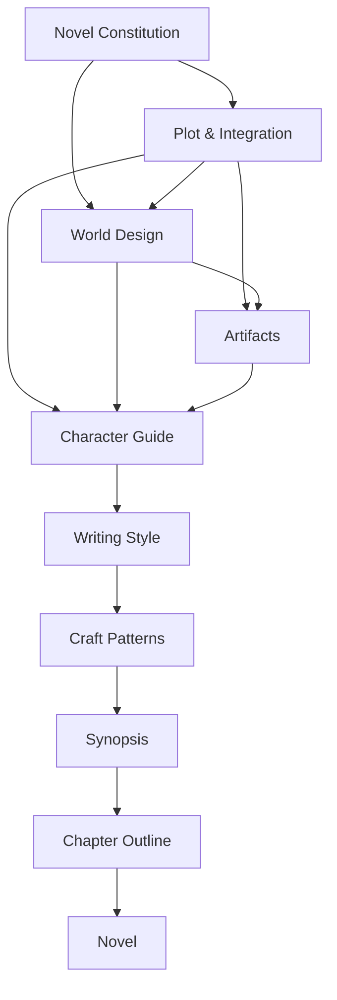

# The Relay Design Handbook — Overview

This document establishes **The Relay Design Handbook**: a set of seven reference manuals that describe how *The Relay* works. It is the entry point and the constitution for the rewrite.

This is a **design memory**, not a rewrite. The existing docs in [the parent docs folder](../) are left untouched as historical reference; all handbook work lives here, in `docs/rewrite/`.

End-goal workflow: **write the 7 guides → rewrite the synopsis → rewrite the chapter outline → rewrite the novel.** There are no planning artifacts beyond the seven guides — the synopsis and chapter outline are downstream deliverables, and the Follett integration climax lives inside Plot & Integration rather than as its own document.

---

## What this is

Not "craft guides" that teach writing in the abstract. **A design handbook that describes how *The Relay* works** — in the spirit of Christopher Alexander's *A Pattern Language*: a durable design memory of this specific novel.

> **The purpose of this handbook is not to reduce creativity. It is to preserve the discoveries made during the design of the novel so they are not accidentally lost during drafting.**

The handbook is memory, not rules. It is also a living artifact: after the novel is finished it is revised to reflect which ideas proved true, ending as the distilled understanding of why the finished book works — part of the novel's intellectual history, not just a planning step.

> **Reconstruction test.** If someone picked up the handbook five years from now, having forgotten the novel, they could reconstruct not just the plot but the philosophy, the feel, the kinds of people who inhabit it, how the civilization functions, what the prose sounds like, and why the story exists.

---

## Governing laws

These three laws sit above every guide. When anything conflicts, resolve it here.

1. **Primacy of story (the escape hatch).** *If the novel becomes less surprising, less emotionally alive, or less human because of these guides, the guides are wrong.* The story is permitted to be better than the architecture.
2. **The human-author test.** A guide is right only if a human author would want it beside the keyboard while writing Chapter 18 by hand. If it only makes sense as instructions to an AI, it is the wrong document. AI tooling is one consumer of the handbook, not the reason it exists.
3. **Single ownership.** *Every important idea has exactly one primary owner.* Other guides may reference it; only one guide defines it. (For example: integration events → Plot; the meaning-migration ladder → Novel Constitution; foundational world assumptions → Novel Constitution; observational voice → Writing Style; relay role → Character Guide.) This is the law that resolves cross-guide tensions.

---

## Working with the handbook

Three practices govern how the handbook is *used*, as distinct from what it contains.

- **The handbook serves the novel, not the reverse.** During design, the handbook is protected; once drafting begins, the *novel* is. Be far less protective of these guides while writing prose than while building them: if a scene teaches you that "Sera would never say that," or that an artifact isn't emotionally alive, **change the handbook.** The handbook exists to make the novel better; the novel does not exist to prove the handbook correct. This is the drafting-phase face of Law 1 and of Guide 7's discovered-not-declared philosophy.
- **Hold decisions open on purpose.** For every `[DECISION]`, ask not only "what would we gain by deciding this?" but **"what would we lose by deciding this today?"** Premature convergence is the exact failure the novel is about; the design process must not commit the sin the book diagnoses. Resolve a `[DECISION]` when a downstream guide actually needs it — not merely because it is open.
- **Review for subtraction, not only addition.** The handbook is mature enough that every new paragraph must now justify its existence; optimize for clarity through simplification. A standing question for any full-handbook review: *if you had to remove one section because it is redundant, what would it be, and why?* — asked precisely because the answer surfaces simplifications that ordinary critique misses. "Nothing" is a valid and useful answer.

**Working notebooks (not guides).** Alongside the seven guides live a few **notebooks** — not guides, not bound by single ownership or the universal sections, and not frozen: the [parking lot](./PARKING-LOT.md) (deferred ideas, tracked so they reach the right guide) and [memorable moments](./memorable-moments.md) (memory anchors — the images, jokes, and specifics that make the novel *stick*, since architecture makes a book coherent but moments make it remembered). They feed the guides and the drafting; they are scratch space, kept deliberately loose.

---

## Four universal sections

Every one of the seven guides ends with these four sections. Together they turn seven separate documents into one network.

- **Failure Modes** — *(Christopher Alexander's discipline.)* The ways a draft can satisfy the guide and still write a worse novel. Each entry names the trap, a *tell* (how to detect it), and the better target. A guide's Failure Modes are the local instances of "the traps this novel exists to avoid" (Novel Constitution). A pattern is not just "do this"; it is "here is what goes wrong if you don't."
- **Dramatization** — "How ideas become scenes." For each core idea the guide owns: `idea → shown through… / not explained by…`. Ideas become things characters *do, discover, or struggle with*, never things they explain.
- **Questions Left Open** — explicitly names what the guide intentionally does **not** answer. The anti-scope-creep valve; not a to-do list.
- **Related Guides** — lists the guides this one touches, each with one sentence of relationship (for example, "assumes the definitions in the Novel Constitution"; "must not contradict Plot & Integration").

---

## The core reframe driving everything

The existing canon ([project-spec.md](../project-spec.md), [synopsis.md](../synopsis.md)) is built on *maintaining* a civilization, a *discovery* mystery, and a cast of **complementary lenses** — additive "puzzle-piece" thinking that the new direction rejects.

The new direction — *how civilizations learn*, plus Follett **integration** and **co-creation** — needs characters holding **genuinely opposed positions with different underlying interests**, resolved by inventing a third thing nobody proposed.

Single ownership keeps the boundary clean: a **position/interest** (Plot) versus **the person holding it** (Character) versus **the cultural being they are** (World) versus **how they sound** (Style).

---

## The seven guides

Each guide also contains the four universal sections: **Failure Modes**, **Dramatization**, **Questions Left Open**, and **Related Guides**.

### 1. Novel Constitution
*(formerly "Writing Philosophy")*

- **Purpose:** Not instruction on writing — the constitutional layer: why this story exists, what it refuses to become, the meaning of the Relay, and the foundational assumptions. Preserves the design discoveries so they are not lost in drafting; all guides answer to it.

> **Founding commitment.** The ending increases mystery about civilization rather than eliminating it.

- **Owns / Required sections:** Core question + one-line premise; thematic thesis (how civilizations learn / distributed learning); **Core Tensions** (the opposed forces the plot is built from — for example, certainty vs. learning; local knowledge vs. global coordination; discovery vs. invention; maintenance vs. adaptation; stability vs. responsiveness; individual perspective vs. collective understanding; tensions are distinct from themes — themes are what the book is *about*, tensions are what keep it *moving*); the Relay **meaning-migration ladder** (owner of "meaning migration"); integration & co-creation defined by negation (the Follett not-list); **Foundational World Assumptions** (human-only vs. multi-species; hard vs. soft science fiction; scope of the civilization; tone — these decide *what kind of novel this is*; World Design only implements them); **Things the novel refuses to do** (commitments-as-guardrails: no mastermind, no hidden AI, no single genius; diversity is not automatically wisdom; cooperation alone is insufficient; integration requires invention); reader-experience intent; non-negotiables vs. open questions; governing-terms glossary.
- **Must NOT contain:** Plot/climax mechanics; character roster; world *implementation* (locations, food, species detail); prose/voice rules; artifact catalog.
- **Dependencies:** None (root).

### 2. Plot & Integration

- **Purpose:** Story engine and highest-risk document, organized as a navigable arc. **Owns all integration events and story causation** (including the question, "does Lena cause the story to move?").
- **Structure (five movements):** **Beginning / Complication / Discovery / Integration / Resolution.** Each movement answers the same five questions: *What changes? Why? Which characters? Which artifacts? Which observations?*
- **Centerpiece (inside Integration):** positions → underlying interests → the invented third solution none proposed (Follett). A distributed-knowledge map — how fragments combine into knowledge — replaces [mystery-beat-sheet.md](../mystery-beat-sheet.md), expressed across the five movements.
- **Integration Validation (a checklist Plot owns).** For every major integration event:
  - Are the positions genuinely different?
  - Are the underlying interests genuinely different?
  - Would satisfying only one interest leave another character dissatisfied?
  - Was the final solution proposed by nobody beforehand?
  - Does the solution satisfy each interest *differently*, not identically?
  - **Does each participant abandon something they believed necessary?** (The transformation test — integration requires that each gives up a conviction; contribution does not.)
  - **Would removing one participant change the resulting solution?** (If removing a character does not change the outcome, that character was not actually necessary — the necessity test.)
  - **Could the reader have *derived* this solution from the opening chapters?** (Must be **no** — not "could they guess it" but "could they have built it from the parts on the table." If yes, the ending is too additive. Target: unforeseeable in advance, inevitable in hindsight. The foresight test that keeps the ending from feeling merely additive.)
- **Must NOT contain:** Chapter outline; character interiority/bios beyond plot-function; world/species mechanics; artifact definitions; drafted scenes.
- **Dependencies:** Novel Constitution (bidirectional with World; references the meaning-migration ladder, which the Constitution owns).
- **Contradictions to resolve here:** "No one understands enough" vs. payoff + agency; opposed interests vs. an additive cast; old sabotage/purge beats vs. the learning theme.

### 3. World Design

- **Purpose:** *Implements* the Foundational World Assumptions from the Novel Constitution as a lived-in civilization that learns and forgets. It does not decide species, scope, or tone.
- **Owns / Required sections:** **Design Philosophy** (what makes the civilization feel *old*, feel *lived-in*, and what readers should *constantly notice* — written first, because it drives food, architecture, humor, and markets so details are discovered rather than invented ad hoc); the civilization-learning model; the Relay/network (the literal transport layer); a belief-vs-truth table; cultures with an enrich-not-determine ruleset; iconic locations; everyday life and economy as they bear on learning.
- **Must NOT contain:** The species/scope/tone *decision* (the Constitution owns it — World implements); the artifact catalog (Artifacts owns the medium); character bios; plot beats; prose/voice; technobabble; any culture-determines-personality/morality/politics content.
- **Dependencies:** Novel Constitution; Plot & Integration.

### 4. Artifacts

- **Purpose:** The in-world artifacts as the active medium of distributed cognition — how the civilization thinks on the page. **Core test:** *an artifact should perform work that dialogue would otherwise have had to perform.*
- **Owns / Required sections (three classes):**
  - **Ephemeral** — broadcasts, tickets, receipts, menus, bulletins.
  - **Persistent** — papers, manuals, maps, maintenance symbols, archives.
  - **Living** — traditions, songs, sayings, rituals, folklore: civilizations thinking through culture, not paper.
  - Plus: artifacts-as-cognition; usage rules (anti-infodump, excerpt-vs-summary, frequency cap, the dialogue-work test); integration linkage; continuity rules.
- **Must NOT contain:** The civilization-learning theory (World); character bios; chapter placement; ordinary-narration prose style; the fragment-combination logic (Plot owns it — Artifacts covers carriage).
- **Dependencies:** Novel Constitution; Plot & Integration; World Design.

### 5. Character Guide

- **Purpose:** The cast as opposed-position holders AND distributed-cognition nodes, rich enough to feel alive. **Owns character interiority, not integration.**
- **Owns / Required sections:** Cast roster (job, independent goal, climax position+interest, sees/misses); **Relay Role** per character (what information they naturally *receive*, what they naturally *pass on*, and who they *connect* that otherwise wouldn't meet — their place in the network, not how the climax unfolds); **Character Fingerprint** per character (what makes them instantly recognizable; what they always notice; what they consistently overlook; the mistake they repeatedly make; what surprises, delights, annoys, and amuses them); **Lena** (what carrying responsibility *does to her* — the internal cost; agency-as-causation belongs to Plot); the Arin thread; anti-caricature/anti-essentialism rules; a one-line voice fingerprint per character.
- **Must NOT contain:** Co-creation / integration events (Plot owns them); "does Lena move the story" (Plot); full prose/dialogue style (Style); plot/act beats; culture definitions; climax mechanics.
- **Dependencies:** Novel Constitution; Plot & Integration; World Design; light Artifacts.

### 6. Writing Style

- **Purpose:** The prose/voice/tone bible governing drafting; evolves [voice-spec.md](../voice-spec.md).
- **Owns / Required sections:** Tone and narrative voice; POV rules; dialogue principles (contemporary, anti-thesis); humor (sources, the humor-free-scene policy, Lena's sharpness ceiling vs. snark); **Observational Voice** (owner: Lena reading patterns about civilization — when she should and when she must not; examples and non-examples; distinct from both humor and narration; a defining feature of the novel); cultural voice (execution, not caricature); profanity/register per character; line-level implication and anti-lecture; the accessibility rule.
- **Must NOT contain:** Theme/philosophy; plot/structure; character bios beyond voice; storytelling techniques (Craft Patterns); world/culture lore (only how it sounds).
- **Dependencies:** Novel Constitution; Character Guide; World Design.

### 7. Craft Patterns

- **Purpose:** A **storytelling-pattern library that begins empty.** Patterns are *discovered to recur* during outlining and drafting, then promoted in — never declared up front (this prevents confirmation bias). **A pattern is promoted only after it has naturally appeared at least twice in the novel, or has become a deliberate organizing principle agreed upon during revision** — so "this happened once" never becomes a permanent pattern.
- **Required sections:** An entry **template** only, at first — each promoted pattern carries *Purpose · When to use · How readers recognize it · Common mistakes · Connections.* This is a living document that grows during the rewrite. A final **appendix** holds revision rules / anti-pattern checks (intrusion, redundant explanation, thesis dialogue, snags, drift), explicitly subordinate to the reader experience and the primacy-of-story law.
- **Must NOT contain (at start):** Pre-seeded named patterns; voice/tone definitions (Style); theme; plot/character/world content.
- **Dependencies:** All of the above. The empty scaffold is only a few paragraphs and can be created at any time, so the guide is written last; Plot & Integration and World Design generate the first candidate patterns, which accrue during drafting.

---

## Dependency diagram

Character is the point where Plot and World meet. **Artifacts** is authored after World (it depends on World's learning system and Plot's fragments) and feeds Character. Then Writing Style, then Craft Patterns (whose empty scaffold can be created at any time and then evolves), then Synopsis → Chapter Outline → Novel.

Each guide consumes only what is already written, so the synopsis inherits a settled climax and nothing is outlined against a moving target.

---

## Writing order

1. **Novel Constitution** (root).
2. **Plot & Integration** — settle the integration climax early; reconcile with World next.
3. **World Design** — Design Philosophy first, then the rest.
4. **Artifacts** — the cognitive medium; depends on World's learning system and Plot's fragments.
5. **Character Guide** — people holding the plot's positions, inhabiting the world, using the artifacts.
6. **Writing Style** — voice and observational voice for those specific people and cultures.
7. **Craft Patterns** — create the empty scaffold (a few paragraphs, can be made at any time), then evolve it as patterns prove they recur during drafting. Plot and World tend to generate the first candidates.

Then: **Synopsis** (from Plot & Integration + Character Guide) → **Chapter Outline** (from the synopsis plus all guides) → **Novel**.

---

## Synopsis handoff — the decisions the synopsis honors

*Not a new planning artifact — a one-screen checklist. The seven guides are written and the [synopsis](./synopsis.md) exists; this section freezes the small set of decisions the synopsis depends on so the **chapter outline inherits a settled target** and does not re-litigate them. Each item is owned and defined elsewhere; this is only the manifest of what is locked. (Design-facing detail behind these lives in [synopsis-design-notes.md](./synopsis-design-notes.md).)*

**Locked — the outline must honor these:**

1. **The failure mechanism** — *uncommunicated local corrections compounding* (no saboteur, no single broken part; the cause is the sum of everyone's invisible, uncoordinated fixes). *Owner: World Design.*
2. **The climax location** — the **dead Vesper gatehouse**, repurposed as the first station. Chosen over the Cardinal Crossing precisely so the **opening wound becomes the ending's first station.** *Owner: Plot.*
3. **Two speeds of travel** — a *dark* gate severs only the **fast doorway**, not the **slow ship-routes** between worlds. This is what makes the convergence on a dead gate, and the slow early spread of the manifests, physically possible. *Owner: World Design.*
4. **The invented artifact** — the **open manifest**: an ordinary cargo manifest repurposed so each carrier adds what they've observed before passing it on; owned by no center. It is the title's payoff. *Owner: Artifacts.*
5. **Integration, not contribution** — the climax is an invention every participant must *abandon a conviction* to reach, not a heist where each supplies a pre-cut piece. The necessity test applies. *Owner: Plot.*
6. **The circulation ending** — the relay continues **without** Lena; the final image is someone else receiving and carrying an open manifest. Not a rescue. *Owner: Plot; sibling spine in Character.*
7. **Lena's gift is attention** — she is a great courier because *she notices* (a manifest's seam, who isn't heard, what a world needs vs. says it wants). Her becoming the human relay is a culmination, not an accident. *Owner: Character.*
8. **The triangle of answers** — Varik (certainty that is wrong), Sera (faith that is not enough), Lena (the discovered third thing: trust given a practice and a medium). Sera is seeded as Varik's counterpart from Act I; Arin is seeded mid-book via the "lists." *Owner: Character + Plot.*
9. **POV** — third person limited, tiered: **Lena primary + Arin + Jun**, everyone else external. **Varik never gets POV.** Arin's POV is *emergent* (staying-as-texture; the depth-web coheres before he names it). Acts I and V are Lena-dominant; Arin/Jun cluster in the middle. *Owner: Writing Style.*

**Still open — minor, the outline may decide; none are structural:** the two species' **names and finishing cultural detail** (count locked at two, culture-first, decoupled from Move/Stay); world count; artifact frequency cap. *(Tracked in [PARKING-LOT.md](./PARKING-LOT.md) and the owning guides.)*

> **The next danger is not an underdeveloped handbook — it is continuing to develop it instead of letting it do its job.** With the above locked, the handbook is done enough. The next move is the **chapter outline**, not more guide refinement. Reopen a frozen guide only if drafting exposes a genuine contradiction (Law 1).

**The chapter outline is now drafted** at [chapter-outline.md](./chapter-outline.md) — 28 chapters across the five movements (Act IV given six chapters so each participant's abandonment is dramatized, not implied), POV assigned per chapter (Lena primary + Arin + Jun), every locked beat mapped to a chapter (Appendix A) and seeds tracked so none go dark (Appendix C). The remaining step in the workflow is the **novel** itself.

## Drafting quickstart — use the handbook *lightly*

*The design system is mature. The danger now is treating every principle as equally active every morning — consulting the whole machine to write a single scene. Don't. The handbook has already been compressed into scene architecture (the [chapter outline](./chapter-outline.md)); that is what you draft from. This is the entire ritual:*

**Before drafting a chapter, read only:**

1. **that chapter's outline entry** (its POV, location, concrete events, required beat, artifact, and what it withholds);
2. the **POV note** for whoever holds the chapter (Writing Style) — Lena's attention, Arin's emergent staying-as-texture, or Jun's limited interior;
3. the **seed/payoff row** (Appendix C) *only if* the chapter carries one, so a thread doesn't go dark;
4. the **Style guide** *only when* the prose starts drifting (voice, sentence feel) — not preemptively.

That's enough. The frozen guides are there to consult when something *breaks*, not to re-read daily. Reopen a guide only on a genuine contradiction (Law 1).

**Don't add more system to use the system.** No per-guide one-page summaries, no second canon ledger (Appendices A–C already are the working canon), no further guide refinement to make it "more operational." The cure for weight is lighter use, not more documents.

**Start with calibration, not Chapter 1-through-N.** Draft **Chapter 1** and **Chapter 9** first, as style-calibration pieces: Ch 1 tests Lena's attention and the suspension bulletin; Ch 9 tests Varik's warmth and useful certainty (the hardest tonal target — sympathetic, competent, wrong). Two scenes at the opposite poles of the book's voice will teach more than any added sample prose.

**Calibration is done — the two chapters are now the register touchstone.** [`draft/chapter-01-suspended-pending-review.md`](./draft/chapter-01-suspended-pending-review.md) and [`draft/chapter-09-the-best-man-in-the-room.md`](./draft/chapter-09-the-best-man-in-the-room.md) define how the book sounds; when a later chapter feels off-register, read the nearer of the two before reopening any guide. What they *proved* has been folded back into the system in three small places (and nowhere else — the cure for weight is still lighter use, not more documents):
- **Writing Style** — openings grip before they breathe; ration the aphorism *hard* (aim for zero, at most one thesis-shaped line/chapter); never name the gift, spend the tells; systemic events land in the body before the bulletin; and a short **locked register lexicon** (e.g. *second sitting* not *second bell*; a false manifest is grease, not conspiracy; avoid *throat*).
- **Craft Patterns** — first two promoted entries: **failure-in-miniature** and **open on an undercut stance** (plus candidates logged with first-seen instances).
- **Character Guide** — Varik's lost-sister motive (his mirror to Lena), logged from Ch 9.
