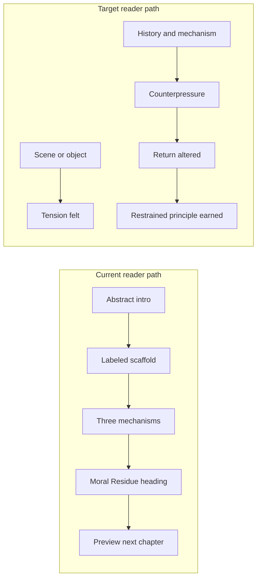

# When Incentives Become the Moral Language — Rewrite Planning Document

**Status:** Planning complete (July 2026) — essayistic rewrite not yet started  
**Canon manuscript:** [`index.md`](../index.md) — split Markdown, ~11.5k words (July 2026 essay edition)  
**Target manuscript:** four parts; twelve chapters + epilogue (length follows craft—not a fixed word band for now)  
**Model plan:** [`docs/rewrite-plans/how-meaning-moves-essayistic-rewrite-plan.md`](../../../docs/rewrite-plans/how-meaning-moves-essayistic-rewrite-plan.md)

**Reference books (latest Markdown canon):**

| Book | Path | Words (approx.) |
|------|------|-----------------|
| Trust Beyond Similarity | [`books/trust-beyond-similarity/`](../../../trust-beyond-similarity/) | ~34,700 |
| After Certainty | [`books/after-certainty/`](../../../after-certainty/) | ~19,600 |
| Everyone Knows Love | [`books/everyone-knows-love/`](../../../everyone-knows-love/) | ~23,000–25,000 |
| How Meaning Moves | [`books/how-meaning-moves/`](../../../how-meaning-moves/) | ~19,500 |

**Author approval gates:** [`author-approval-gates.md`](author-approval-gates.md)

**Voice north star:**  
- Ch 1: [`reference/chapter-1-the-bed-someone-else-needs.md`](reference/chapter-1-the-bed-someone-else-needs.md)  
- Ch 6: [`reference/chapter-6-the-front-page-watches-back.md`](reference/chapter-6-the-front-page-watches-back.md)  
- Ch 10: [`reference/chapter-10-the-hidden-subsidy.md`](reference/chapter-10-the-hidden-subsidy.md)  
- Patterns: [`reference/VOICE-NOTES.md`](reference/VOICE-NOTES.md)

---

## 1. Executive assessment

The current manuscript is **conceptually strong and compositionally inverted** for the author's emerging essayistic voice.

**What works (preserve the argument, not the scaffolding):**

- Core invariant is clear and non-caricatured: incentives enter as translators, then substitute for moral aims when judgment cannot coordinate at scale
- All eight domains are well-chosen and already differentiated in places (Ch 6 vs Ch 2 journalism/platforms; Ch 7 vs Ch 6 polling/attention)
- Counterpressure is present: metrics solve real coordination problems; practitioners are not villains
- Citation anchors exist per chapter (CMS HRRP, Haugen testimony, DORA, Paris Agreement, organizational justice research, etc.)
- Conclusion's closing distinction is excellent: *"Incentive systems will remain. So will judgment. The work is to keep them from pretending to be the same thing."*

**Core problem:** The book **proves its framework eight times** using a visible, labeled scaffold codified in [`book-rules.md`](book-rules.md). Readers meet mechanism headings before they meet institutional life. The essay edition (~9–11k) compresses each domain to ~750–1,400 words, which **amplifies formula** rather than scene.

**Length:** Word count is **not a planning constraint for now**. The rewrite should take the room scene-led craft requires; optional pacing notes in §14 are reference only.

### Three most important structural changes

1. **From parallel case studies to one unfolding essay** — dissolve the visible eight-chapter scaffold (original aim → judgment fracture → three mechanisms → moral residue → institutional/human scale) into scene-led discovery; name the full mechanism once in Ch 9, not eight times in domain chapters.
2. **Add Part IV and delayed synthesis** — split conclusion work into Ch 9 (proxy mechanism), Ch 10 (hidden human subsidy), Ch 11 (institutional deafness), Ch 12 (orientation), and epilogue (blank column); move reader from translation → substitution → formation → human cost.
3. **Replace defensive interlude with map essay** — *The Map Was Not a Lie* establishes anti-metric/anti-nostalgia posture through essayistic thought rather than bullet negations; interlude sits after Part I translation chapters, before substitution deepens.

### Three largest risks

1. **Scale jump without scene-led expansion** — the essay edition’s compression reinforces formula; rewrites need room to breathe, but no fixed word target applies yet
2. **Scaffold creep** via legacy agent pipeline — old specs explicitly add "mechanism paragraphs" and domain scaffold; must use [`agents/rewrite/`](agents/rewrite/) specs instead
3. **Composite scenes presented as reportage** — undermines trust; requires disclosure discipline in appendix and author notes

---

## 2. Signature-style analysis (reference books)

### Recurring compositional patterns (not sentence mimicry)

| Pattern | Trust Beyond Similarity | After Certainty | Everyone Knows Love | How Meaning Moves |
|---------|------------------------|-----------------|---------------------|-------------------|
| **Scene-first entry** | David's basswood model, fence mesh | Siblings arguing about a tree | Grandmother's aching hands before rain | Meeting ending while sentence still forming |
| **Serialized continuity** | David, Priya, Jade, Grace across chapters | Recurring scale moves (family → science → public health) | Kitchen/ordinary-life motifs | Philip, Nora, recurring meeting strand |
| **Widening with return** | Model → homophily research → back to model | Tree → Wegener → back to revision cost | Fire/seasons → love recognition | Room → Goffman/Kahneman → launch date on board |
| **Delayed naming** | "Core Principle" after 2,000+ words of scene | Concepts emerge after lived tension | "Before the diagrams" refusal | Appendix A holds formal definitions |
| **Dual truth held** | Similarity helps AND narrows | Correctness helps AND overclaims | Explanation helps AND flattens | Signal necessary AND costly |
| **Chapter endings** | Return to model with altered weight | Unresolved revision cost | Quiet recognition, not summary | Object meaning changed (whiteboard date) |
| **Paragraph rhythm** | Long flowing paragraphs, occasional short line | Varied length; historical passages breathe | Sensory particularity, not staccato | Essayistic runs; anti-fragmentation pass done |

### Short representative excerpts (for rewrite agents)

**Scene generates analysis** (*How Meaning Moves*, Ch 1 opening):

> "The meeting was supposed to be routine… Her voice was calm. 'I think we should slow this down a bit.'… What registered first was not the sentence. It was when she chose to say it."

**Recognition before framework** (*Everyone Knows Love*, Ch 3):

> "Recognition is not ignorance. It is a kind of knowledge that arrives before language catches up…"

**Historical widening after human scale** (*After Certainty*, Ch 1):

> "At family scale, this pattern is easy to miss… In 1912, Alfred Wegener proposed an idea that many scientists considered absurd…"

**Object as organizing image** (*Trust Beyond Similarity*, Ch 1):

> "David Okafor kept a model of the community center on a table in his studio… A strip of chain-link… ran along the back edge of the lot where the real fence still stood."

**Earned principle at end** (*How Meaning Moves*, Ch 1):

> "### Core Principle: Attention Finds a Signal — The first cue that feels important decides how later words land."

### What the incentives rewrite should adopt

- **Match the reference chapter** ([`reference/chapter-1-the-bed-someone-else-needs.md`](reference/chapter-1-the-bed-someone-else-needs.md)) for scene-first entry, evocative section titles, dual-truth counterpressure, and earned Core Principle
- Enter through **institutional surfaces** (whiteboard, feed, matrix, front page) not thesis paragraphs
- Keep **one widening per chapter** (policy history, documented episode, research)—return to opening image
- Move **"moral residue"** from heading to **experienced consequence** before the term appears (Part IV may name it)
- Use **Core principle** or restrained closing line only after demonstration
- **Dissolve** `### The Original Moral Aim`, `### Three mechanisms`, `### Moral Residue` as visible headings—retain as invisible craft checklist only (see §15)

---

## 3. Problems in the current structure

### Mechanical scaffold (every domain chapter)

1. Central question (explicit)
2. `### The Original Moral Aim…`
3. `### Why Judgment…` (often opens "Judgment did not fail because…")
4. `### How [X] Replace…` + **"Three mechanisms carry/drove/shape the shift"** (all 8 chapters)
5. **"None of these tools claims…"** (Ch 3, 5, 6, 7, 8)
6. `### Moral Residue…` (labeled section)
7. Institutional vs human scale contrast ("At institutional scale…" / "At human scale…")
8. Closing **preview of next chapter** (Ch 1→2, 2→3, … 7→8)

### Duplicated language inventory

| Phrase / move | Occurrences | Action |
|---------------|-------------|--------|
| "Three mechanisms…" | Ch 1–8 (all) | Keep idea once in Ch 9 synthesis; elsewhere show mechanisms in prose |
| "None of these tools claims…" | Ch 3, 5, 6, 7, 8 | Cut formula; vary counterpressure |
| "Judgment did not fail because…" | Ch 1, 3, 6, 8 | Use once early; elsewhere show without template |
| "Moral residue" (heading or label) | Intro, all chapters, conclusion | Experience first; name sparingly after Ch 10 |
| Chapter previews | Ch 1–7 closings | Replace with relational transitions (§10) |
| Part bridges as domain lists | Both bridges | Cut or merge; interlude carries scope |

### Current manuscript chapter-by-chapter inventory

#### Introduction — Why Judgment No Longer Coordinates Action (~849 words)

| Field | Assessment |
|-------|------------|
| **Domain** | Cross-institutional framing |
| **Central claim** | Judgment failed operationally, not morally; incentives became moral language |
| **Strongest passages** | Coordination failure paragraph; metrics' three advantages; moral language moved, not vanished |
| **Useful anchors** | Workforce matrices, discharge metrics (named generically) |
| **Repeated material** | Eight-domain preview; procedure-replaces-judgment list |
| **Preserve** | Coordination-not-ethics framing; metrics' real advantages |
| **Move** | Moral residue concept → Ch 10; domain inventory → cut |
| **Remove** | "Part I and Part II develop eight cases" |
| **Gaps** | No opening scene; states thesis before reader feels tension |

#### Ch 1 — Care Without Caring (~1,208 words)

| Field | Assessment |
|-------|------------|
| **Domain** | Healthcare / discharge / capacity |
| **Central claim** | Care metrics replace healing as defensible language |
| **Strongest passages** | Double bind bullets; "patient met discharge criteria"; privatized caring |
| **Anchors/citations** | HRRP, MS-DRGs, NAM burnout, Talbot/Dean moral injury |
| **Repeated** | Three mechanisms template; scaffold headings |
| **Preserve** | Discharge double bind; criteria-as-erasure paragraph (near-verbatim) |
| **Move** | Bridge preview → relational transition to Ch 2 |
| **Remove** | "Chapter 2 tests the same substitution in platform governance" |
| **Gaps** | No whiteboard scene; no specific ward moment |

#### Ch 2 — Engagement as a Theory of Value (~1,408 words)

| Field | Assessment |
|-------|------------|
| **Domain** | Technology platforms / engagement ranking |
| **Central claim** | Engagement became theory of value when editorial judgment became liability |
| **Strongest passages** | Mirror/deflection ("platform was a mirror"); moderator/engineer residue |
| **Anchors/citations** | Zuckerberg/Pichai testimony; WSJ Facebook divisiveness; Haugen Senate |
| **Repeated** | Three mechanisms (implicit in sections); Ch 1 callback |
| **Preserve** | Distributed vs concentrated moral pattern; internal research set-aside |
| **Move** | — |
| **Remove** | Chapter 3 preview closing |
| **Gaps** | No user-facing opening scene (feed never empties) |

#### Ch 3 — Publishing as Truth (~1,086 words)

| Field | Assessment |
|-------|------------|
| **Domain** | Academic research / publications / citations |
| **Central claim** | Productivity metrics replace truth-seeking as institutional language |
| **Strongest passages** | Productivity vs contribution distinction; reforms absorbed as new metrics |
| **Anchors/citations** | Hirsch h-index, DORA, NSF merit review, replication crisis (OSC, Ioannidis) |
| **Repeated** | "Three mechanisms drove the shift"; "None of these tools claims…" |
| **Preserve** | Contribution vs productivity close |
| **Move** | — |
| **Remove** | Chapter 4 preview |
| **Gaps** | No researcher-at-fork scene; metric shaping inquiry underdeveloped |

#### Ch 4 — Targets Without Judgment (~1,192 words)

| Field | Assessment |
|-------|------------|
| **Domain** | Climate / ESG / emissions targets |
| **Central claim** | Seriousness substitutes for responsibility when harm is diffuse |
| **Strongest passages** | Seriousness vs responsibility; "no standard column for what we do not know" |
| **Anchors/citations** | Paris Agreement, SBTi, World Bank carbon pricing, ISSB/ESRS, VCMI/ICVCM |
| **Repeated** | Three mechanisms; Part I pattern recap |
| **Preserve** | Accounting-vs-impact gap; practitioner insider knowledge |
| **Move** | Interlude pointer → cut (interlude rewrites) |
| **Remove** | "The interlude that follows states what this book is not" |
| **Gaps** | No sustainability professional scene; ESG breadth could narrow |

#### Interlude — What This Book Is Not (~490 words)

| Field | Assessment |
|-------|------------|
| **Domain** | Scope / posture |
| **Central claim** | Diagnostic, not anti-metric, anti-capitalist, nostalgic, or prescriptive |
| **Strongest passages** | "Clarity does not solve problems. It changes how problems are seen." |
| **Preserve** | All five refusals (reframed as map essay) |
| **Remove** | Bullet-negation structure; Part II preview list |
| **Gaps** | Not essayistic; defensive rather than discovered |

#### Ch 5 — Fairness by Formula (~1,025 words)

| Field | Assessment |
|-------|------------|
| **Domain** | Workforce / HR / layoffs |
| **Central claim** | Procedural fairness substitutes for authored judgment |
| **Strongest passages** | Fairness vs formula two-sentence distinction |
| **Anchors/citations** | Cappelli/Tavis HBR; WARN Act; Greenberg organizational justice |
| **Repeated** | Three mechanisms; "None of these tools claims…" |
| **Preserve** | Fairness/formula distinction (near-verbatim) |
| **Remove** | Chapter 6 preview |
| **Gaps** | No documented layoff episode; no matrix scene |

#### Ch 6 — Attention as Importance (~1,022 words)

| Field | Assessment |
|-------|------------|
| **Domain** | Journalism / newsroom analytics |
| **Central claim** | Attention metrics replace editorial claims about public importance |
| **Strongest passages** | "Audience is not the same as public"; explicit Ch 2 differentiation |
| **Anchors/citations** | Pew, Reuters Digital News Report, Sunstein, Gallup/Knight |
| **Repeated** | Three mechanisms; "At institutional scale…" |
| **Preserve** | Audience/public distinction; newsroom vs platform difference |
| **Remove** | Chapter 7 preview |
| **Gaps** | No newsroom analytics scene; needs documented Chartbeat-era reporting |

#### Ch 7 — Polling as Moral Signal (~863 words)

| Field | Assessment |
|-------|------------|
| **Domain** | Electoral politics / polling |
| **Central claim** | Popularity signals substitute for deliberative legitimacy |
| **Strongest passages** | Representation vs popularity close; deliberation vs snapshot |
| **Anchors/citations** | Pew, FEC, Hersh, trust time series |
| **Repeated** | Three mechanisms; Ch 6 differentiation paragraph |
| **Preserve** | "Listening replaces owning" section |
| **Remove** | Chapter 8 preview |
| **Gaps** | Thin on historical polling; needs Gallup/archive grounding |

#### Ch 8 — Formation Without Formation (~763 words)

| Field | Assessment |
|-------|------------|
| **Domain** | Education / testing / formation |
| **Central claim** | Measurement replaces formation as institutional language |
| **Strongest passages** | "Formation goes quiet—practiced locally, rarely owned publicly" |
| **Anchors/citations** | ESEA, ACGR, PISA, RAND/LPI |
| **Repeated** | Three mechanisms; "None of these tools claims…" |
| **Preserve** | Data-driven-as-care rhetoric; formation vs measurement |
| **Remove** | "Capstone" framing; conclusion handoff |
| **Gaps** | Shortest chapter; no report-card scene |

#### Conclusion — Living Inside Incentive Systems (~920 words)

| Field | Assessment |
|-------|------------|
| **Central claim** | Orientation without program; keep judgment and metrics distinct |
| **Strongest passages** | Final three sentences; practitioner examples in orientation section |
| **Preserve** | Closing distinction (near-verbatim); orientation practices (reframe for Ch 12) |
| **Move** | Three-pattern list → Ch 9; eight-domain inventory → cut; practitioner subsidy → Ch 10 |
| **Remove** | Part I/II recap; domain phrase list |

---

## 4. Proposed book architecture

**Endorse the four-part, 12-chapter + epilogue architecture** with these refinements:

| Refinement | Reason |
|------------|--------|
| **Dissolve part bridges** into chapter transitions | Bridges currently re-list domains; conflicts with essayistic flow |
| **Place Ch 9 (synthesis) after Ch 8** in reading order—but **draft Ch 9 early** in production | Reader discovers mechanism before full naming; writers need north star |
| **Keep all eight domains** | Each advances a distinct stage (§9); no stronger replacement identified |
| **Rename introduction** to *The Question the Dashboard Cannot Ask* | Current intro is thesis-forward; new title signals scene entry |
| **Move "what book is not" content** into map interlude + light intro threading | Avoid double defensive front matter |
| **Update `book.yml` description** when rewrite milestone ships | Note essayistic edition; no word-band lock required for now |

### Part map

**Introduction** — The Question the Dashboard Cannot Ask

**Part I — The Need for Translation**

- Ch 1 — The Bed Someone Else Needs (healthcare)
- Ch 2 — The Feed That Never Empties (platforms)
- Ch 3 — The Paper That Must Count (academia)

**Interlude** — The Map Was Not a Lie

**Part II — When the Translation Takes Over**

- Ch 4 — The Target on the Wall (climate/ESG)
- Ch 5 — The Matrix With No Author (workforce/HR)
- Ch 6 — The Front Page Watches Back (journalism)

**Part III — The World the Metric Makes**

- Ch 7 — The Poll Before the Position (politics)
- Ch 8 — The Child the Score Cannot Hold (education)
- Ch 9 — When the Proxy Becomes the Good (delayed synthesis)

**Part IV — What Judgment Still Knows**

- Ch 10 — The Hidden Subsidy
- Ch 11 — The Institution That Cannot Hear Itself
- Ch 12 — Keeping the Difference Alive

**Epilogue** — The Blank Column

---

## 5. Chapter-by-chapter rewrite briefs

### Introduction — The Question the Dashboard Cannot Ask

- **Current source:** [`introduction-why-judgment-no-longer-coordinates-action.md`](../front-matter/introduction-why-judgment-no-longer-coordinates-action.md)
- **Action:** Rewrite substantially
- **Opening scene:** Organizational meeting where human consequences are debated until someone turns to a dashboard/score (composite scene—label in author notes)
- **Preserve:** Coordination failure framing; metrics' real advantages; judgment-not-failed-morally-but-operationally
- **Cut:** "Part I and Part II develop eight cases"; labeled "Moral Residue" section; domain inventory
- **Target:** Room for scene-led craft (no fixed word count)

### Ch 1 — The Bed Someone Else Needs

- **Reference draft (author):** [`reference/chapter-1-the-bed-someone-else-needs.md`](reference/chapter-1-the-bed-someone-else-needs.md) — **primary voice north star** for the rewrite
- **Current essay edition:** Ch 1 Care Without Caring
- **Object:** Hospital whiteboard with expected discharge date
- **Action:** Integrate reference draft into manuscript structure; add citations at pivots (HRRP, DRG, capacity/boarding sources per §11)
- **Preserve from reference:** Scene structure, section movement, criteria language, hidden-subsidy preview, Core Principle, closing whiteboard return
- **Preserve from essay edition:** Footnote anchors where claims align
- **Do not:** Reintroduce scaffold headings; expand hidden-subsidy section to Ch 10 scope
- **Principle (earned):** Care continues; caring becomes private (reference draft closing)
- **Target:** Room for scene-led craft (reference draft sets pacing)

### Ch 2 — The Feed That Never Empties

- **Current:** Ch 2 Engagement
- **Object:** Endless scroll / feed after user forgot why they opened app
- **Anchors:** Zuckerberg/Pichai testimony; WSJ Horwitz/Seetharaman; Haugen disclosures
- **Preserve:** Mirror/deflection; moderator residue; distinction from healthcare concentration vs distributed gap
- **New emphasis:** Feedback loop—signal shapes future behavior
- **Principle:** What receives attention begins to look worthy of attention
- **Target:** Room for scene-led craft (no fixed word count)

### Ch 3 — The Paper That Must Count

- **Current:** Ch 3 Publishing
- **Scene:** Researcher choosing between important uncertain question and narrower publishable one (composite)
- **Anchors:** h-index, DORA, NSF merit review, replication crisis literature
- **Preserve:** Productivity vs contribution; reforms absorbed as new metrics
- **New emphasis:** Metric shapes what gets *attempted*, not only evaluated
- **Principle:** What institutions can recognize eventually shapes what people learn to pursue
- **Target:** Room for scene-led craft (no fixed word count)

### Interlude — The Map Was Not a Lie

- **Current:** [`interlude-what-this-book-is-not.md`](../front-matter/interlude-what-this-book-is-not.md)
- **Action:** Full rewrite as essay (maps, compression, omission)
- **Preserve:** Anti-metric/anti-capitalism/nostalgia/solutions refusals—but as discovered thought, not bullet negations
- **Target:** Room for scene-led craft (no fixed word count)

### Ch 4 — The Target on the Wall

- **Current:** Ch 4 Targets
- **Object:** Public net-zero target with number and date
- **Human anchor:** Sustainability professional (composite) who believes in framework and knows accounting gaps
- **Anchors:** Paris Agreement, SBTi, World Bank carbon pricing, ISSB/ESRS, VCMI/ICVCM offset debates
- **Preserve:** Seriousness vs responsibility; "no standard column for what we do not know"
- **Narrow:** Focus on target compliance vs causal ownership—not broad ESG indictment
- **Principle:** Meeting a target can substitute for owning harm the target was meant to reduce
- **Target:** Room for scene-led craft (no fixed word count)

### Ch 5 — The Matrix With No Author

- **Current:** Ch 5 Fairness
- **Object:** Spreadsheet/matrix with names, ratings, cost, selection status
- **Anchors:** Cappelli/Tavis HBR; Greenberg organizational justice; documented WARN/SEC layoff patterns
- **Evidence needed:** One well-sourced layoff matrix episode (e.g., public tech restructuring reporting)
- **Preserve:** Fairness vs formula distinction (near-verbatim candidate)
- **Principle:** A procedure can be consistent without being sufficient
- **Target:** Room for scene-led craft (no fixed word count)

### Ch 6 — The Front Page Watches Back

- **Reference draft (author):** [`reference/chapter-6-the-front-page-watches-back.md`](reference/chapter-6-the-front-page-watches-back.md) — **primary voice north star** for domain chapters (sustained single-thread scene)
- **Current essay edition:** Ch 6 Attention as Importance
- **Essential distinction (preserve):** Audience measures response; public requires judgment about consequences—including stories people may not initially choose to read. Economic pressure is real; not simple abandonment of civic purpose.
- **Ch 2 differentiation (preserve):** *Mirror with a hand* — newsroom allocates while reflecting; platform distributes engagement at global scale
- **Action:** Integrate reference draft; add citations at pivots (Reuters Digital News Report, Pew, trust surveys, advertising collapse—per §11)
- **Preserve:** 8:12 homepage opening; print front page history; business-model subsidy; performs reaching backward; audience/public section; circular relevance; story that cannot prove demand in advance; editor protection act; dusk two-accounts close
- **Do not:** Merge with Ch 2; anti-analytics polemic; golden-age journalism nostalgia
- **Principle (earned):** Attention is evidence, not authority (reference Core Principle)
- **Target:** Room for scene-led craft (reference draft sets pacing)

### Ch 7 — The Poll Before the Position

- **Current:** Ch 7 Polling
- **Scene:** Campaign team testing language / waiting for poll before taking position
- **Anchors:** Pew polling methodology; FEC fundraising data; Hersh *Politics Is for Power*; trust time series
- **Evidence needed:** Historical grounding—documented evolution of nightly tracking (Gallup/NYT), 2016 polling miss postmortems (primary sources)
- **Preserve:** Representation vs responsiveness; deliberation vs snapshot
- **Principle:** A snapshot can guide representation without becoming the whole meaning of legitimacy
- **Target:** Room for scene-led craft (no fixed word count)

### Ch 8 — The Child the Score Cannot Hold

- **Current:** Ch 8 Formation
- **Object:** Teacher writing report-card comment about change grade cannot capture
- **Anchors:** ESEA accountability, ACGR, PISA, RAND/LPI teacher stress
- **Preserve:** Formation goes quiet; data-driven as care rhetoric
- **Principle:** What cannot be measured does not disappear—it becomes private work
- **Target:** Room for scene-led craft (no fixed word count)

### Ch 9 — When the Proxy Becomes the Good (NEW synthesis)

- **Sources:** Introduction mechanism + conclusion "What Substitution Does Everywhere"
- **Action:** New chapter; draft early for craft, revise after Ch 1–8
- **Structure:** Return to object family (whiteboard, feed, citation count, target, matrix, analytics, poll, report card); name six-step mechanism once:

  1. A value is difficult to coordinate.
  2. A proxy makes the value legible.
  3. Rewards and consequences attach to the proxy.
  4. People reorganize behavior around it.
  5. The institution forgets the proxy was a translation.
  6. What the proxy cannot express loses public standing.

- **Principle:** A proxy becomes moral language when the institution forgets it is a translation
- **Target:** Room for scene-led craft (no fixed word count)

### Ch 10 — The Hidden Subsidy (NEW)

- **Reference draft (author):** [`reference/chapter-10-the-hidden-subsidy.md`](reference/chapter-10-the-hidden-subsidy.md) — **primary voice north star** for Part IV opening
- **Bookend with Ch 1:** 11:42 discharge time vs nine unrecorded minutes; *Nine Minutes* closing returns to nurse hallway
- **Sources:** Scattered practitioner material across essay-edition Ch 1–8 + conclusion orientation examples
- **Action:** Integrate reference draft; ensure Ch 1 hidden-subsidy preview stays lighter than this chapter
- **Preserve:** Cross-domain scenes (nurse, manager, teacher, montage); reliable-person section; subsidy withdrawn; discretion vs repair; anti-metric-for-care passage; moral exhaustion; speakable remainder
- **Do not:** Turn into eight identical case-study blocks; add reform checklist; metric every act of care
- **Principle (earned):** People supply what the system cannot name (reference Core Principle)
- **Target:** Room for scene-led craft (reference draft sets pacing)

### Ch 11 — The Institution That Cannot Hear Itself (NEW)

- **Action:** New conceptual escalation—displaced moral knowledge returns only in measurable forms
- **Examples:** moral distress → engagement data; distrust → retention risk; civic alienation → polling movement; poor formation → test-performance issue; quality problems → readmission data; loss of meaning → productivity decline
- **Principle:** A system cannot learn from knowledge it has no language to receive
- **Target:** Room for scene-led craft (no fixed word count)

### Ch 12 — Keeping the Difference Alive

- **Current:** [`conclusion-living-inside-incentive-systems.md`](../back-matter/conclusion-living-inside-incentive-systems.md)
- **Action:** Rewrite—orientation not checklist; preserve closing distinction
- **Cut:** Eight-domain inventory recap; three-pattern numbered list (moved to Ch 9)
- **Target:** Room for scene-led craft (no fixed word count)

### Epilogue — The Blank Column (NEW)

- **Return:** Hospital whiteboard or institutional surface
- **Show:** Fields for recorded knowledge vs blank space for fear, uncertainty, another patient's need
- **Target:** Room for scene-led craft (no fixed word count)

---

## 6. Old-to-new content map

| Current unit | Proposed unit | Action | Notes |
|--------------|---------------|--------|-------|
| Introduction | Introduction (renamed) | Rewrite substantially | Scene-first |
| Part I bridge | — | Cut/merge | Essence → Ch 1 transition |
| Ch 1 Care | Ch 1 Bed | Rewrite | Preserve best paragraphs |
| Ch 2 Engagement | Ch 2 Feed | Rewrite | |
| Ch 3 Publishing | Ch 3 Paper | Rewrite | |
| Ch 4 Targets | Ch 4 Target | Rewrite | Move after interlude |
| Interlude | Interlude Map | Full rewrite | |
| Part II bridge | — | Cut/merge | |
| Ch 5 Fairness | Ch 5 Matrix | Rewrite | |
| Ch 6 Attention | Ch 6 Front Page | Rewrite | |
| Ch 7 Polling | Ch 7 Poll | Rewrite + history | |
| Ch 8 Formation | Ch 8 Child/Score | Rewrite | |
| — | Ch 9 Proxy | **New** | From intro+conclusion |
| — | Ch 10 Hidden Subsidy | **New** | From practitioner threads |
| — | Ch 11 Cannot Hear | **New** | |
| Conclusion | Ch 12 Keeping Difference | Rewrite | Keep final lines → epilogue overlap ok |
| — | Epilogue Blank Column | **New** | |
| Appendix | Appendix | Update | Remove scaffold advertisement; update domain table |
| Bibliography | Bibliography | Expand | Migrate all footnotes |

**Footnote migration rule:** Every `[^cN-...]` in current chapter files maps to new parent chapter; no orphan citations.

### Footnote inventory (current edition)

| Chapter | Footnote count (approx.) | Key sources |
|---------|--------------------------|-------------|
| Ch 1 | 4 | CMS HRRP/DRG, NAM, STAT |
| Ch 2 | 4 | Senate/House testimony, WSJ, Haugen |
| Ch 3 | 5 | Hirsch, DORA, NSF, OSC, Ioannidis |
| Ch 4 | 3 | Paris, World Bank, ISSB/ESRS |
| Ch 5 | 3 | Cappelli/Tavis, WARN, Greenberg |
| Ch 6 | 3 | Pew/Reuters, Sunstein, Gallup/Knight |
| Ch 7 | 4 | Pew, FEC, Hersh, trust series |
| Ch 8 | 4 | ED, NCES, OECD, RAND/LPI |

Consolidated [`bibliography.md`](../back-matter/bibliography.md) currently lists only 5 entries—all chapter footnotes must migrate on rewrite.

---

## 7. Human and historical anchors (per proposed chapter)

| Ch | Opening scene | Recurring object | Historical/institutional anchors | Core tension | Strongest counterargument | Human consequence | Return image |
|----|---------------|------------------|----------------------------------|--------------|---------------------------|-------------------|--------------|
| Intro | Meeting turns to dashboard | Dashboard threshold | Composite organizational scene (disclose) | Judgment must justify itself to metric | Metrics enable coordination at distance | Moral exhaustion in competent orgs | Dashboard question that cannot be asked |
| 1 | Discharge planning at whiteboard | Whiteboard discharge date | HRRP (2012+), DRG system | One patient needs bed/another needs night | Metrics reduce arbitrariness, reveal patterns | Clinician carries unrecorded uncertainty | Whiteboard blank column |
| 2 | User opens app, feed continues | Infinite feed | Facebook Papers, 2018–21 hearings | Neutrality vs editorial responsibility | Engagement reflects real preference | Moderator/engineer private knowledge | Feed still refreshing |
| 3 | Researcher at grant fork | Citation count / journal shelf | h-index 2005, DORA 2012, replication crisis | Slow truth vs fast productivity | Metrics surface inequity, enable comparison | Abandoned inquiry lines | Paper accepted, question narrowed |
| 4 | Target on corporate wall | Net-zero target poster | Paris 2015, SBTi, offset integrity debates | Diffuse harm vs auditable pledge | Targets mobilize capital and attention | Community near uncounted emissions | Target met, harm persists locally |
| 5 | Manager receives matrix | Workforce matrix | Performance management revolution, WARN | Consistency vs case adequacy | Procedure reduces discrimination risk | Employee receives process not account | Name in selected row |
| 6 | Editor watches homepage shift | Analytics-driven front page | Digital News Report, trust surveys | Civic importance vs traffic | Analytics reveal audience needs | Reporter burns out on performative news | Front page after A/B test |
| 7 | Poll-tested messaging meeting | Poll toplines | FEC disclosures, Pew trust series; add historical polling | Listening vs leading | Polling improves representation | Voter wants reason not snapshot | Position released after poll |
| 8 | Report-card comment writing | Report card comment field | ESEA accountability, ACGR | Formation vs snapshot measurement | Tests reveal inequity | Teacher's private developmental work | Comment longer than grade |
| 9 | Montage of prior objects | All institutional surfaces | Cross-domain synthesis | Translation forgotten | Proxies necessary at scale | — | Objects now mean something darker |
| 10 | Return to practitioners | Same objects, human hands | Cross-chapter cast (composite) | System appears sufficient via subsidy | Subsidy enables survival | Blame lands on individual when subsidy fails | Quiet compensating acts |
| 11 | Institution reads own distress as metric | Dashboard of HR/engagement data | Documented employee engagement industry | Information without moral language | Measurement enables response | Alienation converted to KPI | Metric that replaces the complaint |
| 12 | Orientation without program | — | — | Keep difference alive | Orientation insufficient alone | Sustainable participation | — |
| Epilogue | Whiteboard again | Blank column | Return to Ch 1 | Necessary but incomplete decision | — | Judgment begins in blank space | Unfilled field |

**Composite scene policy:** Label in planning notes and author note/appendix; prose may use indefinite framing ("a hospital," "a campaign team") without fabricated proper names or fake quotations.

---

## 8. Chapter distinctiveness test

| Ch | New conceptual work | Escalation stage |
|----|---------------------|------------------|
| 1 | Judgment must **travel**; criteria as portable decision | Translation needed |
| 2 | Signal **feeds back** into behavior at scale | Translation + feedback |
| 3 | Metric shapes what gets **imagined/attempted** | Upstream formation of inquiry |
| 4 | Compliance can substitute for **causal ownership** | Substitution for responsibility |
| 5 | Procedure diffuses **authorship** of harm | Substitution + distributed blame |
| 6 | Audience response becomes **public importance** (civic frame) | Importance redefined post-publication |
| 7 | Measurement becomes **legitimacy** | Political moral language |
| 8 | Unmeasured value becomes **private labor** | Formation displaced |
| 9 | Proxies become **moral definitions** (full mechanism named) | Synthesis |
| 10 | Individuals **subsidize** system humanity | Human cost |
| 11 | Institution cannot **receive** displaced knowledge | Epistemic blind spot |
| 12 | **Orientation** without program | Practice stance |

**Flag:** Ch 6 vs Ch 2 remain closest pair—maintain explicit civic/journalism vs platform-product distinction in rewrite briefs and transitions (§10).

**Domain retention evaluation:**

| Domain | Keep? | Notes |
|--------|-------|-------|
| Healthcare | Yes | Opens translation arc; strongest moral aim |
| Platforms | Yes | Feedback loop stage |
| Academia | Yes | Early placement correct—shapes inquiry upstream |
| Climate/ESG | Yes, narrowed | Focus targets/accounting, not broad ESG polemic |
| Workforce/HR | Yes | Authorship diffusion distinct from climate |
| Journalism | Yes | Civic frame distinct from Ch 2 if maintained |
| Politics | Yes, deepen history | Needs Gallup/archive/postmortem sources |
| Education | Yes | Correct position before synthesis |

No missing stage identified; no replacement domain recommended.

---

## 9. Recurring image and object map

**Family of institutional surfaces** (related, not forced):

| Object | Chapters | Function |
|--------|----------|----------|
| Whiteboard / blank column | 1, epilogue | Portable clinical decision; what system cannot record |
| Feed / endless scroll | 2 | Non-terminating attention surface |
| Citation count / journal shelf | 3 | Upstream shaping of inquiry |
| Target on wall | 4 | Portable responsibility pledge |
| Workforce matrix | 5 | People reduced to rows |
| Analytics front page | 6 | Civic importance as traffic |
| Poll toplines | 7 | Legitimacy as snapshot |
| Report card / comment field | 8 | Formation as private margin |
| All surfaces montage | 9 | Synthesis—objects darkened |
| Surfaces + human hands | 10–11 | Subsidy and misread signals |

Do not force one metaphor per chapter—develop the **family of writable surfaces**.

---

## 10. Transition plan (chapter boundaries)

| Boundary | Movement concept |
|----------|------------------|
| Intro → Ch 1 | Dashboard question needs a room where the metric is clinical, not abstract |
| Ch 1 → Ch 2 | The bed must empty; the feed never does—both coordinate through numbers, one has a door |
| Ch 2 → Ch 3 | Engagement measures response; citations begin shaping inquiry before response exists |
| Ch 3 → Interlude | After three translations, reader needs map—not denial—before substitution deepens |
| Interlude → Ch 4 | Maps make responsibility visible; targets make it portable—and detachable |
| Ch 4 → Ch 5 | Target makes harm abstract; matrix makes **people** abstract |
| Ch 5 → Ch 6 | Matrix removes author; front page removes editor—attention without a byline |
| Ch 6 → Ch 7 | Front page follows attention after publication; politics consults attention before position |
| Ch 7 → Ch 8 | Poll captures preference snapshot; school captures development snapshot—both miss time |
| Ch 8 → Ch 9 | Eight surfaces seen; now name what happened to them collectively |
| Ch 9 → Ch 10 | Mechanism named; who pays when it works? |
| Ch 10 → Ch 11 | People subsidize systems; systems misread subsidy as success |
| Ch 11 → Ch 12 | Seeing blindness is not fixing it—how to live inside anyway |
| Ch 12 → Epilogue | Orientation returns to one surface, one blank field |

Do not write polished transition prose yet. Each boundary should accomplish the relational movement above without mechanical chapter previews.

---

## 11. Evidence and citation worklist

### Per chapter priorities

| Ch | Adequate now | Needs strengthening |
|----|--------------|---------------------|
| 1 | CMS HRRP/DRG, NAM, STAT moral injury | Hospital capacity/boarding crisis primary sources; whiteboard/discharge workflow docs |
| 2 | Congressional testimony, WSJ, Haugen | Internal research summaries (public disclosures); moderation workforce studies |
| 3 | Hirsch, DORA, NSF, replication lit | Grant panel criteria docs; tenure policy examples; meta-science reviews (2020+) |
| 4 | Paris, World Bank, ISSB/ESRS | Offset failure investigations (Guardian 2023 VCM, etc.); SBTi controversy primary reporting |
| 5 | Cappelli/Tavis, Greenberg | Specific documented layoff (public SEC WARN filings + journalism) |
| 6 | Pew, Reuters, Sunstein, Gallup/Knight | Newsroom analytics adoption (Nieman Lab, CJR documented cases) |
| 7 | Pew, FEC, Hersh | Historical polling influence (Gallup archives); 2016/2020 postmortems; deliberative democracy contrast sources |
| 8 | ED, NCES, OECD, RAND/LPI | Teacher evaluation rubric studies; report-card research |
| 9–12 | Structural synthesis | New claims need new sources or explicit authorial synthesis labels |

### Global bibliography tasks

- Expand [`bibliography.md`](../back-matter/bibliography.md) from 5 to full consolidated list
- Run citation audit pass (precedent: [`docs/audits/citation-audit-2026-07.md`](../../../docs/audits/citation-audit-2026-07.md))
- Distinguish documented fact vs authorial synthesis in appendix
- Prefer: original research, government documentation, statutes, institutional reports, direct testimony, primary historical sources, investigative reporting where primary material unavailable

---

## 12. Material to preserve verbatim or nearly verbatim

- Ch 1: "Patient met discharge criteria" paragraph; privatized caring sentence
- Ch 5: Fairness vs formula two-sentence distinction
- Ch 6: "Audience is not the same as public" section core
- Ch 4: seriousness vs responsibility; missing column for uncertainty
- Conclusion: final paragraph ("Incentive systems will remain…")
- Core invariant (rephrase across book, do not drop)

---

## 13. Material to cut or consolidate

- All `### Three mechanisms` labeled sections (integrate into prose)
- All "None of these tools claims…" template sentences
- Chapter-ending "Chapter N+1 tests…" previews
- Part I and II bridge domain inventories
- Introduction domain preview paragraph
- Conclusion eight-domain list and three-numbered-pattern recap (→ Ch 9)
- Appendix scaffold-as-virtue paragraph (replace with scene-first method description)
- Visible `### Moral Residue` headings (keep phenomenon, lose label until earned)

---

## 14. Estimated word counts and pacing (optional reference)

**Not binding for now.** Author has deferred word-count decisions. Use this section only if pacing questions arise mid-rewrite.

| Unit | Reference range (optional) |
|------|---------------------------|
| **Total book** | Substantial essayistic book—likely well above essay edition (~11k) |
| Introduction | Enough room for opening scene + question |
| Domain chapters | Long enough for scene, widening, return |
| Interlude / Epilogue | Shorter than domain chapters |
| Part IV chapters | Room for human cost and orientation |

**Pacing notes:**

- Longest scenes: Ch 1 discharge, Ch 5 matrix execution, Ch 10 practitioner returns
- Shortest: Interlude, Epilogue
- Highest abstraction risk: Ch 9, Ch 11—anchor in objects and documented episodes
- Current over-explaining: mechanism headings, repeated three-step lists

**Update `book.yml` description** when rewrite milestone ships (no word-band lock required for now).

---

## 15. Flexible chapter-writing template (for rewrite agents)

**Invisible craft sequence—never label these sections in prose:**

1. Enter through scene or object; stay until tension is felt
2. Observation and question emerge from scene
3. Widen: institutional history, policy, documented episode
4. Show why reasonable actors adopted the proxy (counterpressure required)
5. Evidence and primary sources
6. Reveal what proxy cannot carry—hold two truths
7. Return to opening image with altered meaning
8. Optional restrained **Core principle** only if earned

**Explicit warnings for agents:**

- Do not reproduce eight labeled sections per chapter
- Do not open with "Central question:"
- Do not use "Three mechanisms" as heading or counted list more than once in whole book (Ch 9)
- Do not preview the next chapter by number/name
- Do not invent named patients, employees, or quoted dialogue as reported fact
- Run echo pass after Part I, Part III, and full manuscript
- Use [`agents/rewrite/`](agents/rewrite/) specs, not legacy essay-edition agents **01–08**

---

## 16. Recommended rewrite sequence

1. **Introduction** (sets question and voice)
2. **Ch 1** (canonical scene + translation)
3. **Ch 9** (provisional synthesis—revise after Ch 8)
4. **Ch 10** (moral residue as lived cost)
5. **Interlude** (map essay—scope before Part II)
6. **Ch 2–8** in order (domain chapters)
7. **Ch 9** revision (full object montage after domains exist)
8. **Ch 11**
9. **Ch 12 + Epilogue**
10. Full transition and repetition pass
11. Citation verification + bibliography consolidation
12. Voice consistency pass (compare to After Certainty / HMM post-rewrite)

**Rationale:** Early Ch 1 + Ch 9 + Ch 10 establish voice, mechanism, and emotional stakes before eight domain rewrites. Interlude before Part II prevents defensive repetition.

---

## 17. Risks and open editorial questions

See [`author-approval-gates.md`](author-approval-gates.md) for decisions requiring author sign-off before chapter rewrites begin.

### Additional risks

- Ch 6/Ch 2 collapse under essayistic wandering
- Bibliography debt slows publication
- Part IV (Ch 10–11) may feel additive if Ch 9 synthesis is too complete—calibrate overlap

---

## 18. Acceptance criteria for completed rewrite

- [ ] Central invariant intact; substitution-not-anti-metrics posture maintained
- [ ] Each chapter advances argument (distinctiveness table §8 satisfied)
- [ ] Voice continuous with After Certainty / HMM / Trust scene-led craft
- [ ] Structure feels discovered; no visible eight-part scaffold
- [ ] Metrics necessary and incomplete in every domain chapter
- [ ] No domain morality play; practitioners remain sympathetic
- [ ] All citations traceable; bibliography complete
- [ ] Scenes composite-labeled where not documented
- [ ] Moral residue experienced before named
- [ ] Arc: translation → substitution → proxy-as-good → human subsidy → institutional deafness → orientation
- [ ] Ending offers orientation without checklist
- [ ] Independent chapter execution possible using this document's briefs

---

## Related documents

| Document | Purpose |
|----------|---------|
| [`author-approval-gates.md`](author-approval-gates.md) | Decisions requiring author sign-off |
| [`book-rules.md`](book-rules.md) | Updated architectural constraints |
| [`status.md`](status.md) | Rewrite phase tracking |
| [`drafting-process.md`](drafting-process.md) | Rewrite workflow |
| [`agents/rewrite/README.md`](agents/rewrite/README.md) | New agent specs for essayistic rewrite |
| [`reference/chapter-1-the-bed-someone-else-needs.md`](reference/chapter-1-the-bed-someone-else-needs.md) | Author reference — Ch 1; translation arc |
| [`reference/chapter-6-the-front-page-watches-back.md`](reference/chapter-6-the-front-page-watches-back.md) | Author reference — Ch 6; journalism / domain model |
| [`reference/chapter-10-the-hidden-subsidy.md`](reference/chapter-10-the-hidden-subsidy.md) | Author reference — Ch 10; human cost arc |
| [`reference/VOICE-NOTES.md`](reference/VOICE-NOTES.md) | Compositional patterns; Ch 2/6 distinction; bookends |
