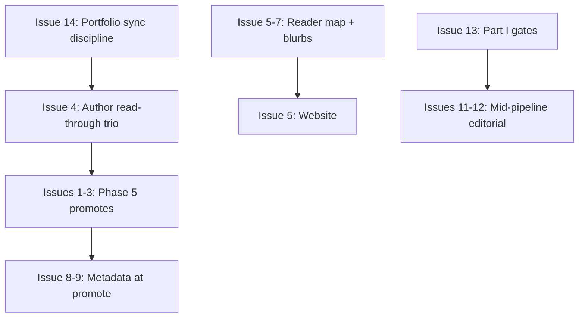

# Follow-Up Issues Backlog

**Date:** 2026-05-21  
**Source:** Portfolio promotion readiness audit ([#99](https://github.com/ksteffe/after-certainty/issues/99))

Suggested GitHub issues for the repository owner to file. Dependencies noted where sequencing matters.

---

## Promotion readiness

### 1. Phase 5: Promote After Certainty to `books/`

**Scope:** Author sign-off on Phase 4 cohesion; copy `upcoming/after-certainty/` → `books/after-certainty/`; enable `build.formats.*` and `publishing.enabled`; add `author.website`; refresh `description` for judgment-without-finality framing; update portfolio-status to promoted.

**Depends on:** Author read-through (human gate).

**Blocks:** Website “flagship” page, quote extraction.

---

### 2. Phase 5: Promote Before Certainty Arrives to `books/`

**Scope:** Same promote checklist as #1 for `before-certainty-arrives`.

**Depends on:** Author read-through.

**Can parallel:** Issue #1 after independent sign-off.

---

### 3. Phase 5: Promote When Accountability No Longer Expires to `books/`

**Scope:** Same promote checklist; **include** differentiation copy vs published *When Authority Outlives Accountability* in index intro or reader map.

**Depends on:** Author read-through.

**Blocks:** Public marketing that mentions “accountability” without disambiguation.

---

### 4. Author read-through batch: Phase 4 trio

**Scope:** Single tracking issue for author gates on after-certainty, before-certainty-arrives, when-accountability-no-longer-expires with checklist per `docs/drafting-process.md` Phase 5 prep.

**Depends on:** Nothing.

**Blocks:** Issues #1–#3.

---

## Onboarding & cross-linking

### 5. Integrate portfolio reader map into after-certainty.com

**Scope:** Publish content from [`docs/portfolio-reader-map.md`](../portfolio-reader-map.md) (or adapt) on website; link from each book’s landing page.

**Depends on:** Reader map merged (this audit PR).

**Leverage:** High clarity impact for new readers.

---

### 6. Add differentiation blurbs: accountability pair + certainty cluster

**Scope:** Short “If you liked X, read Y” / “Read this first” blocks in:

- `books/when-authority-outlives-accountability/index.md` (or front matter)
- `upcoming/when-accountability-no-longer-expires/index.md`
- `books/curiosity-before-certainty/index.md`, `books/how-serious-systems-learn/index.md`, `books/the-discipline-of-uncertainty/index.md`, `books/after-certainty/index.md`

**Depends on:** Reader map (#5 optional but helpful).

**Constraint:** No terminology flattening.

---

### 7. WOLTY edition chooser for new readers

**Scope:** Paragraph in root README and WOLTY v1/v2 indexes: v1 = field guide / harm-effectiveness-legitimacy; v2 = pattern companion.

**Depends on:** None.

---

## Metadata & SEO

### 8. Add `author.website` to all upcoming nonfiction `book.yml` at Phase 5

**Scope:** `https://after-certainty.com` on eight upcoming titles when promoted (Velorum already has site).

**Depends on:** Promote issues or batch YAML edit before first export.

---

### 9. Refresh `book.yml` descriptions at promotion gates

**Scope:** Replace generic descriptions for After Certainty, Why Collaboration, and any title where description undersells manuscript spine (see audit §3).

**Depends on:** Per-book author approval.

---

### 10. Commerce metadata parity for published backlist

**Scope:** Add `purchase_links` / covers for Curiosity, Moral Seriousness, Coupling when ready for sale.

**Depends on:** Author/commerce decisions.

---

## Editorial & ontology

### 11. Interpretation: author read Parts III–IV + expansion decision

**Scope:** Complete author gate; lock essay vs 80–110k expansion; run echo check vs incentives/after-certainty/economy before large expansion.

**Depends on:** None.

**Blocks:** Interpretation promotion.

---

### 12. Incentives: Phase 3 coherence gate (single-part arc)

**Scope:** One manuscript-wide pass linking Ch 3–8 to Ch 1–2 anchors; update status + portfolio-status.

**Depends on:** Author read Ch 3–8 (can overlap).

---

### 13. Collaboration / Economy / Discipline: Part I author gates

**Scope:** Three subtasks or one umbrella issue for Pass 6 Part I read-through before Part II–IV expansion.

**Depends on:** None.

**Blocks:** Large depth passes toward 50–90k bands.

---

### 14. Portfolio-status automation or PR checklist

**Scope:** CI comment or PR template reminding editors to update `upcoming/docs/portfolio-status.md` when `docs/status.md` phase or rough scale changes.

**Depends on:** None.

**Prevents:** Recurrence of drift found in audit.

---

## Website & fiction

### 15. Velorum: complete `index.md` for all 30 chapters

**Scope:** List Acts 2–5 in index or add `index-preview.md` + README note if only Act I is public preview.

**Depends on:** Fiction track decision.

---

### 16. How Serious Systems Learn: remove draft footer before public promotion

**Scope:** Edit `book.yml` `title_page_footer`; confirm export artifacts.

**Depends on:** Editorial sign-off that manuscript is no longer “development draft.”

---

## Content extraction (promotion support)

### 17. Quote extraction pass: published leadership cluster

**Scope:** Pull 20–40 quotable passages from Misread, Outlives, WOLTY v1, Moral Seriousness for social/site; store in `books/<slug>/docs/quotes.md` or semantic.

**Depends on:** None.

**Leverage:** Promotion without manuscript edits.

---

### 18. Surface semantic glossary links from pattern-heavy books

**Scope:** Optional appendix or index links from WOLTY v2 / How Meaning Moves to `semantic/glossary` terms (generated or static).

**Depends on:** Manifest stability.

---

## Housekeeping

### 19. Published books editorial status rollup

**Scope:** Add `books/PORTFOLIO-EDITORIAL.md` or per-book `docs/status.md` for Moral Seriousness, Misread, Curiosity, HSSL.

**Depends on:** None.

---

### 20. Coupling: merge `coupling-manuscript-pass` PR to main

**Scope:** Complete open PR; enable full promotion for Coupling.

**Depends on:** Author/reviewer.

---

## Recommended sequencing

**Quick wins (agent or author, low effort):** 7, 14, 7, reader map merge, 15 (index only).

**Author-critical path:** 4 → 1–3 → 5–6.
