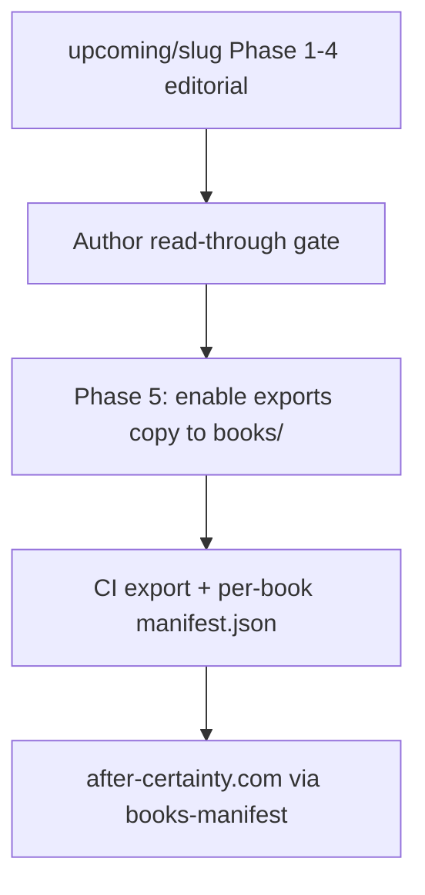

# 1. Portfolio structure

## Summary

The repository functions as a **unified publishing monorepo**: nine publishable manuscript roots under `books/`, nine metadata-backed folders under `upcoming/` (eight nonfiction + Velorum fiction), one shared Pandoc/CI pipeline, and aggregate manifests (`books-manifest.json`, `semantic-manifest.json`) intended for website and release consumers. Strengths include consistent `book.yml` specs, per-book editorial docs, and a clear Phase 5 promote path from `upcoming/` to `books/`. Primary friction: **dual status sources**, **no series reading-order doc**, **no cross-book links in manuscript hubs**, and **stale portfolio dashboard rows** for three upcoming titles.

## Repository organization

```
after-certainty/
├── books/              # Published: exports enabled, CI releases
├── upcoming/           # In progress: exports disabled until Phase 5
├── semantic/           # Shared glossary, patterns, sources (YAML)
├── scripts/ + tools/   # build.py, manifests, validation
├── schema/             # book.schema.json, manifest schemas
├── templates/          # Jinja front matter
└── docs/portfolio-audit/   # This audit (cross-cutting)
```

| Layer | Role |
|-------|------|
| `books/<slug>/` | Live manuscripts; `publishing.enabled: true`; formats exported on change |
| `upcoming/<slug>/` | Draft manuscripts; `upcoming.status: in_progress`; `build.formats.*.enabled: false` until promote |
| `upcoming/docs/portfolio-status.md` | Editorial dashboard (8 nonfiction) |
| Root `README.md` | Public catalog table (subset of portfolio; omits most upcoming) |
| CI `book-export-release.yml` | Touch detection, per-book artifacts, aggregate manifests on release |

**Path correction:** Issue #99 lists `upcoming/portfolio-status.md`; the canonical file is [`upcoming/docs/portfolio-status.md`](../../upcoming/docs/portfolio-status.md).

## Promotion flow (`upcoming/` → `books/`)



Phase 5 checklist (example: [`upcoming/after-certainty/docs/drafting-process.md`](../../upcoming/after-certainty/docs/drafting-process.md)):

1. Confirm `index.md` linkage and `book.yml` export settings.
2. Copy tree to `books/<slug>/`.
3. Export smoke test (`make build-book`).
4. Update `upcoming/docs/portfolio-status.md` and book `docs/status.md`.

**Gate today:** Three nonfiction titles are Phase 4 complete and blocked on **author read-through** before Phase 5 (after-certainty, before-certainty-arrives, when-accountability-no-longer-expires).

## Discoverability pathways

| Path | What it offers | Gap |
|------|----------------|-----|
| Root [`README.md`](../../README.md) | 10-row table → `index.md`; pipeline overview | Does not list 8 upcoming nonfiction titles |
| `upcoming/README.md` | Lists upcoming slugs + portfolio dashboard link | Not linked from root README |
| Per-book `index.md` | Chapter TOC hub | No YAML summary; no “related books” |
| GitHub Releases | DOCX/EPUB/PDF + `*.manifest.json` | Upcoming books have no release URLs |
| `books-manifest.json` | Title, subtitle, description, cover, format URLs | No `readingOrder`, `series`, or `themes` fields |
| External site | `author.website: https://after-certainty.com` in every `book.yml` | No in-repo `web/`; site gaps inferred from manifest fields |

## Onboarding flow for new readers

**Published books** — front-matter inventory:

| Book | Author's note | Preface | Introduction | How to read / reader guide |
|------|:---:|:---:|:---:|:---:|
| coupling | ✓ | ✓ | ✓ | typographical-conventions |
| curiosity-before-certainty | ✓ | — | ✓ | — |
| how-meaning-moves | ✓ | ✓ | ✓ | ✓ |
| how-serious-systems-learn | — | — | — | ✓ reader-guide + index “Reader’s Use” |
| when-authority-is-misread | ✓ | — | ✓ | — |
| when-authority-outlives-accountability | ✓ | ✓ | ✓ | ✓ |
| when-moral-seriousness-scales | ✓ | ✓ | ✓ | — |
| when-others-look-to-you v1 | ✓ | ✓ | ✓ | typographical-conventions |
| when-others-look-to-you v2 | ✓ | — | ✓ | — (companion note in author's note) |

**Upcoming nonfiction** — stronger onboarding on mature titles:

- **Interpretation:** author's note, preface, introduction, **how-to-read**
- **Accountability:** author's note, preface, introduction, interlude
- **Before certainty:** author's note, **how-to-read-this-history**, introduction
- **Collaboration:** core-reframe, what-this-book-is, organizing-question (no classic preface)
- **Incentives / economy / discipline / after-certainty:** intro-led; after-certainty has introduction only in front matter

**Pattern to reuse:** [`books/when-others-look-to-you/v1/docs/reader-facing-scope.md`](../../books/when-others-look-to-you/v1/docs/reader-facing-scope.md) separates reader- vs writer-facing paths—only when-others v1 documents this explicitly.

## Metadata structure

| Field location | Used for |
|----------------|----------|
| `book.yml` → `book.title`, `subtitle`, `description` | Manifests, generated title pages, website copy |
| `book.yml` → `purchase_links`, `isbns`, `media` | Commerce (sparse on published set) |
| `book.yml` → `companion_books` / `companion_of` | Only when-others v1/v2 |
| `index.md` | TOC only (no summary front matter) |
| Per-book `docs/status.md` | Authoritative phase + word count |
| `upcoming/docs/portfolio-status.md` | Portfolio dashboard (**drift risk**) |

## Organizational friction

| Friction | Impact | Severity |
|----------|--------|----------|
| **portfolio-status.md stale** | interpretation listed Phase 2 (actual: Phase 4); incentives/economy/discipline word counts and phases wrong | High |
| **Dual status sources** | Editors must sync dashboard + per-book status in same PR | Medium |
| **No series guide** | “When …” / “Before/After Certainty” family confuses new readers | High |
| **No cross-book hrefs** | Readers cannot navigate related titles from `index.md` | Medium |
| **Root README incomplete** | Upcoming work invisible to repo visitors | Medium |
| **Semantic manifest sparse for upcoming** | All upcoming books: 0 linked concepts/patterns/sources in manifest | Medium (website/ontology) |
| **Commerce metadata uneven** | 4 published books lack `purchase_links`; only when-others v1 has ISBN | Medium |
| **how-serious-systems-learn draft footer** | `title_page_footer: "Draft manuscript for editorial development."` on a published book | Low–Medium |

## Duplicated concepts (structural, not manuscript)

- **Accountability** (published: *When Authority Outlives Accountability*; upcoming: *When Accountability No Longer Expires*) — different framings; titles sound adjacent.
- **Certainty cluster** — *Curiosity Before Certainty*, *Before Certainty Arrives*, *After Certainty*, *The Discipline of Uncertainty*.
- **Judgment / compression cluster** — interpretation, incentives, economy, after-certainty, how-meaning-moves (published).

These are intentional portfolio threads; friction is **discoverability**, not duplication of manuscripts.

## Missing connective tissue (recommended, not implemented here)

1. **`docs/series-guide.md`** — Suggested reading order, cluster map, “start here” for leaders vs historians vs communication-focused readers.
2. **Manifest extensions** — Optional `series`, `readingOrder`, `relatedSlugs` in `books-manifest` schema for after-certainty.com.
3. **Related books block** — Short markdown partial in each `index.md` (metadata-driven or hand-curated).
4. **Sync portfolio-status** — Align interpretation, incentives, economy, discipline rows with `docs/status.md` (done in this PR).

## Strengths

- Mature **Phase 4** pipeline for three upcoming essays ready for author gate.
- **Coherence-pass docs** (e.g. interpretation Parts I–IV) log cross-book echo decisions.
- **Aggregate manifests** already built in CI for website integration.
- **Companion edition model** (when-others v1/v2) is the only explicit cross-book link in metadata today—worth extending.
