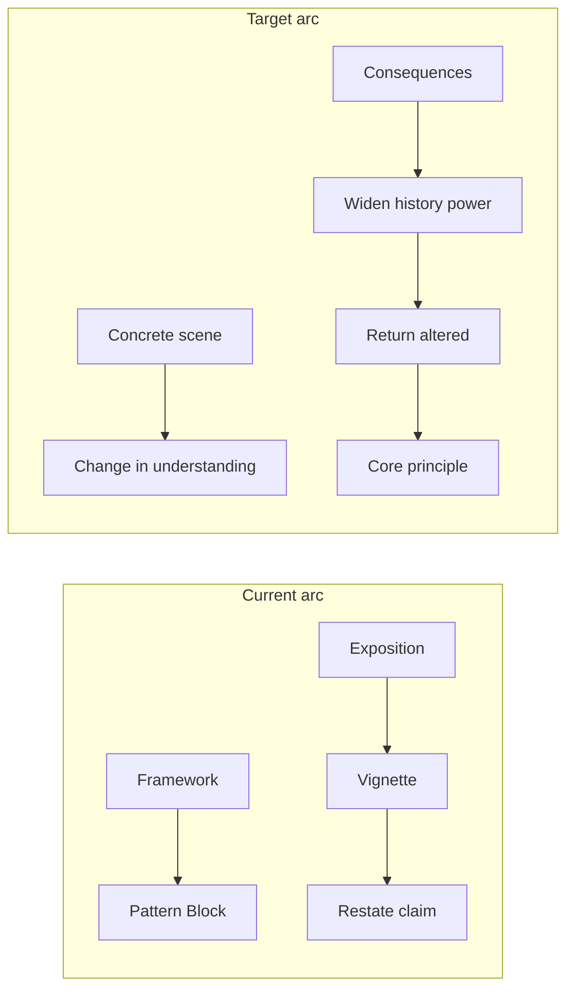

# How Meaning Moves — Essayistic Editorial Rewrite Plan

**Branch:** `cursor/hmm-essayistic-rewrite-4cdb`  
**Architecture:** Option B (confirmed)  
**Phase:** Calibration (Introduction + Ch 6 complete; Ch 1–5, 7–10 stubs)

# How Meaning Moves — Essayistic Editorial Rewrite Plan

**Confirmed architecture:** **Option B** — 10 chapters, 3 parts (author decision locked).

**Deliverable location (on execution):** [`docs/rewrite-plans/how-meaning-moves-essayistic-rewrite-plan.md`](docs/rewrite-plans/how-meaning-moves-essayistic-rewrite-plan.md)

**Manuscript canon:** [`books/how-meaning-moves/index.md`](books/how-meaning-moves/index.md) (~17,513 words across 14 chapters)

**Assembly:** Markdown units linked from `index.md` → [`scripts/assemble.py`](scripts/assemble.py) → Pandoc export via [`scripts/build.py`](scripts/build.py). Pattern/vignette typography enforced by [`tools/how_meaning_moves_typography_check.py`](tools/how_meaning_moves_typography_check.py).

**Writer-facing references:** [`books/how-meaning-moves/docs/book-rules.md`](books/how-meaning-moves/docs/book-rules.md), [`pattern-evidence-map.md`](books/how-meaning-moves/docs/pattern-evidence-map.md), [`pattern-causal-map.md`](books/how-meaning-moves/docs/pattern-causal-map.md)

**Convention:** Follow [`books/boundary-conditions/docs/developmental-revision-plan.md`](books/boundary-conditions/docs/developmental-revision-plan.md) as the repo’s model for a book-scoped revision plan; place HMM plan at repo `docs/rewrite-plans/` since no HMM-specific plan folder exists yet.

---

## 1. Executive editorial diagnosis

The manuscript is **conceptually strong and structurally inverted for the author’s emerging essayistic voice**.

**What works:** Plain language, moral seriousness without villains, human-scale systems thinking, distinctive pattern vocabulary, and late chapters (11–13) that already treat pace, incentives, correctness, and reachability with consequence.

**Core problem:** Readers meet **definitions before experience**. Chapter 1 opens with three Pattern Blocks before any scene. The introduction presents the full five-cluster map and diagram before a sustained human situation. Vignettes usually arrive **after** exposition (Ch 1, 7, 8, 9) or sit mid-chapter while analysis has already named the mechanism (Ch 10–14 are better on vignette placement). The book explains *then* illustrates; the revision should **recognize, then classify**.

**Secondary problems:**
- Fifteen one-off vignettes with overlapping dramatic function (meeting misread → story sticks).
- Part II (Ch 4–6) largely **re-applies** Part I forces from speaker/listener angles without new terrain.
- `Contact`, `Connection`, and `Reachability` are conceptually distinct but **arrive late and unevenly**; readers may conflate them with Compression/Restraint.
- Power asymmetry appears (Ch 9, 10, 12) but **restraint is still framed too symmetrically** in Part I–II.
- Front matter is **~1,400 words of meta-instruction** before Part I; disclaimers repeat across Preface, Introduction, and How to Read.
- Prose defaults to **short declarative stacks** and formula headings (`## **Why X**`, `## **What X Reveals**`)—partially flagged in book-rules but not yet realized in draft.

**Target reader experience:** Enter a room, a thread, a kitchen; feel meaning move; follow consequences through institutions and memory; widen into psychology/history/power; return altered; **then** receive `### Core principle: …` at chapter end. Appendix A remains the formal pattern field guide.

---

## 2. Author’s signature style (to preserve and strengthen)

Drawn from HMM draft + comparison books—not Solnit mimicry, but **transferable essayistic techniques** adapted to this author:

| Technique | Already present in HMM | Strengthen via |
|-----------|------------------------|----------------|
| Human-scale systems thinking | Passing comment → plan; affordable pace vs calendar | Recurring strands that cross meetings, docs, memory |
| Moral seriousness w/o villains | Ch 9, 11, 12 | Keep; deepen power cost of restraint |
| Responsibility after innocence | Epilogue, Preface | End on reachability, not lens-holding alone |
| Concrete particularity | Strongest in vignettes | Move particulars to **openings**, not closings |
| Spacious movement | Late Ch 11–13 | Longer syntactic runs; fewer one-line paragraphs |
| Named patterns as portable tools | Appendix A, Pattern Blocks | **End** chapters with Core Principle; appendix unchanged |
| Understated landing lines | Pull quotes in Ch 7, 8, 9 | Earn with longer preceding movement |

**Voice lock:** Keep Part I’s calm observer register ([`book-rules.md`](books/how-meaning-moves/docs/book-rules.md) Part I voice lock)—but **invert delivery order**, not tone.

---

## 3. What must remain unchanged

- Central argument: meaning forms faster than shared understanding; failure often precedes bad faith.
- Eleven named patterns + five clusters in **Appendix A** (full Context/Problem/Forces/Observation/Effect/Resulting Context/Related Patterns).
- Core forces: **Signal, Compression, Restraint**.
- Relational terms: **Contact, Connection, Reachability** (clarify distinctions; do not rename).
- Twelve conceptual dynamics listed in brief (meaning forming early, gaps, intent assignment, shifting, drifting, distorting, reinforcing).
- Moral frame: structures not virtue contests; skepticism toward tidy solutions.
- Plain language, systems thinking, series placement (Formation / judgment-compression cluster).
- Footnote/bibliography discipline; vignette/pattern Pandoc custom styles.
- Author’s Note AI disclosure.

---

## 4. What makes the manuscript feel instructional

1. **Pattern Blocks in chapter openings** (Ch 1–3 especially)—readers memorize labels before feeling the room.
2. **Introduction pattern map** (`pattern-groups.png`) before any sustained scene.
3. **Chapter titles that are definitions** (“Signal: What Arrives Before Words”).
4. **Heading cadence:** predictable `## **Why…**` / `## **When…**` ladders every 80–120 words.
5. **Vignettes as proof** after the claim is stated—not as the site of discovery.
6. **Repeated negations:** “not advice,” “not a method,” “not a flaw” across front matter and chapters.
7. **Symmetric treatment of restraint**—reads as universal practice rather than asymmetric cost.
8. **Part II redundancy**—speaker/listener chapters restate Part I with new headings.
9. **Anonymous interchangeable workplace rooms**—low cumulative consequence.

---

## 5. Comparison with reference books

### Trust Beyond Similarity ([`books/trust-beyond-similarity/`](books/trust-beyond-similarity/))
- **Learn:** Serialized cast (David, Priya, Jade, Grace), fence as boundary object, same object → different meanings, disagreement as **plot**, **Core Principle only after scene**.
- **HMM adaptation:** 2–3 recurring strands (not necessarily named characters)—e.g. one leader’s passing comment tracked across Ch 4, 6, 9, 11; one family phrase across Ch 3, 8.

### After Certainty ([`books/after-certainty/`](books/after-certainty/))
- **Learn:** Historical/institutional widening (Wegener, procedure vs lived consequence), moral ambiguity, limits without resignation, **essay-discovery** pipeline ([`docs/agents/01-essay-discovery-revision.md`](books/after-certainty/docs/agents/01-essay-discovery-revision.md)).
- **HMM adaptation:** Telegram compression, cockpit CRM, meeting minutes as record—**one widening per chapter max**, return to scene.

### Everyone Knows Love ([`books/everyone-knows-love/`](books/everyone-knows-love/))
- **Learn:** Ordinary Tuesdays, domestic objects (toast, chair), sensory particularity, recognition before explanation, brief aphorisms **supported** by fuller prose.
- **HMM adaptation:** Kitchen-table phrase, phone on nightstand, dish towel—**particular anchors** instead of “a manager” / “she.”

### What HMM must keep that is uniquely its own
- Communication as **movement**, not transmission.
- **Pace** as moral and relational force.
- Portable **pattern language** tied to observable dynamics.
- Attention to words → stories → records → institutional fact.
- **Reachability** as culmination: imperfect understanding with somewhere for revision to land.

---

## 6. Inventory — chapters and scenes

### Current structure (14 chapters, 4 parts)

| Part | Chapters | ~Words |
|------|----------|--------|
| Front matter | 7 files | ~1,400 |
| Part I — Three Forces | 1–3 | ~3,600 |
| Part II — Speaking/Listening | 4–6 | ~3,000 |
| Part III — Familiar Situations | 7–10 | ~3,400 |
| Part IV — What Lens Changes | 11–14 | ~3,200 |
| Back matter | Epilogue, Appendix, Bib | ~2,000 |

### Vignette inventory (15)

| Vignette | Chapter | Distinctive? | Proposed fate |
|----------|---------|--------------|---------------|
| The Routine Meeting | 1 | Medium | **Expand** → Strand A (opening) |
| The Message Thread | 2 | Medium | Merge into Strand B (text/family) or cut |
| The Delayed Correction | 3 | High | **Expand** → Strand B |
| The Compressed Directive | 4 | Low | Merge into Strand A |
| The Listening Shift | 5 | Low | Cut or fold into Ch 5 opening |
| The Quiet Escalation | 6 | Medium | Merge with Strand A escalation beat |
| The Pace Shift | 7 | High | **Keep** as Ch 7 opening |
| The Echoed Comment | 8 | High | **Expand** → Strand B (family) |
| The Passing Comment | 9 | **Highest** | **Primary Strand A** — cross-book spine |
| The Aligned Surface | 10 | High | **Keep** — open Ch 10 |
| The Affordable Pace | 11 | High | **Keep** — open Ch 11 |
| When Rightness Repairs | 12 | High | Pair with Cost of Correctness |
| The Cost of Correctness | 12 | **Highest** | **Strand C** — cross Ch 5, 10, 12 |
| After the Meeting | 13 | High | **Keep** — reachability anchor |
| Holding The Decision Open | 14 | Medium | Revise; tie to Strand A decision |

### Recurring strands (Option B placement)

**Strand A — The passing comment:** Tentative leader language → notes → plan change → denial → institutional memory. **New chapters:** Introduction (prequel), 1, 3, 6, 7, Epilogue.

**Strand B — The echoed phrase:** Family/kitchen text activating history across encounters. **New chapters:** 2, 3, 5.

**Strand C — The room after you are right:** Technically correct explanation narrowing future speech. **New chapters:** 2 (listener), 7, 8.

---

## 7. Pattern-to-chapter mapping

### Current (pattern blocks often early)

| Pattern | Primary current home | Also active |
|---------|---------------------|-------------|
| Attention finds a signal | Ch 1 (block at open) | Ch 4 |
| Meaning forms early | Ch 1, Intro | Ch 2 |
| Meaning outruns the words | Ch 1 | Ch 5 |
| Gaps invite completion | Ch 2 | Ch 6 |
| Intent gets assigned | Ch 2 | Ch 5 |
| Meaning shifts under pressure | Ch 2 | Ch 7 |
| Meaning drifts over time | Ch 8 | Ch 5 |
| Contact keeps the read open | Ch 3 | Ch 13, 14 |
| Meaning gets distorted | Ch 3, 6 | Ch 10, 12 |
| Meaning reinforces itself | Ch 9 | Ch 11 |
| Reachability (glossary, not pattern) | Ch 13 | Ch 14, Epilogue |

### Proposed primary Core Principle per chapter — Option B (canonical)

| New ch | Title | End Core Principle |
|--------|-------|-------------------|
| 1 | Before the Words | Attention Finds a Signal |
| 2 | The Story That Arrives First | Gaps Invite Completion |
| 3 | The Cost of Leaving It Open | Contact Keeps the Read Open |
| 4 | When the Pauses Disappear | Meaning Shifts Under Pressure |
| 5 | The Archive in the Kitchen | Meaning Drifts Over Time |
| 6 | A Passing Comment Becomes a Plan | Meaning Reinforces Itself |
| 7 | What the Calendar Can Afford | Meaning Reinforces Itself *(systems revisit)* |
| 8 | The Room After You Are Right | Meaning Gets Distorted |
| 9 | Still Reachable | Reachability |
| 10 | What Restraint Makes Possible | Contact Keeps the Read Open *(revisit)* |

**Pattern map relocation:** Remove from Introduction; place **after Part I bridge** (`parts/part-i-what-arrives-first/`) once reader has met Signal, Compression, and Restraint through scenes.

### Legacy 14-chapter mapping (reference only)

---

## 8. Option A — Conservative restructuring (reference only)

**Status:** Not selected. Retained for comparison if a future partial rollback is needed.

**Shape:** Keep 14 chapters and 4 parts; reorder within chapters; add historical widening; move pattern naming to endings; establish 3 strands; relocate pattern map.

**Gains:** Lowest file churn; preserves TOC familiarity; easier incremental PRs; typography/semantic YAML mostly stable.

**Losses:** Part II redundancy remains structurally; shorter chapters limit essayistic spaciousness; 14 Core Principles may feel repetitive for revisits.

**Rewrite intensity:** ~40% new prose, ~60% reorder/revise; **medium** overall.

**Pattern fit:** All 11 patterns still fit; some chapters get **revisit** principles without new blocks.

**Arc change:** Same macro arc; **micro arc per chapter** inverts; Part IV becomes clearly reachability-directed.

---

## 9. Option B — Deeper essayistic restructuring (~10 chapters) — CONFIRMED

**Proposed shape** (hypothesis—refine on pass mapping):

**Introduction — The Sentence Before the Sentence** (merge Preface + Intro scene-first; cut How to Read to 1 page or fold into Author’s Note)

**Part I — What Arrives First** (3 chapters, ~2,500–3,500 w each)
1. Before the Words *(Signal + speaking under signal)*
2. The Story That Arrives First *(Compression + listening)*
3. The Cost of Leaving It Open *(Restraint + when it fails; power asymmetry seed)*

**Part II — Rooms That Accelerate Meaning** (4 chapters)
4. When the Pauses Disappear *(Conflict + pace)*
5. The Archive in the Kitchen *(Intimacy/family + drift)*
6. A Passing Comment Becomes a Plan *(Leadership/authority + reinforcement)*
7. What the Calendar Can Afford *(Work/feedback + systems rarity)*

**Part III — What Can Still Move** (3 chapters)
8. The Room After You Are Right *(Correctness hurts)*
9. Still Reachable *(Contact, Connection, Reachability)*
10. What Restraint Makes Possible *(limits, consent, repair—no false promises)*

**Epilogue** — return to Strand A opening sentence.

**Gains:** Matches TBS/AC **~9–10 chapter essay length**; eliminates Part II duplication; room for historical widening; stronger narrative accumulation; clearer reachability finale.

**Losses:** Major `index.md` surgery; export/CI typography re-baseline; semantic `pattern-evidence-map` rewrite; readers with old TOC lose granular chapter titles.

**Rewrite intensity:** **Heavy** (~60–70% prose new or moved).

**Pattern fit:** Still 11 patterns; some chapters carry **secondary** patterns only in prose; appendix unchanged.

**Arc change:** Macro arc becomes explicit: **Arrival → Acceleration → Reachability**.

---

## 10. Confirmed architecture — Option B

**Author decision:** Option B (10 chapters). Option A is retained below (§8) as reference only—not an active fallback.

**Target shape:** ~25–35k words (from ~17.5k), ~2,500–3,500 words per chapter.

**Macro arc:** Arrival → Acceleration → Reachability.

### Canonical TOC (new)

| # | Title | Part | Target file |
|---|-------|------|-------------|
| — | Introduction — The Sentence Before the Sentence | Front matter | `front-matter/introduction-the-sentence-before-the-sentence.md` |
| — | Part I — What Arrives First | Bridge | `parts/part-i-what-arrives-first/bridge.md` |
| 1 | Before the Words | I | `parts/part-i-what-arrives-first/chapter-1-before-the-words.md` |
| 2 | The Story That Arrives First | I | `parts/part-i-what-arrives-first/chapter-2-the-story-that-arrives-first.md` |
| 3 | The Cost of Leaving It Open | I | `parts/part-i-what-arrives-first/chapter-3-the-cost-of-leaving-it-open.md` |
| — | Part II — Rooms That Accelerate Meaning | Bridge | `parts/part-ii-rooms-that-accelerate-meaning/bridge.md` |
| 4 | When the Pauses Disappear | II | `parts/part-ii-rooms-that-accelerate-meaning/chapter-4-when-the-pauses-disappear.md` |
| 5 | The Archive in the Kitchen | II | `parts/part-ii-rooms-that-accelerate-meaning/chapter-5-the-archive-in-the-kitchen.md` |
| 6 | A Passing Comment Becomes a Plan | II | `parts/part-ii-rooms-that-accelerate-meaning/chapter-6-a-passing-comment-becomes-a-plan.md` |
| 7 | What the Calendar Can Afford | II | `parts/part-ii-rooms-that-accelerate-meaning/chapter-7-what-the-calendar-can-afford.md` |
| — | Part III — What Can Still Move | Bridge | `parts/part-iii-what-can-still-move/bridge.md` |
| 8 | The Room After You Are Right | III | `parts/part-iii-what-can-still-move/chapter-8-the-room-after-you-are-right.md` |
| 9 | Still Reachable | III | `parts/part-iii-what-can-still-move/chapter-9-still-reachable.md` |
| 10 | What Restraint Makes Possible | III | `parts/part-iii-what-can-still-move/chapter-10-what-restraint-makes-possible.md` |
| — | Epilogue | Back matter | `back-matter/epilogue-holding-the-lens.md` (revise) |

**Front matter cuts:** Merge `preface-before-understanding.md` + `introduction-why-communication-fails-before-anyone-is-wrong.md` → new introduction; **retire** `how-to-read-this-book.md` (fold limits into Author’s Note).

**Pattern map:** New interstitial after Part I bridge — `parts/part-i-what-arrives-first/pattern-map.md` or section in bridge.

**Old part directories:** Retire after passage map complete (`part-i-the-three-forces/`, `part-ii-speaking-and-listening-under-pressure/`, `part-iii-familiar-situations/`, `part-iv-what-this-lens-changes/`).

### Source merge map (old → new)

| New ch | Merges from (old) | Primary strand | End Core Principle |
|--------|-------------------|----------------|-------------------|
| 1 | Ch 1 Signal + Ch 4 Speaking Under Signal | A (Routine Meeting) | Attention Finds a Signal |
| 2 | Ch 2 Compression + Ch 5 Listening | B (Message Thread) | Gaps Invite Completion |
| 3 | Ch 3 Restraint + Ch 6 When Restraint Fails | B (Delayed Correction) + A (Quiet Escalation) | Contact Keeps the Read Open |
| 4 | Ch 7 Conflict | — | Meaning Shifts Under Pressure |
| 5 | Ch 8 Intimacy and Family | B (Echoed Comment) | Meaning Drifts Over Time |
| 6 | Ch 9 Leadership and Authority | A (Passing Comment) — **keystone** | Meaning Reinforces Itself |
| 7 | Ch 10 Work/Feedback + Ch 11 Better Communication Rare | A + C (Aligned Surface, Affordable Pace) | Meaning Reinforces Itself *(systems revisit)* |
| 8 | Ch 12 Why Being Right Still Hurts | C (Cost of Correctness) | Meaning Gets Distorted |
| 9 | Ch 13 Reachable Afterward | After the Meeting | Reachability |
| 10 | Ch 14 What Restraint Makes Possible | Holding the Decision Open | Contact Keeps the Read Open *(revisit)* |

**Secondary patterns in prose (not end-named):** Meaning Forms Early (Ch 1–2); Meaning Outruns the Words (Ch 1); Intent Gets Assigned (Ch 2); Meaning Gets Distorted (Ch 3, 8); Meaning Outruns / Intent echoes as needed.

### Strand placement under Option B

| Strand | Chapters |
|--------|----------|
| A — Passing comment | Intro (prequel), 1, 3, 6, 7, Epilogue |
| B — Echoed phrase / thread | 2, 3, 5 |
| C — Room after you are right | 2 (listener), 7, 8 |

---

## 11. Chapter-by-chapter rewrite plan — Option B (canonical)

### Chapter 1 — Before the Words
| Field | Content |
|-------|---------|
| Merges | Old Ch 1 + Ch 4 |
| Purpose | Signal as what arrives; speaking under pressure as signal leakage |
| Opening | **Routine Meeting** expanded: launch date on whiteboard, “slow this down,” afternoon confidence misread |
| Widening | Goffman ritual; optional Shannon selective-attention paragraph (verify) |
| Strand A | Leader’s tentative phrasing introduced |
| Return | Same meeting—story stuck before anyone named signal |
| End principle | **Attention Finds a Signal** |
| Preserve | Signal ≠ sincerity; speaker compresses under urgency (from old Ch 4) |
| Cut | Early Pattern Blocks; speaker/listener bullet lists |
| Intensity | **Heavy** |

### Chapter 2 — The Story That Arrives First
| Field | Content |
|-------|---------|
| Merges | Old Ch 2 + Ch 5 |
| Purpose | Compression + listening as completion; gaps and intent |
| Opening | Phone on nightstand; typing indicator; “ok” completes the wrong story |
| Widening | Telegram / wire compression (verify Gleick/James) |
| Strand B | Text thread opens |
| Strand C | Listener’s “recognition” feeling—not deciding, or so it feels |
| Return | Thread days later; drift without new words |
| End principle | **Gaps Invite Completion** |
| Qualify | “Listening basically over” → curiosity often over (from old Ch 5) |
| Intensity | **Heavy** |

### Chapter 3 — The Cost of Leaving It Open
| Field | Content |
|-------|---------|
| Merges | Old Ch 3 + Ch 6 |
| Purpose | Restraint’s cost; when it fails; power asymmetry |
| Opening | **Delayed Correction**—she carries discomfort alone |
| Widening | Legal transcript / tone loss; Fricker testimonial injustice (verify, narrow) |
| Strand A | Quiet Escalation beat—correction accelerates institutional read |
| Power | Who pays for openness; silence as fear vs restraint |
| Return | Correction lands as attack when restraint absent |
| End principle | **Contact Keeps the Read Open** |
| Intensity | **Heavy** |

### Chapter 4 — When the Pauses Disappear
| Field | Content |
|-------|---------|
| Merges | Old Ch 7 only |
| Opening | **Pace Shift** first (move from end) |
| Qualify | “Facts do not slow conflict” → narrow; tempo-not-values contextualized |
| End principle | **Meaning Shifts Under Pressure** |
| Intensity | **Medium** |

### Chapter 5 — The Archive in the Kitchen
| Field | Content |
|-------|---------|
| Merges | Old Ch 8 only |
| Opening | **Echoed Comment** at breakfast |
| Widening | Oral story drift through repetition (verify one example) |
| Strand B | Family phrase accumulates history |
| End principle | **Meaning Drifts Over Time** |
| Intensity | **Medium** |

### Chapter 6 — A Passing Comment Becomes a Plan
| Field | Content |
|-------|---------|
| Merges | Old Ch 9 (primary) |
| Opening | Passing comment → notes → plan change → denial |
| Widening | Meeting minutes as institutional memory (verify) |
| Strand A | **Keystone**—meaning moves through room, document, memory |
| End principle | **Meaning Reinforces Itself** |
| Intensity | **Heavy** (expand; calibration chapter) |

### Chapter 7 — What the Calendar Can Afford
| Field | Content |
|-------|---------|
| Merges | Old Ch 10 + Ch 11 |
| Opening | **Affordable Pace** meeting; cut to **Aligned Surface** feedback scene |
| Widening | Perrow/March-Simon institutional motion (one paragraph) |
| Strands | A (calendar blocks return); C (aligned surface narrows speech) |
| End principle | **Meaning Reinforces Itself** *(systems/incentives)* |
| Intensity | **Medium–Heavy** |

### Chapter 8 — The Room After You Are Right
| Field | Content |
|-------|---------|
| Merges | Old Ch 12 only |
| Opening | **Cost of Correctness**; then **When Rightness Repairs** as counterexample |
| Widening | Fricker epistemic injustice—scene-linked |
| Strand C | Climax |
| End principle | **Meaning Gets Distorted** |
| Intensity | **Medium** |

### Chapter 9 — Still Reachable
| Field | Content |
|-------|---------|
| Merges | Old Ch 13 only |
| Opening | **After the Meeting** first |
| Clarify | Contact / Connection / Reachability in prose |
| End principle | **Reachability** |
| Intensity | **Medium** |

### Chapter 10 — What Restraint Makes Possible
| Field | Content |
|-------|---------|
| Merges | Old Ch 14 only |
| Opening | **Holding the Decision Open** |
| Limits first | What restraint cannot promise; asymmetric obligation |
| End principle | **Contact Keeps the Read Open** (revisit) |
| Intensity | **Medium** |

---

## 11b. Chapter-by-chapter rewrite plan (legacy 14-chapter reference)

Columns abbreviated for plan; full tables expand in committed doc.

### Chapter 1 — Signal: What Arrives Before Words
| Field | Content |
|-------|---------|
| Current purpose | Define signal; introduce 3 Formation patterns |
| Primary patterns | Attention Finds a Signal; Meaning Forms Early; Meaning Outruns the Words |
| Strongest passage | **The Routine Meeting** vignette; “signal is not sincerity” section |
| Redundant | Opening pattern blocks; bullet lists on speaker/listener |
| Conceptual issues | Connection introduced before defined; patterns before scene |
| Proposed role | Part I opener: reader **in the meeting** before “signal” is named |
| Proposed opening | Routine meeting: “slow this down” → nods → confidence misread → afternoon remark |
| Anchor | Whiteboard launch date visible in room |
| Historical widening | Goffman on ritual presence; optional Shannon/signal **one paragraph** on selective attention (verify) |
| Return | Same meeting: leader learns story stuck without villainy |
| End Core Principle | **Attention Finds a Signal** |
| Preserve | Sincerity-not-signal distinction; moral neutrality section (revise) |
| Revise | Move all Pattern Blocks to end; compress heading ladder |
| Merge | Speaker/listener bullets → prose paragraph |
| Cut | “Signal drags whole room in” if restated at end |
| Intensity | **Heavy** |

### Chapter 2 — Compression
| Field | Content |
|-------|---------|
| Purpose | Define compression; Completion patterns |
| Patterns | Gaps Invite Completion; Intent Gets Assigned; Meaning Shifts Under Pressure |
| Strongest | Message Thread; “compression feels like understanding” |
| Redundant | Overlaps Ch 5 listening |
| Issues | Pattern blocks at §2; telegram history absent |
| Role | Strand B: text thread where “ok” completes a fight |
| Opening | Phone glow; typing indicator; gap filled wrong |
| Widening | **Telegram / early wire compression** (verify James/Gleick) |
| Return | Same thread days later—meaning drifted |
| End principle | **Gaps Invite Completion** |
| Preserve | Attribution as moral compression |
| Merge | Pressure section → Ch 7 |
| Cut | Duplicate “why explain better fails” if in Ch 12 |
| Intensity | **Heavy** |

### Chapter 3 — Restraint
| Field | Content |
|-------|---------|
| Purpose | Cost of delaying closure; Contact/Distortion patterns |
| Patterns | Contact Keeps the Read Open; Meaning Gets Distorted |
| Strongest | **Delayed Correction**; “restraint feels risky” |
| Redundant | Silence vs restraint (keep but shorten) |
| Issues | Power asymmetry underdeveloped |
| Role | Introduce **who pays for open interpretation** |
| Opening | Delayed Correction scene first—she carries discomfort alone |
| Widening | Fricker testimonial injustice (verify)—**narrow** claim |
| Return | Same speaker: correction now lands as attack |
| End principle | **Contact Keeps the Read Open** |
| Preserve | Restraint expensive list (convert to prose) |
| Revise | Add: silence as fear vs restraint |
| Intensity | **Heavy** |

### Chapter 4 — Speaking Under Signal
| Purpose | Speaker-side signal | Pattern: Meaning Outruns the Words |
| Strongest | Compressed Directive vignette | Redundant with Ch 1–2 |
| Role | Strand A: leader shortens speech under urgency |
| Opening | Compressed directive before theory |
| Widening | Cockpit **read-back** culture (CRM) as contrast (verify) |
| End | **Meaning Outruns the Words** | Intensity | **Medium** (merge into Opt B Ch1 if consolidated) |

### Chapter 5 — Listening Under Compression
| Patterns | Intent Gets Assigned; drift echo |
| Strongest | “Listening is basically over” line; Listening Shift |
| Issues | Claim needs qualification (see §17) |
| Role | Strand C seed: listener’s “recognition” feeling |
| Opening | Listening Shift scene first |
| End | **Intent Gets Assigned** | Intensity | **Medium–Heavy** |

### Chapter 6 — When Restraint Fails
| Patterns | Meaning Gets Distorted |
| Strongest | Quiet Escalation; “no bell” section |
| Role | Strand A: correction accelerates plan |
| Opening | Quiet Escalation before mechanism |
| Widening | Weick sensemaking under pressure (already cited—**dramatize**) |
| End | **Meaning Gets Distorted** | Intensity | **Medium** |

### Chapter 7 — Conflict
| Patterns | Meaning Shifts Under Pressure |
| Strongest | **Pace Shift** vignette; tempo-not-values section |
| Issues | “Most clashes are tempos” overbroad |
| Role | Domain chapter: conflict as pace collision |
| Opening | Pace Shift **first** (move from end) |
| Widening | Deutsch on conflict resolution—**narrow** to pace |
| End | **Meaning Shifts Under Pressure** | Intensity | **Medium** |

### Chapter 8 — Intimacy and Family
| Patterns | Meaning Drifts Over Time |
| Strongest | **Echoed Comment**; history as signal |
| Role | Strand B centerpiece |
| Opening | Echoed Comment at breakfast |
| Widening | Bowlby/Gottman stay; add **oral story drift** (one folktale echo—verify) |
| End | **Meaning Drifts Over Time** | Intensity | **Medium** |

### Chapter 9 — Leadership and Authority
| Patterns | Meaning Reinforces Itself |
| Strongest | **Passing Comment** — best scene in book |
| Role | Strand A **keystone** |
| Opening | Passing comment → notes → plan → denial |
| Widening | Meeting minutes as institutional memory (verify) |
| Return | Leader notices plan changed without deciding |
| End | **Meaning Reinforces Itself** | Intensity | **Heavy** (expand cross-book) |

### Chapter 10 — Work, Feedback, Misalignment
| Patterns | Distortion; connection |
| Strongest | **Aligned Surface** (already opens well) |
| Role | Strand C at work |
| Opening | Keep Aligned Surface; add manager’s later confusion |
| Widening | Edmondson already—add **review doc as record** |
| End | **Meaning Gets Distorted** (work revisit) | Intensity | **Light–Medium** |

### Chapter 11 — Why Better Communication Is Rare
| Patterns | Reinforcement; systems |
| Strongest | **Affordable Pace**; calendar vs connection |
| Role | Systems chapter—make incentives visceral |
| Opening | Keep Affordable Pace |
| Widening | Perrow/March-Simon—**one** institutional paragraph |
| End | **Meaning Reinforces Itself** | Intensity | **Medium** |

### Chapter 12 — Why Being Right Still Hurts
| Patterns | Distortion; Fricker |
| Strongest | **Two-scene contrast** (Repairs vs Cost) |
| Role | Strand C climax |
| Opening | Cost of Correctness first; then Repairs as counterexample |
| Widening | Fricker epistemic injustice—scene-linked |
| End | **Meaning Gets Distorted** OR new subsection on **epistemic harm** without new pattern |
| Intensity | **Medium** |

### Chapter 13 — Reachable Afterward
| Patterns | Contact; Connection; Reachability |
| Strongest | **After the Meeting**; “reachable” definition |
| Role | Conceptual **destination** of book |
| Opening | After the Meeting first |
| Clarify | Contact vs Connection vs Reachability in **one table in writer doc only**; prose distinctions in chapter |
| End | **Reachability** (glossary culmination) | Intensity | **Medium** |

### Chapter 14 — What Restraint Makes Possible
| Patterns | Contact; consent; repair |
| Strongest | Holding the Decision Open |
| Issues | Reads like checklist of benefits |
| Role | Limits chapter—what restraint cannot promise |
| Opening | Holding Decision Open |
| Revise | Fold limits **before** benefits; asymmetric restraint |
| End | **Contact Keeps the Read Open** (revisit) | Intensity | **Medium** |

---

## 12. Front matter plan

| Section | Action |
|---------|--------|
| Title/Copyright/About Series | Keep (generated) |
| Author’s Note | Keep; optional one-line “how to read” |
| Preface | **Merge into new Introduction** scene-first |
| Introduction | Replace framework opener with **Strand A prequel** (one paragraph); move pattern map **post–Part I** |
| How to Read | **Cut to ~100 words** or merge into Author’s Note; single limits statement |
| First sustained scene | **Page 1 of new Introduction** or Part I Ch1—not after 1,400 words |

**Disclaimers to consolidate (one place only):** Not advice; not a method; not a guarantee of harmony; not moral ranking.

---

## 13. Historical and research opportunities (verify + cite)

| Topic | Target chapter (Option B) | Notes |
|-------|---------------------------|-------|
| Signal/information theory (Shannon) | Ch 1 | One paragraph; not a survey |
| Telegram compression | Ch 2 | Historical parallel to text gaps |
| Legal transcripts / tone loss | Ch 3 | Record vs contact |
| Cockpit read-back / CRM | Ch 1 | Speaking under consequence (merged from old Ch 4) |
| Meeting minutes as official reality | Ch 6 | Strand A |
| Email/read receipts/typing indicators | Ch 2 | Already implicit—name |
| Goffman interaction ritual | Ch 1, 5 | Already cited—**enter as scene widener** |
| Arendt judgment/responsibility | Ch 3, 10 | Already cited—dramatize |
| Fricker epistemic injustice | Ch 3, 8 | Power asymmetry |
| Weick sensemaking | Ch 3 | Organization under ambiguity (merged from old Ch 6) |
| High-reliability communication | Ch 1, 7 | Contrast with office pace |

All additions flagged **requires verification** in bibliography pass.

---

## 14. Power-and-restraint revision plan

**Insert asymmetric analysis in:** Ch 3 (primary), Ch 5, Ch 6, Ch 7, Ch 8, Ch 10.

**Questions to address in prose (not FAQ):**
- Who bears cost of open interpretation? → junior staff, family members with less exit, marginalized voices.
- Who may sound uncertain? → rank, gender, race (cite Fricker cautiously).
- When silence is fear vs restraint → Ch 3, 5.
- When immediate correction is more responsible → Ch 3, 8 (counter restraint).
- Calls for restraint as delay of warranted judgment → Ch 10.
- Greater authority → greater obligation to preserve openness → Ch 6.

**Scene rule:** Delayed Correction and Aligned Surface—**do not** frame less powerful person’s silence as virtuous without ambiguity.

---

## 15. Reachability arc

**Assessment:** Making reachability the **conceptual destination strengthens the book**—old Ch 13 (`Still Reachable`, new Ch 9) is already the most distinctive mature prose.

**Proposed macro chain:**
- Signal → why meanings begin early
- Compression → why they harden
- Restraint → preserves revisability (asymmetric)
- Contact → tests interpretations
- Connection → consequence continues
- **Reachability** → what preservation is *for*

**Epilogue revision:** Return to Strand A or After the Meeting image; land near: *“The work is not to keep meaning from moving. It will move. The work is to leave it somewhere to return.”*—**only if** earned by strand recurrence; alternative: phone still glowing, reply still possible.

---

## 16. Line-level style guidance

### Reduce
- One-sentence paragraph stacks (default in Ch 1–6)
- `The problem is not X. It is Y.` (>3 per chapter)
- Repeated “not a flaw” / “not advice”
- Pattern Blocks before scene
- Generic “she/he in a meeting”

### Preserve
- Compressed landing lines (`Speed buys closure before doubt gets air.`)
- Moral reversals (sincerity beside the point)
- Intent vs consequence distinctions
- Understated pull quotes

### Micro-examples (editorial direction only)

**1. Opening inversion (Ch 1)**  
- *Before:* “Communication is how people decide… This chapter follows those two claims.”  
- *After:* “The meeting was supposed to be routine. Everyone had read the document. When she said they should slow down, no one objected—and that was the problem.”

**2. Pattern delay**  
- *Before:* Pattern Block for Attention Finds a Signal in line 15.  
- *After:* End section: “### Core principle: Attention Finds a Signal” — two paragraphs naming what the meeting demonstrated.

**3. Not-X-but-Y**  
- *Before:* “The problem is not urgency by itself. Urgency changes wording…”  
- *After:* “Urgency changes wording in ways the speaker barely notices—shorter sentences, fewer qualifiers, questions that sound like deadlines.”

**4. Bullet list → prose (Ch 1)**  
- *Before:* Four bullets on listener checks.  
- *After:* “The listener is not only hearing words. They are bracing for what might happen next—whether this is safe, whether they must defend, whether they must decide before the sentence ends.”

**5. Disclaimer consolidation**  
- *Before:* Preface + Intro + How to Read each say “not advice.”  
- *After:* Author’s Note: “This book offers a lens, not a script.”

**6. Reachability**  
- *Before:* Abstract definition first in Ch 13.  
- *After:* Open After the Meeting; define reachable only after email thread shown.

**7. Power**  
- *Before:* “Restraint is expensive.”  
- *After:* “Restraint is expensive—and the bill is not split evenly. The person with less rank often pays it twice: once for staying open, once for being misread as disengaged.”

**8. Historical widen**  
- *Before:* Footnote to Goffman after claim.  
- *After:* “In a courtroom transcript, the words survive. The hesitation that changed their meaning does not. Most offices run on transcripts of one kind or another.”

**9. Rhythm**  
- *Before:* Five consecutive sentences under 8 words.  
- *After:* One medium sentence carrying the same claim with a subordinate clause, then a short stop.

**10. Chapter end**  
- *Before:* “Seeing this clearly does not end the fight. It explains why fights often refuse tidy endings.”  
- *After:* End on Pace Shift’s last image—two people in parking lot with updated stories—**then** Core Principle.

---

## 17. Claims requiring qualification

| Claim | Location (old → new) | Action |
|-------|----------------------|--------|
| “Facts do not slow conflict down” | Old Ch 7 → **Ch 4** | **Narrow:** “Facts rarely slow conflict **once compression has chosen a story**” |
| “Most clashes are tempos colliding, not values” | Old Ch 7 → **Ch 4** | **Contextualize:** add “when values overlap”; acknowledge deep value conflict exists |
| “Listening is basically over” when compression finishes | Old Ch 5 → **Ch 2** | **Narrow:** “for practical purposes, **curiosity** is often over” |
| “Sincerity is beside the point” | Old Ch 1 → **Ch 1** | **Retain force** but add: “not because intent is irrelevant to ethics, but because signal arrives first” |
| Restraint as morally preferable | Old Ch 3, 14 → **Ch 3, 10** | **Replace symmetry:** restraint as **sometimes** responsible; sometimes correction or boundary is |
| “Compression is not a flaw” | Old Ch 2 → **Ch 2** | **Retain** with existing nuance |
| Better communication “not affordable” | Old Ch 11 → **Ch 7** | **Retain**—well supported |

---

## 18. Material cut / merge / preserve / expand

**Cut:** Old Part II files after merge; duplicate standalone vignettes (Listening Shift, Compressed Directive); `how-to-read-this-book.md`; introduction pattern map from front matter (relocate post–Part I).

**Merge (Option B):** Old Ch 4→new 1, Ch 5→new 2, Ch 6→new 3, Ch 10+11→new 7, Ch 13→new 9, Ch 14→new 10.

**Preserve near-unchanged:** Appendix A structure; Aligned Surface; Affordable Pace; Passing Comment core; After the Meeting; Cost of Correctness; bibliography IDs where still cited.

**Expand:** Passing Comment cross-book (new Ch 6); Echoed Comment (new Ch 5); Delayed Correction power analysis (new Ch 3); Still Reachable (new Ch 9); historical inserts (6–8 total).

---

## 19. Suggested rewrite sequence (Option B)

1. ~~**Confirm architecture**~~ — **Done:** Option B locked.
2. **Commit plan doc** — write full plan to `docs/rewrite-plans/how-meaning-moves-essayistic-rewrite-plan.md`.
3. **Passage map** — spreadsheet: preserve / move / merge / revise / cut per § in each old `.md` → new chapter target.
4. **Scaffold new TOC** — create `parts/part-i-what-arrives-first/`, `part-ii-rooms-that-accelerate-meaning/`, `part-iii-what-can-still-move/`; update `index.md` atomically.
5. **Strand bible** — `books/how-meaning-moves/docs/recurring-strands.md`.
6. **Calibration:** rewrite new Introduction + new Ch 6 (Passing Comment) → **author review before bulk rewrite**.
7. **Part I** — new Ch 1–3 (merge old 1–6 source material).
8. **Part II** — new Ch 4–7 (domain + systems).
9. **Part III** — new Ch 8–10 + epilogue (reachability culmination).
10. **Historical material** with verified citations.
11. **Core Principle endings** throughout; remove early Pattern Blocks from migrated prose.
12. **Appendix A** cross-check + `pattern-evidence-map.md` rewrite for new chapter paths.
13. **Retire** old part directories and orphaned front-matter files.
14. **Cadence pass** per book-rules Advanced Polish.
15. **Build verify:** `make typography-check-how-meaning-moves`, `make build-book DIR=books/how-meaning-moves`.

**Branch:** `cursor/hmm-essayistic-rewrite-4cdb` on execution.

---

## 20. Risks and regression checks

| Risk | Mitigation |
|------|------------|
| Losing pedagogical clarity | Appendix A + end Core Principles |
| Sentimentality | No new decorative scenes; every object does work |
| Pattern inflation | Max one primary principle/chapter |
| TOC/export breakage | Update `index.md` atomically per phase |
| Typography CI failures | Run typography check each PR |
| Over-qualification dulling force | Qualify in prose, keep compressed landing lines |
| Strand continuity errors | Strand bible + character consistency pass |
| Reachability overselling harmony | Keep Ch 10 limits adjacent to Ch 9 |

---

## 21. Acceptance criteria (future rewrite)

All criteria from user brief, plus:
- [ ] 10 chapters in 3 parts per canonical TOC (§10)
- [ ] Pattern map after Part I only
- [ ] ≥2 recurring strands across ≥3 chapters each
- [ ] New Ch 3 and Ch 6 explicitly treat asymmetric restraint
- [ ] Introduction enters scene within first 2 pages
- [ ] `make build-book` and typography CI pass
- [ ] Feels kin to TBS/AC/EKL without copying fence/kitchen/Tuesday devices wholesale

---

## Concise summary

- **Confirmed structure:** Option B — 10 chapters, 3 parts; target ~25–35k words.
- **Three largest changes:** (1) Scene-first chapter arc with end Core Principles; (2) Three recurring strands replacing one-off vignettes; (3) Reachability + asymmetric restraint as culminating architecture (new Ch 9–10).
- **Strongest existing material:** Passing Comment → new Ch 6; Cost of Correctness → new Ch 8; Affordable Pace + Aligned Surface → new Ch 7; After the Meeting → new Ch 9; Echoed Comment → new Ch 5; Pace Shift → new Ch 4.
- **Areas requiring most care:** Power/restraint asymmetry (new Ch 3, 6); Contact/Connection/Reachability (new Ch 9); qualifying tempo claims (new Ch 4); TOC/index migration without breaking build.
- **Next step (on execution approval):** Commit plan doc, scaffold new part directories, passage map, strand bible, then calibration sample (Introduction + new Ch 6) for author review.
