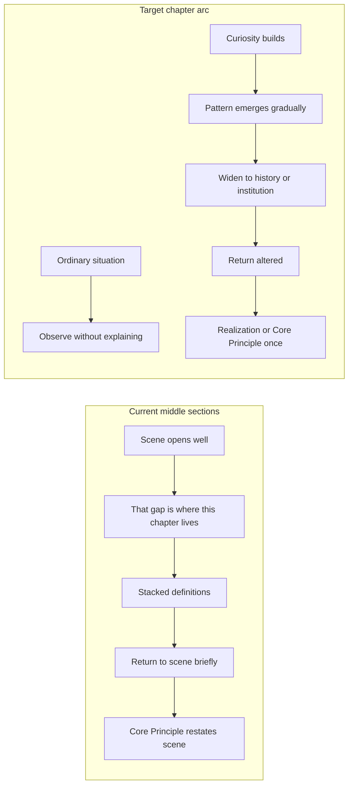
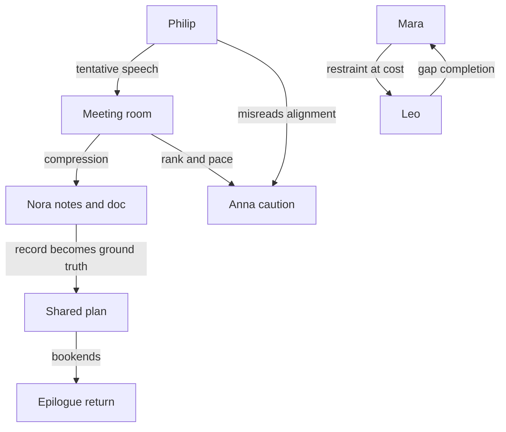

# How Meaning Moves — Narrative Rewrite Plan

**Status:** Executed (narrative voice pass, branch `cursor/hmm-narrative-rewrite-cd17`)

**Scope:** Planning document. Manuscript edits applied per this plan.

**Manuscript canon:** [`books/how-meaning-moves/index.md`](books/how-meaning-moves/index.md) — 10 chapters + introduction + epilogue (~19.5k words)

**Prior work:** Structural Option B rewrite is **complete** ([`docs/rewrite-plans/how-meaning-moves-essayistic-rewrite-plan.md`](docs/rewrite-plans/how-meaning-moves-essayistic-rewrite-plan.md), [`books/how-meaning-moves/docs/passage-map.md`](books/how-meaning-moves/docs/passage-map.md)). Philip/Nora workplace strand and scene-first openings exist. **This plan targets the next pass: voice, pacing, scene linger, and discovery-before-explanation.**

**Calibration benchmark:** [`books/how-meaning-moves/parts/part-ii-rooms-that-accelerate-meaning/chapter-6-a-passing-comment-becomes-a-plan.md`](books/how-meaning-moves/parts/part-ii-rooms-that-accelerate-meaning/chapter-6-a-passing-comment-becomes-a-plan.md) — interleaved scene/theory, Nora dialogue climax, boundary object (shared document). All chapters should aim for Ch 6’s scene-to-essay ratio (~60/40), not Ch 5’s (~20/80).

**Writer-facing guardrails:** [`books/how-meaning-moves/docs/book-rules.md`](books/how-meaning-moves/docs/book-rules.md), [`books/how-meaning-moves/docs/recurring-strands.md`](books/how-meaning-moves/docs/recurring-strands.md)

---

## 1. Overall Rewrite Strategy

### Narrative philosophy

The book’s concepts are working. The remaining problem is **delivery order and emotional posture**: readers still too often receive conclusions before they have felt the room move.

**Guiding principle:** *Recognize, then classify* — not *define, then illustrate*.

The rewrite should feel like someone **noticing alongside the reader**, not presenting a finished model. Each chapter should open a small mystery (“Something interesting happened… why did it happen?”) and let the reader reach for the pattern before the chapter names it.

### What stays fixed

- 10-chapter Option B architecture and part titles
- Eleven named patterns + five clusters in [Appendix A](books/how-meaning-moves/back-matter/appendix-a-pattern-language-of-meaning.md)
- Core forces: Signal, Compression, Restraint
- Relational terms: Contact, Connection, Reachability
- Moral frame: structures not virtue contests; no villains
- Pattern map after Part I ([`pattern-map.md`](books/how-meaning-moves/parts/part-i-what-arrives-first/pattern-map.md))
- Plain language, footnote discipline, vignette/pattern Pandoc styles

### Cross-manuscript rules for this pass

1. **Hold one beat of unresolved curiosity** before naming Signal, Compression, or Restraint in any chapter.
2. **Interleave, don’t sandwich:** After every 2–3 explanatory paragraphs, return to a named character or concrete object (whiteboard, phone, shared doc, coffee pot).
3. **Core Principle blocks appear once**, at chapter end only, and must add **one distinction the scene did not already show** — not a summary.
4. **Cut the “third stabilizer”:** insight → explanation → explanation-of-explanation clusters (per book-rules Advanced Polish).
5. **One widening per chapter max** (historical, institutional, or citation-backed); return to scene before the next widening.
6. **Vary section endings** — resist repeated “Seeing this clearly does not X. It explains Y.” cadence across adjacent sections.

### Target word shape (optional expansion)

Current ~19.5k is lean for narrative linger. A narrative pass may grow chapters to **~2,500–3,500 words each** (~25–32k total) primarily by **extending scenes**, not adding theory. Priority expansion: Ch 3, 5, 7, 8, Epilogue.

---

## 2. Voice Guide

### Target voice

| Quality | In practice |
|---------|-------------|
| Observant | Name what registers in bodies and rooms before naming concepts |
| Curious | Leave at least one question open through the first third of each chapter |
| Reflective | Philip’s interior misrecognition; Nora’s coordination view; Anna’s cost |
| Quietly confident | State hard truths once; do not re-secure them |
| Patient | Let conversations breathe; quoted dialogue over summarized exchange |
| Human | Phenomenology over category labels |

### Increase

- Present-tense-adjacent scene immediacy (“What registered first was not the sentence”)
- Specific objects as meaning-carriers (circled launch date, typing indicator, summary block)
- Dual partial truths held without resolution
- Short hard stops after strong lines
- Sensory room detail (glances, pauses, laptop snap, coffee pot)
- Questions the narrator does not immediately answer

### Decrease

- Framework announcements: “That gap is where this chapter lives,” “Compression is how the mind…”
- Bold mini-headings that function as thesis labels (**The gap**, **The completion**, **Confirmation**)
- Stacked negations: “not advice / not a method / not a flaw”
- Glossary-style definition stacks (Connection / Contact / Reachability in consecutive sentences)
- Academic proper-noun drops mid-scene (Fricker, epistemic injustice) — keep the observation, move citation to footnote or appendix
- Core Principle paragraphs that repeat the chapter’s last scene beat-for-beat

### Before / after samples (illustrative)

**Current (Ch 1, lines 23–27)** — defines before reader finishes wondering:

> That gap is where this chapter lives. Most people think communication starts when someone speaks… There is no signal-free conversation. Silence carries signal.

**Target direction:**

> Philip kept replaying the afternoon remark. *Not confident.* The engineer had meant care. The room had already spent the sentence on something else. He did not yet have a word for what had happened. He only knew the next morning felt different.

**Current (Ch 2, lines 27–31)** — labels before curiosity dies:

> Compression is how the mind keeps up with the world… **The gap.** His *ok* was ambiguous.

**Target direction:**

> His thumb hovered. Three letters. The thread above was longer—careful, not quite a yes—and already the shorter message felt like the whole story. He did not know yet that his chest had tightened before he chose a meaning. He only knew the reply he finally sent was answering something she had not written.

**Keep (Ch 6, lines 51–53)** — earned, human, dual truth:

> "That isn't the same as deciding." / "No," Nora said. "But it is what the room did."

---

## 3. Chapter-by-Chapter Recommendations

### Introduction — The Sentence Before the Sentence

**File:** [`introduction-the-sentence-before-the-sentence.md`](books/how-meaning-moves/front-matter/introduction-the-sentence-before-the-sentence.md)

| Dimension | Assessment |
|-----------|------------|
| **Working** | Opening scene (“The sentence had”) is excellent; promise of accumulation across rooms |
| **Too explanatory** | Lines 13–21: full Signal/Compression/Restraint/Connection triad before Part I; lines 15–19 defensive negations |
| **Expand narrative** | Extend opening 3–5 lines: someone writing the line down (proto-Nora), whiteboard date visible; end on “He had not made the call. The sentence had.” |
| **Recurring characters** | Name Philip in intro **or** keep unnamed but make whiteboard/doc details match Ch 1 exactly; avoid third anonymous “he” if Philip is already named in Ch 1 |
| **Curiosity before explanation** | Move lines 13–21 to after Ch 1, or reduce to one question: *What happens to a sentence after everyone has moved on?* Cut framework names entirely from intro |

---

### Chapter 1 — Before the Words

**File:** [`chapter-1-before-the-words.md`](books/how-meaning-moves/parts/part-i-what-arrives-first/chapter-1-before-the-words.md)

| Dimension | Assessment |
|-----------|------------|
| **Working** | Strong opening; engineer’s line; afternoon confidence misread; next-morning glance; Nora’s notes |
| **Too explanatory** | Lines 23–37: signal definitions, sincerity misunderstanding, nervous-system sorting — **before** afternoon story fully lands |
| **Expand narrative** | Linger in afternoon side-conversation (quoted dialogue); Anna’s POV for one paragraph (what she meant vs. what landed); Philip noticing the glance at her before nodding — **before** naming signal |
| **Recurring characters** | Philip, Nora, **Anna** (name the engineer here on first introduction); establish Anna as recurring caution-voice |
| **Curiosity before explanation** | Delay “That gap is where this chapter lives” until after line 21; let “The story had already stuck” carry the turn |

---

### Chapter 2 — The Story That Arrives First

**File:** [`chapter-2-the-story-that-arrives-first.md`](books/how-meaning-moves/parts/part-i-what-arrives-first/chapter-2-the-story-that-arrives-first.md)

| Dimension | Assessment |
|-----------|------------|
| **Working** | Nightstand scene; “He could not find his way back”; her morning turn; three-day transcript innocence |
| **Too explanatory** | Lines 27–49: **The gap / completion / attribution / confirmation / curiosity ends** bold headers; telegraph widening mid-scene |
| **Expand narrative** | Run compression as **his and her interior sequences** without section labels; extend kitchen exchange with one more failed repair beat |
| **Recurring characters** | Domestic couple (Strand B) — consider light names (e.g. **Mara** and **Leo**) for callback clarity in Ch 3, 5, 9; no Philip/Nora (correct) |
| **Curiosity before explanation** | Do not use the word “compression” until after both private completions are shown; telegraph as one sentence after he is already wrong |

---

### Chapter 3 — The Cost of Leaving It Open

**File:** [`chapter-3-the-cost-of-leaving-it-open.md`](books/how-meaning-moves/parts/part-i-what-arrives-first/chapter-3-the-cost-of-leaving-it-open.md)

| Dimension | Assessment |
|-----------|------------|
| **Working** | Breakfast restraint; Philip’s session with Anna; Nora trimming notes; asymmetry paragraph; Part I hinge |
| **Too explanatory** | Lines 19–73: longest definitional run in book — restraint defined 3×, institutional block, correction taxonomy |
| **Expand narrative** | **Priority chapter.** Double scene time: breakfast through evening; Philip’s session as full scene with dialogue; Nora’s note-editing as witnessed beat, not summary |
| **Recurring characters** | Braid Anna + domestic couple + Philip/Nora — first full three-strand intersection; Anna says “That’s not what I said” |
| **Curiosity before explanation** | Stay in her chest tightening at breakfast; delay “Restraint is what slows compression down” until Philip fails to slow the room |

---

### Chapter 4 — When the Pauses Disappear

**File:** [`chapter-4-when-the-pauses-disappear.md`](books/how-meaning-moves/parts/part-ii-rooms-that-accelerate-meaning/chapter-4-when-the-pauses-disappear.md)

| Dimension | Assessment |
|-----------|------------|
| **Working** | PTA library meeting; tempo collision; deleted group message; hallway aftermath |
| **Too explanatory** | Lines 35+ after vote: Signal/Compression/Restraint re-introduced; motivated reasoning block exits scene by ~line 49 |
| **Expand narrative** | Return to library once mid-chapter (e.g. one parent re-reading the thread); linger in hallway |
| **Recurring characters** | Keep anonymous PTA parents — **universality is the point**; do not force Philip/Nora here |
| **Curiosity before explanation** | Open on pace shift only; delay pattern language until after vote |

---

### Chapter 5 — The Archive in the Kitchen

**File:** [`chapter-5-the-archive-in-the-kitchen.md`](books/how-meaning-moves/parts/part-ii-rooms-that-accelerate-meaning/chapter-5-the-archive-in-the-kitchen.md)

| Dimension | Assessment |
|-----------|------------|
| **Working** | “I didn’t know you were planning that”; bracing vs. restraint distinction; week-later coda |
| **Too explanatory** | Lines 19–41: ~80% essay — attachment, Goffman, Gottman, Minuchin stack with minimal scene return |
| **Expand narrative** | **Priority chapter.** Re-stage kitchen argument across 2–3 beats; show archive through **one repeated phrase** accumulating weight; cut middle theory by ~40%, replace with scene returns |
| **Recurring characters** | Same domestic couple as Ch 2–3; echo Ch 2 phone thread obliquely |
| **Curiosity before explanation** | Reader should feel “when did the present moment disappear?” before “Meaning Drifts Over Time” |

---

### Chapter 6 — A Passing Comment Becomes a Plan

**File:** [`chapter-6-a-passing-comment-becomes-a-plan.md`](books/how-meaning-moves/parts/part-ii-rooms-that-accelerate-meaning/chapter-6-a-passing-comment-becomes-a-plan.md)

| Dimension | Assessment |
|-----------|------------|
| **Working** | **Calibration benchmark** — best scene/essay balance; Nora dialogue; document as boundary object; Anna’s underground agreement |
| **Too explanatory** | Lines 31–34, 57–59: authority/sensemaking blocks could tighten ~20%; Core Principle middle paragraph repeats dialogue |
| **Expand narrative** | Minor: extend Anna’s weekly review beat with one line of withheld question |
| **Recurring characters** | Philip, Nora, Anna — **keystone**; preserve almost entirely per [`chapter-6-calibration-revision.md`](books/how-meaning-moves/docs/chapter-6-calibration-revision.md) |
| **Curiosity before explanation** | Already strong; use as template for other chapters |

---

### Chapter 7 — What the Calendar Can Afford

**File:** [`chapter-7-what-the-calendar-can-afford.md`](books/how-meaning-moves/parts/part-ii-rooms-that-accelerate-meaning/chapter-7-what-the-calendar-can-afford.md)

| Dimension | Assessment |
|-----------|------------|
| **Working** | “The calendar had won”; feedback session (“You seem more aligned”); Nora opens old notes |
| **Too explanatory** | Opening summarized in ~12 lines; March/Simon/Perrow block before feedback scene fully lands |
| **Expand narrative** | Slow opening meeting; expand feedback session to Ch 6 dialogue length; Anna’s interior during feedback |
| **Recurring characters** | Philip, Nora, Anna — no Philip–Nora dialogue this chapter; add one async Nora note or comment on doc |
| **Curiosity before explanation** | Open on **cost** (“The meeting had been thin”) before naming calendar/incentives |

---

### Chapter 8 — The Room After You Are Right

**File:** [`chapter-8-the-room-after-you-are-right.md`](books/how-meaning-moves/parts/part-iii-what-can-still-move/chapter-8-the-room-after-you-are-right.md)

| Dimension | Assessment |
|-----------|------------|
| **Working** | “He was right” / repair contrast; Philip’s delayed recognition of “alignment” |
| **Too explanatory** | **Expository sandwich:** lines 27–29 and 43–44 between contrast scenes; Fricker by name |
| **Expand narrative** | **Priority chapter.** Play A/B scenes back-to-back with minimal interruption; extend repair scene (pen down, breath, “what were we each trying to protect?”) |
| **Recurring characters** | Philip + Anna (Strand C); Nora absent — acceptable, but optional Nora glance at monthly review |
| **Curiosity before explanation** | Let contrast scenes carry argument; move “Correct interpretations can still cause damage” to after repair scene |

---

### Chapter 9 — Still Reachable

**File:** [`chapter-9-still-reachable.md`](books/how-meaning-moves/parts/part-iii-what-can-still-move/chapter-9-still-reachable.md)

| Dimension | Assessment |
|-----------|------------|
| **Working** | Best braided structure; dual Philip/Nora reads; kitchen echo; “They remained reachable” |
| **Too explanatory** | Lines 17–18, 35–43: reachability/connection/contact definition stack |
| **Expand narrative** | One Nora line in opening conference scene; slightly longer sister-visit beat |
| **Recurring characters** | Philip, Nora + domestic couple — **strongest Nora chapter**; preserve hierarchy (work primary, home parallel) |
| **Curiosity before explanation** | Move reachability definition below kitchen scene; collapse 35–43 to 2–3 image-led sentences |

---

### Chapter 10 — What Restraint Makes Possible

**File:** [`chapter-10-what-restraint-makes-possible.md`](books/how-meaning-moves/parts/part-iii-what-can-still-move/chapter-10-what-restraint-makes-possible.md)

| Dimension | Assessment |
|-----------|------------|
| **Working** | Most scene-forward in Part III; Nora leaves question visible; Anna speaks again; director email |
| **Too explanatory** | Lines 31–35: cost accounting steps out of scene; shortest chapter — high theory ratio |
| **Expand narrative** | Extend launch meeting 5–10 lines; fold lines 31–33 into Philip glancing at Anna |
| **Recurring characters** | Philip, Nora, Anna — **arc payoff** for all three workplace characters |
| **Curiosity before explanation** | End on vendor response incomplete — restraint without triumph; soften Contact label in Returning Principle |

---

### Epilogue — Holding the Lens

**File:** [`epilogue-holding-the-lens.md`](books/how-meaning-moves/back-matter/epilogue-holding-the-lens.md)

| Dimension | Assessment |
|-----------|------------|
| **Working** | Document return; Philip adds agenda question; final two lines excellent |
| **Too explanatory** | Lines 11–25: Signal/Compression/Restraint recap; connection/reachability restatement; “Here is the trap” meta |
| **Expand narrative** | **Priority unit.** Philip’s desire to fix summary block as scene conflict; cut framework recap ~60%; optional Nora async on same doc |
| **Recurring characters** | Philip solo — add Nora perspective lightly (one line in doc history or comment) |
| **Curiosity before explanation** | Enter “lens” through Philip’s specific complicity, not reader lecture |

---

## 4. Recurring Character Proposal

**Recommendation: Yes — expand from two named workplace characters to a three-person recurring cast, plus lightly named domestic couple.**

The manuscript already benefits from Philip/Nora continuity (Ch 1, 3, 6–10, Epilogue). The unnamed engineer and unnamed couple limit emotional accumulation. Recurring companions are **not protagonists**; they are familiar rooms the reader re-enters.

### Workplace cast (Strand A + C)

| Character | Role | Personality | Strengths | Blind spots | Function |
|-----------|------|-------------|-----------|-------------|----------|
| **Philip** | Director-level leader | Thoughtful, tired, thinks aloud | Reads rooms; genuine care for dependencies | Hears himself as tentative while room hears direction; calls thin alignment “alignment” | Authority without intent; trial balloons; restraint under urgency |
| **Nora** | Project lead / de facto scribe | Precise, unsentimental, institutionally literate | Converts live speech to workable records; sees what room began doing | Compression required by role; cannot preserve every hesitation | Boundary object keeper; second perspective; institutional memory |
| **Anna** | Senior engineer (name the current “engineer”) | Calm, late to speak, technically grounded | Names dependencies plainly when safe; repair-capable | Caution read as blockage; speech narrows under rank | Human cost of compression; epistemic voice; arc from silenced → speaking again |

**Anna naming rationale:** User prompt suggests Anna; manuscript already treats this figure as cross-chapter (Ch 1, 3, 6–8, 10). Naming her enables reader familiarity without serial-plot baggage. **Do not reuse series names** (Marcus, Elena, etc.) per [`recurring-strands.md`](books/how-meaning-moves/docs/recurring-strands.md).

**Central object:** Shared plan document + whiteboard launch date (circled, crossed, rewritten) — treat as boundary object across all Philip/Nora/Anna beats.

### Domestic cast (Strand B)

| Character | Role | Notes |
|-----------|------|-------|
| **Mara** (she) | Partner who texts carefully, holds restraint at cost | Phone/nightstand thread; kitchen archive |
| **Leo** (he) | Partner who completes gaps quickly, genuine surprise | Not villain; bracing vs. attack distinction |

Light naming optional — if kept unnamed, use consistent pronoun/scene markers (same apartment, same sister visit, same coffee pot).

### Recurring dynamics

### Appearance map (target after rewrite)

| Chapter | Philip | Nora | Anna | Mara/Leo |
|---------|--------|------|------|----------|
| Introduction | echo | echo | — | — |
| 1 | ● | ● | ● | — |
| 2 | — | — | — | ● |
| 3 | ● | ● | ● | ● |
| 4 | — | — | — | — |
| 5 | — | — | — | ● |
| 6 | ● | ● | ● | — |
| 7 | ● | ● | ● | — |
| 8 | ● | — | ● | — |
| 9 | ● | ● | — | ● |
| 10 | ● | ● | ● | — |
| Epilogue | ● | ○ | — | — |

● = scene presence · ○ = optional async/doc presence

---

## 5. Rewrite Priorities (ranked by impact)

### Tier 1 — Highest impact (do first)

1. **Establish narrative rewrite benchmark from Ch 6** — document scene/essay ratio, interleaving rule, and Core Principle discipline; apply to all chapters.
2. **Name Anna; update [`recurring-strands.md`](books/how-meaning-moves/docs/recurring-strands.md)** — single source of truth for cast continuity.
3. **Ch 3 — The Cost of Leaving It Open** — densest exposition; Part I hinge; braid all three strands; double scene time.
4. **Ch 5 — The Archive in the Kitchen** — weakest scene/essay ratio; replace middle theory stack with scene returns.
5. **Introduction + Epilogue bookends** — cut framework recap; let Philip’s document arc carry opening/closing mystery.

### Tier 2 — High impact

6. **Ch 2 — bold header excision** — convert labeled compression taxonomy into interior sequence.
7. **Ch 8 — remove expository sandwich** — play correctness vs. repair scenes adjacent.
8. **Ch 1 — delay lines 23–37** — extend afternoon beat; Anna POV paragraph.
9. **Ch 7 — expand feedback session** to Ch 6 dialogue depth; slow cold open.

### Tier 3 — Refinement

10. **Ch 9 — collapse definition stack** (35–43); one Nora line in opening.
11. **Ch 10 — extend launch meeting**; fold cost accounting into scene.
12. **Ch 4 — mid-chapter scene return** after PTA vote.
13. **Voice pass on Core Principle blocks** — each must add one new distinction, not summarize.
14. **Section ending variety pass** — audit “Seeing this clearly…” and “The problem is not X” clusters ([`book-rules.md`](books/how-meaning-moves/docs/book-rules.md) Attentional Architecture).

### Execution order (suggested batches)

| Batch | Units | Goal |
|-------|-------|------|
| A | Intro, Ch 1–3, update strands doc | Part I discovery arc; name Anna |
| B | Ch 5, 7–8 | Worst exposition ratios; Strand C payoff |
| C | Ch 2, 4, 9–10, Epilogue | Header cleanup; Part III polish; bookends |
| D | Full-manuscript voice pass | Core Principles, endings, citation spacing |

### Success criteria

- Reader can describe each chapter as **a situation they noticed**, not only a concept explained.
- No chapter middle exceeds **4 consecutive explanatory paragraphs** without scene return.
- Philip/Nora/Anna recognizable across **6+ chapters** without feeling like a novel.
- Pattern vocabulary unchanged; Appendix A still authoritative.
- Audiobook listen: attention varies chapter-to-chapter (book-rules macro shape variation).

### Deliverable location (on execution)

Save completed plan to: [`docs/rewrite-plans/how-meaning-moves-narrative-rewrite-plan.md`](docs/rewrite-plans/how-meaning-moves-narrative-rewrite-plan.md)

Reference during rewrite: [`books/how-meaning-moves/docs/chapter-6-calibration-revision.md`](books/how-meaning-moves/docs/chapter-6-calibration-revision.md), essay-discovery / experience-deepening skills in `.cursor/skills/` for unit-level passes.