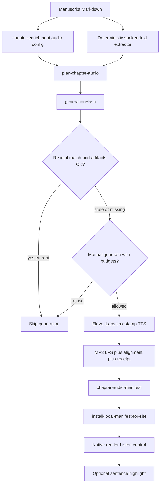

# ElevenLabs TTS pilot for the native reader

**Status:** Active specialized plan (pilot not yet implemented)  
**Created:** 2026-08-03  
**Location:** `docs/roadmaps/elevenlabs-tts-pilot.md`  
**Authority:** Specialized cross-layer plan. Does **not** replace [`remaining-product-roadmap.md`](remaining-product-roadmap.md). Unfinished follow-ups that become cross-layer backlog should remain linked from that master roadmap (`AUDIO-*`).

**Document role:** Executable implementation roadmap for selectively generated ElevenLabs narration in the After Certainty native reader—schemas, offline planning, metered generation, CI, Git LFS artifacts, and reader UX—scoped to a low-risk credit-bounded pilot.

> **Evidence rule:** Live code, schemas, workflows, and tests override planning-time snapshots in this document.

> **Safety rule:** This roadmap must be implemented without putting `ELEVENLABS_API_KEY` in Cursor agent environments, local `.env` files, or ordinary CI. No ElevenLabs API calls were made while authoring this document.

---

## 1. Executive summary

**Feasibility:** Feasible and architecture-aligned.

The monorepo already separates **authored desired state** (semantic YAML / `chapter-enrichment.yml` / `book.yml`) from **machine-generated observed state** (`build/semantic-manifest.json`, cover WebPs, enrichment PRs). The native reader SSR-renders sanitized manuscript HTML and already cancels Web Speech on chapter navigation—natural hooks for a Listen control. Corpus tooling is Make + Python (`tools/`, `tests/`); site consumption is TypeScript under `apps/site/`. GitHub Actions is the CI provider; secrets are already isolated to narrow publish jobs.

**Fit:** The pilot extends existing patterns rather than inventing a parallel stack:

| Existing pattern | TTS analogue |
|------------------|--------------|
| `chapter-enrichment.yml` unit metadata | Optional `audio` narration intent |
| Cover derivatives + install-for-site | Audio install into `apps/site/public/generated/audio/` |
| `semantic-enrichment.yml` manual dispatch → PR | Metered generation workflow → reviewable PR |
| `validate-*` / `verify-*` Make gates | Secret-free `plan-chapter-audio` / `validate-chapter-audio` |
| Credential-free Cursor policy | ElevenLabs key only in Actions secrets |

**Recommended pilot scope:** One unit—`chapter-after-certainty-front-matter-introduction`—with hard credit ceilings, Git LFS for MP3s, sentence-level highlighting deferred to Phase 6, and no automatic regeneration.

**Largest risks:**

1. **Credit burn** — Rough spoken length ~8,300 characters; one generation can consume most of a 10,000-credit monthly free allowance.
2. **Git LFS operational surface** — Repo has no LFS today; LFS must be enabled before the first MP3 commit, and CI/Vercel must fetch objects (not pointer stubs).
3. **Spoken-text parity** — Python extractor and site renderer must agree on speakable sequence for timing sync.
4. **Public licensing** — ElevenLabs terms for shipping generated audio on the public site need human confirmation before Phase 4/5 ship.
5. **Accidental API use** — Mitigated by manual dispatch, dry-run defaults, unit allowlists, and no key in ordinary CI or agents.

---

## 2. Current-state repository findings

### 2.1 Verified repository facts

| Area | Fact | Path / evidence |
|------|------|-----------------|
| Monorepo layout | Corpus at repo root; site at `apps/site/`; packages `packages/corpus-tasks/` | Root `README.md`, `package.json` workspaces |
| Package manager | npm workspaces + Turbo; Python via `uv` + `Makefile` | `package.json`, `turbo.json`, `pyproject.toml`, `uv.lock` |
| Corpus CLI | Make is authoritative (`generate-*`, `validate-*`, `verify-*`) | `Makefile` |
| Chapter identity | `chapter-{editionSlug}-{pathDashed}`; routeKey frozen | `tools/manuscript_structure.py`, `docs/semantic-chapter-identity.md` |
| Unit enrichment | Authored in `books/<slug>/chapter-enrichment.yml`; schema forbids unknown fields | `schema/semantic/chapter-enrichment.schema.json` |
| Book media today | YouTube-only `media.intro` / `media.patterns` | `schema/book.schema.json` `#/$defs/bookMediaSpec` |
| Manifest pipeline | `make generate-semantic-manifest` → `build/semantic-manifest.json` | `tools/generate_semantic_manifest.py`, `tools/discovery_manifest.py` |
| Site install | Manifest + manuscripts + covers + OG into site data/public | `scripts/install_local_manifest_for_site.py` |
| Native reader route | `/explore/books/{slug}/chapters/{chapterSlug}` SSR | `apps/site/app/explore/(reader)/books/[slug]/chapters/[chapterSlug]/page.tsx` |
| Markdown pipeline | remark/rehype (not MDX for chapters); sanitize + slug | `apps/site/lib/reading/render-manuscript-html.ts` |
| Speech today | Cancels `speechSynthesis` on chapter change; no chapter TTS | `navigate-chapter.ts`, `reset-spoken-content.tsx` |
| Podcast audio | Remote RSS/CDN `<audio>`; unrelated to chapter TTS | `apps/site/components/podcast/podcast-episode-card.tsx` |
| CI provider | GitHub Actions only | `.github/workflows/*.yml` |
| Ordinary site CI | No repo secrets; builds corpus offline | `site-ci.yml` |
| Manual dispatch precedent | Enrichment opens review PR; tokens cleared during Python | `semantic-enrichment.yml` |
| Secrets in Actions today | `CACHE_REVALIDATE_SECRET`, `GITHUB_TOKEN` / `github.token` | `book-export-release.yml`, security docs |
| Credential-free agents | No API keys in Cursor; Gitleaks + `test_no_secrets_in_repo.py` | `docs/security/credential-free-cursor.md`, `.cursor/rules/no-secrets-in-repo.mdc` |
| Git LFS | **Not configured**; no root `.gitattributes`; migration notes “No Git LFS observed” | `docs/roadmaps/monorepo-migration-plan.md` |
| Large binaries | Cover PNGs committed without LFS; `build/` gitignored | `.gitignore`, `books/*/book-cover.png` |
| Roadmap index | Specialized plans registered in `docs/roadmaps/README.md` | This document’s home |
| Pilot manuscript | After Certainty introduction exists and is exported as `kind: introduction` | `books/after-certainty/front-matter/introduction.md`, enrichment entry |
| Rough spoken size | ~8,300 characters / ~1,260 words after naive markdown strip | Local estimate only; Phase 0 must use the real extractor |
| Mermaid | Already used in repo docs | e.g. `monorepo-migration-plan.md` |

### 2.2 Proposed changes (this plan)

- Optional `audio` block on chapter enrichment (+ optional book-level `narrationDefaults`).
- New Python package area under `tools/` for spoken-text extraction, hashing, planning, generation client, validation.
- New Make targets: `plan-chapter-audio`, `generate-chapter-audio`, `validate-chapter-audio`, `verify-chapter-audio`.
- Artifact tree `books/<slug>/audio/` with LFS-tracked `*.mp3`.
- Generated `build/chapter-audio-manifest.json` + site install path.
- Manual Actions workflow for metered generation; ordinary CI validation only.
- Reader Listen UI + later sentence highlighting.

### 2.3 Open questions (inspection could not fully resolve)

| Question | Why unresolved | Default in this plan |
|----------|----------------|----------------------|
| Exact ElevenLabs with-timestamps endpoint + credit accounting for chosen model | Requires current product docs / account; no API call made | Assume Flash `eleven_flash_v2_5` + timestamp-capable TTS; confirm in Phase 0 |
| Stock voice ID and public-use licensing | Human / commercial judgment | Placeholder voice; Kevin confirms before first generation |
| Whether Vercel build environment fetches Git LFS by default | Depends on Vercel git integration settings | Plan for explicit LFS fetch in install/build scripts |
| Stale-audio CI policy: fail vs warn | Product judgment | **Warn** in ordinary CI during pilot; **hide** Listen when stale |

---

## 3. Target architecture

### 3.1 End-to-end flow



### 3.2 Desired vs observed state

| Kind | Store | Edited by |
|------|-------|-----------|
| Narration intent + settings | `books/*/chapter-enrichment.yml` (+ optional `book.yml` defaults) | Authors |
| Normalized spoken text | Computed (optional debug `.spoken.txt`) | Tools |
| Receipt / hashes / paths | `books/*/audio/*.receipt.json` | Generator only |
| Audio binary | `books/*/audio/*.mp3` (Git LFS) | Generator only |
| Timing | `books/*/audio/*.alignment.json` | Generator only |
| Site index | `build/chapter-audio-manifest.json` → site data/public | Generator / install |

**Do not** store last-generated hashes in authored enrichment YAML.

### 3.3 Component map

| Layer | Responsibility | Likely homes |
|-------|----------------|--------------|
| Schema | Optional audio config validation | `schema/semantic/chapter-enrichment.schema.json`, `schema/book.schema.json`, new `schema/chapter-audio-*.schema.json` |
| Extractor | Markdown → deterministic spoken text + sentence segments | `tools/chapter_audio/` (new) |
| Plan / hash / verify | Secret-free CLI | `tools/plan_chapter_audio.py`, `tools/validate_chapter_audio.py` |
| Generate | Metered ElevenLabs client | `tools/generate_chapter_audio.py` + narrow client module |
| Make | Verb-noun targets | `Makefile` |
| CI generate | Manual dispatch + PR | `.github/workflows/chapter-audio-generate.yml` (new) |
| CI verify | No secret | Hook into `python-tests.yml` / `site-ci.yml` |
| Site data | Resolve current audio for chapter | `apps/site/lib/reading/` + types |
| Site UI | Listen / play / progress | `apps/site/components/reading/` |

### 3.4 Git LFS strategy (locked)

Enable **before** the first MP3 commit:

```gitattributes
books/*/audio/*.mp3 filter=lfs diff=lfs merge=lfs -text
```

- **LFS:** `*.mp3` only.
- **Regular Git:** `.alignment.json`, `.receipt.json` (and optional `.spoken.txt` if committed).
- Contributors: `git lfs install`.
- Actions: `actions/checkout` with `lfs: true` when real MP3 bytes are required.
- Install/build: refuse to publish pointer stubs; `validate-chapter-audio` detects the `version https://git-lfs.github.com/spec/v1` header.

---

## 4. Data contracts

### 4.1 Semantic narration configuration (authored)

**Home:** per-chapter object in `books/<slug>/chapter-enrichment.yml`, schema extension on `chapter-enrichment.schema.json`.

**Book defaults (optional):** `narrationDefaults` on `book.yml` / `book.schema.json`—**not** under existing YouTube `media`.

```yaml
# books/after-certainty/chapter-enrichment.yml (conceptual)
- sourcePath: front-matter/introduction.md
  # ... existing enrichment fields ...
  audio:
    enabled: true
    provider: elevenlabs
    voice_id: REPLACE_WITH_STOCK_VOICE_ID
    model_id: eleven_flash_v2_5
    output_format: mp3_44100_128
    include_title: true
    include_footnotes: false
    language: en
    max_credits: 9000
```

| Field | Authored | Notes |
|-------|----------|-------|
| `enabled` | Yes | Chapter must set `true` to opt in; book defaults never silently enable |
| `provider` | Yes | Pilot: `elevenlabs` only |
| `voice_id` | Yes | Inherit from `narrationDefaults` if omitted |
| `model_id` | Yes | Inherit allowed |
| `output_format` | Yes | Inherit allowed |
| `include_title` | Yes | Default `true` |
| `include_footnotes` | Yes | Default `false` for pilot |
| `language` | Yes | Default `en` |
| `voice_settings` | Optional | Only if material to output; hashed when present |
| `seed` | Optional | Hashed when present |
| `max_credits` | Yes | Hard per-unit ceiling |
| `pronunciation_dictionary_id` / version | Optional | Hashed when present |

**Inheritance rule:** merge book `narrationDefaults` under chapter `audio`, then require chapter `enabled: true`.

**Manifest:** Phase 1 may omit audio from `semantic-manifest.json` and keep a separate `chapter-audio-manifest.json`. If later folded into chapter entries, bump manifest `schemaVersion` and keep fields optional for forward compatibility.

### 4.2 Generation receipt (generated)

`books/<slug>/audio/<chapterSlug>.receipt.json`

```json
{
  "schemaVersion": 1,
  "unitId": "chapter-after-certainty-front-matter-introduction",
  "editionSlug": "after-certainty",
  "chapterSlug": "front-matter-introduction",
  "sourcePath": "front-matter/introduction.md",
  "sourceHash": "sha256:...",
  "spokenTextHash": "sha256:...",
  "generationHash": "sha256:...",
  "pipelineVersion": 1,
  "extractorVersion": 1,
  "provider": "elevenlabs",
  "voiceId": "...",
  "modelId": "eleven_flash_v2_5",
  "outputFormat": "mp3_44100_128",
  "language": "en",
  "includeTitle": true,
  "includeFootnotes": false,
  "charactersSubmitted": 0,
  "estimatedCredits": 0,
  "generatedAt": "2026-08-03T12:00:00Z",
  "audioPath": "books/after-certainty/audio/front-matter-introduction.mp3",
  "alignmentPath": "books/after-certainty/audio/front-matter-introduction.alignment.json",
  "audioSha256": "sha256:...",
  "alignmentSchemaVersion": 1
}
```

All fields generated. Authors must not hand-edit receipts.

### 4.3 Normalized timing data (generated)

`books/<slug>/audio/<chapterSlug>.alignment.json`

```json
{
  "schemaVersion": 1,
  "unitId": "chapter-after-certainty-front-matter-introduction",
  "generationHash": "sha256:...",
  "granularity": "sentence",
  "segments": [
    {
      "id": "s0001",
      "text": "Clarity kept arriving without rest.",
      "startMs": 1200,
      "endMs": 3400,
      "charStart": 42,
      "charEnd": 78
    }
  ]
}
```

| Field | Role |
|-------|------|
| `granularity` | Pilot: `sentence` |
| `segments[].id` | Stable within a generation; site `data-audio-seg` |
| `charStart` / `charEnd` | Offsets into normalized spoken text |
| Optional `words[]` | Deferred; may be stored later without changing sentence IDs |

Provider-specific timestamp payloads are normalized into this shape before write.

### 4.4 Site-facing audio manifest (generated)

`build/chapter-audio-manifest.json` (install copy under `apps/site/data/`)

```json
{
  "schemaVersion": 1,
  "generatedAt": "2026-08-03T12:00:00Z",
  "units": [
    {
      "unitId": "chapter-after-certainty-front-matter-introduction",
      "editionSlug": "after-certainty",
      "chapterSlug": "front-matter-introduction",
      "routeKey": "/explore/books/after-certainty/chapters/front-matter-introduction",
      "status": "current",
      "audioUrl": "/generated/audio/after-certainty/front-matter-introduction.mp3",
      "alignmentUrl": "/generated/audio/after-certainty/front-matter-introduction.alignment.json",
      "generationHash": "sha256:...",
      "durationHintMs": null
    }
  ]
}
```

`status` values: `current` | `stale` | `missing` | `disabled` | `invalid`.

**Listener rule:** Show Listen only when `status === "current"` and artifacts resolve.

### 4.5 Schema versioning

- Integer `schemaVersion` on each generated JSON; validators accept known versions and fail closed on unknown major versions.
- Authored enrichment remains `version: 1` at file root; additive `audio` property is backward compatible (`additionalProperties: false` requires schema edit).
- Pipeline / extractor versions are separate integers inside the generation hash input.

---

## 5. Hashing and cache-invalidation rules

### 5.1 Generation hash inputs

Canonical UTF-8 JSON (sorted keys) hashed with SHA-256, prefixed `sha256:`:

| Input | Included |
|-------|----------|
| `pipelineVersion` | Yes |
| `extractorVersion` | Yes |
| Exact normalized spoken text | Yes |
| `provider` | Yes |
| `voiceId` | Yes |
| `modelId` | Yes |
| `outputFormat` | Yes |
| `language` | Yes |
| `includeTitle` / `includeFootnotes` | Yes |
| `voice_settings` (canonical) | When present |
| `seed` | When present |
| Pronunciation dictionary id + version | When present |
| Any other request setting that changes audio | Yes |

**Do not** hash only raw Markdown. Also record `sourceHash` (raw file bytes) on the receipt for forensics; it does not alone decide freshness.

### 5.2 Spoken-text normalization (deterministic)

Extractor must define stable behavior for corpus constructs observed in manuscripts:

| Construct | Pilot rule |
|-----------|------------|
| YAML / Pandoc front matter | Strip |
| ATX / setext headings | Speak text; optional title policy via `include_title` |
| Emphasis / strong | Speak inner text only |
| Links | Speak link text; omit URL |
| Images | Omit image; optionally speak alt if policy says so (pilot: omit) |
| Captions / `{ width=... }` attrs | Strip |
| Footnotes | Omit bodies and refs when `include_footnotes: false` |
| Block quotes | Speak text |
| Scene separators (`---` / `***`) | Short pause marker or omit (define in extractor tests) |
| HTML | Strip tags; speak text if any |
| `:::` containers / `\newpage` | Strip (same as reader preprocess) |
| Leading duplicate H1 | Align with `preprocessManuscriptMarkdown` title handling |

Golden fixtures under `tests/fixtures/chapter_audio/` lock behavior.

### 5.3 Invalidation matrix

| Change | Effect |
|--------|--------|
| Text edit changing spoken text | New hash → stale |
| Voice / model / format / settings change | New hash → stale |
| Extractor version bump | New hash → stale |
| Pronunciation dictionary change | New hash → stale |
| Missing MP3 or alignment | `missing` / `invalid`; no Listen |
| Corrupt / unreadable receipt | `invalid`; refuse to treat as current |
| Reverted text restoring prior spoken form | Hash matches prior receipt **only if** settings unchanged; may become current again without regen |
| `enabled: false` | `disabled`; hide Listen; do not generate |
| `force=true` | Regenerate even if current (still subject to credit ceilings) |
| LFS pointer instead of MP3 | `invalid` |

---

## 6. Credit and safety controls

### 6.1 Principles

- Offline plan/validate never need a key and never call the network for TTS.
- Generation is explicit, single-unit (pilot), budgeted, and reviewable.
- Ordinary CI never receives `ELEVENLABS_API_KEY`.
- Cursor agents never receive the key ([`docs/security/credential-free-cursor.md`](../security/credential-free-cursor.md)).

### 6.2 Pilot defaults

| Control | Default |
|---------|---------|
| Monthly free allowance assumption | 10,000 credits |
| Units per workflow run | **1** (required `UNIT` / `unit_id`) |
| `audio-generate-enabled` bulk command | **Deferred** until after one-unit pilot |
| `force` | `false` |
| Workflow `dry_run` | `true` (must flip to `false` to spend credits) |
| Per-unit `max_credits` | `9000` for the After Certainty introduction |
| Per-run workflow ceiling | `9500` |
| Unchanged content | Refuse regeneration |
| Disabled units | Refuse |
| Over budget | Refuse |
| PR / fork triggers | None; `workflow_dispatch` only from default branch trusted context |
| Concurrency | `chapter-audio-${{ inputs.unit_id }}`, `cancel-in-progress: false` |
| Logs | Per-unit skip/regen reason required |

### 6.3 Secret placement

| Location | Allowed? |
|----------|----------|
| GitHub Actions repository secret `ELEVENLABS_API_KEY` | Yes (Phase 4) |
| `site-ci.yml` / `python-tests.yml` | No |
| Cursor / cloud agents | No |
| `.env`, `.env.local`, committed files | No |
| Workflow logs | Never print key or full auth headers |

### 6.4 Account allowance checks

When the ElevenLabs API exposes subscription/character remaining, query during generate (not during ordinary CI) and refuse if remaining < estimated need. If unsupported, rely on hard ceilings and dry-run character reports.

---

## 7. Phased implementation roadmap

Do not combine phases into one implementation PR.

### Phase 0 — Decisions and spike

- Confirm timestamp-capable endpoint, model credit rules, licensing.
- Lock pilot unit (this doc’s unit) and stock voice.
- Measure exact spoken characters via extractor prototype or temporary local script **without** API calls.
- Enable Git LFS tracking file (`.gitattributes`) before any MP3 exists.
- Decide sentence highlighting for Phase 6 (locked: sentence).
- Record expected credit ceiling.

### Phase 1 — Metadata and schemas

- Add optional `audio` to chapter enrichment schema + book `narrationDefaults`.
- Wire validation (`validate_discovery_content` / enrichment consumers as needed).
- Add JSON Schemas for receipt, alignment, audio manifest.
- Fixtures + schema tests.
- Commit `.gitattributes` LFS pattern if not done in Phase 0.

### Phase 2 — Offline planning

- Deterministic spoken-text extraction + sentence segmentation.
- Hashing + receipt load/compare.
- `make plan-chapter-audio` (JSON/text report: current/stale/missing/disabled/invalid + character estimates).
- Fixture tests; zero network.

### Phase 3 — Metered generation

- Narrow ElevenLabs client interface.
- `make generate-chapter-audio UNIT=...` with budgets, dry-run, force=false.
- Atomic writes (temp → rename); normalize alignment; write receipt.
- Default tests use mocks; no real credits in CI.

### Phase 4 — Manual CI workflow

- `workflow_dispatch` workflow with inputs, concurrency, dry-run default.
- LFS install/push; open reviewable PR (enrichment-style).
- Ordinary CI: `validate-chapter-audio` / `verify-chapter-audio` without secret.
- Document secret in GitHub settings checklist (Kevin).

### Phase 5 — Reader playback pilot

- Install audio into `apps/site/public/generated/audio/`.
- Data loader: Listen only if `current`.
- Accessible play/pause/progress; cleanup on chapter nav.
- Tests; progressive enhancement (no JS → no broken layout; audio link optional).

### Phase 6 — Synchronized highlighting pilot

- Sentence-level `data-audio-seg` via dedicated rehype pass (not naive word split).
- Shared fixtures proving extractor segments ↔ renderer markers ↔ alignment IDs.
- `prefers-reduced-motion` / a11y: highlighting optional or subdued.
- Preserve links, emphasis, footnotes, copy/selection, SSR/hydration.

### Phase 7 — Evaluation and expansion

- Measure credits used, voice quality, timing quality, UX.
- Re-check licensing.
- Decide whether to enable more introductions/chapters or stop.

---

## 8. Task breakdown

Complexity: **S** small · **M** medium · **L** large. Credits: **No** unless noted.

### Phase 0

| ID | Goal | Likely files | New files | Deps | Acceptance | Tests | Security | Credits | Size |
|----|------|--------------|-----------|------|------------|-------|----------|---------|------|
| AUDIO-P0-01 | Confirm ElevenLabs endpoint, model credits, licensing notes | — | Notes in this roadmap or `docs/publishing/` spike addendum | — | Written assumptions checked by human | N/A | No key in agents | No | S |
| AUDIO-P0-02 | Measure exact spoken chars for pilot unit (local extractor spike) | intro md | Optional spike script (discard or keep under tools) | P0-01 | Character count + estimate logged | Fixture sketch | No network | No | S |
| AUDIO-P0-03 | Select stock voice ID (human) | enrichment later | — | P0-01 | Voice ID recorded | N/A | N/A | No | S |
| AUDIO-P0-04 | Add Git LFS `.gitattributes` for `books/*/audio/*.mp3` | `.gitattributes` | `.gitattributes` | — | `git check-attr filter` shows LFS; no MP3s yet | Doc/CI note | N/A | No | S |

### Phase 1

| ID | Goal | Likely files | New files | Deps | Acceptance | Tests | Security | Credits | Size |
|----|------|--------------|-----------|------|------------|-------|----------|---------|------|
| AUDIO-P1-01 | Schema: chapter `audio` + book `narrationDefaults` | `schema/semantic/chapter-enrichment.schema.json`, `schema/book.schema.json` | — | P0-04 | Invalid audio configs fail validation | Schema tests | No secrets | No | M |
| AUDIO-P1-02 | Receipt / alignment / audio-manifest JSON Schemas | — | `schema/chapter-audio-receipt.schema.json`, `schema/chapter-audio-alignment.schema.json`, `schema/chapter-audio-manifest.schema.json` | P1-01 | Draft fixtures validate | `tests/test_chapter_audio_schemas.py` | No secrets | No | M |
| AUDIO-P1-03 | Opt in pilot enrichment `audio` block (enabled, ceilings, placeholders) | `books/after-certainty/chapter-enrichment.yml` | — | P1-01, P0-03 | Enrichment validates; enabled only for pilot unit | Discovery/enrichment tests | No secrets | No | S |

### Phase 2

| ID | Goal | Likely files | New files | Deps | Acceptance | Tests | Security | Credits | Size |
|----|------|--------------|-----------|------|------------|-------|----------|---------|------|
| AUDIO-P2-01 | Spoken-text extractor + sentence segments | — | `tools/chapter_audio/extract.py`, fixtures | P1-02 | Deterministic on fixtures | Golden tests | No network | No | L |
| AUDIO-P2-02 | Hash + receipt compare | — | `tools/chapter_audio/hashing.py`, `receipts.py` | P2-01 | Stable hash; detects setting/text drift | Unit tests | No network | No | M |
| AUDIO-P2-03 | `make plan-chapter-audio` | `Makefile` | `tools/plan_chapter_audio.py` | P2-02 | Reports status + chars; exit codes documented | CLI tests | No key | No | M |

### Phase 3

| ID | Goal | Likely files | New files | Deps | Acceptance | Tests | Security | Credits | Size |
|----|------|--------------|-----------|------|------------|-------|----------|---------|------|
| AUDIO-P3-01 | ElevenLabs client interface + mocks | — | `tools/chapter_audio/elevenlabs_client.py` | P2-03 | Interface injectable; mock returns audio+timestamps | Mock tests | Key only via env in real mode | No in CI | M |
| AUDIO-P3-02 | `generate-chapter-audio` with budgets + atomic write | `Makefile` | `tools/generate_chapter_audio.py` | P3-01 | Refuses disabled/stale-budget/unchanged; atomic outputs | Failure + budget tests | Refuses without key when not dry-run | Only when explicitly run with key | L |
| AUDIO-P3-03 | Alignment normalizer | — | `tools/chapter_audio/alignment.py` | P3-01 | Provider payload → schema | Fixture tests | N/A | No | M |

### Phase 4

| ID | Goal | Likely files | New files | Deps | Acceptance | Tests | Security | Credits | Size |
|----|------|--------------|-----------|------|------------|-------|----------|---------|------|
| AUDIO-P4-01 | Manual generate workflow | — | `.github/workflows/chapter-audio-generate.yml` | P3-02, P0-04 | Dispatch inputs; dry_run default; LFS push; PR branch | Workflow dry review | Key only on generate job; clear during plan | Only if dry_run=false | M |
| AUDIO-P4-02 | Ordinary CI validate/verify audio | `python-tests.yml`, maybe `site-ci.yml` | — | P2-03 | CI runs validate without secret; no generate step | CI greps / job list | No `ELEVENLABS_API_KEY` in ordinary CI | No | M |
| AUDIO-P4-03 | Document secret + LFS ops | `docs/security/github-settings-checklist.md`, maybe CONTRIBUTING | — | P4-01 | Checklist entry for Kevin | N/A | Credential-free Cursor unchanged | No | S |

### Phase 5

| ID | Goal | Likely files | New files | Deps | Acceptance | Tests | Security | Credits | Size |
|----|------|--------------|-----------|------|------------|-------|----------|---------|------|
| AUDIO-P5-01 | Install audio artifacts for site | `scripts/install_local_manifest_for_site.py`, `vercel_build.sh` | — | P4-02 | Copies real MP3s; fails on LFS pointers | Python tests | N/A | No | M |
| AUDIO-P5-02 | Site audio manifest loader | `apps/site/types/`, `lib/reading/` | `lib/reading/chapter-audio.ts` | P5-01 | Resolves current only | Vitest | N/A | No | M |
| AUDIO-P5-03 | Listen / playback UI + nav cleanup | `chapter-reader-shell.tsx`, `reader-chrome.tsx`, `navigate-chapter.ts`, `reset-spoken-content.tsx` | `components/reading/chapter-audio-player.tsx` | P5-02 | Accessible controls; pause on chapter change; no Listen if not current | Component + e2e smoke | N/A | No | L |

### Phase 6

| ID | Goal | Likely files | New files | Deps | Acceptance | Tests | Security | Credits | Size |
|----|------|--------------|-----------|------|------------|-------|----------|---------|------|
| AUDIO-P6-01 | Shared segment contract fixtures | tools + site | `tests/fixtures/chapter_audio/*`, site fixture | P2-01, P5-03 | Same segment texts/ids | Cross-checked tests | N/A | No | M |
| AUDIO-P6-02 | Rehype sentence markers | `render-manuscript-html.ts`, sanitize schema | `lib/reading/rehype-audio-segments.ts` | P6-01 | Markers without breaking footnotes/links | render tests | Sanitize allows `data-audio-seg` | No | L |
| AUDIO-P6-03 | Playback sync + reduced-motion | player component | — | P6-02 | Sentence highlight tracks audio; respects a11y prefs | Component tests | N/A | No | M |

### Phase 7

| ID | Goal | Likely files | New files | Deps | Acceptance | Tests | Security | Credits | Size |
|----|------|--------------|-----------|------|------------|-------|----------|---------|------|
| AUDIO-P7-01 | Evaluation write-up + expand/stop decision | this roadmap or short report | Optional `reports/chapter-audio-pilot-eval.md` | P5–P6 + one real gen | Decision recorded; backlog updated | N/A | No new secrets | Accounting only | S |

---

## 9. Testing strategy

| Area | Approach |
|------|----------|
| Text normalization | Golden Markdown fixtures → exact spoken text |
| Hash stability | Same inputs → same `generationHash` |
| Hash invalidation | Flip each hashed field; expect mismatch |
| Receipt corruption | Truncated/missing fields → `invalid` |
| Budget enforcement | Estimate > max → refuse before client call |
| Mock ElevenLabs | Recorded bytes + timestamp JSON; assert writes |
| Atomic write failure | Kill after audio temp write → no receipt replace; old current preserved |
| Alignment normalize | Provider fixture → schema + segment count |
| LFS pointer detection | File starting with LFS pointer header → fail validate |
| Site manifest load | Fixture manifest statuses |
| Reader controls | Vitest + Playwright smoke |
| Highlight sync | Fake timers / stubbed `HTMLMediaElement` |
| Accessibility | Labels, keyboard, reduced-motion path; extend `reader-a11y` if needed |
| CI behavior | Assert ordinary workflows lack generate job and secret env |
| Network assurance | Client raises if called without mock in unit tests; plan/validate have no HTTP session |

`make check` / site Vitest must make **zero** ElevenLabs network calls.

---

## 10. Failure modes and recovery

| Failure | Behavior |
|---------|----------|
| API rate limit | Fail run; leave prior artifacts; retry later manually |
| Credit exhaustion | Refuse; dry-run still works |
| Partial/malformed API response | Do not replace receipt/audio; exit non-zero |
| Audio without valid timing | Refuse to mark current; optional policy: keep audio only if Phase 5 playback-without-highlight accepted—pilot **requires** timing |
| Process killed mid-write | Temps cleaned or ignored; previous receipt remains authoritative |
| Receipt/audio hash mismatch | `invalid`; hide Listen; CI warn/fail per policy |
| Stale after manuscript edit | Plan shows stale; Listen hidden; no auto-regen |
| Deleted source unit | Orphan artifacts reported by validate; remove in follow-up PR |
| Changed unit IDs | Treat as new unit; old paths orphaned |
| Duplicate generate jobs | Workflow concurrency group per `unit_id` |
| Failed PR push | Artifacts remain on runner only; no silent main commit |
| Reader: audio 404 / decode error | Control shows error; reading uninterrupted |
| LFS not fetched on Vercel | Install detects pointer; fail build or skip audio install with loud log (prefer fail once audio is expected) |

---

## 11. Pilot definition

| Field | Value |
|-------|-------|
| Unit ID | `chapter-after-certainty-front-matter-introduction` |
| Edition slug | `after-certainty` |
| Chapter slug | `front-matter-introduction` |
| Source path | `books/after-certainty/front-matter/introduction.md` |
| Route | `/explore/books/after-certainty/chapters/front-matter-introduction` |
| Approx spoken characters | ~8,300 (naive strip); **re-measure in Phase 0** |
| Voice | Placeholder stock voice — Kevin selects in AUDIO-P0-03 |
| Model | `eleven_flash_v2_5` (confirm Phase 0) |
| Output format | `mp3_44100_128` |
| `include_title` | `true` |
| `include_footnotes` | `false` |
| Per-unit `max_credits` | `9000` |
| Per-run ceiling | `9500` |
| Expected artifacts | `books/after-certainty/audio/front-matter-introduction.mp3` (LFS), `.alignment.json`, `.receipt.json` |
| Manual invocation (conceptual) | Actions → Chapter audio generate → `unit_id=chapter-after-certainty-front-matter-introduction`, `max_credits=9500`, `force=false`, first `dry_run=true`, then `dry_run=false` |
| Reader behavior | Listen visible only when receipt hash matches and MP3 is real; play/pause/progress; cleanup on navigate |
| Non-regen acceptance | Second generate with unchanged inputs exits 0 without API call and without rewriting artifacts |

**Credit note:** One successful generation may consume most of the monthly free allowance. Retries wait for a new month or an explicit human budget decision.

---

## 12. Open decisions

| Decision | Recommendation (default) |
|----------|----------------------------|
| Public licensing / attribution for ElevenLabs audio on after-certainty.com | Confirm before first public deploy of audio; do not ship Listen until Kevin OK |
| Preferred stock voice | Human listen test in Phase 0; record `voice_id` in enrichment |
| Narrate titles? | Yes (`include_title: true`) |
| Narrate footnotes? | No for pilot |
| Highlight granularity | **Sentence** for pilot |
| Storage | **Git + LFS for MP3s**; JSON in regular Git; PR review. Revisit CDN/Blob only if LFS quota or deploy fetch hurts |
| Stale audio UX / CI | **Hide** Listen when not `current`; ordinary CI **warn** on stale enabled units during pilot (upgrade to fail when process is trusted) |
| Bulk `generate-enabled` | Deferred post-pilot |
| Fold audio into semantic-manifest chapters[] | Defer; keep separate audio manifest for pilot |

---

## 13. Cursor execution sequence

Each prompt implements **one phase or tight task group**. Stop when acceptance criteria pass. Do not request or load `ELEVENLABS_API_KEY` into Cursor unless the prompt explicitly says Phase 3/4 human-gated generation is in scope **and** the operator intends a real run (prefer CI for real runs).

### Prompt A — Phase 0 spike + LFS bootstrap

- **Objective:** Confirm assumptions; measure spoken length locally; add `.gitattributes` LFS lines; record voice placeholder notes.
- **Scope:** Docs notes + `.gitattributes` only (or tiny local measurement script).
- **Non-goals:** Schemas beyond LFS; API calls; enrichment enablement.
- **Tests:** `git check-attr` on a hypothetical path; no network.
- **Stop:** LFS pattern committed; character estimate recorded.
- **Credits:** Not permitted.

### Prompt B — Phase 1 schemas + pilot enrichment stub

- **Objective:** AUDIO-P1-01–P1-03.
- **Scope:** JSON Schemas, enrichment `audio` block, schema tests.
- **Non-goals:** Extractor, CI generate, reader UI.
- **Tests:** Schema validation tests green; `make validate-book-specs` / enrichment validation as wired.
- **Stop:** Pilot unit config validates; no MP3s.
- **Credits:** Not permitted.

### Prompt C — Phase 2 offline planning

- **Objective:** AUDIO-P2-01–P2-03.
- **Scope:** Extractor, hashing, receipts, `plan-chapter-audio`.
- **Non-goals:** ElevenLabs client; workflows; site UI.
- **Tests:** Golden fixtures; hash tests; plan CLI.
- **Stop:** `make plan-chapter-audio` reports pilot unit status without secrets.
- **Credits:** Not permitted.

### Prompt D — Phase 3 metered generation (mock-first)

- **Objective:** AUDIO-P3-01–P3-03.
- **Scope:** Client interface, generate command, alignment normalizer, atomic writes.
- **Non-goals:** Public workflow; reader; real API by default.
- **Tests:** Mocks only in CI; document how a human runs a real generate in Actions later.
- **Stop:** Mock generate produces valid artifact trio; budgets enforced.
- **Credits:** Not in Cursor/CI; real optional only via explicit human CI run.

### Prompt E — Phase 4 manual workflow + ordinary CI verify

- **Objective:** AUDIO-P4-01–P4-03.
- **Scope:** Workflow YAML, CI hooks, security checklist note, LFS checkout flags.
- **Non-goals:** Reader UI; enabling more units.
- **Tests:** Workflow review; validate job present; confirm no secret on site-ci/python-tests.
- **Stop:** Dry-run dispatch path documented; validate in ordinary CI.
- **Credits:** Only if a human sets `dry_run=false` in Actions (not in Cursor).

### Prompt F — Phase 5 reader playback

- **Objective:** AUDIO-P5-01–P5-03.
- **Scope:** Install path, loader, Listen UI, nav cleanup.
- **Non-goals:** Highlighting; bulk generation.
- **Tests:** Vitest + reader e2e smoke; a11y labels.
- **Stop:** Listen appears iff current; playback works; chapter change stops audio.
- **Credits:** Not permitted.

### Prompt G — Phase 6 sentence highlighting

- **Objective:** AUDIO-P6-01–P6-03.
- **Scope:** Shared fixtures, rehype markers, sync, reduced-motion.
- **Non-goals:** Word-level highlight; DOM-wide naive split; new units.
- **Tests:** Render + sync tests; footnote/link regressions.
- **Stop:** Sentences highlight in sync on pilot unit with fixture alignment.
- **Credits:** Not permitted.

### Prompt H — Phase 7 evaluation

- **Objective:** AUDIO-P7-01.
- **Scope:** Short evaluation report; update remaining-product roadmap / this status.
- **Non-goals:** Expanding to full audiobook.
- **Tests:** N/A.
- **Stop:** Expand/stop decision recorded.
- **Credits:** Accounting only.

---

## Appendix A — Related paths (quick index)

| Path | Role |
|------|------|
| `books/after-certainty/front-matter/introduction.md` | Pilot source |
| `books/after-certainty/chapter-enrichment.yml` | Authored unit metadata |
| `schema/semantic/chapter-enrichment.schema.json` | Enrichment schema |
| `schema/book.schema.json` | Book defaults / media |
| `tools/manuscript_structure.py` | Chapter IDs / structure |
| `docs/semantic-chapter-identity.md` | ID contract |
| `Makefile` | Corpus commands |
| `.github/workflows/semantic-enrichment.yml` | Manual PR workflow precedent |
| `.github/workflows/site-ci.yml` | Ordinary site CI (no TTS secret) |
| `apps/site/lib/reading/render-manuscript-html.ts` | Manuscript HTML pipeline |
| `apps/site/components/reading/chapter-reader-shell.tsx` | Reader chrome hook |
| `docs/security/credential-free-cursor.md` | No keys in agents |
| `docs/roadmaps/remaining-product-roadmap.md` | Master backlog pointer (`AUDIO-*`) |

## Appendix B — Authorship confirmation

- Roadmap authored from repository inspection on 2026-08-03.
- **No ElevenLabs API calls were made.**
- **No API credentials were added** to the repository, environment files, or agent session.
