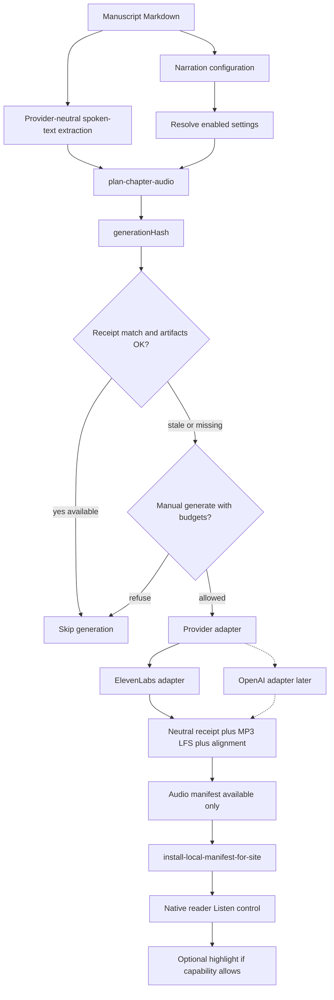

# Provider-neutral chapter TTS pilot for the native reader

**Status:** Active specialized plan (pilot not yet implemented)  
**Created:** 2026-08-03  
**Revised:** 2026-08-03 (provider-neutral architecture; ElevenLabs as first adapter)  
**Location:** `docs/roadmaps/elevenlabs-tts-pilot.md`  
**Authority:** Specialized cross-layer plan. Does **not** replace [`remaining-product-roadmap.md`](remaining-product-roadmap.md). Unfinished follow-ups that become cross-layer backlog should remain linked from that master roadmap (`AUDIO-*`).

**Document role:** Executable implementation roadmap for selectively generated chapter narration in the After Certainty native reader. The architecture is **provider-neutral**. ElevenLabs is the likely first pilot adapter; OpenAI TTS is a later evaluation candidate that must not require redesigning semantic metadata, receipts, manifests, CI orchestration, or the reader.

> **Evidence rule:** Live code, schemas, workflows, and tests override planning-time snapshots in this document.

> **Safety rule:** Do not commit provider API keys (`ELEVENLABS_API_KEY`, future `OPENAI_API_KEY`, etc.). Do not put them in Cursor **cloud** agent environments, ordinary CI, or Vercel. For the first real generate, Kevin may use a **trusted laptop**: put the key only in gitignored root `.env.local` (see `.env.example`) and run `make generate-chapter-audio`. Optional later: the same variable as a GitHub Actions secret for a manual workflow. No TTS API calls were made while authoring or revising this document.

---

## 0. Terminology

| Term | Meaning |
|------|---------|
| **Narration configuration** | Authored desired state (book defaults + per-unit overrides) |
| **Generation receipt** | Observed state recorded after a successful provider request |
| **Audio artifact** | Generated media (MP3 via Git LFS) and optional alignment JSON |
| **Audio manifest** | Validated site-facing index of **available** units only |
| **Provider adapter** | Implementation of provider-specific estimate / generate / normalize |
| **Audio-enabled unit** | Semantic unit with resolved `enabled: true` (eligible for narration) |
| **Audio-available unit** | Enabled unit with a **current**, validated artifact matching its `generationHash` |

**Enabled never implies available.** The Listen control depends on availability (receipt + artifacts + hash match installed into the site)—not on the authored enablement flag alone. No separate site env flag: if no unit is available for the chapter, Listen does not appear.

Use **provider-neutral** for shared concerns. Do not use the phrase “provided neutral.”

---

## 1. Executive summary

**Feasibility:** Feasible and architecture-aligned.

The monorepo already separates **authored desired state** (semantic YAML / `chapter-enrichment.yml` / `book.yml`) from **machine-generated observed state** (`build/semantic-manifest.json`, cover WebPs, enrichment PRs). The native reader SSR-renders sanitized manuscript HTML and already cancels Web Speech on chapter navigation—natural hooks for a Listen control. Corpus tooling is Make + Python (`tools/`, `tests/`); site consumption is TypeScript under `apps/site/`. GitHub Actions is the CI provider; secrets are already isolated to narrow publish jobs.

**Fit:** The pilot extends existing patterns with a **provider adapter boundary**:

| Existing pattern | TTS analogue |
|------------------|--------------|
| `chapter-enrichment.yml` unit metadata | Optional per-unit `audio` narration intent |
| `book.yml` book-level fields | Optional `narration.defaults` (not YouTube `media`) |
| Cover derivatives + install-for-site | Audio install into `apps/site/public/generated/audio/` |
| `semantic-enrichment.yml` manual dispatch → PR | Metered generation workflow → reviewable PR |
| `validate-*` / `verify-*` Make gates | Secret-free plan / list / validate / verify |
| Credential-free Cursor policy | Cloud agents: no keys. Laptop pilot: gitignored `.env.local` only; optional Actions secret later |

**Recommended pilot scope:** **Observer Patterns** (poetry) — enable the full exported book (29 units) for narration tracking; **first generate** = `chapter-observer-patterns-front-matter-introduction` (~211 characters). Provider **ElevenLabs** behind a narrow `TtsProvider` interface. Free-plan first; **no production Listen** until Kevin’s explicit go-ahead (paid-plan upgrade + licensing). Poetry form is an intentional stress case (short units, line breaks, two-column pattern tables). Full-book rough spoken size ~13.6k characters—pace free-plan generation or wait for paid upgrade before narrating everything.

**Local vs production (Kevin, 2026-08-04):** On a **trusted laptop**, Kevin may generate with gitignored root `.env.local` (`ELEVENLABS_API_KEY`), install the local site manifest (including available audio), run the site, and exercise the full native-reader Listen path—Listen appears only for chapters that are **available**. No site feature-flag env var: presence of available units is the signal. **Production / after-certainty.com** stays dark until Kevin’s go-ahead by **not shipping available audio into the live install** (or not merging generated artifacts to `main` until ready)—so there is nothing to forget to enable. Optional GitHub Actions artifact upload remains fine for pipeline review without installing into production.

**Largest risks:**

1. **Usage burn** — Rough spoken length ~8,300 characters; under ElevenLabs free credits, one generation can consume most of a ~10,000-credit monthly allowance (provider constraint, not a core architectural assumption).
2. **Git LFS operational surface** — Repo has no LFS today; LFS must be enabled before the first MP3 commit, and CI/Vercel must fetch objects (not pointer stubs).
3. **Spoken-text parity** — Python extractor and site renderer must agree on speakable sequence when highlighting is enabled.
4. **Public licensing / disclosure** — Provider terms for shipping AI narration on the public site need human confirmation before Phase 4/5 ship.
5. **Accidental API use** — Mitigated by manual dispatch, dry-run defaults, single-unit pilot, hash-based skip, and no keys in ordinary CI or agents.
6. **Provider lock-in** — Mitigated by provider-neutral config, receipts, manifests, and reader capability fields; only adapters are provider-specific.

---

## 2. Current-state repository findings

### 2.1 Verified repository facts

| Area | Fact | Path / evidence |
|------|------|-----------------|
| Monorepo layout | Corpus at repo root; site at `apps/site/`; packages `packages/corpus-tasks/` | Root `README.md`, `package.json` workspaces |
| Package manager | npm workspaces + Turbo; Python via `uv` + `Makefile` | `package.json`, `turbo.json`, `pyproject.toml`, `uv.lock` |
| Corpus CLI | Make is authoritative (`generate-*`, `validate-*`, `verify-*`) | `Makefile` |
| Chapter identity | `chapter-{editionSlug}-{pathDashed}`; routeKey frozen | `tools/manuscript_structure.py`, `docs/semantic-chapter-identity.md` |
| Addressable units | Exported manuscript chapters with `kind` enum | `introduction`, `chapter`, `bridge`, `interlude`, `conclusion`, `appendix`, `afterword`, `notes`, `poem`, `section`, `sequence`, `other` |
| Unit enrichment | Authored in `books/<slug>/chapter-enrichment.yml`; schema forbids unknown fields | `schema/semantic/chapter-enrichment.schema.json` |
| Book media today | YouTube-only `media.intro` / `media.patterns` | `schema/book.schema.json` `#/$defs/bookMediaSpec` |
| Manifest pipeline | `make generate-semantic-manifest` → `build/semantic-manifest.json` | `tools/generate_semantic_manifest.py`, `tools/discovery_manifest.py` |
| Site install | Manifest + manuscripts + covers + OG into site data/public | `scripts/install_local_manifest_for_site.py` |
| Native reader route | `/explore/books/{slug}/chapters/{chapterSlug}` SSR | `apps/site/app/explore/(reader)/books/[slug]/chapters/[chapterSlug]/page.tsx` |
| Markdown pipeline | remark/rehype (not MDX for chapters); sanitize + slug | `apps/site/lib/reading/render-manuscript-html.ts` |
| Speech today | Cancels `speechSynthesis` on chapter change; no chapter TTS | `navigate-chapter.ts`, `reset-spoken-content.tsx` |
| Podcast audio | Remote RSS/CDN `<audio>`; unrelated to chapter TTS | `apps/site/components/podcast/podcast-episode-card.tsx` |
| CI provider | GitHub Actions only | `.github/workflows/*.yml` |
| Ordinary site CI | No repo secrets; builds corpus offline | `site-ci.yml` |
| Manual dispatch precedent | Enrichment opens review PR; tokens cleared during Python | `semantic-enrichment.yml` |
| Secrets in Actions today | `CACHE_REVALIDATE_SECRET`, `GITHUB_TOKEN` / `github.token` | `book-export-release.yml`, security docs |
| Credential-free agents | No API keys in Cursor; Gitleaks + `test_no_secrets_in_repo.py` | `docs/security/credential-free-cursor.md`, `.cursor/rules/no-secrets-in-repo.mdc` |
| Git LFS | **Not configured**; no root `.gitattributes`; migration notes “No Git LFS observed” | `docs/roadmaps/monorepo-migration-plan.md` |
| Large binaries | Cover PNGs committed without LFS; `build/` gitignored | `.gitignore`, `books/*/book-cover.png` |
| Roadmap index | Specialized plans registered in `docs/roadmaps/README.md` | This document’s home |
| Pilot manuscript | After Certainty introduction exists and is exported as `kind: introduction` | `books/after-certainty/front-matter/introduction.md`, enrichment entry |
| Rough spoken size | ~8,300 characters / ~1,260 words after naive markdown strip | Local estimate only; Phase 2 must use the real extractor |
| Mermaid | Already used in repo docs | e.g. `monorepo-migration-plan.md` |

### 2.2 Proposed changes (this plan)

- Book-level `narration.defaults` + per-chapter `audio` overrides (explicit opt-in).
- Optional logical voice catalog (`config/chapter-audio-voices.yml`).
- Provider-neutral Python package under `tools/chapter_audio/` (extract, resolve, hash, plan, validate) plus a narrow `TtsProvider` Protocol.
- First adapter only: ElevenLabs. OpenAI deferred to Phase 7 evaluation.
- Make targets: `list-chapter-audio`, `plan-chapter-audio`, `generate-chapter-audio`, `validate-chapter-audio`, `verify-chapter-audio`.
- Artifact tree `books/<slug>/audio/` with LFS-tracked `*.mp3`; receipts/alignment in ordinary Git.
- Generated `build/chapter-audio-manifest.json` containing **available** units only.
- Manual Actions workflow mounts **only** the selected provider’s secret.
- Reader depends on capability fields (available, duration, alignment granularity, disclosure)—not provider names.

### 2.3 Open questions (inspection could not fully resolve)

| Question | Why unresolved | Default in this plan |
|----------|----------------|----------------------|
| Exact ElevenLabs timestamp endpoint + credit accounting for chosen model | Requires current product docs / account; no API call made | Assume Flash `eleven_flash_v2_5` + timestamp-capable TTS; confirm in Phase 0 |
| Stock / logical voice mapping and public-use licensing | Human / commercial judgment | Alias `reflective-narrator`; Kevin confirms before first generation |
| Whether Vercel build environment fetches Git LFS by default | Depends on Vercel git integration settings | Plan for explicit LFS fetch in install/build scripts |
| Stale-audio CI policy: fail vs warn | Product judgment | **Warn** in ordinary CI during pilot; omit stale from site manifest |
| OpenAI alignment strategy if added later | Product / API capability | May be `none` until a separate strategy exists |

---

## 3. Target architecture

### 3.1 End-to-end flow



### 3.2 Desired vs observed state

| Kind | Store | Edited by |
|------|-------|-----------|
| Narration configuration | `book.yml` `narration.defaults` + `chapter-enrichment.yml` `audio` | Authors |
| Logical voice catalog | `config/chapter-audio-voices.yml` | Authors / maintainers |
| Normalized spoken text | Computed (optional debug `.spoken.txt`) | Tools |
| Generation receipt | `books/*/audio/*.receipt.json` | Generator only |
| Audio binary | `books/*/audio/*.mp3` (Git LFS) | Generator only |
| Timing / alignment | `books/*/audio/*.alignment.json` (when capability ≠ `none`) | Generator only |
| Site audio manifest | `build/chapter-audio-manifest.json` → site data/public | Generator / install |

**Do not** store last-generated hashes in authored enrichment YAML.

### 3.3 Provider-neutral vs provider-specific

**Remain provider-neutral:**

- Unit discovery and logical unit IDs
- Enabled-state resolution and inheritance
- Text extraction and normalization
- Generation hashing and staleness detection
- Cost/usage estimation **interface** and budget enforcement
- Artifact naming and paths
- Receipt structure (with provider fields as data, not branching logic in the reader)
- Site-facing audio manifest
- Reader playback and highlighting (driven by capability fields)
- CI safety model and verification commands

**May be provider-specific (inside adapters / `provider_options`):**

- Auth environment variable name
- Model and voice resolution details
- Request format and response parsing
- Billing units and estimate formulas
- Native timing / alignment support
- Supported output formats
- Disclosure wording requirements
- Retryable error classification

### 3.4 Component map

| Layer | Responsibility | Likely homes |
|-------|----------------|--------------|
| Schema | Narration config + generated JSON schemas | `schema/book.schema.json`, `schema/semantic/chapter-enrichment.schema.json`, `schema/chapter-audio-*.schema.json` |
| Voice catalog | Logical alias → provider voice | `config/chapter-audio-voices.yml` |
| Resolve / list / plan | Secret-free enablement + status reports | `tools/chapter_audio/` |
| Extractor | Markdown → deterministic spoken text + sentence segments | `tools/chapter_audio/extract.py` |
| Provider interface | `TtsProvider` Protocol | `tools/chapter_audio/provider.py` |
| First adapter | ElevenLabs only | `tools/chapter_audio/adapters/elevenlabs.py` |
| Generate / validate | Metered generate; artifact checks | `tools/generate_chapter_audio.py`, `tools/validate_chapter_audio.py` |
| Make | Verb-noun targets | `Makefile` |
| CI generate | Manual dispatch + PR | `.github/workflows/chapter-audio-generate.yml` |
| CI verify | No provider secrets | `python-tests.yml` / `site-ci.yml` |
| Site data / UI | Capability-based Listen | `apps/site/lib/reading/`, `components/reading/` |

### 3.5 Git LFS strategy (locked)

Enable **before** the first MP3 commit:

```gitattributes
books/*/audio/*.mp3 filter=lfs diff=lfs merge=lfs -text
```

- **LFS:** `*.mp3` only.
- **Ordinary Git:** `.alignment.json`, `.receipt.json` (and optional `.spoken.txt` if committed).
- Contributors: `git lfs install`.
- Actions: `actions/checkout` with `lfs: true` when real MP3 bytes are required.
- Install/build: refuse to publish pointer stubs; validate detects the `version https://git-lfs.github.com/spec/v1` header.
- External object storage: revisit only after the pilot if LFS quota or deploy fetch becomes binding.

### 3.6 Selective rollout shapes

With default-disabled book policy + explicit unit `enabled: true`, authors can roll out:

- One showcase introduction (pilot)
- All introductions across books (enable each introduction unit)
- Selected chapters only
- One complete book (enable every exported unit for that edition)

No implicit “all chapters” rollout.

---

## 4. Data contracts

### 4.1 Addressable units

Narration attaches to **exported manuscript chapters** already produced by `tools/manuscript_structure.py`, identified by graph unit IDs such as `chapter-after-certainty-front-matter-introduction`.

Supported `kind` values today: `introduction`, `chapter`, `bridge`, `interlude`, `conclusion`, `appendix`, `afterword`, `notes`, `poem`, `section`, `sequence`, `other`.

**Do not** invent intra-chapter subsection narration IDs without new schema and structure work. Book-level `narration` supplies defaults only—it is not itself a narratable unit.

### 4.2 Semantic narration configuration (authored)

**Prefer audio on each chapter enrichment object** (fits existing `chapters[]` + `additionalProperties: false`), not a keyed `units:` map.

**Book defaults** on `book.yml` / `book.schema.json` as `narration` (**not** under YouTube `media`):

```yaml
# books/after-certainty/book.yml (conceptual)
narration:
  defaults:
    enabled: false
    provider: elevenlabs
    voice: reflective-narrator
    model: eleven_flash_v2_5
    output_format: mp3_44100_128
    language: en
    include_title: true
    include_footnotes: false
    max_estimated_usd: 1.00
    provider_options: {}
```

**Unit override** in `chapter-enrichment.yml`:

```yaml
# books/after-certainty/chapter-enrichment.yml (conceptual)
- sourcePath: front-matter/introduction.md
  # ... existing enrichment fields ...
  audio:
    enabled: true
    # provider / voice / model inherit unless overridden
    max_credits: 9000
```

**Namespaced provider options example:**

```yaml
audio:
  enabled: true
  provider: elevenlabs
  voice: reflective-narrator
  model: eleven_flash_v2_5
  provider_options:
    elevenlabs:
      stability: 0.5
      similarity_boost: 0.75
```

Future OpenAI-shaped override (not implemented in the pilot):

```yaml
audio:
  enabled: true
  provider: openai
  voice: reflective-narrator
  model: gpt-4o-mini-tts
  instructions: >
    Read in a calm, reflective, restrained narrative style.
  provider_options:
    openai: {}
```

| Field | Authored | Notes |
|-------|----------|-------|
| `enabled` | Yes | Chapter must set `true` to opt in |
| `provider` | Yes / inherit | Pilot resolved value: `elevenlabs` |
| `voice` | Yes / inherit | **Logical alias**, not a raw provider ID |
| `model` | Yes / inherit | Provider model id string |
| `output_format` | Yes / inherit | e.g. `mp3_44100_128` |
| `language` | Yes / inherit | Default `en` |
| `include_title` / `include_footnotes` | Yes / inherit | Extraction options |
| `instructions` | Optional | Hashed when present (style prompts) |
| `provider_options.<provider>` | Optional | Provider-specific; hashed when present |
| `max_estimated_usd` | Yes / inherit | Provider-neutral ceiling |
| `max_credits` / other native ceilings | Optional | Provider-native; hashed/enforced when present |
| `seed` | Optional | Hashed when present |

### 4.3 Inheritance and override semantics

**Precedence (highest last):**

1. Repository voice catalog (alias → provider voice details)
2. Book `narration.defaults`
3. Chapter `audio`

**Rules:**

- Omitted chapter fields inherit from book defaults.
- Explicit `enabled: false` on a chapter wins over any broader desire to narrate.
- Book `defaults.enabled: false` means **no silent enablement**; chapters must set `enabled: true`.
- Book `defaults.enabled: true` is **disallowed for the pilot** (too easy to narrate an entire book accidentally). Schema may allow it later with explicit validation warnings.
- Incomplete enabled configuration (missing resolvable voice/provider/model) → status `enabled-unconfigured`; refuse generation.

### 4.4 Logical voice catalog

```yaml
# config/chapter-audio-voices.yml (conceptual)
voices:
  reflective-narrator:
    elevenlabs:
      voice_id: REPLACE_WITH_STOCK_VOICE_ID
    openai:
      voice: cedar
      instructions: >
        Read in a calm, reflective, restrained narrative style.
```

- Authored `voice` stores the **alias**.
- Receipts store `{ "alias": "reflective-narrator", "providerVoiceId": "..." }` (or provider-native voice name).
- Raw provider IDs belong in the catalog / `provider_options`, not as the primary authored `voice` field.

### 4.5 Provider interface (Python)

```python
# tools/chapter_audio/provider.py (conceptual)
from typing import Protocol

class TtsProvider(Protocol):
    name: str
    adapter_version: str

    def estimate(self, request: GenerationRequest) -> GenerationEstimate: ...

    def generate(self, request: GenerationRequest) -> ProviderGenerationResult: ...

    def normalize_alignment(
        self,
        result: ProviderGenerationResult,
        spoken_text: str,
    ) -> NormalizedAlignment | None: ...
```

**`GenerationRequest` (provider-neutral):** unit ID, exact spoken text, resolved voice identity, model, output format, language, instructions, resolved `provider_options`, deterministic settings, maximum allowed cost (USD and/or native).

**`ProviderGenerationResult`:** encoded audio bytes, optional provider generation/request ID, duration, provider-reported usage, raw alignment when available, warnings, audit metadata. **Never** include secrets or auth headers.

Adapters must not assume native word-level alignment. `normalize_alignment` may return `None`.

### 4.6 Alignment capability model

| Capability | Meaning |
|------------|---------|
| `native-character` | Provider returns character timing |
| `native-word` | Provider returns word timing |
| `derived-word` | Words derived from another signal (e.g. separate transcription) |
| `segment-only` | Sentence/phrase segments only |
| `none` | Playback only; no sync data |

Normalized alignment files (when present) keep a provider-neutral segment schema. Site manifest exposes the **actual** granularity available. Reader supports playback when granularity is `none`.

**Pilot recommendation:** ElevenLabs → normalize to **sentence** segments (`segment-only`). Word highlighting only when data and rendering contracts are trustworthy (post-pilot).

### 4.7 Generation receipt (generated)

`books/<slug>/audio/<chapterSlug>.receipt.json`

```json
{
  "schemaVersion": 1,
  "unitId": "chapter-after-certainty-front-matter-introduction",
  "editionSlug": "after-certainty",
  "chapterSlug": "front-matter-introduction",
  "sourcePath": "front-matter/introduction.md",
  "sourceHash": "sha256:...",
  "spokenTextHash": "sha256:...",
  "generationHash": "sha256:...",
  "pipelineVersion": 1,
  "extractorVersion": 1,
  "provider": "elevenlabs",
  "providerAdapterVersion": "1",
  "model": "eleven_flash_v2_5",
  "voice": {
    "alias": "reflective-narrator",
    "providerVoiceId": "..."
  },
  "outputFormat": "mp3_44100_128",
  "language": "en",
  "includeTitle": true,
  "includeFootnotes": false,
  "spokenCharacters": 0,
  "estimatedUsage": { "unit": "credits", "amount": 0, "usd": null },
  "actualUsage": { "unit": "credits", "amount": 0, "usd": null },
  "providerGenerationId": null,
  "alignment": {
    "granularity": "segment-only",
    "path": "books/after-certainty/audio/front-matter-introduction.alignment.json"
  },
  "audioPath": "books/after-certainty/audio/front-matter-introduction.mp3",
  "audioSha256": "sha256:...",
  "generatedAt": "2026-08-03T12:00:00Z"
}
```

OpenAI-shaped receipt fields (illustrative only):

```json
{
  "provider": "openai",
  "estimatedUsage": { "unit": "usd", "amount": 0.04, "usd": 0.04 },
  "alignment": { "granularity": "none", "path": null }
}
```

All receipt fields are generated. Authors must not hand-edit receipts. No secrets in receipts.

### 4.8 Normalized timing data (generated, optional)

`books/<slug>/audio/<chapterSlug>.alignment.json` when granularity ≠ `none`:

```json
{
  "schemaVersion": 1,
  "unitId": "chapter-after-certainty-front-matter-introduction",
  "generationHash": "sha256:...",
  "granularity": "segment-only",
  "segments": [
    {
      "id": "s0001",
      "text": "Clarity kept arriving without rest.",
      "startMs": 1200,
      "endMs": 3400,
      "charStart": 42,
      "charEnd": 78
    }
  ]
}
```

### 4.9 Site-facing audio manifest (generated)

`build/chapter-audio-manifest.json` — **only available units** (`enabled-current`).

```json
{
  "schemaVersion": 1,
  "generatedAt": "2026-08-03T12:00:00Z",
  "units": [
    {
      "unitId": "chapter-after-certainty-front-matter-introduction",
      "editionSlug": "after-certainty",
      "chapterSlug": "front-matter-introduction",
      "routeKey": "/explore/books/after-certainty/chapters/front-matter-introduction",
      "audioUrl": "/generated/audio/after-certainty/front-matter-introduction.mp3",
      "durationSeconds": null,
      "alignmentUrl": "/generated/audio/after-certainty/front-matter-introduction.alignment.json",
      "alignmentGranularity": "segment-only",
      "generationHash": "sha256:...",
      "disclosure": "AI-generated narration"
    }
  ]
}
```

**Public manifest omits provider name.** The reader asks: Is audio available? Duration known? Alignment available? At what granularity? Is disclosure required?—not “Is this ElevenLabs?”

**Pilot artifact policy:** one active current artifact set per unit. Switching provider replaces the active current set; prior files may become `orphaned-artifact` until cleanup. Do not ship multiple provider variants as simultaneously available during the pilot.

### 4.10 Schema versioning

- Integer `schemaVersion` on generated JSON; fail closed on unknown majors.
- Authored enrichment remains file `version: 1`; additive `audio` requires schema edit (`additionalProperties: false`).
- Pipeline / extractor / adapter versions participate in the generation hash.

---

## 5. Hashing and cache-invalidation rules

### 5.1 Generation hash inputs

Canonical UTF-8 JSON (sorted keys) hashed with SHA-256, prefixed `sha256:`:

| Input | Included |
|-------|----------|
| `pipelineVersion` / relevant schema versions | Yes |
| `extractorVersion` | Yes |
| Exact normalized spoken text | Yes |
| `provider` | Yes |
| `providerAdapterVersion` | Yes |
| `model` | Yes |
| Resolved voice identity (alias + provider voice id) | Yes |
| Voice configuration / `provider_options` affecting output | Yes |
| `instructions` | When present |
| `outputFormat` | Yes |
| `language` | Yes |
| Extraction options (`include_title`, `include_footnotes`, …) | Yes |
| Pronunciation dictionary / override version | When present |
| Alignment strategy when it affects generated artifacts | Yes |
| Deterministic `seed` | When present |

**Do not** hash only raw Markdown. Record `sourceHash` on the receipt for forensics; it does not alone decide freshness.

### 5.2 Spoken-text normalization (deterministic)

Extractor must define stable behavior for corpus constructs:

| Construct | Pilot rule |
|-----------|------------|
| YAML / Pandoc front matter | Strip |
| Headings | Speak text; honor `include_title` |
| Emphasis / strong | Speak inner text |
| Links | Speak link text; omit URL |
| Images / attrs | Omit (pilot) |
| Footnotes | Omit when `include_footnotes: false` |
| Block quotes | Speak text |
| Scene separators | Define in fixtures (pause marker or omit) |
| HTML / `:::` / `\newpage` | Strip tags / containers |
| Poetry line breaks / stanza gaps | Preserve audible pause structure (Phase 2 fixtures from Observer Patterns) |
| Two-column Markdown tables (OP poems) | Define explicit narration (e.g. left then right, or “A. … B. …”); must be deterministic |

Golden fixtures under `tests/fixtures/chapter_audio/` lock behavior.

### 5.3 Invalidation matrix

| Change | Effect |
|--------|--------|
| Text edit changing spoken text | New hash → `enabled-stale` |
| Provider change | New hash → regenerate required (same text ≠ same artifact) |
| Voice / model / instructions / format / provider_options | New hash → stale |
| Extractor or adapter version bump | New hash → stale |
| Missing MP3 or required alignment | `enabled-missing` / `enabled-invalid` |
| Corrupt receipt | `enabled-invalid` |
| Reverted config restoring prior hash | May rediscover matching receipt/artifacts without regen |
| `enabled: false` | `disabled`; hide Listen; do not generate |
| `force=true` | Regenerate even if current (still subject to budgets) |
| LFS pointer instead of MP3 | `enabled-invalid` |

---

## 6. Usage budgets and safety controls

### 6.1 Principles

- Offline list/plan/validate never need a key and never call TTS networks.
- Generation is explicit, single-unit (pilot), budgeted, and reviewable.
- Ordinary CI never receives provider TTS secrets.
- Cursor **cloud** agents never receive provider TTS keys.
- Generation does not run on Vercel; do not place TTS secrets in Vercel env.
- **Preferred first real call path:** Kevin’s laptop + gitignored root `.env.local` + `make generate-chapter-audio` (after Phase 3).
- **Optional later:** GitHub Actions `workflow_dispatch` with repository secret for the same command.

### 6.2 Provider-neutral budget model

Support provider-native units such as: credits, characters, generated minutes, audio tokens, USD.

Planning always reports:

- Provider-native estimate (when known)
- Normalized USD estimate when calculable (`usd` field may be null)

Enforcement:

- Hard `max_estimated_usd` (provider-neutral)
- Optional provider-native ceiling (e.g. `max_credits` for ElevenLabs)
- No usage-based overage unless the repository owner explicitly enables it later

**ElevenLabs free-credit limit (~10,000/month)** is a **pilot provider constraint**, not an architectural constant.

### 6.3 Pilot defaults

| Control | Default |
|---------|---------|
| Units per workflow run | **1** (required `UNIT`) |
| Bulk generate-all-enabled | Deferred until after pilot |
| `force` | `false` |
| Workflow `dry_run` | `true` |
| `max_estimated_usd` (pilot unit) | `1.00` (tighten after Phase 0 estimate) |
| ElevenLabs `max_credits` | `9000` |
| Unchanged content | Refuse regeneration |
| Disabled / unconfigured | Refuse |
| Over budget | Refuse |
| Triggers | `workflow_dispatch` only |
| Concurrency | `chapter-audio-${{ inputs.unit_id }}`, `cancel-in-progress: false` |
| Logs | Per-unit skip/regen reason; never print secrets |

### 6.4 Secret placement

| Location | Allowed? |
|----------|----------|
| Root `.env.local` (gitignored) on Kevin’s laptop | **Yes** — preferred for the first free-plan generate test via `make generate-chapter-audio` |
| Root `.env.example` | Yes — documents variable **names** only; never real values |
| Actions secret `ELEVENLABS_API_KEY` | Yes (optional Phase 4), only on generate job when unit provider is ElevenLabs |
| Future Actions secret `OPENAI_API_KEY` | Yes only if Phase 7+ implements OpenAI and unit resolves to it |
| Mount both keys on every generate job | **No** — mount only the selected provider’s secret |
| `site-ci.yml` / `python-tests.yml` | No |
| Cursor **cloud** agents / untrusted agent VMs | No |
| Vercel | No |
| Committed `.env`, chat transcripts, manifests, receipts | No |

**Loading rule (Phase 3+):** `generate-chapter-audio` may read `ELEVENLABS_API_KEY` from the process environment or from root `.env.local` if present. It must refuse to run a real generate if the key is missing, and must never print the key.

---

## 7. Tracking audio-enabled units

### 7.1 Status vocabulary

| Status | Meaning |
|--------|---------|
| `disabled` | Resolved `enabled: false` |
| `enabled-unconfigured` | Enabled but missing resolvable provider/voice/model/options |
| `enabled-current` | Enabled + receipt hash matches + artifacts valid (**available**) |
| `enabled-stale` | Enabled + receipt/hash mismatch |
| `enabled-missing` | Enabled + no artifacts/receipt |
| `enabled-invalid` | Enabled + corrupt/mismatching/pointer artifacts |
| `orphaned-artifact` | Artifacts exist for a unit that is disabled, deleted, or ID-changed |

### 7.2 Reporting commands (Make-native)

| Command | Role |
|---------|------|
| `make list-chapter-audio` | List units; filters e.g. `FILTER=enabled\|available\|stale\|missing` |
| `make plan-chapter-audio` | Full plan report; `UNIT=...` or `ENABLED=1` |
| `make validate-chapter-audio` | Secret-free artifact/receipt/LFS checks |
| `make verify-chapter-audio` | Plan + validate gate for ordinary CI |
| `make generate-chapter-audio UNIT=...` | Metered generate (requires selected provider secret) |

### 7.3 Plan report fields (no API key, no network)

For each unit, planning output should include:

- Unit ID, book/edition slug, title, source path, kind
- Enabled state; whether settings are inherited vs overridden
- Provider; logical voice alias; resolved provider voice id
- Normalized character count; estimated duration (heuristic OK)
- Estimated provider-native usage and USD (when calculable)
- Current generation hash vs receipt generation hash
- Status and reason regeneration is or is not required

This report answers: which units are audio-enabled? which provider? which inherit defaults? which enabled units lack current audio? which are available?

---

## 8. Phased implementation roadmap

Do not combine phases into one implementation PR.

### Phase 0 — Provider-neutral decisions

- Confirm supported unit granularity (exported chapters only).
- Confirm authored enablement model and inheritance rules.
- Select pilot provider (ElevenLabs) and pilot unit.
- Confirm licensing and disclosure requirements.
- Decide initial alignment granularity (sentence / `segment-only`).
- Confirm Git LFS artifact strategy; add `.gitattributes` before any MP3.
- Rough character / cost estimate without API calls.

#### Phase 0 progress (2026-08-03)

| ID | Status | Notes |
|----|--------|-------|
| AUDIO-P0-02 | **Done** | Provisional strip originally measured After Certainty intro (~8.3k). **Pilot book switched to Observer Patterns** (2026-08-04): introduction ~**211** characters; full exported book ~**13.6k** rough characters across 29 units. |
| AUDIO-P0-04 | **Done** | Root [`.gitattributes`](../../.gitattributes) tracks `books/*/audio/*.mp3` with Git LFS; receipts/alignment remain ordinary Git. |
| AUDIO-P0-01 | **Blocked on Kevin** | Confirm ElevenLabs commercial/public-site licensing + AI disclosure wording before **Phase 5** public Listen. Free-plan generation + GitHub artifact review may proceed earlier. No API key required for the licensing decision itself. |
| AUDIO-P0-03 | **Blocked on Kevin** | Pick stock voice and map it to alias `reflective-narrator` in the voice catalog (Phase 1 can ship a placeholder; generation needs a real id). No API key required until generation. |
| **Public / production Listen** | **Gated by availability** | Listen only when a unit is **available** in the installed site audio manifest. Local E2E: generate + install locally. Production stays dark until Kevin’s go-ahead by not shipping available audio live (target ~$6/mo + licensing). No `NEXT_PUBLIC_*` enable flag. |
| **Pilot book** | **Observer Patterns** | Poetry collection; all 29 exported units audio-enabled for tracking; first generate = introduction. |

**API key:** Still **not** required for Phase 1–2. When ready for a real free-plan generate (Phase 3+): copy `.env.example` → `.env.local`, set `ELEVENLABS_API_KEY`, run `make generate-chapter-audio` on a trusted laptop, then install/run the site locally to exercise reader features. Optional later: the same key as a GitHub Actions secret. Never commit `.env.local`; never put the key in Cursor cloud agents or Vercel. Production Listen waits for Kevin’s go-ahead.

#### Phase 1 progress (2026-08-04)

| ID | Status | Notes |
|----|--------|-------|
| AUDIO-P1-01–P1-04 | **Done (pilot book: Observer Patterns)** | Schemas, voice catalog stub, `make list-chapter-audio`, Observer Patterns `narration.defaults` + all 29 exported units `audio.enabled: true`. Status is `enabled-unconfigured` until Kevin replaces `PLACEHOLDER_ELEVENLABS_VOICE_ID`. Public Listen remains gated. After Certainty audio opt-in was reverted. |

#### Phase 2 progress (2026-08-04)

| ID | Status | Notes |
|----|--------|-------|
| AUDIO-P2-01–P2-03 | **Done** | Deterministic extractor (OP poetry tables → left-then-right), generation hashing (provider change invalidates), offline estimates, `make plan-chapter-audio`. Intro spoken length confirmed **211** chars. Still secret-free; units remain `enabled-unconfigured` until a real voice id is set. |

### Phase 1 — Semantic enablement and schemas

- Add `narration.defaults` + chapter `audio` schemas.
- Add voice catalog schema/file.
- Inheritance resolution + validation for enabled-but-incomplete config.
- Queries/reports listing audio-enabled units (`list-chapter-audio`).
- Schema fixtures and tests.
- **No provider SDK; no API calls.**

### Phase 2 — Provider-neutral planning

- Deterministic spoken-text extraction (**poetry stress case:** line breaks, stanza gaps, two-column Markdown tables in Observer Patterns).
- Resolve provider configuration and voice aliases.
- Compute generation hashes; load/compare receipts.
- Estimate provider-native and USD cost (formulas/mocks; no network).
- Produce enabled/current/stale/missing reports.
- Secret-free.

### Phase 3 — Provider interface and first adapter

- Add `TtsProvider` Protocol and shared request/result types.
- Implement **ElevenLabs adapter only**.
- Mock all provider calls in tests.
- Normalize results and alignment (or `none`).
- Atomic artifact writing.
- Support loading `ELEVENLABS_API_KEY` from the environment or gitignored root `.env.local` for laptop generate (never commit the file).

### Phase 4 — Manual generation workflow

- Primary path for first real generate: **laptop** `make generate-chapter-audio UNIT=…` with `.env.local`.
- After generate: local `install-local-manifest-for-site` (or successor) + local site so Kevin can test reader features end-to-end.
- Optional: Resolve provider from the selected unit in Actions; supply only that provider’s secret; dry-run default; upload GitHub Actions artifacts for review.
- Optional: open a reviewable PR that commits LFS audio under `books/*/audio/` for pipeline review—hold merge to `main` / live install until Kevin’s go-ahead if Listen must stay dark in production.
- Ordinary CI remains provider-secret-free.
- **Production enable:** ship available audio into the live site install only after paid-plan upgrade + licensing + Kevin’s go-ahead. No separate Listen env flag.

### Phase 5 — Reader playback

- **Build and test locally first:** Listen UI, disclosure, nav cleanup against locally generated available artifacts—Kevin’s laptop is the primary QA surface.
- **No site feature-flag env var.** Listen appears iff the chapter unit is **available** in the installed audio manifest. Until the generate pipeline has produced and installed artifacts, the button does not show anywhere.
- Production stays dark by not installing / merging available audio until go-ahead—not by remembering an env toggle.
- Consume provider-neutral manifest (available only); accessible play/pause/progress; AI narration disclosure; cleanup on chapter navigation.
- **Do not require alignment.**

### Phase 6 — Optional synchronized highlighting

- Use `alignmentGranularity` capability metadata.
- Sentence-level pilot; preserve playback when timing unavailable.
- Keep provider-specific alignment parsing out of the reader.

### Phase 7 — Second-provider evaluation

- Evaluate the same pilot unit conceptually with OpenAI (quality, cost, alignment, ops).
- Do **not** add the second adapter unless evaluation justifies it.
- Document coexistence / migration behavior (pilot default: replace active current).

### Phase 8 — Expansion

- Enable selected additional units or one full book.
- Monitor API spend, LFS growth, bandwidth.
- Reassess storage/CDN if needed.

---

## 9. Task breakdown

Complexity: **S** small · **M** medium · **L** large.  
Columns: **PN** provider-neutral · **PS** provider-specific · **Creds** · **Usage** real API spend.

### Phase 0

| ID | Goal | Likely files | New files | Deps | Acceptance | Tests | PN | PS | Creds | Usage | Size |
|----|------|--------------|-----------|------|------------|-------|----|----|-------|-------|------|
| AUDIO-P0-01 | Confirm licensing, disclosure, ElevenLabs endpoint assumptions | This roadmap notes | Optional spike note | — | Human-checked assumptions | N/A | Y | Y | N | N | S |
| AUDIO-P0-02 | Local spoken-length estimate for pilot unit | Intro md | Optional throwaway script | — | Character count recorded | N/A | Y | N | N | N | S |
| AUDIO-P0-03 | Choose logical voice alias + catalog stock id (human) | — | — | P0-01 | Alias recorded | N/A | Y | Y | N | N | S |
| AUDIO-P0-04 | Add Git LFS `.gitattributes` for `books/*/audio/*.mp3` | `.gitattributes` | `.gitattributes` | — | `git check-attr filter` shows LFS; no MP3s yet | Doc/CI note | Y | N | N | N | S |

Phase 0 implementation note (2026-08-03): **AUDIO-P0-02** and **AUDIO-P0-04** completed on branch work; **AUDIO-P0-01** and **AUDIO-P0-03** remain Kevin-gated and do not block Phase 1 schemas/listing.

### Phase 1

| ID | Goal | Likely files | New files | Deps | Acceptance | Tests | PN | PS | Creds | Usage | Size |
|----|------|--------------|-----------|------|------------|-------|----|----|-------|-------|------|
| AUDIO-P1-01 | Schemas for `narration.defaults` + chapter `audio` | `schema/book.schema.json`, `chapter-enrichment.schema.json` | — | P0-04 | Invalid configs fail | Schema tests | Y | N | N | N | M |
| AUDIO-P1-02 | Voice catalog + receipt/alignment/manifest schemas | — | `config/chapter-audio-voices.yml`, `schema/chapter-audio-*.schema.json` | P1-01 | Fixtures validate | Schema tests | Y | partial | N | N | M |
| AUDIO-P1-03 | Inheritance resolver + enabled-unit listing | — | `tools/chapter_audio/resolve.py`, `list_chapter_audio.py` | P1-02 | `make list-chapter-audio FILTER=enabled` works | Unit tests | Y | N | N | N | M |
| AUDIO-P1-04 | Opt in pilot enrichment + book defaults | `books/after-certainty/book.yml`, `chapter-enrichment.yml` | — | P1-03, P0-03 | Only pilot unit enabled | Validation tests | Y | Y | N | N | S |

### Phase 2

| ID | Goal | Likely files | New files | Deps | Acceptance | Tests | PN | PS | Creds | Usage | Size |
|----|------|--------------|-----------|------|------------|-------|----|----|-------|-------|------|
| AUDIO-P2-01 | Spoken-text extractor + sentence segments | — | `tools/chapter_audio/extract.py`, fixtures | P1-03 | Deterministic fixtures | Golden tests | Y | N | N | N | L |
| AUDIO-P2-02 | Hash + receipt compare + cost estimate interface | — | `hashing.py`, `receipts.py`, `estimate.py` | P2-01 | Provider change invalidates hash | Unit tests | Y | estimate formulas may be PS | N | N | M |
| AUDIO-P2-03 | `make plan-chapter-audio` | `Makefile` | `tools/plan_chapter_audio.py` | P2-02 | Full status report; no network | CLI tests | Y | N | N | N | M |

### Phase 3

| ID | Goal | Likely files | New files | Deps | Acceptance | Tests | PN | PS | Creds | Usage | Size |
|----|------|--------------|-----------|------|------------|-------|----|----|-------|-------|------|
| AUDIO-P3-01 | `TtsProvider` Protocol + types | — | `tools/chapter_audio/provider.py` | P2-03 | Interface compile/import; no concrete SDK required beyond adapter | Type/unit tests | Y | N | N | N | M |
| AUDIO-P3-02 | ElevenLabs adapter + mocks | — | `adapters/elevenlabs.py` | P3-01 | Mock generate returns audio + optional timing | Mock tests | N | Y | env only in real mode | N in CI | M |
| AUDIO-P3-03 | `generate-chapter-audio` budgets + atomic write | `Makefile` | `tools/generate_chapter_audio.py` | P3-02 | Refuses disabled/unconfigured/over-budget/unchanged | Failure tests | Y | uses adapter | Y for real | only explicit real run | L |

### Phase 4

| ID | Goal | Likely files | New files | Deps | Acceptance | Tests | PN | PS | Creds | Usage | Size |
|----|------|--------------|-----------|------|------------|-------|----|----|-------|-------|------|
| AUDIO-P4-01 | Manual generate workflow | — | `.github/workflows/chapter-audio-generate.yml` | P3-03, P0-04 | Dry-run default; mounts only selected provider secret; LFS push; PR branch | Workflow review | Y | secret name PS | Y on generate job | if dry_run=false | M |
| AUDIO-P4-02 | Ordinary CI validate/verify | `python-tests.yml`, maybe `site-ci.yml` | — | P2-03 | No TTS secrets; validate present | Job inspection | Y | N | N | N | M |
| AUDIO-P4-03 | Document secrets + LFS ops | `docs/security/github-settings-checklist.md` | — | P4-01 | Checklist entry for Kevin | N/A | Y | Y | N | N | S |

### Phase 5

| ID | Goal | Likely files | New files | Deps | Acceptance | Tests | PN | PS | Creds | Usage | Size |
|----|------|--------------|-----------|------|------------|-------|----|----|-------|-------|------|
| AUDIO-P5-01 | Install audio for site | `scripts/install_local_manifest_for_site.py`, `vercel_build.sh` | — | P4-02 | Copies real MP3s; fails on LFS pointers | Python tests | Y | N | N | N | M |
| AUDIO-P5-02 | Manifest loader (available only) | `apps/site/types/`, `lib/reading/` | `chapter-audio.ts` | P5-01 | Listen data only when available | Vitest | Y | N | N | N | M |
| AUDIO-P5-03 | Playback UI + disclosure + nav cleanup | reader shell/chrome, `navigate-chapter.ts`, `reset-spoken-content.tsx` | `chapter-audio-player.tsx` | P5-02 | Listen only when available; no env enable flag; disclosure shown | Component + e2e | Y | N | N | N | L |

### Phase 6

| ID | Goal | Likely files | New files | Deps | Acceptance | Tests | PN | PS | Creds | Usage | Size |
|----|------|--------------|-----------|------|------------|-------|----|----|-------|-------|------|
| AUDIO-P6-01 | Shared segment fixtures | tools + site | fixtures | P2-01, P5-03 | Extractor ↔ renderer contract | Cross tests | Y | N | N | N | M |
| AUDIO-P6-02 | Rehype sentence markers | `render-manuscript-html.ts` | `rehype-audio-segments.ts` | P6-01 | Markers without breaking footnotes/links | Render tests | Y | N | N | N | L |
| AUDIO-P6-03 | Sync highlight + reduced-motion | player | — | P6-02 | Uses capability; no-op if `none` | Component tests | Y | N | N | N | M |

### Phase 7–8

| ID | Goal | Likely files | New files | Deps | Acceptance | Tests | PN | PS | Creds | Usage | Size |
|----|------|--------------|-----------|------|------------|-------|----|----|-------|-------|------|
| AUDIO-P7-01 | Second-provider evaluation write-up | report / this roadmap | Optional `reports/chapter-audio-provider-eval.md` | P5+ | Expand/stop/adapter decision recorded | N/A | Y | Y | N | N unless explicit | S |
| AUDIO-P8-01 | Expansion monitoring checklist | roadmap / ops note | — | P7 | LFS/spend/bandwidth reviewed before bulk enable | N/A | Y | N | N | N | S |

---

## 10. Testing strategy

| Area | Approach |
|------|----------|
| Enablement resolution | Inheritance fixtures; default-disabled; explicit true/false |
| Enabled listing | `list-chapter-audio` filters |
| Text normalization | Golden Markdown → spoken text |
| Hash stability / invalidation | Including **provider change** and voice/instructions change |
| Receipt corruption | → `enabled-invalid` |
| Budget enforcement | USD and native ceilings refuse before client call |
| Provider interface | Mock adapter; no network in unit tests |
| Atomic write failure | Prior current preserved |
| Alignment normalize | Provider fixture → neutral segments or `none` |
| LFS pointer detection | Fail validate |
| Site manifest | Only `enabled-current`; no provider field required by reader |
| Reader controls | Listen only when available; no env enable flag; playback without alignment; disclosure; nav cleanup |
| Highlight sync | Optional; respects `alignmentGranularity` and reduced-motion |
| CI | Ordinary workflows lack generate + TTS secrets |
| Network assurance | Plan/list/validate have no HTTP TTS session |

`make check` / site Vitest must make **zero** TTS provider network calls.

---

## 11. Failure modes and recovery

| Failure | Behavior |
|---------|----------|
| API rate limit / credit exhaustion | Fail run; leave prior artifacts; dry-run still works |
| Partial/malformed provider response | Do not replace receipt/audio |
| Audio without timing | Allowed for availability if granularity `none`; Phase 5 playback still ships |
| Process killed mid-write | Temps ignored; previous receipt authoritative |
| Receipt/audio mismatch | `enabled-invalid`; omit from manifest |
| Stale after edits | Plan shows `enabled-stale`; Listen hidden; no auto-regen |
| Deleted / renamed unit | Orphans reported |
| Duplicate generate jobs | Concurrency group per unit id |
| Missing provider secret | Refuse generate; clear error |
| Wrong secret mounted | Refuse (provider/secret mismatch) |
| Failed PR push | No silent main commit |
| Reader 404 / decode error | Error state; reading uninterrupted |
| LFS not fetched | Detect pointer; fail install when audio expected |

---

## 12. Pilot definition

| Field | Value |
|-------|-------|
| Pilot book | **Observer Patterns** (`observer-patterns`, `kind: poetry`) |
| First generate unit ID | `chapter-observer-patterns-front-matter-introduction` |
| Source path | `books/observer-patterns/front-matter/introduction.md` |
| Enabled set | All **29** exported units (introduction, bridges, poems, closing) via `chapter-enrichment.yml` |
| `audio.enabled` | `true` on each unit; book `narration.defaults.enabled: false` |
| Provider | `elevenlabs` (first adapter) |
| Logical voice | `reflective-narrator` |
| Model | `eleven_flash_v2_5` (confirm Phase 0/4) |
| Approx spoken characters (intro) | **211** (extractor v1, 2026-08-04) |
| Approx spoken characters (full book) | **~13,600** rough — exceeds typical 10k free monthly allowance if generated in one month; pace unit-by-unit or upgrade |
| Poetry-form notes | Short lines, stanza breaks, and two-column Markdown tables are part of the spoken-text contract (Phase 2 must define table narration explicitly) |
| Expected first artifacts | `books/observer-patterns/audio/front-matter-introduction.mp3` (LFS), optional `.alignment.json`, `.receipt.json` — **or** GitHub Actions artifact zip for free-plan first test |
| Alignment capability | Prefer `segment-only` (sentence/line); playback must work even if `none` |
| Manual invocation | Prefer laptop: root `.env.local` + `make generate-chapter-audio UNIT=…`, then local site install. Listen appears for available units only—no site enable env. Hold production install/merge until Kevin’s go-ahead. |
| Reader behavior | Listen only when unit is **available** in the installed manifest. Disclosure shown; alignment optional |
| Acceptance tests | Unchanged content does not regenerate; **changing provider invalidates generation hash**; poetry fixtures cover tables/line breaks |

**Credit note:** First generate (introduction) is cheap on the free plan. Narrating much of the book is intentional but must be paced or done after the paid-plan upgrade. Retries and full-book runs wait for budget headroom.

---

## 13. Open decisions

| Decision | Default |
|----------|---------|
| Logical voice aliases vs raw provider voice IDs | **Aliases** via `config/chapter-audio-voices.yml` |
| Provider defaults at repository vs book level | **Book** `narration.defaults`; repo catalog only for voices |
| Public manifests expose provider identity? | **No** — receipts keep provider; reader uses capabilities |
| Initial alignment granularity | **Sentence / `segment-only`** |
| OpenAI alignment if added | May be **`none`** until a separate strategy exists |
| Commercial-use / disclosure by provider | Confirm before **production** Listen; free-plan generate + local reader QA (+ optional GitHub artifact) OK beforehand; show AI narration disclosure when Listen ships |
| Production Listen before go-ahead | **Blocked** until Kevin’s go-ahead (upgrade ~$6/mo + licensing). Gate by not shipping available audio into the live install—not by a site env flag. Local generate + local install is enough for E2E QA |
| Site Listen enable flag | **None.** Capability-based only: available units in the installed audio manifest. Avoids a forgotten `NEXT_PUBLIC_*` toggle |
| Multiple provider variants coexist? | **No** during pilot — one active current set per unit |
| Switching provider | **Replace** active current; orphans cleaned later |
| Stale enabled units in ordinary CI | **Warn** during pilot; omit from site manifest |
| Git LFS vs external object storage after pilot | **Keep LFS** until quota/deploy friction forces revisit |
| Explicit opt-in | **Yes** — disabled unless unit sets `enabled: true` |
| First adapter | **ElevenLabs**; OpenAI = Phase 7 evaluation candidate |

---

## 14. Cursor execution sequence

Each prompt implements one phase or tight task group. Stop when acceptance criteria pass.

### Prompt A — Phase 0 decisions + LFS bootstrap

- **Objective:** Licensing/voice notes; local character estimate; `.gitattributes` LFS lines.
- **Non-goals:** Schemas beyond LFS; adapters; API calls.
- **Secrets / usage:** Not permitted.
- **Stop:** LFS pattern committed; assumptions recorded.

### Prompt B — Phase 1 semantic enablement and reporting (**first implementation task**)

- **Objective:** AUDIO-P1-01–P1-04 — schemas, voice catalog stub, inheritance resolver, `list-chapter-audio`, pilot unit enablement.
- **Non-goals:** Extractor completeness beyond stubs if needed for listing; provider SDKs; generation; reader UI.
- **Tests:** Schema + resolver + list filters; only pilot unit enabled.
- **Secrets / usage:** Not permitted.
- **Stop:** `make list-chapter-audio FILTER=enabled` reports the pilot unit without network access.

### Prompt C — Phase 2 provider-neutral planning

- **Objective:** Extractor, hashing (incl. provider invalidation), plan report, cost estimate interface.
- **Non-goals:** Real adapters; workflows; site UI.
- **Secrets / usage:** Not permitted.
- **Stop:** `make plan-chapter-audio` reports statuses and hashes offline.

### Prompt D — Phase 3 provider interface + ElevenLabs adapter only

- **Objective:** `TtsProvider` + ElevenLabs adapter + generate command with mocks; wire optional `.env.local` key loading for laptop use.
- **Non-goals:** OpenAI adapter; requiring Actions; reader; committing secrets.
- **Secrets / usage:** Not in cloud agents/CI. Real calls only when Kevin runs generate locally with gitignored `.env.local`.
- **Stop:** Mock generate writes valid artifact trio; budgets enforced; `.env.example` documents `ELEVENLABS_API_KEY`.

### Prompt E — Phase 4 optional Actions workflow + local generate polish

- **Objective:** Document/polish laptop generate path; optional dispatch workflow; ordinary CI validate; checklist docs.
- **Non-goals:** Reader UI; second provider; public Listen.
- **Secrets / usage:** Laptop `.env.local` for Kevin’s first free-plan test; Actions secret only if/when workflow is used.
- **Stop:** Local generate path documented; ordinary CI has no TTS secrets.

### Prompt F — Phase 5 reader playback

- **Objective:** Local install path, available-only loader, Listen UI (no env enable flag), disclosure, nav cleanup—testable on Kevin’s laptop after generate + install.
- **Non-goals:** Highlighting; bulk generation; shipping available audio to production without Kevin’s go-ahead.
- **Secrets / usage:** Not permitted in CI/cloud agents.
- **Stop:** Listen appears iff unit available; absent when no available audio; playback works without alignment.

### Prompt G — Phase 6 highlighting (separate)

- **Objective:** Sentence markers + sync from capability metadata.
- **Non-goals:** Word-level; second provider.
- **Secrets / usage:** Not permitted.
- **Stop:** Highlight works when granularity allows; no-op when `none`.

### Prompt H — Phase 7 second-provider evaluation (separate decision)

- **Objective:** Compare OpenAI candidate vs ElevenLabs on quality/cost/alignment/ops; decide whether to implement an adapter.
- **Non-goals:** Implementing OpenAI unless evaluation explicitly accepts it.
- **Secrets / usage:** Only if a human runs a deliberate comparison outside ordinary CI; not required for a paper evaluation.
- **Stop:** Written expand/stop/adapter decision.

---

## Appendix A — Related paths (quick index)

| Path | Role |
|------|------|
| `books/after-certainty/front-matter/introduction.md` | Pilot source |
| `books/after-certainty/chapter-enrichment.yml` | Per-unit authored metadata |
| `books/after-certainty/book.yml` | Book defaults home |
| `schema/semantic/chapter-enrichment.schema.json` | Enrichment schema |
| `schema/book.schema.json` | Book defaults / media |
| `tools/manuscript_structure.py` | Chapter IDs / kinds |
| `docs/semantic-chapter-identity.md` | ID contract |
| `Makefile` | Corpus commands |
| `.github/workflows/semantic-enrichment.yml` | Manual PR workflow precedent |
| `.github/workflows/site-ci.yml` | Ordinary site CI (no TTS secret) |
| `apps/site/lib/reading/render-manuscript-html.ts` | Manuscript HTML pipeline |
| `apps/site/components/reading/chapter-reader-shell.tsx` | Reader chrome hook |
| `docs/security/credential-free-cursor.md` | No keys in agents |
| `docs/roadmaps/remaining-product-roadmap.md` | Master backlog pointer (`AUDIO-*`) |

## Appendix B — Authorship confirmation

- Initial roadmap authored from repository inspection on 2026-08-03.
- Provider-neutral revision on 2026-08-03 preserves verified findings and Git LFS strategy while introducing adapter boundaries, enabled≠available semantics, and multi-provider-ready contracts.
- **No TTS API calls were made.**
- **No API credentials were added.**
- **No provider SDKs were installed.**
- **No audio was generated.**
- **No application behavior was changed** in this documentation revision.
