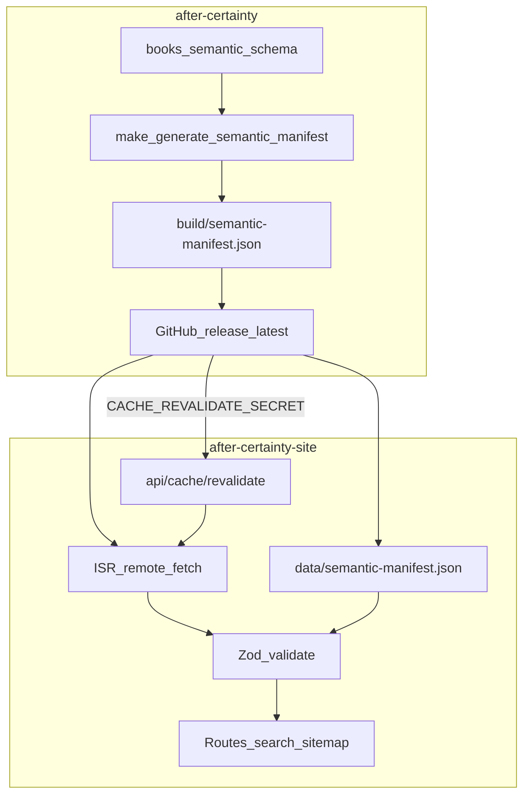
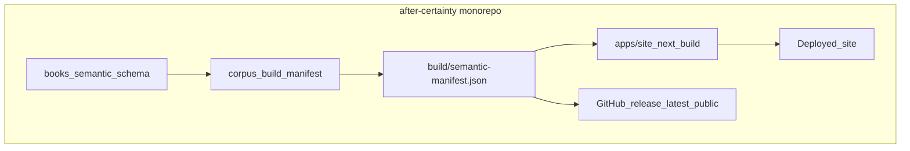

# Monorepo migration plan: after-certainty + after-certainty-site

**Status:** Phases 0–5 complete. Phase 6 in progress ([`docs/migrations/monorepo-phase-6/`](../migrations/monorepo-phase-6/)).  
**Date:** 2026-07-23  
**Surviving repository (recommended):** [`ksteffe/after-certainty`](https://github.com/ksteffe/after-certainty)  
**Site repository (to import, then archive):** [`ksteffe/after-certainty-site`](https://github.com/ksteffe/after-certainty-site)

**Document legend**

| Label | Meaning |
|-------|---------|
| **Fact** | Observed in the repositories, workflows, or public GitHub metadata at planning time |
| **Recommendation** | Proposed approach grounded in those facts |
| **Unresolved** | Cannot be confirmed from the repositories alone (dashboard, DNS, org policy, etc.) |

---

## 1. Executive summary

**Recommendation:** Combine the two repositories into one monorepo with **after-certainty as the survivor**, the public Next.js site at **`apps/site/`**, and the corpus (**`books/`**, **`semantic/`**, **`schema/`**, **`tools/`**, **`scripts/`**, **`Makefile`**) remaining at the **repository root**.

Use **npm workspaces** plus a **thin Turborepo** layer for the Node task graph. Keep **Make + uv** as the corpus orchestrator. Do **not** move the corpus under `packages/corpus`. Do **not** rewrite the Python publishing pipeline into TypeScript. Do **not** run DOCX/PDF/EPUB/Typst inside Vercel.

**Why:** The site currently depends on a released `semantic-manifest.json` via remote fetch, ISR, cache revalidation, and a bundled fallback. That creates cross-repository release coordination, schema-compatibility risk, fallback drift, and dual-CI friction. The desired end state is:

> one repository → one commit → validated semantic data → generated semantic-manifest → site build from that local artifact → one immutable deployment

while still publishing `semantic-manifest.json` as a public release artifact for traceability and external consumers.

**Migration style:** staged, reversible, no flag day. Production continues on the current Vercel project until a monorepo preview is proven. Remote manifest loading is removed only after local-build parity is validated. The old site repository is archived only after a stability window.

**This PR:** adds only this planning document under [`docs/roadmaps/`](./). That path matches the site’s roadmap convention and the requested deliverable path; the corpus also has [`docs/planning/`](../planning/) and [`docs/migrations/`](../migrations/) for related work.

---

## 2. Current repository architecture

### 2.1 after-certainty (corpus / publishing)

**Fact — primary languages**

- Python tooling under `tools/`, `scripts/`, `tests/`
- Bash release/CI helpers under `scripts/*.sh`
- Markdown manuscripts under `books/` and `upcoming/`
- YAML semantic graph under `semantic/`
- JSON Schema under `schema/`
- Typst for poetry PDF (`books/observer-patterns/typst/`)
- No Node/`package.json` in this repository today

**Fact — Python version and package manager**

| Item | Value |
|------|--------|
| `requires-python` | `>=3.11` ([`pyproject.toml`](../../pyproject.toml)) |
| CI pin | `3.12.3` |
| Manager | **uv** (`uv.lock`, `[tool.uv] package = false`) |
| CI bootstrap | [`scripts/ci_uv_sync.sh`](../../scripts/ci_uv_sync.sh) (pinned uv `0.11.29`) |
| Fallback | [`requirements.txt`](../../requirements.txt) |
| Dependency groups | **None** today — all deps are a single flat list |

**Fact — current Python dependencies**

`jinja2`, `jsonschema`, `PyYAML`, `pytest`, `ruff`, `pre-commit`, `python-docx`, `pip-audit`.

**Fact — manuscript layout**

- Publishable books: `books/**/book.yml` + `index.md` (32 specs at planning time)
- Upcoming: `upcoming/`
- Common prose: `front-matter/`, `parts/`, `back-matter/`, `docs/`
- Fiction variant: e.g. `books/velorum/manuscript/act-*`
- Poetry/Typst: `books/observer-patterns/typst/`

**Fact — semantic-data layout**

| Path | Role |
|------|------|
| `semantic/glossary/*.yml` | Concepts |
| `semantic/patterns/*.yml` | Patterns |
| `semantic/sources/*.yml` | Sources |
| `semantic/thinkers/*.yml` | Thinkers |
| `semantic/relationships.yml` | Typed relationships |
| `semantic/questions/*.yml` | Questions |
| `semantic/situations/*.yml` | Situations |
| `semantic/trails/*.yml` | Trails |
| `semantic/shelves/*.yml` | Shelves |
| `semantic/change-events/*.yml` | Public change events |
| `semantic/search-aliases.yml` | Search aliases |
| `semantic/ontology/*.yml` | Ontology terms |
| `semantic/_drafts/` | Generated drafts (gitignored) |

**Fact — schema layout**

- Top-level: `schema/book.schema.json`, `books-manifest.schema.json`, `semantic-manifest.schema.json`, `upcoming.schema.json`
- Entity schemas: `schema/semantic/*.schema.json`
- Public contract docs: [`docs/semantic-manifest-contract.md`](../semantic-manifest-contract.md) (`schemaVersion` currently `"2.3"`)

**Fact — key Make targets**

| Area | Targets |
|------|---------|
| Lint/test | `lint`, `lint-fix`, `test`, `check` |
| Specs | `validate-book-specs`, `validate-publication-manuscript` |
| Semantic validate | `verify-semantic-yaml`, `validate-semantic-entities`, `validate-discovery-content`, `lint-semantic-graph`, `verify-semantic-ontology` |
| Manifest | `generate-semantic-manifest`, `validate-semantic-manifest`, `verify-semantic-manifest` |
| Books manifest | `generate-books-manifest`, `validate-books-manifest`, `verify-books-manifest` |
| Reports | `report-semantic-completeness`, `audit-semantic-graph`, `compare-site-discovery`, … |
| Export | `build-book`, `export-docx`, `export-kindle-epub`, `export-pdf`, `export-typst-pdf`, `export-all-docx` |

Default semantic output: `SEMANTIC_MANIFEST_OUT=build/semantic-manifest.json`.

**Fact — publishing system dependencies**

- Pandoc (DOCX/EPUB/PDF)
- librsvg / ImageMagick (diagrams)
- texlive-xetex / xelatex (Pandoc PDF)
- Typst (poetry PDF; `scripts/install_typst.sh`)
- `gh`, `jq`, `curl` for release staging

**Fact — generated artifacts and caches**

Gitignored (among others): `build/`, `.venv/`, `.pytest_cache/`, `.ruff_cache/`, `*.docx`/`*.epub`/`*.pdf` (with reference-docx exceptions), `semantic/_drafts/generated/`, portfolio-audit data manifests.

**Fact — path assumptions**

- Most tools expect `--repo .` from repository root
- Discovery hardcodes `books/` and `upcoming/` under the repo root
- Scripts resolve repo root as parent of `scripts/`
- Release URL generation assumes GitHub slug + ref `main` + tag `latest`
- [`scripts/revalidate_site_cache.sh`](../../scripts/revalidate_site_cache.sh) hardcodes `https://www.after-certainty.com/api/cache/revalidate`

**Fact — GitHub Actions (corpus)**

| Workflow | Purpose |
|----------|---------|
| `book-export-release.yml` | Validate, detect affected books, build DOCX/EPUB/PDF, publish rolling `latest`, revalidate site |
| `python-tests.yml` | Ruff, ontology verify, pytest, clean-tree, Gitleaks, pip-audit |
| `semantic-enrichment.yml` | Manual enrichment draft PR |
| `how-meaning-moves-typography.yml` | Path-filtered typography checks |
| `codeql.yml` | CodeQL |
| `scorecards.yml` | OpenSSF Scorecard |

**Fact — secrets / permissions**

- `GITHUB_TOKEN` / `GH_TOKEN` for release publish and enrichment PRs
- `CACHE_REVALIDATE_SECRET` for site revalidate (exact-URL allowlist)
- Publish jobs escalate to `contents: write`; prep jobs stay read-only
- Manifest generation must sanitize credential-bearing remotes (`sanitize_github_repo_slug`)

**Fact — release tags**

- Rolling mutable tag/release: `latest`
- Also present: `preview-observer-patterns-temp`
- Assets include per-book DOCX/EPUB/PDF/`*.manifest.json`, `books-manifest.json`, `semantic-manifest.json`, `SHA256SUMS`
- At planning time, `semantic-manifest.json` on `latest` was ~2.9MB with hundreds of download counts

**Fact — scale**

- ~906 commits on the corpus history inspected
- Working tree ~250MB; no Git LFS observed
- Open corpus issues exist (semantic/schema follow-ups); site had zero open issues at planning time

### 2.2 after-certainty-site (presentation)

**Fact — stack**

| Item | Value |
|------|--------|
| Next.js | `16.2.11` |
| React / React DOM | `19.2.7` |
| Package manager | **npm** (`package-lock.json` v3) |
| Node (CI) | `20` |
| Workspaces / Turbo | None |
| Python | Not used |

**Fact — scripts**

`dev`, `build`, `start`, `lint`, `test`, `test:e2e`, `format`, `generate:og`, `validate:fallback`, `validate:public-corpus`, Husky `prepare`.

No dedicated `typecheck` script; `next build` type-checks.

**Fact — layout assumptions**

- Single package at repo root
- TS path alias `@/*` → `./*`
- Scripts treat parent of `scripts/` as project root
- Vitest/Playwright expect cwd at site root
- Dependabot npm directory `/`

**Fact — Vercel**

- No tracked `vercel.json` or `.vercel` (`.vercel` gitignored)
- Deployment settings live in the Vercel dashboard (**Unresolved** exact install/build/root/env inventory)
- Uses `@vercel/analytics`, `@vercel/speed-insights`, `VERCEL_URL` fallbacks
- Production URL convention: `https://www.after-certainty.com` via `NEXT_PUBLIC_SITE_URL`

**Fact — CI**

Single workflow `.github/workflows/ci.yml`: `npm ci`, audit, lint, test, validate fallback/public corpus, build with `SEMANTIC_MANIFEST_OFFLINE=1`, Playwright e2e. No repository secrets referenced in the workflow file.

**Fact — scale**

- ~224 commits on `main` history
- Disk ~22MB bare / ~45MB shallow working tree
- Largest blobs: book cover/texture assets and historical `data/semantic-manifest.json` copies
- No Git LFS; no GitHub Pages; no open issues at planning time
- Many stale remote feature branches (do not bulk-import)

---

## 3. Current cross-repository data flow

**Fact**

```text
after-certainty YAML (books/, semantic/, schema/)
  → make generate-semantic-manifest
  → build/semantic-manifest.json
  → prepare_release_staging.sh + publish_latest_release.sh
  → GitHub release tag `latest` asset semantic-manifest.json
       ├─→ public artifact for external consumers / parity
       └─→ site no longer fetches this asset at runtime after Phase 6
```

**Fact — duplicated / mirrored contracts**

| Concern | Corpus | Site |
|---------|--------|------|
| Manifest JSON Schema | `schema/semantic-manifest.schema.json` | Zod in `lib/graph/schemas.ts` + types in `types/semanticGraph.ts` |
| Schema version policy | docs + generator (`2.3`) | `lib/graph/schema-version.ts` (`INTENDED_SCHEMA_VERSION = "2.3"`) |
| Discovery fixtures / parity | `docs/migrations/fixtures/site-discovery/`, `compare-site-discovery` | Site-local fixtures / tests |
| Bundled manifest | Generated locally from corpus | Installed `data/local-semantic-manifest.json`; committed `data/semantic-manifest.json` remains a non-synced fixture |
| Cache refresh | `scripts/revalidate_site_cache.sh` | `app/api/cache/revalidate/route.ts` |

**Fact — ownership boundary (already documented)**

[`docs/migrations/site-to-semantic-manifest-inventory.md`](../migrations/site-to-semantic-manifest-inventory.md): corpus owns meaning; site owns presentation. Podcast episodes and some What’s New `site_feature` rows remain site-owned for now.

---

## 4. Current deployment and release flow

**Fact — corpus release**

1. Push/PR to `main` (or `workflow_dispatch`) runs `book-export-release.yml`
2. Validate semantic YAML / book specs; detect affected books
3. Build book formats when needed (or semantic-only path)
4. Stage manifests + assets; secret-scan; publish/replace GitHub release `latest`
5. Optionally revalidate production site caches

**Fact — site deployment**

1. Vercel builds from `after-certainty-site` (dashboard config)
2. Production prefers remote `semantic-manifest.json` from corpus `latest`
3. ISR refreshes ~hourly; on-demand revalidate after corpus release
4. CI and local offline mode use bundled fallback
5. Search index is generated at runtime (`GET /api/search/index`), not as a committed static file
6. Sitemap/robots/What’s New feed derive from graph + podcast data

**Recommendation:** Keep this production path live until monorepo preview parity is proven. Do not reconnect the production domain during early phases.

---

## 5. Monorepo justification

### Benefits (material for this pair)

- Atomic corpus schema + site adapter/page changes in one commit/PR
- Deterministic site builds from the same checkout’s generated manifest
- Eliminate dual release/fallback synchronization as the steady-state model
- Shared contract tests (YAML → manifest → Zod → routes)
- Fewer cross-repository secrets (`CACHE_REVALIDATE_SECRET` for semantic becomes removable after cutover)
- Simpler preview deploys for vertical changes
- One place for Cursor rules spanning corpus and site boundaries

### Costs (real)

- Larger repository and mixed Python/Node contributor surface
- More complex CI path filters
- Vercel must understand monorepo root + optional lightweight Python
- Broader repository permissions for site deployers
- History-merge complexity (manageable: site history is ~224 commits)

### Verdict

**Recommendation: proceed with a monorepo.** The synchronization machinery is not incidental — it is the main operational tax of the current split, and the product already treats after-certainty as the authoritative corpus. Keeping separate repos with “better automation” cannot deliver one-commit vertical changes or remove dual-source drift.

---

## 6. Alternatives considered

| Option | Summary | Verdict |
|--------|---------|---------|
| **1. Keep separate + improve automation** | Stronger release hooks, stricter fallback freshness, better notifications | Reject as end state — still two sources of truth for builds |
| **2. Monorepo without Turborepo** | npm workspaces + Make + Actions path filters | Viable; weaker native task DAG / Vercel affected integration |
| **3. Monorepo with Turborepo (thin)** | Workspaces + Turbo pipelines wrapping Make for corpus tasks | **Recommended** |
| **4. Other orchestration** | Nx, Earthly, custom Make-only | Overkill or poorer Node/Vercel fit; Make already owns publishing |

**Why Turborepo adds value beyond npm workspaces and Actions**

1. Explicit `dependsOn` (`site#build` → `corpus#build-manifest` / validate)
2. Cacheable task outputs with declared `inputs`/`outputs`
3. Affected-task filtering usable by CI and Vercel
4. Room for future packages (`semantic-contract`) without inventing a second graph
5. Does **not** need to own Python publishing — wrappers call Make

**Recommendation:** adopt Turbo thinly; enable remote cache only in a later optimization phase.

---

## 7. Recommended target structure

```text
after-certainty/
├── apps/
│   └── site/                 # former after-certainty-site
├── books/                    # corpus source (unchanged location)
├── semantic/
├── schema/
├── scripts/
├── tools/
├── tests/                    # Python tests; later + integration harness
├── templates/
├── reports/                  # generated reports (mostly uncommitted)
├── build/                    # gitignored; semantic-manifest.json
├── docs/
│   ├── roadmaps/
│   │   └── monorepo-migration-plan.md
│   ├── migrations/
│   └── planning/
├── pyproject.toml            # add uv dependency groups
├── uv.lock
├── Makefile
├── package.json              # npm workspaces root
├── package-lock.json
├── turbo.json
├── .github/workflows/…
└── README.md
```

### Structure comparison

| Placement | Pros | Cons |
|-----------|------|------|
| Corpus at root + `apps/site` (**chosen**) | Minimal path churn; Make/`--repo .` keep working; clear corpus-vs-presentation boundary | Root hosts two toolchains |
| Everything under `packages/corpus` | Symmetric packages | Rewrites hundreds of path assumptions; high risk |
| Suggested `packages/corpus` + `packages/semantic-contract` immediately | Clean package graph | Premature; contract package not yet justified |

**Recommendation — boundaries to preserve**

| Concern | Location |
|---------|----------|
| Corpus source | `books/`, `semantic/`, `upcoming/`, `schema/` |
| Semantic build outputs | `build/` (gitignored) |
| Site source | `apps/site/` |
| Shared contract | Initially `schema/` + `apps/site` types/Zod; optional later `packages/semantic-contract` |
| Publishing outputs | Release assets / local `build/` / export dirs — not Vercel |
| Reports | `reports/`, per-book `semantic-reports/` |
| Temp artifacts | `build/`, `upload/`, `staging/`, `prior/`, `built/` |

**Recommendation:** do **not** create `packages/semantic-contract` in Phase 1. Add contract tests first; extract a package only if dual maintenance of JSON Schema and Zod becomes painful.

---

## 8. Workspace and task graph

**Recommendation — package manager:** **npm workspaces** (site already uses npm + lockfile). Do not switch to pnpm/Yarn in the same migration.

**Recommendation — root `package.json` (illustrative)**

- `workspaces: ["apps/*"]` (and later `packages/*` if needed)
- Scripts: `dev`, `build`, `test`, `lint`, `validate`, `corpus:manifest`, `corpus:validate` wrapping Make
- `package-lock.json` becomes the workspace lockfile derived from the site’s current lock

**Recommendation — thin corpus participation**

Represent corpus tasks as root scripts or a tiny `tools/corpus-tasks` package that only shells out:

| Turbo / npm task | Invokes | Cacheable? |
|------------------|---------|------------|
| `corpus:validate` | `make verify-semantic-ontology` (or a lighter subset for Vercel) | Yes (inputs: books/semantic/schema/tools) |
| `corpus:test` | `make test` / `make check` | Yes |
| `corpus:build-manifest` | `make generate-semantic-manifest` | Yes → `build/semantic-manifest.json` |
| `corpus:reports` | report Make targets | Yes → `reports/**` |
| `corpus:export-books` | book export Make / CI workflow | No in site pipeline; secrets; publishing deps |
| `site:lint` | `npm run lint -w apps/site` | Yes |
| `site:typecheck` | add explicit `tsc`/`next` typecheck if desired | Yes |
| `site:test` | vitest | Yes |
| `site:validate-public-corpus` | existing site script against local/build manifest | Yes |
| `site:build` | copy/link manifest + `next build` | Yes after deps |

**Recommended dependency edges**

```text
site:build
  dependsOn:
    - corpus:validate          # or lighter validate-book-specs + verify-semantic-yaml + validate-semantic-manifest
    - corpus:build-manifest
    - site:validate-public-corpus
```

**Explicit exclusion:** `corpus:export-books` and full ontology enrichment agents never run in Vercel or ordinary `site:build`.

### Task I/O sketch

| Task | Inputs | Outputs | Env / secrets | Cache | Committed? | Deployed? | Release artifact? |
|------|--------|---------|---------------|-------|------------|-----------|-------------------|
| `corpus:build-manifest` | `books/`, `semantic/`, `schema/`, `tools/`, `upcoming/` | `build/semantic-manifest.json` | `GITHUB_REPOSITORY` optional | Yes | No | Indirect (via site) | Yes (copied to GitHub release) |
| `corpus:validate` | same + tests | exit code | none | Yes | No | Gate only | No |
| `corpus:export-books` | books + export tooling | DOCX/EPUB/PDF | publishing tools; `GH_TOKEN` at publish | Possibly CI-only | No | Linked URLs on site | Yes |
| `site:build` | `apps/site/**` + local manifest | `.next/` | `NEXT_PUBLIC_*`; no publishing secrets | Yes | No | Yes | No |
| `site:validate-public-corpus` | local/fallback manifest | exit code | offline flags | Yes | No | Gate only | No |
| Search index | graph + podcast at runtime | HTTP JSON | podcast URL | Runtime CDN cache | No | Yes (endpoint) | No |

---

## 9. Python and Node integration

**Recommendation**

- Node owns `apps/site` and root workspace/Turbo
- Python owns corpus validation, manifest generation, reports, publishing
- Root scripts / Turbo tasks call `make` / `uv run` — no TS rewrite of generators
- Site package keeps `@/*` aliases relative to `apps/site` (unchanged after move if cwd is the app)
- CI jobs set `defaults.run.working-directory` per job or use `-w apps/site`
- Document dual setup in root README: `uv sync` + `npm ci`

**Recommendation — Cursor guidance**

- Keep corpus rules at `.cursor/rules/` (Python lint, no-secrets)
- Import site rules under `apps/site/.cursor/` or merge carefully
- AGENTS/README should state: corpus paths stay root; site work happens under `apps/site`

---

## 10. Lightweight semantic-build strategy

**Fact:** Import tracing of `generate_semantic_manifest.py` and its local module graph shows third-party needs of essentially **`yaml` (PyYAML)** and **`jsonschema`**, plus stdlib and `git` for `sourceCommit`. It does **not** require pandoc, Typst, or `python-docx` to generate the manifest (those are publishing concerns). Validation tools used in the ontology gate also center on PyYAML/jsonschema.

**Recommendation — uv dependency groups** (to add during implementation phases, not this PR):

| Group | Contents (illustrative) | Used by |
|-------|-------------------------|---------|
| `semantic` | PyYAML, jsonschema | Manifest generate/validate in CI + Vercel |
| `test` | pytest, ruff, pip-audit, pre-commit | CI / local |
| `publishing` | python-docx (+ system pandoc/Typst/tex) | Book export workflow only |
| `dev` | union of the above | Local full toolchain |

**Answers**

| Question | Recommendation |
|----------|----------------|
| What Python deps must Vercel have? | Lightweight `semantic` group only (+ Make + Python 3.12) |
| Can manifest gen run without system packages? | **Yes** for semantic-manifest (no pandoc/Typst) |
| Does site build need Python if CI generates first? | Not strictly — but same-checkout generation is simpler and more deterministic |
| Commit generated manifest? | **No** as production SoT |
| Pass CI artifact to Vercel? | Contingency only |
| Best balance? | **Generate inside the same checkout during site build** (local, CI, Vercel) |

**Contingency:** If Vercel Python/uv install proves unreliable, generate in GitHub Actions and feed the artifact into deploy via an explicit, documented mechanism — without making generated commits the steady state.

---

## 11. Full publishing-task separation

**Recommendation**

- Keep / refine `book-export-release.yml` as path-filtered and/or manual
- Install pandoc, texlive, Typst, ImageMagick **only** in that workflow
- Never list publishing system packages in Vercel install/build
- Never expose `GH_TOKEN` publish credentials to Vercel
- Site may **link** to GitHub release download URLs; it must not assume local `build/*.docx` exist in the deployment bundle
- Semantic-only releases (no book rebuild) remain supported

---

## 12. Git-history migration strategy

### Options compared

| Strategy | History fidelity | Rename tracking | Attribution | Complexity | Risk | Archaeology | PR continuity |
|----------|------------------|-----------------|-------------|------------|------|-------------|---------------|
| **git filter-repo → subdirectory, then merge** | High | Excellent (paths always under `apps/site`) | Preserved | Medium | Low–medium | Excellent | Site PRs stay on old repo |
| git subtree | Good | Good | Preserved | Medium | Low | Good | Same |
| Merge unrelated + move | High then one big move | Weaker blame across move | Preserved | Lower | Medium (huge move commit) | OK | Same |
| Squashed subtree | Low | N/A | Collapsed | Low | Low | Poor | Same |
| Archive without merge | N/A in survivor | N/A | Old repo only | Lowest | Low | Split brain | Same |

**Recommendation:** Use **`git filter-repo --to-subdirectory-filter apps/site`** on a clean clone of `after-certainty-site`, then merge into `after-certainty` with `--allow-unrelated-histories`. Import **`main` history only**; do not bulk-import stale `cursor/*` site branches.

**Also recommend**

| Topic | Decision |
|-------|----------|
| Surviving repo | `ksteffe/after-certainty` |
| Site history appearance | Commits show files under `apps/site/…` from the rewritten history |
| Tags | Do **not** import site tags that could collide with corpus `latest`. Document a mapping table; optionally recreate non-colliding annotated tags with `site/` prefix |
| Releases | Corpus keeps GitHub Releases. Site releases (if any) remain visible on the archived repo |
| Old branches | Leave on archived repo; port open work manually if needed |
| Issues / PRs | Site had 0 open issues at planning time. Close/port any future open PRs before archival. Corpus issues stay put. GitHub does not move issues automatically — **Unresolved** whether to use an issue-transfer tool |
| When read-only | After Phase 7 success criteria + agreed stability window |
| Archive README | Banner: “Site source now lives at `https://github.com/ksteffe/after-certainty/tree/main/apps/site`. This repository is archived.” |

---

## 13. CI architecture

### Inventory classification (current)

| Workflow | Class |
|----------|-------|
| `python-tests.yml` | Corpus validation / security |
| `book-export-release.yml` | Book publishing + manifest release + site revalidate |
| `semantic-enrichment.yml` | Corpus agent / manual |
| `how-meaning-moves-typography.yml` | Corpus path-filtered |
| `codeql.yml` / `scorecards.yml` | Security |
| Site `ci.yml` | Site lint/test/build/e2e |

### Target model

**Pull-request validation**

- Path filters / Turbo affected:
  - Corpus paths → Python lint, ontology/manifest checks
  - `apps/site` → site lint/test/e2e (offline/local manifest)
  - Schema/manifest generators → contract + site integration + full site build
- Do **not** run full book export unless publishing paths change or workflow_dispatch

**Main-branch validation**

- Corpus validate + generate manifest
- Site integration tests + build against local manifest (after Phase 3+)
- Reports optional
- Publishing release workflow remains separate/restricted

**Book-publication workflow**

- Path- or manually triggered
- Full publishing deps + secret-scanned assets
- Creates/updates release assets
- Uses restricted secrets
- Never runs on Vercel

**Semantic-manifest release**

**Recommendation:** Keep publishing `semantic-manifest.json` on the rolling `latest` release (and consider future immutable dated tags). It may remain part of the book-export/semantic-only workflow. Independence from book-format rebuilds should continue. After Phase 5, the site no longer needs the remote asset for its own build, but the public artifact remains.

**Security**

- Minimal `permissions:` per job
- Environment-scoped secrets for publish
- No publishing credentials on site/Vercel jobs
- Dependabot: configure npm at `/` and `/apps/site` as needed; keep Actions updates; add pip/uv if supported
- Retain Gitleaks / secret scanning / pip-audit / npm audit
- Path filters to avoid unnecessary privileged jobs

---

## 14. Vercel architecture

**Fact:** Exact dashboard settings are not in git (**Unresolved**). Plan assumes a standard Next.js project connected to the site repo today.

**Recommendation — monorepo project settings**

| Setting | Target |
|---------|--------|
| Git repo | `ksteffe/after-certainty` |
| Root directory | `apps/site` **or** monorepo root with explicit build command — prefer **monorepo root** if install must run uv + npm together; otherwise root directory `apps/site` with install/build that `cd` to repo root for manifest gen |
| Install | `npm ci` at workspace root; `uv sync --frozen --only-group semantic` (or equivalent) |
| Build | `npm run build` / `turbo run build --filter=site…` which generates manifest then `next build` |
| Output | Next default (`.next`) |
| Node | 20.x (≥20.9; prefer current CI-compatible 20) |
| Python | 3.12 available at build time only |
| Env | Existing `NEXT_PUBLIC_*`, podcast URLs, GA; after Phase 5 set offline/local-manifest flags; remove semantic revalidate secret when unused |
| Preview | Enabled on PRs |
| Production domain | Unchanged until Phase 5 validation |
| Ignored build step | Skip when changes cannot affect site (docs-only publishing notes, draft-only semantic drafts excluded from public manifest, etc.) — use Turbo/Vercel affected + custom ignore script that treats public corpus paths as site-affecting |

**Rebuild when these change**

- `books/`, `semantic/` (public), `schema/`, manifest generators (`tools/generate_semantic_manifest.py`, discovery helpers), `apps/site/**`, shared contract packages (if added), public assets under site

**Do not necessarily rebuild for**

- Internal docs under `docs/` that do not affect public corpus
- Publishing-only scripts when unused by manifest gen
- Generated book formats
- Unrelated reports
- Draft-only content under gitignored draft dirs

**Recommendation:** Do **not** rely on Vercel to infer Python corpus dependencies automatically. Encode them in Turbo `inputs` and/or an `ignoreCommand` that fails (triggers build) when corpus public paths change.

**Build source decision:** Generate manifest **inside the Vercel build from the same checkout** (lightweight Python). Contingency: CI artifact handoff.

### Cutover sequence

1. Create monorepo preview deployment (new Vercel project or second Git connection)
2. Keep current production on `after-certainty-site` unchanged
3. Compare route inventory and representative page output
4. Compare semantic `sourceCommit` / schemaVersion / entity counts
5. Compare search index payload shape and sitemap URLs
6. Validate production-like env vars on preview
7. Validate redirects and canonical URLs
8. Reconfigure existing Vercel project to monorepo (or promote preview project)
9. Deploy without moving the domain first if the same project can switch Git source
10. Move/confirm domain only after validation
11. Retain immediate rollback: reconnect previous Git source / redeploy prior deployment

---

## 15. Manifest-consumption migration

Staged behavior (aligned with implementation phases):

### Stage A — Monorepo with existing remote consumption

- Site lives under `apps/site`
- Runtime still fetches remote `latest` manifest
- Fallback sync and revalidate remain
- **Exit:** Site builds and previews succeed from new path

### Stage B — Generate local manifest and compare

- `corpus:build-manifest` in CI/local
- Production still remote
- Parity report: schemaVersion, sourceCommit, entity counts, smoke routes, search/sitemap hashes where practical
- **Exit:** Parity within agreed tolerances; failures block promoting local mode

### Stage C — Local manifest in preview builds

- Preview: `SEMANTIC_MANIFEST_OFFLINE=1` + build-time copy of `build/semantic-manifest.json` into the site data path (or a dedicated build path loader)
- Production: still remote
- Exercise atomic corpus+site PRs
- **Exit:** Preview parity vs production for representative changes

### Stage D — Local manifest in production

- Production build consumes local artifact
- Runtime remote fetch disabled
- Public release artifact still published
- Keep fallback file temporarily if needed for emergency offline
- **Exit:** Production `sourceCommit` matches deploying git SHA; no remote fetch in logs

### Stage E — Remove synchronization machinery

Remove after stability window:

- Runtime remote fetch for semantic manifest
- Semantic ISR revalidate interval for that fetch
- Cache-refresh target `"semantic"` (retain podcast if still needed)
- Cross-repo release notification for semantic
- Shared semantic cache-refresh secret (if unused)
- Bundled production fallback sync skill/scripts
- Staleness / remote-vs-fallback diagnostics specific to dual-source mode

Retain:

- Manifest validation, schema versioning, deterministic generation
- Public release artifacts
- Public-corpus integrity checks
- Build provenance (`sourceCommit`, build lock if useful)
- Compatibility fixtures / contract tests

---

## 16. Local development workflow

**Recommendation — common commands**

```bash
uv sync --group semantic --group test   # or full dev group
npm ci
npm run corpus:manifest                 # make generate-semantic-manifest
npm run validate                        # corpus validate + site public-corpus checks
npm run dev -w apps/site                # Next dev with local/offline manifest
npm run build                           # turbo: manifest → site build
npm test
```

**Recommendations**

| Topic | Decision |
|-------|----------|
| One command for site + manifest watch? | Nice-to-have in Phase 8; initially regenerate manifest then `next dev` |
| Auto rebuild manifest on YAML change? | Optional watcher later; not required for Phase 1 |
| Next reload on manifest change? | Works if the app reads a file that changes; may need restart depending on import style |
| venv | `.venv` via uv at repo root |
| uv required? | **Yes** for canonical installs (pip requirements remain fallback) |
| Node invokes Python? | Yes, via npm scripts → Make |
| OS differences | Document macOS/Linux first; Windows via WSL recommended for Make/pandoc |
| Site-only work | `npm ci` + existing fallback/offline mode until Phase C; after that copy a generated manifest or run semantic group only |
| Generated artifacts | Keep `build/` gitignored; stop treating committed fallback as SoT after Stage D/E |

Local workflow must **not** require publishing a GitHub release to see a corpus change on the site.

---

## 17. Contract and integration testing

**Recommendation — target pyramid**

1. YAML schema validation (existing Python)
2. Manifest generation determinism / schema validate (existing)
3. Manifest backward compatibility (site schema-version tests)
4. TypeScript/Zod parse of generated manifest
5. Site view-model normalization
6. Public route integrity / smoke e2e
7. Search-index integrity
8. Sitemap integrity
9. Chapter/semantic-role rendering
10. Work/edition resolution
11. Hidden-content exclusion
12. Deterministic build checks
13. Remote-vs-local parity during transition (Stage B–D)

**Single integration proof**

```text
authoritative YAML → generate_semantic_manifest → Zod validate → public registry/view-model → route smoke
```

**Representative fixtures** (extend existing site + corpus fixtures):

Published nonfiction, fiction (`boundary-conditions` / `velorum`), poetry (`observer-patterns`), upcoming work, companion edition, superseded edition, question, trail, shelf, chapter summary, concept role, pattern provenance, What’s New event.

---

## 18. Cache strategy after migration

| Cache | After cutover |
|-------|----------------|
| Turbo/Vercel build cache | Retain for manifest gen, validation, `next build`, tests where safe |
| Next fetch cache for remote semantic manifest | **Remove** (Stage E) |
| `revalidateTag("semantic-graph")` for manifest | **Remove** with remote fetch |
| Podcast RSS ISR/tag | **Retain** (still remote runtime data) |
| Search endpoint `s-maxage` | Retain as HTTP caching of derived runtime payload |
| Bundled fallback freshness machinery | Remove after Stage E |

**Risks**

- Caching `build/semantic-manifest.json` with incomplete Turbo `inputs` → stale pages
- Embed `sourceCommit` and/or content hash in build lock / diagnostics so deploys are auditable
- Env vars that change public URL or offline mode must bust caches (`NEXT_PUBLIC_SITE_URL`, offline flags)

---

## 19. Generated-artifact ownership

| Artifact | Generated by | Used by site | Committed | Published | Cached |
|----------|--------------|--------------|-----------|-----------|--------|
| `semantic-manifest.json` | corpus task | Yes | No (SoT); transitional fallback maybe | Yes (GitHub release) | Build cache yes |
| Search index JSON | site runtime endpoint | Yes | No | No (HTTP only) | CDN/runtime yes |
| Semantic reports | corpus | No | Possibly samples only | No | Yes |
| DOCX/PDF/EPUB | publishing workflow | Linked via release URLs | No | Yes | CI artifacts |
| Covers / OG / public images | corpus raw URLs and/or `apps/site/public` | Yes | Yes (site public assets) | Via site/GitHub raw | CDN |
| `books-manifest.json` | corpus | Indirect / legacy | No | Yes | Build/CI |
| `data/build-manifest-lock.json` | site build | Diagnostics | No (gitignored) | No | No |

**Recommendation:** Site must not link to local-only export paths that are absent after deployment; keep using GitHub release URLs for downloads.

---

## 20. Release and versioning policy

**Recommendation:** A monorepo does **not** force a single version number.

| Version axis | Policy |
|--------------|--------|
| Git tags / GitHub Releases | Corpus publishing continues (`latest` rolling; future immutable tags optional) |
| `schemaVersion` | Additive string on manifest (`2.3` today); breaking → major bump with dual-read window |
| `manifestVersion` | `1`/`2` as today (thinkers) |
| Site deployment | Vercel deployment ID + git SHA; record `sourceCommit` from manifest |
| Book edition | Remains in `book.yml` / editions collection |
| npm `apps/site` version | Independent / private `0.x` fine |
| Release notes | Publishing workflow notes for books; schema contract doc for manifest; site changelog optional |

Public artifact naming stays `semantic-manifest.json` on the release. Old release assets remain available on GitHub.

---

## 21. Security and secret migration

| Secret / permission | Action |
|---------------------|--------|
| `CACHE_REVALIDATE_SECRET` (corpus + Vercel) | Retain through Stage D for podcast/semantic; remove semantic usage in Stage E; drop secret when unused |
| `GH_TOKEN` publish | Remain on publishing workflow only — never Vercel |
| `NEXT_PUBLIC_*` | Stay on Vercel (public) |
| Podcast RSS URL | Stay on Vercel if used |
| Cross-repo notification | Remove after Stage E |
| Dependabot / Gitleaks / CodeQL / Scorecard | Extend path awareness for monorepo |
| Manifest remote sanitization | Keep forever |

**Recommendation:** No publishing secrets in Vercel. Site builds only need public config + lightweight Python install network access to package indexes (not GitHub release auth).

---

## 22. Rollback and disaster recovery

| Phase | Rollback |
|-------|----------|
| 1–2 Site import / CI | Revert merge commit; production still on old site repo |
| 3 Local generate | Disable local tasks; keep remote consumption |
| 4 Preview local | Turn preview back to remote/offline fallback |
| 5 Production local | Re-enable remote fetch + previous env; redeploy prior Vercel deployment; temporary fallback |
| 6 Sync removal | Git revert of removal PR; restore secret |
| 7 Archive | Unarchive GitHub repo; restore README; reconnect Vercel Git if needed |
| Domain | Repoint to previous Vercel project/deployment |

**Backup before Phase 5**

- Export Vercel env var list
- Screenshot/record root directory, install, build, ignore commands
- Note current production deployment URL/ID
- Confirm previous site repo deploy still possible

**Stability window:** **Unresolved** exact duration — recommend minimum **14 days** of production-on-local-manifest without incident before Stage E removals and before archival (Phase 7).

**Data at risk:** primarily configuration and deployment wiring — not corpus YAML (lives in git). Fallback/release assets remain recoverable from GitHub.

---

## 23. Migration hazards

Investigate / mitigate explicitly:

| Hazard | Notes |
|--------|-------|
| Case-sensitive paths | Linux Vercel vs macOS contributors |
| Git LFS | Not observed — re-check before history merge |
| Large generated files | Avoid committing multi-MB manifests repeatedly; history already has site fallback blobs |
| Repo size | Corpus ~250MB + site assets — acceptable; prune later if needed |
| Vercel deployment size | Keep book binaries out of site output |
| Root-relative scripts | Adjust site scripts that assume repo root = site root |
| Python CWD imports | Keep corpus at root to avoid churn |
| Node `@/*` aliases | Stay app-local under `apps/site` |
| `.env` locations | `apps/site/.env.local`; document root vs app |
| Actions working directories | Update after move |
| Release scripts assuming repo name | Still `after-certainty` — good |
| Hard-coded GitHub URLs | Site links to corpus repo remain valid; update links that pointed at `after-certainty-site` |
| Status badges / README | Update both repos |
| Issue templates / CODEOWNERS / branch protection | Manual |
| Dependabot paths | Update |
| Cursor rules | Merge carefully |
| Submodules | None observed |
| Secrets scoped to site repo | Recreate on survivor where needed |
| Vercel Git integration | Manual reconnect |
| Webhooks | Manual |
| Security scanners | Path updates |

---

## 24. Phased migration plan

### Phase 0 — Preparation

| | |
|--|--|
| **Goal** | Freeze baseline; backups; tests; decisions |
| **Preconditions** | This plan approved |
| **Changes** | Inventory Vercel/GitHub settings; expand contract/parity tests; no prod change |
| **User-visible** | None |
| **CI / Vercel** | None required |
| **Success** | Checklist complete; rollback notes written |
| **Rollback** | N/A |
| **Risks** | Incomplete inventory |
| **Effort** | Low–medium |
| **Ships independently** | Yes |
| **Manual** | Dashboard exports |
| **Prod behavior** | Unchanged |

### Phase 1 — Create monorepo structure

| | |
|--|--|
| **Goal** | Site history under `apps/site`; workspaces + thin Turbo; behavior unchanged |
| **Preconditions** | Phase 0 |
| **Changes** | filter-repo import; root `package.json` / `turbo.json`; README dual-toolchain |
| **User-visible** | None |
| **CI** | May still be incomplete |
| **Vercel** | Optional preview project only |
| **Success** | `npm ci`, site lint/test, corpus `make check` work from one clone |
| **Rollback** | Revert merge; delete preview project |
| **Risks** | Lockfile/workspace pain |
| **Effort** | Medium |
| **Ships independently** | Yes |
| **Manual** | None critical |
| **Prod behavior** | Unchanged |

### Phase 2 — Consolidate CI without changing data flow

| | |
|--|--|
| **Goal** | Path-filtered CI; site CI under `apps/site`; remote manifest still used in prod |
| **Preconditions** | Phase 1 green |
| **Changes** | Port site `ci.yml`; adjust corpus workflows’ paths if needed; Dependabot |
| **User-visible** | None |
| **Success** | PRs run appropriate checks; production still old Vercel Git source |
| **Rollback** | Restore prior workflows |
| **Risks** | Missed path filters |
| **Effort** | Medium |
| **Prod behavior** | Unchanged |

### Phase 3 — Add local manifest generation wiring

| | |
|--|--|
| **Goal** | Lightweight semantic group; Turbo task; parity reports |
| **Preconditions** | Phase 2 |
| **Changes** | `pyproject` groups; `corpus:build-manifest` in graph; Stage B parity |
| **User-visible** | None |
| **Success** | Local manifest generates without pandoc; parity report published in CI |
| **Rollback** | Ignore new tasks |
| **Risks** | Group split mistakes |
| **Effort** | Medium |
| **Prod behavior** | Unchanged (still remote) |

### Phase 4 — Preview uses local manifest

| | |
|--|--|
| **Goal** | Stage C |
| **Preconditions** | Phase 3 parity green |
| **Changes** | Preview build copies local manifest; offline mode in preview |
| **User-visible** | Preview content tracks PR corpus |
| **Success** | Atomic corpus+site PR visible on preview; route/search/sitemap checks pass |
| **Rollback** | Preview back to remote |
| **Risks** | Preview/prod drift confusion |
| **Effort** | Medium |
| **Prod behavior** | Unchanged |

### Phase 5 — Production uses local manifest

| | |
|--|--|
| **Goal** | Stage D — **first production behavior change** |
| **Preconditions** | Phase 4 stable; backups done |
| **Changes** | Vercel project → monorepo; prod build local manifest; disable runtime remote fetch |
| **User-visible** | Should be none if parity holds; fresher coupling to git SHA |
| **Success** | Prod `sourceCommit` == deploy SHA; URLs/canonicals unchanged; releases still public |
| **Rollback** | Previous Vercel deployment + remote fetch env; old site repo reconnect |
| **Risks** | Python on Vercel; missed env vars |
| **Effort** | Medium–high |
| **Manual** | Vercel Git/root/install/build/env/domain confirmation |
| **Prod behavior** | **Changes** |

### Phase 6 — Remove obsolete synchronization

| | |
|--|--|
| **Goal** | Stage E |
| **Preconditions** | Stability window after Phase 5 |
| **Changes** | Remove semantic remote fetch, ISR tag usage, semantic revalidate path, fallback sync, obsolete secrets/docs |
| **User-visible** | None expected |
| **Success** | Code search shows no semantic remote URL fetch; podcast revalidate remains if needed |
| **Rollback** | Revert removal PR |
| **Risks** | Over-deletion of podcast cache tooling |
| **Effort** | Low–medium |
| **Prod behavior** | Simplifies (no semantic ISR) |

### Phase 7 — Archive former site repository

| | |
|--|--|
| **Goal** | Read-only archive with pointer |
| **Preconditions** | Phase 6; stability window; no open site PRs |
| **Changes** | README banner; archive repo; update links/badges |
| **User-visible** | Contributors redirected |
| **Success** | Archive + clear pointer; issues/releases preserved on GitHub |
| **Rollback** | Unarchive |
| **Risks** | External links to old repo |
| **Effort** | Low |
| **Manual** | GitHub archive button; link sweeps |
| **Prod behavior** | Unchanged |

### Phase 8 — Optimize

| | |
|--|--|
| **Goal** | Remote Turbo cache, watch mode, finer affected detection, dependency-group polish |
| **Preconditions** | Phase 7 optional (can start after Phase 5) |
| **Changes** | DX/perf only |
| **Prod behavior** | Unchanged functionally |

---

## 25. Phase-by-phase acceptance criteria

| Phase | Acceptance |
|-------|------------|
| 0 | Inventories + rollback notes stored; baseline route/manifest snapshots captured |
| 1 | One clone builds corpus tools and site package; history blame works under `apps/site` |
| 2 | PR CI green with path filters; prod still on old deployment |
| 3 | `uv sync --only-group semantic` + `make generate-semantic-manifest` works; parity job exists |
| 4 | Preview deploy shows corpus PR changes without GitHub release |
| 5 | Production deploy matches local manifest `sourceCommit`; no prod remote semantic fetch; public release still updated |
| 6 | Sync machinery removed; podcast caching still works; secrets minimized |
| 7 | Site repo archived with README pointer |
| 8 | Measurable build-time or DX improvements without behavior regressions |

---

## 26. Manual migration checklist

Code alone cannot finish the migration. Track these manually:

- [ ] Export current Vercel project settings (root, install, build, output, Node, ignore command)
- [ ] Inventory all Vercel env vars (prod + preview)
- [ ] Record current production deployment ID/URL for rollback
- [ ] Confirm domain DNS / Vercel domain assignment owner steps
- [ ] Confirm deployment protection / password settings
- [ ] List GitHub secrets on **both** repos (`CACHE_REVALIDATE_SECRET`, others)
- [ ] List GitHub Environments and required reviewers
- [ ] Snapshot branch protection rules on both repos
- [ ] Inventory webhooks and GitHub App installs (Vercel, Dependabot, etc.)
- [ ] Dependabot / Renovate org settings
- [ ] OAuth / analytics (GA4 stream, Consent Mode) ownership notes
- [ ] Search Console / sitemap submission (only if domain or sitemap URL changes — should not)
- [ ] Decide stability window length (recommend ≥14 days)
- [ ] Port or close any open site PRs before archive
- [ ] Archive `after-certainty-site` and set README banner
- [ ] Update external docs/bookmarks pointing at the old repo
- [ ] Recreate any site-only secrets on the surviving repo if still required
- [ ] Verify CODEOWNERS / team access on monorepo
- [ ] Confirm publishing secrets never added to Vercel

---

## 27. File-by-file change map

High-level map for implementation PRs (not applied in this planning PR):

| Path | Change |
|------|--------|
| `apps/site/**` | Import entire site tree via history rewrite |
| `package.json`, `package-lock.json`, `turbo.json` | New workspace root |
| `pyproject.toml`, `uv.lock` | Add dependency groups |
| `Makefile` | Optional thin wrappers; keep targets |
| `.github/workflows/ci-site.yml` (name TBD) | Port from site `ci.yml` with path filters |
| `.github/workflows/python-tests.yml` | Path filters; unchanged core |
| `.github/workflows/book-export-release.yml` | Eventually drop semantic revalidate; keep release |
| `scripts/revalidate_site_cache.sh` | Narrow to podcast-only in Phase 6 |
| `apps/site/lib/graph/manifest.ts` | Local-only runtime after Phase 6 |
| `apps/site/scripts/sync-semantic-manifest.mjs` | Removed in Phase 6 |
| `apps/site/data/semantic-manifest.json` | Stop syncing in Phase 6; delete after static imports are removed |
| `apps/site/.env.example` | Document local-manifest build flags |
| `README.md` | Dual toolchain + architecture |
| `docs/semantic-manifest-contract.md` | Note same-checkout builds |
| `.gitignore` | Ensure `build/` remains ignored; site `.next` |
| `.cursor/rules/**` | Merge site rules carefully |
| `after-certainty-site` README | Archive banner (on that repo) |

---

## 28. Configuration migration map

| Config | From | To |
|--------|------|----|
| Vercel Git repo | `after-certainty-site` | `after-certainty` |
| Vercel root / build | site root `next build` | monorepo-aware install + manifest + `next build` |
| npm | site lockfile | workspace root lockfile |
| Node 20 | site CI/Vercel | unchanged |
| Python 3.12 + uv | corpus CI only | corpus CI + Vercel build (semantic group) |
| `SEMANTIC_MANIFEST_OFFLINE` | CI/dev | Preview/prod after cutover |
| `SEMANTIC_MANIFEST_URL` | prod remote | removed as site runtime config in Phase 6 |
| `CACHE_REVALIDATE_SECRET` | both repos + Vercel | podcast-only or removed |
| Dependabot npm `/` | site | workspace paths |
| Branch protection | both | survivor only after archive |

---

## 29. Risks and unresolved questions

### Largest risks

| Kind | Risk |
|------|------|
| **Technical** | Vercel build environment for uv/Python + correct Turbo inputs so corpus changes always invalidate site builds |
| **Operational** | Mis-cutover of Vercel Git/root/env leaving production on stale remote manifest or broken build |

### Unresolved (cannot settle from repos alone)

1. Exact current Vercel install/build/root/ignore settings
2. Full production env var list and which are encrypted
3. Domain DNS host and whether project switch requires DNS edits
4. Preferred production stability window length
5. Whether any private site branches/PRs need porting at cutover time
6. Org-level Dependabot/Renovate and app install policies
7. Search Console / analytics admin access holders
8. Whether immutable dated manifest release tags should be introduced with this migration or later
9. Whether podcast revalidation should remain triggered from the corpus publishing workflow after semantic revalidate is removed

---

## 30. Final decision record

### Repository structure

| Question | Decision |
|----------|----------|
| Which repository survives? | **`ksteffe/after-certainty`** |
| Where should the site live? | **`apps/site/`** |
| Should the corpus remain at repository root? | **Yes** |
| Is a separate semantic-contract package useful? | **Later, optional** — not Phase 1 |
| Where do generated manifests live? | **`build/semantic-manifest.json`** (corpus); site consumes a build-time copy/path |

### Tooling

| Question | Decision |
|----------|----------|
| Is Turborepo justified? | **Yes, thin** |
| Which package manager owns the workspace? | **npm** |
| How do Python tasks participate? | **npm/Turbo scripts invoke Make/uv** |
| Which tasks cacheable? | validate, build-manifest, site lint/test/build — **not** full publishing |
| Turbo remote cache? | **Later (Phase 8)** |

### Build behavior

| Question | Decision |
|----------|----------|
| Where is the semantic manifest generated? | Same checkout during site-oriented builds |
| Does Vercel need Python? | **Yes, lightweight semantic group only** |
| Does site build depend on manifest generation? | **Yes** (after Phase 3+) |
| How are expensive publishing tasks excluded? | Separate workflow; not in Turbo `site#build` |
| How are corpus changes detected as site-affecting? | Turbo inputs + Vercel ignoreCommand / path filters |
| Affected-project detection? | Prefer Turbo/Vercel affected **plus** explicit corpus public-path rules |

### Manifest behavior

| Question | Decision |
|----------|----------|
| When stop remote fetch? | **Phase 5 (Stage D)** |
| When remove fallback? | **Phase 6 (Stage E)** after stability window |
| Keep public release artifact? | **Yes** |
| Parity verification? | Stage B–D automated report + smoke |
| Source commit in deployment? | Manifest `sourceCommit` + Vercel git SHA must match |

### History

| Question | Decision |
|----------|----------|
| Preserve site history? | **filter-repo into `apps/site`, then merge** |
| Tags? | Avoid colliding `latest`; document/map |
| Issues/PRs? | Remain on old repo; archive after clear |
| Archive when? | **Phase 7** after stability |

### Deployment

| Question | Decision |
|----------|----------|
| Vercel migration? | Preview first; then reconnect/promote; domain last |
| Domain protection? | No DNS move until Phase 5 validation |
| Rollback deployment? | Prior Vercel deployment + old Git connection |
| Old deployment availability? | Keep through stability window |

### CI and security

| Question | Decision |
|----------|----------|
| Merged workflows? | Site CI into survivor; keep publishing separate |
| Independent? | Book export, enrichment, security scans |
| Secrets retained? | Publishing `GH_TOKEN`; podcast revalidate if needed |
| Removable? | Semantic cache-refresh cross-repo secret after Stage E |
| Publishing isolation? | Never on Vercel |

### Versioning

| Question | Decision |
|----------|----------|
| Shared release version? | **No** |
| Schema versions? | Additive `schemaVersion` policy unchanged |
| Book releases? | Existing `latest` (+ future immutable tags optional) |
| Release notes? | Per axis (books / schema / site) |

---

## 31. Definition of done

The full migration is complete when:

1. Both projects live in one repository with preserved corpus/presentation boundaries.
2. The website builds from a semantic manifest generated from the same commit.
3. A schema change and its site consumer can ship atomically.
4. Site builds do not require full book publishing.
5. Production no longer fetches the semantic manifest remotely at runtime.
6. Runtime semantic ISR for that fetch is removed.
7. Cache-refresh endpoints/secrets for semantic sync are removed (podcast may remain).
8. Bundled production fallback synchronization is removed.
9. The semantic manifest continues to be published publicly.
10. Corpus validation failures prevent site deployment.
11. Public-corpus integrity failures prevent site deployment.
12. Preview deployments support corpus-and-site changes together.
13. Vercel rebuilds when public corpus output changes.
14. Vercel can skip builds for changes proven not to affect the site.
15. Book publishing workflows remain operational and isolated.
16. Production URLs and canonical metadata remain unchanged.
17. The old site repository is archived with a clear pointer.
18. Rollback procedures have been tested.
19. Documentation describes the new workflow.
20. The previous production deployment remains recoverable during the agreed stability window.

---

## Appendix A — Current data-flow diagram



## Appendix B — Target data-flow diagram



## Appendix C — Snapshot facts at planning time

| Item | Value |
|------|--------|
| Corpus schemaVersion | `2.3` |
| Site intended schema | `2.3` |
| Fallback manifest size (site) | ~2.7 MiB raw |
| Release manifest size | ~2.9 MB |
| Site Next / React | 16.2.11 / 19.2.7 |
| Corpus Python | `>=3.11`, CI 3.12.3, uv |
| Site package manager | npm |
| Site open issues | 0 |
| Git LFS | none observed |

---

*End of planning document. Implementation must follow phases above; this file alone does not change production behavior.*
