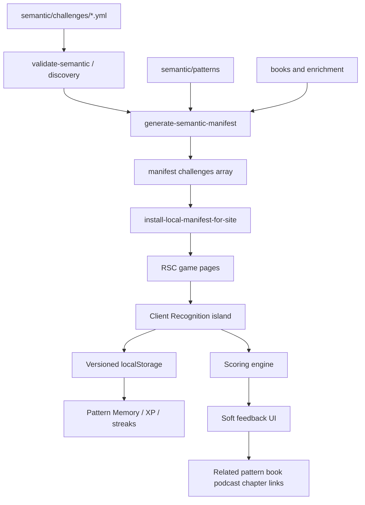

# Pattern Recognition Challenge — Implementation Roadmap

**Status:** Active specialized plan — Phase 0 complete; `GAME-001a` vertical slice in progress (schema + seed + single-challenge loop)  
**Created:** 2026-08-07  
**Revised:** 2026-08-07  
**Location:** `docs/roadmaps/pattern-recognition-challenge.md`  
**Authority:** Specialized cross-layer plan. Does **not** replace [`remaining-product-roadmap.md`](remaining-product-roadmap.md). Unfinished follow-ups that become cross-layer backlog stay linked from that master roadmap (`GAME-001`).

**Document role:** Executable implementation roadmap for a local-first Pattern Recognition Challenge game that teaches players to notice recurring patterns in human systems. Authored challenge content lives in the corpus; player progress starts in browser localStorage and may later sync via optional Supabase identity framed as “Save my progress.”

**Mockups (directional, not pixel-perfect):**

1. Initial challenge state: [Drive](https://drive.google.com/file/d/1cWXucvZwM9S9hNRIE2hL0ZSE1-zXZb8Y/view)
2. Answer / reveal state: [Drive](https://drive.google.com/file/d/1ergRRRxArQ9cbec1bmPEXUwyS2VqvXS1/view)
3. Selected-answer + explanation state: [Drive](https://drive.google.com/file/d/1Cj9J7Vka_LUciO6hOfCuDQCCIyKIpx0J/view)

> **Evidence rule:** Live routes, semantic schemas, tests, and installed manifests override planning-time snapshots. Mockup copy and invented choice labels are **not** corpus truth.

> **Tone rule:** Reflective and observational — not trivia, not arcade gamification. Soft feedback when the player notices a real secondary pattern. No harsh “Wrong.”

---

## 0. Terminology

| Term | Meaning |
|------|---------|
| **Challenge** | One authored scenario with a dominant pattern, secondaries, distractors, and feedback copy |
| **Recognition mode** | Choose the strongest pattern from four options (MVP game mode) |
| **Dominant pattern** | Strongest / intended primary answer for a challenge |
| **Secondary pattern** | Plausible, genuinely present pattern that is not strongest |
| **Distractor** | Weak or misleading choice; still receives humane feedback |
| **Insight XP** | Lightweight progression currency awarded for noticing |
| **Pattern Memory** | Per-pattern encounter / recognition / context stats (more meaningful than levels) |
| **Daily Challenge** | Deterministic five-question set for a calendar day (no backend cron) |
| **Practice** | Unlimited play after or instead of Daily |
| **Session** | One playthrough of N challenges (MVP Daily/Practice = 5) |
| **Player state** | Anonymous local progress; never required for play |

---

## 1. Executive summary

**Feasibility:** Feasible and architecture-aligned.

After Certainty already separates **authored meaning** (`semantic/`, `books/`) from **site presentation** (`apps/site/`), ships discovery collections through the semantic manifest, and persists device-local reading/path progress with SSR-safe storage helpers. There is **no** existing game, quiz, XP, or streak product. The closest content analog is [`semantic/situations/`](../../semantic/situations/) (lived scenes + `activePatterns`), which must **not** be turned into scored quizzes.

**Fit:**

| Existing pattern | Game analogue |
|------------------|---------------|
| `semantic/questions/`, `semantic/trails/` discovery YAML | `semantic/challenges/` authored challenges |
| Additive manifest collections (`schemaVersion` bumps) | `challenges[]` in manifest (target **2.5**) |
| Pattern bare slugs in YAML / `pattern-{slug}` in graph | Challenge refs to canonical pattern slugs only |
| Native reader focused chrome (omit header/footer) | Focused play shell for active sessions |
| `safe-local-storage` versioned envelopes | Versioned `ac_pattern_recognition` player state |
| Consent-gated GA4 event catalog | Optional game events (IDs/buckets only) |
| Vitest + Playwright mobile e2e | Engine unit tests + 390px play smoke |

**Product thesis:** Players learn to **recognize recurring patterns across domains**, not memorize definitions. Many scenarios contain multiple real patterns; scoring must reward noticing something true even when it is not strongest.

**MVP scope (local-first):**

- Recognition mode only
- Daily Challenge (5 questions) + Practice
- Browser localStorage (no auth, no Supabase)
- Insight XP, humane streaks, Pattern Memory
- Soft multi-pattern feedback
- Links into pattern / book / optional podcast / optional chapter
- 15–25 seed challenges across patterns and contexts

**Explicitly deferred:** Ranking / Find the Evidence / Expert modes; Supabase sync; login walls; achievement economies; competitive pressure; new npm dependencies for V1.

**Largest risks:**

1. **Mockup ≠ corpus** — Mockup choices mix book titles (“Boundary Conditions”, “Reality Pushes Back”) and non-pattern names (“Invisible Work”). Seed content must use real pattern slugs.
2. **Tone drift** — Loud trivia UX would fight the literary commons identity; keep gold accent, display/body fonts, restrained chrome.
3. **Manifest contract care** — New `challenges[]` must be additive; bump `schemaVersion` string carefully; keep consumers that ignore unknown fields working.
4. **SSR / hydration** — Progress is client-only; challenge prose must SSR for SEO/share while progress hydrates after mount.
5. **Over-gamification** — Prefer Pattern Memory over level grind; streaks must not punish life.

---

## 2. Current-state repository findings

### 2.1 Verified facts

| Area | Fact | Path / evidence |
|------|------|-----------------|
| Site framework | Next.js 16 App Router, React 19, Tailwind v4 | `apps/site/` |
| Deploy | Vercel; root dir `apps/site` | `apps/site/vercel.json` |
| Design tokens | Dark-first; gold accent; Cormorant + Source Sans | `apps/site/styles/tokens.css`, `app/globals.css` |
| Games routes | **None** | No `app/games/` |
| Patterns | 43 YAML entities; bare slugs | `semantic/patterns/*.yml` |
| Situations | 19 lived scenarios; `activePatterns` | `semantic/situations/*.yml` |
| Situation example matching mockup theme | Temporary fixes / exceptions | `semantic/situations/temporary-fixes-become-permanent.yml` |
| Pattern for mockup scenario | `exceptions-are-forever` | `semantic/patterns/exceptions-are-forever.yml` |
| Questions / trails | Discovery collections in manifest | `tools/discovery_manifest.py` |
| Manifest contract | Public API; additive only; current `schemaVersion` **2.4** | `docs/semantic-manifest-contract.md` |
| Pattern detail related content | Books, concepts, chapters, trails; **not** podcasts | `apps/site/app/explore/(browse)/patterns/[slug]/page.tsx` |
| Podcasts | Site-owned RSS/JSON; `podcast:{id}` in path stops | `apps/site/lib/podcast/`, `data/podcast-episodes.json` |
| Focused shell | Reader omits header/footer via pathname gate | `lib/reading/is-chapter-reader-path.ts`, `ReaderAwareHeader` |
| Local storage | Versioned envelopes + migration | `lib/storage/safe-local-storage.ts` |
| Path progress | Unversioned legacy key `ac_path_progress` | `lib/paths/pathProgress.ts` — **do not copy** |
| Analytics | Consent-gated GA4 + Vercel Analytics | `lib/analytics/events.ts`, `track.ts` |
| Tests | Vitest + Testing Library; Playwright e2e | `apps/site/vitest.config.ts`, `e2e/` |
| Auth / Supabase | **Absent** | No dependency; deferred ideas list accounts as postponed |
| Roadmap homes | Cross-layer → `docs/roadmaps/`; site-only → `apps/site/docs/roadmaps/` | `docs/roadmaps/README.md` |

### 2.2 Mockup → corpus mapping notes

| Mockup label | Corpus reality | Seed implication |
|--------------|----------------|------------------|
| Exceptions Are Forever | Pattern `exceptions-are-forever` | Use as dominant for workaround scenarios |
| Boundary Conditions | **Book** `boundary-conditions`, not a pattern | Do not use as a choice label unless a real pattern is intended |
| Reality Pushes Back | **Book** `reality-pushes-back`; pattern is `reality-answers-back` | Prefer real pattern slugs for choices |
| Invisible Work | No matching pattern slug found | Replace with a real distractor/secondary pattern |

### 2.3 Design principles (locked)

1. Challenges are **authored content**, never inline React strings.
2. Challenges **reference** pattern/book/chapter/podcast IDs; they do not duplicate pattern prose.
3. Play works **without** an account forever.
4. Local-first V1; Supabase later for optional sync only.
5. Mobile-first focused play; literary tokens over mockup neon.
6. Soft multi-pattern feedback; reward noticing.
7. Static/content-driven Daily selection — **no** cron or dynamic backend for rotation.
8. Prefer Pattern Memory over generic levels.
9. Reuse existing validation, storage, analytics, and test stacks — no new framework dependencies for V1.

---

## 3. Target architecture

### 3.1 End-to-end flow



### 3.2 Ownership boundary

| Kind | Store | Edited by |
|------|-------|-----------|
| Challenge content | `semantic/challenges/*.yml` | Authors |
| Pattern / book / situation metadata | Existing corpus YAML | Authors (unchanged ownership) |
| Challenge JSON Schema | `schema/semantic/challenge-entry.schema.json` | Maintainers |
| Manifest `challenges[]` | Generated | Tools only |
| Game engine / UI | `apps/site/lib/games/`, `components/games/`, `app/games/` | Site |
| Player progress V1 | `localStorage` key `ac_pattern_recognition` | Client runtime |
| Player progress future | Supabase tables (player-owned rows) | Optional signed-in sync |

**Do not** put answer keys only in client-bundled ad hoc JSON outside corpus validation. Casual client scoring is acceptable for a reflective game (not high-stakes anti-cheat); honesty comes from authored content integrity, not obfuscation.

### 3.3 Routes

| Route | Role | Chrome | Indexing |
|-------|------|--------|----------|
| `/games` | Optional thin hub | Site shell | Index |
| `/games/pattern-recognition` | Lobby (Daily / Practice / about) | Site shell | Index |
| `/games/pattern-recognition/daily` | Daily session | Focused play shell | `noindex` (ephemeral session) |
| `/games/pattern-recognition/practice` | Practice session | Focused play shell | `noindex` |
| `/games/pattern-recognition/challenge/[slug]` | Shareable single challenge | Lobby chrome or focused after Start | Index (canonical challenge URL) |

Path helpers should live in something like `apps/site/lib/games/paths.ts` (mirror `explorePaths`).

**Not under** `/explore/patterns/...` — that namespace is reserved for pattern entities.

### 3.4 UI shell

- **Lobby / shareable challenge landing:** normal `SiteShell` (header + footer).
- **Active session:** extend the reader pathname-gate pattern (`isChapterReaderPath` → e.g. `isFocusedExperiencePath` / `isPatternChallengePlayPath`) so header/footer omit during play.
- **Exit control:** mockup X is fine on the focused shell; wire to lobby (`/games/pattern-recognition`) with accessible name “Exit challenge”.
- **Visual language:** site tokens (gold accent, display/body fonts, textures). Do not clone mockup blue outlines or generic system sans as brand.
- **Desktop:** same focused column, comfortable max-width for scenario readability; choices remain full-width stacked for touch parity.

### 3.5 Component / module map

| Layer | Responsibility | Likely homes |
|-------|----------------|--------------|
| Schema | Challenge YAML contract | `schema/semantic/challenge-entry.schema.json`, `common.json` context enum |
| Corpus | One file per challenge | `semantic/challenges/*.yml` |
| Manifest build | Emit `challenges[]` | `tools/discovery_manifest.py` or `generate_semantic_manifest.py` |
| Validation | Strict refs to patterns/books/podcasts | `tools/validate_discovery_content.py`, `validate_semantic_entities.py` |
| Contract docs | Additive collection note | `docs/semantic-manifest-contract.md` (schemaVersion **2.5**) |
| Site types / Zod | Parse installed challenges | `apps/site/types/`, `lib/graph/schemas.ts`, `lib/games/` |
| Engine | Scoring, daily pick, session, XP pure functions | `apps/site/lib/games/pattern-recognition/` |
| Persistence | Versioned local store | `apps/site/lib/games/pattern-recognition/storage.ts` |
| UI | Lobby + play island states | `apps/site/components/games/pattern-recognition/` |
| Routes | App Router pages | `apps/site/app/games/...` |
| Analytics | Typed events | `lib/analytics/events.ts`, `track.ts` |
| Tests | Unit + e2e | co-located `*.test.ts(x)`, `e2e/pattern-recognition*.spec.ts` |

---

## 4. Data contracts

### 4.1 Challenge YAML schema (authored)

**Collection:** `semantic/challenges/`  
**Filename rule:** stem === `slug` (same as questions/patterns).  
**ID forms:** bare pattern/book/situation slugs in YAML; manifest may prefix `challenge-{slug}` for graph identity (decide in Phase 1 and document; prefer consistency with `question-{slug}` / `pattern-{slug}`).

```yaml
# semantic/challenges/hallway-workaround-exception.yml
slug: hallway-workaround-exception
title: The temporary fix that never left
mode: recognition
status: published          # draft | published
difficulty: introductory   # introductory | intermediate | ambiguous
context: software          # controlled vocabulary (see §4.2)
scenario: >
  A software team introduces a temporary workaround after a production outage.
  Every sprint someone proposes cleaning it up, but new priorities always win.
  Three years later, every new engineer has to learn the workaround before
  they can contribute.
dominantPattern: exceptions-are-forever
secondaryPatterns:
  - structures-outlive-reasons
  - learning-collapses
distractorPatterns:
  - dissent-is-welcomed
  - feedback-drives-change
explanation: >
  Temporary exceptions create new dependencies. As people adapt around them,
  removing the exception becomes increasingly expensive, allowing the exception
  itself to become part of the system.
choiceFeedback:
  structures-outlive-reasons: >
    You noticed Structures Outlive Reasons — that is present here, but the
    strongest pattern is Exceptions Are Forever because the temporary measure
    itself became the durable dependency.
insightXp:
  dominant: 25
  secondary: 15
  distractor: 5
relatedBooks:
  - when-others-look-to-you-v1
relatedChapterIds: []
relatedPodcastEpisodeId: null    # or podcast:some-episode-id
relatedSituation: temporary-fixes-become-permanent
tags: []
provenance: null                 # optional when historically factual
```

**Validation rules (Phase 1):**

- Exactly one `dominantPattern`.
- `secondaryPatterns` and `distractorPatterns` are disjoint from each other and from dominant.
- Recognition mode presents **four** choices = dominant + enough secondaries/distractors to fill four (authoring lint: `1 + |secondary| + |distractor| >= 4`, with deterministic choice ordering salt).
- All pattern/book/situation refs resolve under `--strict-refs`.
- `relatedPodcastEpisodeId`, when set, matches `podcast:*` known to discovery validation.
- Published challenges require non-empty `scenario`, `explanation`, and `insightXp`.

**Do not duplicate** pattern `setup` / `problem` / `forces` / `observation` on the challenge.

### 4.2 Context vocabulary (controlled)

Game-facing `context` enum (Pattern Memory chips). Overlaps manifestation domains but is broader:

`everyday`, `software`, `organizations`, `leadership`, `business`, `government`, `history`, `science`, `medicine`, `relationships`, `parenting`, `institutions`, `politics`, `family`, `ai_systems`

Store the enum in schema (`common.json` or challenge schema). One primary `context` per challenge for MVP; multi-context can wait.

### 4.3 Related content resolution

| Surface | Authored on challenge? | Runtime resolution |
|---------|------------------------|--------------------|
| Read the Pattern | Implicit (dominant) | `/explore/patterns/{slug}` |
| Also visible | `secondaryPatterns` | Pattern titles from graph |
| Related Book | Optional `relatedBooks` | Else first public book from dominant pattern `relatedBooks` |
| Related Chapter | Optional `relatedChapterIds` | Else reverse index via `publicChaptersForPattern` / chapter associations |
| Podcast Episode | Optional `relatedPodcastEpisodeId` | **No** reliable auto from patterns today — omit link if unset |
| Situation | Optional `relatedSituation` | Explore situation page if useful later |
| Concepts / thinkers | Usually omit | Optional later from pattern adjacency |

### 4.4 Local player state (V1)

**Key:** `ac_pattern_recognition`  
**Envelope:** `{ version: number, data: PatternRecognitionState }` via existing `writeVersionedLocalState` / `readVersionedLocalStateWithMigration`.

```ts
type PatternRecognitionStateV1 = {
  anonymousPlayerId: string;       // uuid
  createdAt: string;               // ISO
  updatedAt: string;
  totalInsightXp: number;          // cached; recomputeable from xpAwards
  currentStreak: number;
  longestStreak: number;
  lastPlayedDate: string | null;   // YYYY-MM-DD in GAME_TZ
  dailyCompletions: Record<string, DailyCompletion>; // date -> meta
  attemptEvents: AttemptEvent[];   // append-only, capped/pruned if needed
  xpAwards: XpAwardEvent[];        // append-only
  patternMemory: Record<string, PatternMemoryEntry>; // pattern slug -> stats
};

type AttemptEvent = {
  id: string;                      // uuid — idempotent for future sync
  challengeId: string;             // challenge slug
  sessionId: string;
  mode: "daily" | "practice" | "single";
  selectedPatternId: string;
  outcome: "dominant" | "secondary" | "distractor";
  context: string;
  answeredAt: string;              // ISO
  dailyDate?: string;              // set when mode=daily
};

type XpAwardEvent = {
  id: string;
  attemptId: string;
  amount: number;
  reason: "dominant" | "secondary" | "distractor" | "daily_bonus" | "session_complete";
  awardedAt: string;
};

type PatternMemoryEntry = {
  patternId: string;
  encountered: number;
  recognizedDominant: number;
  recognizedSecondary: number;
  contexts: string[];              // unique contexts seen
};
```

**XP recommendation:** store **events + cached total**. Cached total is for UI; recompute on migration/corruption. Maps cleanly to future `xp_award` rows.

**Corruption / private mode:** parse failures → empty fresh state (optionally keep `anonymousPlayerId` if recoverable); writes no-op on quota errors; UI still playable without persistence.

**Reset:** explicit “Reset local progress” in lobby; clears data after confirm; does not require reload tricks beyond rewriting envelope.

**Hydration:** server renders challenge content; client reads storage in `useEffect` / after mount; show neutral defaults until hydrated (no streak flash of 0→N if avoidable — mirror reader progress patterns).

### 4.5 Future Supabase schema (design only — no dependency in V1)

**Principle:** Postgres stores **player-specific state**. Challenges remain repository-authored.

| Table | Role |
|-------|------|
| `players` | `id`, optional auth user id, `anonymous_key`, timestamps |
| `challenge_attempts` | mirrors `AttemptEvent` + `player_id` |
| `xp_awards` | mirrors `XpAwardEvent` + `player_id` |
| `pattern_progress` | aggregated Pattern Memory per player/pattern |
| `daily_challenge_completions` | player + `daily_date` + session meta |
| `achievements` | optional later |

**RLS:** players read/write only their rows.  
**Auth framing:** “Save my progress” — never “Create an account to play.”  
**Merge:** upload local events by stable `id`; insert-ignore duplicates; recompute aggregates as max/union; prefer preserving XP and Pattern Memory rather than clobbering the richer side.

---

## 5. Game rules (MVP)

### 5.1 Scoring

| Outcome | Insight XP (default) | Feedback tone |
|---------|----------------------|---------------|
| Dominant | 25 | Affirm + short explanation |
| Secondary | 15 | “You noticed X… strongest is Y because…” |
| Distractor | 5 | Acknowledge attempt; explain dominant; no “Wrong.” |

Defaults live in challenge `insightXp` with engine fallbacks if omitted during draft.

Optional small **daily completion bonus** (e.g. +15 once per day when all 5 answered) — keep tiny.

### 5.2 Humane streaks

- Streak increments when the player **completes** that calendar day’s Daily Challenge (all 5) in `GAME_TZ`.
- Missing a day resets `currentStreak` to 0 on next daily completion check — **does not** remove XP, Pattern Memory, or longest streak.
- No push notifications, no guilt copy, no “you broke your streak” shame. Neutral: “Start a new streak today.”
- Practice does not break streaks; only daily completion advances them.
- V1: no streak freezes / shields (can reconsider later without schema break if events are retained).

**Timezone:** fixed IANA zone documented in code (`America/Los_Angeles` recommended as site-primary default unless product chooses otherwise). All daily keys are `YYYY-MM-DD` in that zone — not browser-local midnight ambiguity across travelers without documentation.

### 5.3 Pattern Memory

On each attempt for selected + dominant (and optionally secondaries shown):

- `encountered++` for patterns the player was asked to consider or that were revealed as dominant/secondary
- `recognizedDominant++` when outcome is dominant
- `recognizedSecondary++` when outcome is secondary
- union `contexts` with challenge `context`

UI example: “You’ve recognized Exceptions Are Forever in 5 contexts: Software · Organizations · …”

### 5.4 Daily selection (no backend)

```text
dateKey = formatDate(now, GAME_TZ)  # YYYY-MM-DD
pool = published recognition challenges sorted by slug
seed = hash("pattern-recognition-daily:" + dateKey)
order = deterministicShuffle(pool, seed)
dailySet = order.slice(0, 5)
```

- Require `pool.length >= 5` before enabling Daily (seed content gate).
- Same device/timezone day → same five challenges.
- No cron, no edge config, no CMS schedule required for V1.
- Optional later: authored `semantic/challenge-daily-schedule.yml` overrides for editorial moments.

### 5.5 Session model

| Mode | Questions | Streak | Notes |
|------|-----------|--------|-------|
| Daily Challenge | 5 | Yes, on full completion | Deterministic set for `dateKey` |
| Practice | Packs of 5 | No | Shuffle; may include already-played |
| Single / shareable | 1 | No | `/challenge/[slug]` |

“Question 1 of 5” matches Daily/Practice packs. Progress indicator updates per answer; choices remain visible after reveal (per mockup selected-answer state); scroll feedback into view after selection (`scrollIntoView`, `motion-reduce` safe).

---

## 6. Phased implementation

Each phase is independently reviewable. Mark **MVP** vs **Future**.

---

### Phase 0 — Repository / content discovery and decisions

**Objective:** Lock decisions in this document; no product code required beyond roadmap registration.  
**MVP:** Yes (docs)  
**Dependencies:** None  
**Relevant files:** this plan; `docs/roadmaps/README.md`; `docs/roadmaps/remaining-product-roadmap.md`

**Tasks:**

1. Confirm content home `semantic/challenges/` (done in this plan).
2. Confirm mockup labels are not treated as corpus truth.
3. Register specialized plan + `GAME-001` pointer.

**Acceptance criteria:**

- [x] Specialized plan exists and is indexed.
- [x] `GAME-001` appears in remaining-product roadmap (same PR as this doc).

**Tests:** N/A  
**Risks:** None  
**Open questions:** None material — defaults locked in §11.

---

### Phase 1 — Challenge content schema + seed content

**Objective:** Authored challenges are first-class, validated corpus content.  
**MVP:** Yes  
**Dependencies:** Phase 0  
**Relevant files / dirs:**

- `schema/semantic/challenge-entry.schema.json` (new)
- `schema/semantic/common.json` (context enum / shared defs as needed)
- `semantic/challenges/*.yml` (new; 15–25 seeds)
- `tools/validate_semantic_entities.py`, `tools/validate_discovery_content.py`
- `tools/discovery_manifest.py` / `tools/generate_semantic_manifest.py`
- `docs/semantic-manifest-contract.md` (additive `challenges[]`, schemaVersion **2.5**)
- `schema/semantic-manifest.schema.json`
- Site Zod/types: `apps/site/lib/graph/schemas.ts`, `types/semanticGraph.ts`
- Python tests under `tests/` for validators

**Tasks:**

1. Author JSON Schema with `additionalProperties: false`.
2. Wire directory into entity + discovery validators (slug===stem, strict pattern refs).
3. Emit `challenges[]` in manifest (prefixed IDs if that is the house style).
4. Update manifest contract + site Zod parse (ignore-unknown consumers stay safe).
5. Author **15–25** published Recognition challenges:
   - Multiple contexts
   - Mix of obvious / medium / secondary-defensible
   - At least one seed inspired by `temporary-fixes-become-permanent` / `exceptions-are-forever`
6. Add a short authoring note (can live in this plan §10 until a `contributing` guide is warranted).

**Architectural decisions:**

- Challenges are a **sibling** of situations/questions — not fields on patterns.
- Seed count targets enjoyability testing, not full pattern coverage.

**Acceptance criteria:**

- `make verify-semantic-ontology` passes with challenges present.
- Installed site manifest includes `challenges` array.
- At least 15 `status: published` recognition challenges; pool ≥ 5 for Daily.

**Tests:**

- Schema fixture valid/invalid YAML.
- Strict-ref failures for unknown pattern slugs.
- Manifest parity / schemaVersion expectations updated.

**Risks:**

- Manifest schemaVersion coordination with site parsers.
- Choice-count authoring mistakes (lint in validator).

---

### Phase 2 — Core game engine

**Objective:** Pure TypeScript engine for choice assembly, scoring, daily selection, session progression — no UI.  
**MVP:** Yes  
**Dependencies:** Phase 1 (types can stub fixtures before full manifest if needed)  
**Relevant files:**

- `apps/site/lib/games/pattern-recognition/` (`scoring.ts`, `daily.ts`, `session.ts`, `feedback.ts`, `xp.ts`, `types.ts`)
- Co-located `*.test.ts`

**Tasks:**

1. `classifyChoice(challenge, selectedPatternId) → dominant | secondary | distractor`.
2. `buildChoices(challenge, rng/salt) → PatternChoice[4]` stable for daily salt.
3. `awardForOutcome(...)` + session totals.
4. `selectDailyChallenges(pool, dateKey, tz) → Challenge[5]`.
5. Feedback copy builder (challenge `choiceFeedback` override → defaults).
6. Pattern Memory reducer from attempt events.

**Acceptance criteria:**

- Engine is framework-agnostic pure functions.
- Daily selection deterministic for fixed pool + dateKey.
- Secondary outcomes never labeled “incorrect” in returned feedback strings.

**Tests:**

- Scoring matrix; XP defaults; daily determinism; date boundary around midnight in `GAME_TZ`; memory aggregation; migration-safe reducers.

**Risks:** Timezone bugs; unstable shuffle — use a documented seeded PRNG.

---

### Phase 3 — Mobile-first game UI

**Objective:** Ship lobby + focused play UI states matching mockup UX ideas inside After Certainty visual language.  
**MVP:** Yes  
**Dependencies:** Phase 2 (can hardcode one fixture briefly for UI-only PR, but prefer Phase 1 content)  
**Relevant files:**

- `apps/site/app/games/layout.tsx`, `page.tsx`
- `apps/site/app/games/pattern-recognition/...`
- `apps/site/components/games/pattern-recognition/*`
- `apps/site/lib/reading/is-chapter-reader-path.ts` or sibling focused-path helper
- `components/layout/reader-aware-header.tsx` / footer twin
- Tokens / typography primitives (`Container`, `ButtonLink`, Phosphor icons allowlist)

**Tasks:**

1. Lobby page with game identity, Daily / Practice CTAs, short reflective lede.
2. Play shell: title, close/exit, “Daily Pattern Challenge” eyebrow, “What pattern do you see?”, scenario card, four choices, Q-of-N + XP footer.
3. Selected + reveal states: soft headline, dominant explanation, also-visible chips, related links placeholders.
4. Touch targets `min-h-11`; safe-area insets; `motion-reduce`.
5. Keyboard: choices as buttons in a radiogroup-like pattern; focus management after reveal.
6. Desktop max-width column.

**Acceptance criteria:**

- Playable on 390×844 without horizontal overflow.
- Exit returns to lobby.
- No site header/footer during active play routes.
- Light/dark tokens respected via existing theme.

**Tests:**

- Component tests for state transitions.
- Playwright smoke at mobile viewport (can deepen in Phase 7).

**Risks:** Over-carding against site design rules — scenario container is an interaction surface (allowed); avoid decorative card stacks elsewhere.

---

### Phase 4 — Local persistence, Insight XP, streaks, Pattern Memory

**Objective:** Progress survives refresh on the same browser without accounts.  
**MVP:** Yes  
**Dependencies:** Phases 2–3  
**Relevant files:**

- `apps/site/lib/games/pattern-recognition/storage.ts`
- `apps/site/lib/storage/safe-local-storage.ts` (reuse)
- Lobby UI for streak / XP / reset

**Tasks:**

1. Implement versioned store v1 + safe parse.
2. Create `anonymousPlayerId` on first use.
3. Append attempt + XP events; update caches.
4. Streak update on daily completion only.
5. Pattern Memory panel on reveal.
6. Reset progress control with confirm.
7. Document migration function stub for v1→v2.

**Acceptance criteria:**

- Refresh preserves XP/streak/memory when storage available.
- Private mode / blocked storage: game still playable; persistence best-effort.
- Corrupted JSON recovers to empty state without crashing.
- No PII in storage.

**Tests:**

- Storage unit tests (migration, corruption, award idempotency by event id).
- Streak date-boundary tests.

**Risks:** Hydration mismatch — never SSR-read localStorage.

---

### Phase 5 — Daily Challenge + Practice session modes

**Objective:** Full five-question Daily and Practice loops.  
**MVP:** Yes  
**Dependencies:** Phases 2–4  
**Relevant files:** session routes under `app/games/pattern-recognition/daily|practice`

**Tasks:**

1. Wire daily selector to published pool.
2. Session state machine: index, answers, completion summary.
3. Prevent double daily XP bonus; allow replaying daily for practice without re-awarding completion bonus.
4. Lobby shows “Daily completed” vs “Continue Practice”.
5. Transition between questions (reduced motion safe).

**Acceptance criteria:**

- Same `dateKey` yields same five challenge slugs.
- Completing daily increments streak once.
- Practice available anytime.

**Tests:**

- Daily determinism integration test with fixture pool.
- Completion bonus idempotency.

**Risks:** Pool smaller than 5 in early drafts — gate Daily CTA.

---

### Phase 6 — Corpus integration and related-content links

**Objective:** Reveal state is a doorway into the existing corpus.  
**MVP:** Yes  
**Dependencies:** Phases 1, 3  
**Relevant files:**

- `lib/games/pattern-recognition/related-content.ts`
- Reuse `relatedContentForPattern`, `publicChaptersForPattern`, podcast loaders
- `TrackedLink` / analytics wrappers

**Tasks:**

1. Resolve Read the Pattern (required).
2. Resolve Related Book (override or pattern fallback).
3. Resolve Podcast only when authored.
4. Optional chapter link when resolvable.
5. Secondary pattern chips link to pattern pages.
6. Ensure SSR pages pass hrefs; client does not invent slugs.

**Acceptance criteria:**

- Dominant pattern link works for every seed challenge.
- No broken links in published seed set (CI or unit assert against graph).
- Podcast button hidden when unset.

**Tests:**

- Resolver unit tests with manifest fixtures.
- E2E click-through to pattern page from reveal.

**Risks:** Over-authoring related links — prefer auto where reliable.

---

### Phase 7 — Accessibility, testing, analytics, polish

**Objective:** Production-ready MVP quality bar.  
**MVP:** Yes  
**Dependencies:** Phases 3–6  
**Relevant files:** e2e specs; `lib/analytics/events.ts`; sitemap/robots/metadata

**Tasks:**

1. a11y: labels, focus, live regions for feedback, contrast, reduced motion.
2. Playwright: start → answer secondary → soft feedback → related pattern → exit; daily completion path.
3. Analytics (optional, non-blocking): `game_started`, `challenge_answered`, `challenge_completed`, `related_content_opened`, `session_completed` — IDs/buckets only; consent-gated.
4. SEO: lobby + challenge `[slug]` metadata via `createPageMetadata`; sitemap entries for indexable routes; `noindex` on session routes.
5. Empty/error states: draft challenges not listed; missing slug 404.
6. Polish copy pass for reflective tone.

**Acceptance criteria:**

- `npm test` and targeted e2e pass in CI.
- No analytics event includes scenario text or pattern titles as PII-like payloads (IDs only).
- Lighthouse/a11y smoke equivalent to reader baseline expectations.

**Tests:** listed above  
**Risks:** Analytics scope creep — keep optional.

---

### Phase 8 — Future Supabase / account sync

**Objective:** Design + eventual implementation of optional cross-device progress.  
**MVP:** No — Future  
**Dependencies:** Stable V1 event model (Phases 4–5)

**Tasks (when triggered):**

1. Add Supabase as explicit product decision (not drive-by).
2. Create tables in §4.5 with RLS.
3. “Save my progress” auth (provider TBD) — play remains anonymous-capable.
4. Merge algorithm: idempotent event upload; aggregate recompute; conflict policy documented.
5. Dual-read: signed-in prefers remote with local offline buffer.
6. Privacy policy update.

**Acceptance criteria:**

- Unsigned play still works end-to-end.
- Merge never deletes Pattern Memory without user intent.
- No challenge content moved into Postgres.

**Tests:** merge fixtures; RLS policies; local→remote roundtrip.  
**Risks:** Auth scope creep into “required account”; avoid.

---

### Phase 9 — Future advanced game modes

**Objective:** Deeper modes once Recognition MVP proves enjoyable.  
**MVP:** No — Future

| Mode | Idea | Notes |
|------|------|-------|
| Ranking | Order patterns by relevance | Needs richer authoring (ordered keys) |
| Find the Evidence | Pick the clue that reveals the pattern | Needs clue spans / passage anchors |
| Expert | Ambiguous multi-defensible cases | Reuse `difficulty: ambiguous` + softer scoring |
| Adaptive difficulty | Prefer unseen contexts / miss patterns | Uses Pattern Memory |

**Acceptance criteria:** Each mode gets its own mini-schema fields and seed set; Recognition remains default Daily mode.  
**Risks:** Content authoring cost — do not expand modes before seed Recognition quality is good.

---

## 7. Seed content plan

**Count:** 15–25 published Recognition challenges for MVP.

**Spread goals:**

- ≥ 8 distinct dominant patterns
- ≥ 6 distinct `context` values
- ≥ 5 challenges where a secondary is genuinely defensible
- ≥ 5 “obvious/easy” for onboarding confidence
- ≥ 1 clearly tied to `exceptions-are-forever` / temporary-fix situations

**Do not** attempt to cover all 43 patterns in V1.

**Authoring workflow:**

1. Add `semantic/challenges/<slug>.yml`
2. Run `make verify-semantic-ontology` (or narrower validate target once wired)
3. Regenerate/install manifest for local site
4. Play in Practice mode
5. PR with content-only diff when possible

Optional later tooling: duplicate-scenario detector; coverage report (patterns lacking challenges).

---

## 8. Analytics (optional, non-blocking)

Extend [`apps/site/lib/analytics/events.ts`](../../apps/site/lib/analytics/events.ts) with privacy-safe params:

| Event | Params (IDs/buckets only) |
|-------|---------------------------|
| `game_started` | `game_id`, `mode` |
| `challenge_answered` | `challenge_id`, `outcome`, `mode` |
| `challenge_completed` | `challenge_id`, `outcome` |
| `related_content_opened` | `challenge_id`, `content_type`, `item_id` |
| `session_completed` | `mode`, `question_count_bucket`, `dominant_count_bucket` |

No scenario text, no raw feedback strings, no user email.

---

## 9. Testing matrix

| Concern | Tool | Phase |
|---------|------|-------|
| Schema / refs | Python pytest + make verify | 1 |
| Scoring / XP / streaks / daily | Vitest | 2, 4, 5 |
| Storage migration / corruption | Vitest | 4 |
| UI state transitions | Vitest + Testing Library | 3 |
| Mobile play smoke | Playwright 390×844 | 3, 7 |
| a11y reader-like checks | Playwright | 7 |
| Related corpus navigation | Playwright / unit resolver | 6 |
| Local→Supabase merge | Vitest fixtures | 8 (future) |

Do **not** introduce Jest, Cypress, or a new a11y stack.

---

## 10. Content authoring checklist (MVP)

When adding a challenge:

1. Real pattern slugs only for all choices.
2. Scenario is concrete and domain-labeled via `context`.
3. Dominant is clearly strongest; secondaries are honestly present.
4. Distractors are plausible but weak — not joke nonsense.
5. Explanation teaches recognition, not definition memorization.
6. Soft `choiceFeedback` for at least the best secondary when ambiguity is intentional.
7. Prefer auto book links; add podcast only when a real episode fits.
8. `status: draft` until played once by an editor.

---

## 11. Architecture Decisions (answers)

1. **Where should authored challenges live?**  
   `semantic/challenges/*.yml`, validated and emitted into the semantic manifest as additive `challenges[]`.

2. **What existing pattern/corpus metadata can they reference?**  
   Pattern slugs (required), book slugs, chapter IDs, situation slugs, optional `podcast:{id}`; titles/summaries/links resolved at runtime from the graph.

3. **What should the challenge schema be?**  
   See §4.1 — Recognition-first fields: scenario, dominant/secondary/distractor patterns, explanation, optional per-choice feedback, Insight XP, context, difficulty, status, optional related overrides.

4. **What should live in localStorage?**  
   Versioned player state: anonymous id, attempt events, XP awards, cached totals, streaks, daily completions, Pattern Memory (§4.4). Not challenge content.

5. **How should local state be versioned?**  
   `{ version, data }` envelopes via `safe-local-storage`, with `readVersionedLocalStateWithMigration` for upgrades and corruption fallbacks.

6. **How should Insight XP be calculated?**  
   Per-outcome awards (dominant/secondary/distractor) from challenge config + small optional daily completion bonus; persist award events **and** cached total.

7. **How should streaks work without being punitive?**  
   Increment only on full Daily completion; missing a day resets current streak only; never claw back XP or Pattern Memory; no shame copy.

8. **How should Pattern Memory be calculated?**  
   Aggregates from attempts: encountered, recognized as dominant/secondary, unique contexts — displayed per pattern, not as a global level.

9. **How should Daily Challenge selection work without a backend?**  
   Deterministic seeded shuffle of published Recognition challenges by `YYYY-MM-DD` in a fixed IANA timezone; first five form the daily set.

10. **What should a five-question game session mean?**  
    Daily and Practice are packs of five Recognition challenges; shareable single-challenge routes are one question.

11. **Which features belong in MVP?**  
    Recognition, Daily + Practice, local persistence, Insight XP, humane streaks, Pattern Memory, soft feedback, corpus links, 15–25 seeds, a11y/tests, optional analytics.

12. **Which features should explicitly wait?**  
    Ranking / Find the Evidence / Expert modes; Supabase/auth sync; achievements economies; adaptive difficulty; competitive features; streak freezes; CMS/cron daily schedules.

13. **What existing site components/layouts can be reused?**  
    Focused pathname-gate shell (reader precedent), `SiteShell` for lobby, design tokens/typography, `Container`/`ButtonLink`, Phosphor allowlist icons, `TrackedLink`, related-content resolvers, `safe-local-storage`, analytics `trackEvent`, `createPageMetadata`.

14. **What will eventually move into Supabase?**  
    Player-owned attempts, XP awards, Pattern Memory aggregates, daily completions, optional achievements — not challenge authoring.

15. **What should remain repository-authored even after Supabase?**  
    Challenges, patterns, books, situations, podcast references as content IDs, explanations, choice feedback, XP defaults.

16. **How would anonymous local progress merge into a signed-in Supabase player?**  
    “Save my progress” uploads idempotent event IDs; insert-ignore duplicates; recompute aggregates as union/max; keep anonymous play working offline.

17. **Does the game require any new dependencies for V1?**  
    **No.** Reuse Zod, Vitest, Playwright, existing UI/storage/analytics. Supabase client and auth SDKs only in Phase 8.

18. **What is the smallest implementation that would let us determine whether this game is actually enjoyable?**  
    One published challenge → shareable challenge page → Recognition client island (scenario, four choices, soft reveal, pattern link) → persist one attempt + Insight XP in versioned localStorage. If that loop feels reflective and sticky, proceed to Daily packs and Pattern Memory.

---

## 12. Recommended implementation order

1. Phase 1 schema + 3–5 draft challenges (enough to play).  
2. **First vertical slice (ship/learn):** Phase 2 scoring + Phase 3 single-challenge UI + Phase 4 minimal persistence (attempt + XP only).  
3. Expand seeds to 15–25; finish Pattern Memory + streaks.  
4. Phase 5 Daily + Practice.  
5. Phase 6 corpus links polish.  
6. Phase 7 a11y, e2e, analytics, SEO.  
7. Pause for enjoyability review before Phase 8–9.

### First small vertical slice (build next)

**Slice name:** `GAME-001a` — Single Recognition challenge loop  

**Includes:**

- Minimal schema + 1–3 published YAML challenges (can land with Phase 1 subset)
- `/games/pattern-recognition/challenge/[slug]` RSC page
- Client island: choices → soft feedback → “Read the Pattern”
- `ac_pattern_recognition` v1 storing anonymous id + attempts + totalInsightXp

**Excludes:** Daily rotation, streak UI, Pattern Memory panel, Practice packs, analytics, Supabase.

**Exit criterion:** An editor can play one challenge on a phone, refresh, and still see their Insight XP total.

---

## 13. Completion checklist (plan hygiene)

- [x] Specialized cross-layer plan authored
- [x] Indexed in `docs/roadmaps/README.md`
- [x] `GAME-001` pointer in `remaining-product-roadmap.md`
- [ ] Implementation PRs link back here per phase
- [ ] Update this status header as phases ship

---

## 14. Non-goals

- Login required to play
- Moving challenge content into a database
- Turning `semantic/questions` into quizzes (editorial contract forbids)
- Embedding challenges into `semantic/patterns/*.yml`
- Manipulative retention loops, loot, leaderboards
- Pixel-perfect reproduction of Drive mockups
- New design system or component library for the game
