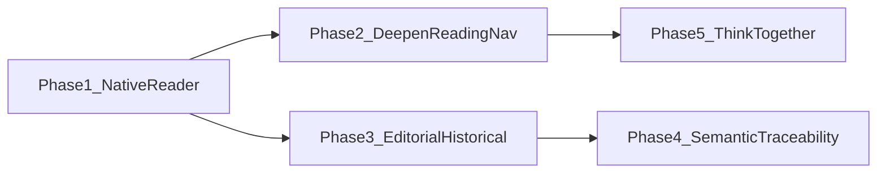
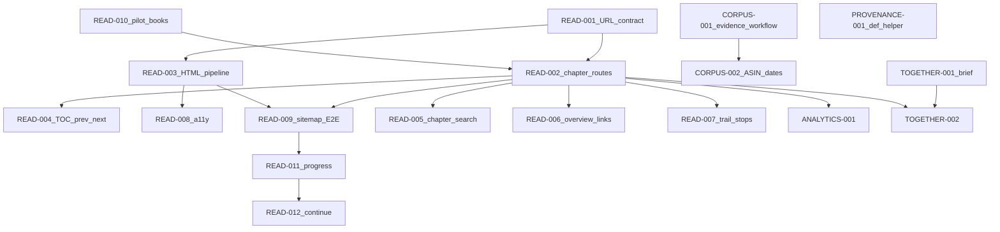

# Remaining After Certainty product and corpus roadmap

**Status:** Active — authoritative for *remaining* cross-layer work  
**Created:** 2026-07-24  
**Surviving repository:** [`ksteffe/after-certainty`](https://github.com/ksteffe/after-certainty)  
**Former site repository (archived):** [`ksteffe/after-certainty-site`](https://github.com/ksteffe/after-certainty-site)

**Scope of this document:** Remaining product, corpus, editorial, and operations work that is **not** already adequately documented elsewhere, and that is **not** already complete in the monorepo. Specialized plans remain authoritative for their topics; this roadmap links to them instead of copying them.

**Out of scope for this document’s creation:** Implementing features, changing production code, editing semantic data, adding dependencies, altering CI, or changing deployment configuration.

**Product stance (default):** Phase 1 is **Read After Certainty (Native Reader V1)**. **Think Together** is Phase 5 — research and lightweight contribution design first. Neither V1 assumes accounts, cloud sync, or a runtime database.

---

## 1. Purpose

This document gives a reliable backlog that can later be broken into individual Cursor or agent implementation tasks.

It exists because:

- Discovery and catalog orientation are largely shipped.
- The corpus contract (manifest schemaVersion **2.3**) is established.
- The monorepo and same-checkout site build are complete.
- The largest remaining *product* gap is on-site reading (chapter routes and manuscript rendering).
- Enrichment, publication dates, and semantic traceability still have report-backed gaps that should not be confused with “rebuild discovery.”
- Think Together is present only as marketing language — it needs a brief before implementation.

**Classification used while auditing candidates**

| Classification | Meaning |
|----------------|---------|
| complete | Done in code/data/docs with evidence |
| implemented but not documented | Shipped; docs lag |
| partially implemented | Real surface exists; distinct outcome remains |
| documented but not implemented | Plan/spec exists; code absent |
| documented and partially implemented | Plan exists; only some outcomes landed |
| not documented | Real remaining work with no adequate plan |
| obsolete | Superseded (often by monorepo migration) |
| requires human editorial input | Agents cannot finish without Kevin |
| requires external records or configuration | Outside the repository |

Only **genuinely remaining** work appears in active phases below.

---

## 2. Current state

Grounded in repository evidence as of 2026-07-24 (planning inspection). Live production parity was **not** treated as authoritative over repository state.

### 2.1 Monorepo and deployment

| Fact | Evidence |
|------|----------|
| Monorepo migration Phases 0–8 complete | [`docs/roadmaps/monorepo-migration-plan.md`](monorepo-migration-plan.md); [`docs/migrations/monorepo-phase-0/`](../migrations/monorepo-phase-0/) … [`phase-8/`](../migrations/monorepo-phase-8/) |
| Site lives at `apps/site/` | Repo layout; root [`README.md`](../../README.md) |
| Same-checkout manifest → install → site build | [`scripts/vercel_build.sh`](../../scripts/vercel_build.sh); `npm run site:build:local` / Turbo pipeline |
| Runtime remote manifest fetch removed | Phase 6; local/offline load under `apps/site/lib/graph/` |
| Public `semantic-manifest.json` release asset retained for external consumers | Contract + Phase 5/6 notes |
| Cover derivative pipeline + validate gate | [`docs/book-cover-assets.md`](../book-cover-assets.md); build validates installed covers |
| Optional Turbo remote cache | Documented in Phase 8 — **not** required remaining product work |

### 2.2 Corpus contract

| Fact | Evidence |
|------|----------|
| Manifest schemaVersion **2.3** | [`docs/semantic-manifest-contract.md`](../semantic-manifest-contract.md); [`schema/semantic-manifest.schema.json`](../../schema/semantic-manifest.schema.json) |
| Work/edition identity, public status, content type, literary form | `book.yml` + book/manifest schemas |
| Parts/chapters with stable IDs and reserved `routeKey` | [`docs/semantic-chapter-identity.md`](../semantic-chapter-identity.md); `ManifestChapter` in `apps/site/types/semanticGraph.ts` |
| Chapter enrichment YAML (summaries, questions, aliases, roles) | [`schema/semantic/chapter-enrichment.schema.json`](../../schema/semantic/chapter-enrichment.schema.json) |
| Overview metadata, concept/pattern roles, grounding, relationship provenance | Schema 2.3; book overview schemas on site |
| Change events | `semantic/change-events/*.yml` + change-event schema |
| Search aliases | Book-local + `semantic/search-aliases.yml` |

YAML remains canonical; the generated manifest is the public additive API.

### 2.3 Discovery phase status

**Shipped** (routes, view-models, E2E, and/or contributing guides present):

| Surface | Primary paths |
|---------|----------------|
| Global Search | `/search`; `apps/site/lib/search/*`; `e2e/search.spec.ts` |
| Start with a Question | `/questions`, `/questions/[slug]` |
| Curated trails | `/trails`, `/trails/[slug]` |
| Book shelves + catalog filters | `/explore/books`; catalog URL state |
| Book overview pages | `/explore/books/[slug]`; overview layout when `overview` present |
| What’s New + RSS | `/whats-new`; `/whats-new/feed.xml` |
| Start Here | `/start` |
| Concepts / Patterns / Situations / Thinkers / Sources | `/explore/{kind}` and detail routes |

Site roadmap headers that still say “planning only” for search are **stale**; implementation is live. Prefer code + E2E over those headers.

### 2.4 Current reading capabilities

| Capability | Status | Evidence |
|------------|--------|----------|
| Chapter metadata + Inside this book maps | **Present** (orientation only) | `book-inside-this-book.tsx`; `book-chapter-view-model.ts` sets `publicUrl` undefined |
| On-site chapter routes | **Absent** | No `app/**/chapters/**`; registry comment “until chapter routes ship” |
| Full manuscript HTML rendering | **Absent** | Site does not transform manuscripts; downloads via export links |
| Footnotes / section anchors in reader | **Absent** | Corpus markdown only |
| Chapter prev/next + reading TOC | **Absent** as reader chrome | Adjacent nav exists for *explore entities*, not chapters |
| Path/trail local progress | **Present** | `lib/paths/pathProgress.ts` — questions/trails only |
| Bookmarks, text-size, reading themes, offline reading | **Absent** | Global site theme ≠ reader theme; no PWA reader |

Public corpus validation requires public chapters to be search- and sitemap-eligible with matching index/sitemap membership (READ-005 / READ-009).

### 2.5 Semantic enrichment state

From [`reports/semantic-enrichment-remaining-gaps.md`](../../reports/semantic-enrichment-remaining-gaps.md) and related audits (2026-07-23 snapshots):

| Area | State |
|------|--------|
| Priority books 1–5 chapter enrichment | **Complete** (73 reading units) |
| Priority books 6–9 + observer-patterns poems | **Remaining** (editorial) |
| Publication dates | **6 books dated**; most unknown; Amazon ASIN confirmation pending for two authority titles |
| Change events | Sparse — only where real publication evidence exists |
| Thinker↔concept coverage | Large empty-concept set in `reports/thinker-concept-audit.md` — data quality, not a product rebuild |
| Graph audit | 0 errors / 74 warnings — do not promote every warning to a roadmap feature |
| Bibliography ↔ semantic drift | Clean (0 missing/stale) in committed drift report |

### 2.6 Participation and Think Together

Marketing and collaborator copy invite reflection and contribution. There is **no** Think Together product plan, schema, contribution workflow, annotation system, or classroom path implementation.

### 2.7 Analytics

Consent-gated GA4 events exist for search, questions, catalog, downloads, and related discovery (`apps/site/lib/analytics/events.ts`), plus Vercel Analytics / Speed Insights. **No** chapter-reader funnel events yet (expected after routes exist).

---

## 3. Existing planning-document inventory

High-signal documents only. Per-book editorial plans under `books/*/docs/` and `docs/rewrite-plans/` are **not** product roadmaps; link [`upcoming/docs/portfolio-status.md`](../../upcoming/docs/portfolio-status.md) for live upcoming editorial status.

| Document | Topic | Status | Still authoritative? | Relationship to this roadmap |
|----------|-------|--------|----------------------|------------------------------|
| [`docs/roadmaps/monorepo-migration-plan.md`](monorepo-migration-plan.md) | Monorepo architecture + Phases 0–8 | Complete | Yes (historical + rationale) | **Reference** — do not replan migration |
| [`docs/migrations/monorepo-phase-0/`](../migrations/monorepo-phase-0/) … [`phase-8/`](../migrations/monorepo-phase-8/) | Phase completion records | Complete | Yes as records | **Reference** |
| [`apps/site/docs/roadmaps/global-search-plan.md`](../../apps/site/docs/roadmaps/global-search-plan.md) | Global Search V1 | V1 shipped; header stale | Yes for design; header outdated | **Reference**; chapter search follow-on is READ-005 here |
| [`apps/site/docs/roadmaps/search-quality-workflow.md`](../../apps/site/docs/roadmaps/search-quality-workflow.md) | Ongoing alias/ranking quality | Active playbook | Yes | **Reference** — ops, not duplicate phase |
| [`apps/site/docs/roadmaps/search-embeddings-evaluation.md`](../../apps/site/docs/roadmaps/search-embeddings-evaluation.md) | When to add embeddings | Deferred / eval | Yes | **Deferred ideas** unless eval flips |
| [`apps/site/docs/roadmaps/start-with-a-question-plan.md`](../../apps/site/docs/roadmaps/start-with-a-question-plan.md) | Questions / paths | Implemented | Yes as design record | **Reference**; chapter deep links → READ-007 |
| [`apps/site/docs/roadmaps/canonical-status-whats-new-book-overviews-plan.md`](../../apps/site/docs/roadmaps/canonical-status-whats-new-book-overviews-plan.md) | Editions, What’s New, overviews | Phases A–H landed | Yes for catalog UX; mid-doc “current state” snapshots historical | **Reference**; open “in-browser reader” question → Phase 1 here |
| [`docs/semantic-manifest-contract.md`](../semantic-manifest-contract.md) | Manifest compatibility | Living | Yes | Contract SoT |
| [`docs/semantic-chapter-identity.md`](../semantic-chapter-identity.md) | Chapter IDs / enrichment | Living | Yes | Inputs for READ-* / CORPUS-* |
| [`docs/semantic-relationship-types.md`](../semantic-relationship-types.md) | Typed relationships | Living | Yes | Phase 4 reference |
| [`docs/semantic-graph-evolution.md`](../semantic-graph-evolution.md) | Enrichment architecture (#116) | Tooling active; “external site repo” framing outdated | Partial | **Reference**; Phase 4 site UX now in-monorepo |
| [`docs/semantic-thinkers-sources-migration.md`](../semantic-thinkers-sources-migration.md) | Thinkers/sources migration | Mostly shipped; some “proposed” wording stale | Partial | **Reference** |
| [`docs/authoring-discovery-metadata.md`](../authoring-discovery-metadata.md) | Authoring shelves/questions/etc. | Living | Yes | **Reference** |
| [`docs/book-cover-assets.md`](../book-cover-assets.md) | Cover pipeline | Living ops | Yes | Complete pipeline — no new phase |
| [`docs/concept-definition-helper-site-changes.md`](../concept-definition-helper-site-changes.md) | Centralize concept definition display | Documented, **not implemented** | Yes as backlog | → **PROVENANCE-001** |
| [`docs/migrations/site-to-semantic-manifest-inventory.md`](../migrations/site-to-semantic-manifest-inventory.md) | Discovery ownership boundary | Largely ported | Yes for ownership | **Reference** |
| [`docs/migrations/enrichment-content-type-corrections.md`](../migrations/enrichment-content-type-corrections.md) | Content-type fix record | Complete | Historical | Do not reopen |
| [`docs/audits/thinker-concept-site-issues.md`](../audits/thinker-concept-site-issues.md) | Thinker UX follow-ups | Active draft issues | Yes | → PROVENANCE-002–004 |
| [`reports/semantic-enrichment-remaining-gaps.md`](../../reports/semantic-enrichment-remaining-gaps.md) | Enrichment backlog | Active snapshot | Yes (regenerate for truth) | → CORPUS-* / PROVENANCE-* |
| [`reports/publication-date-audit.md`](../../reports/publication-date-audit.md) | Missing dates | Active | Yes | → CORPUS-001/002/009 |
| [`reports/thinker-concept-audit.md`](../../reports/thinker-concept-audit.md) | Empty thinker concepts | Snapshot / backlog | Yes as gap list | → PROVENANCE-005 (targeted) |
| [`reports/semantic-graph-audit.md`](../../reports/semantic-graph-audit.md) | Graph DQ warnings | Snapshot | Regenerate | Data-quality; selective only |
| [`reports/semantic-metadata-quality-audit.md`](../../reports/semantic-metadata-quality-audit.md) | Source/thinker metadata | Snapshot | Regenerate | → PROVENANCE-006 |
| [`docs/security/github-settings-checklist.md`](../security/github-settings-checklist.md) | Manual GitHub settings | Open checkboxes | Yes | → OPS-003 |
| [`docs/security/hardening-report.md`](../security/hardening-report.md) | Hardening + deferred | Complete + deferred | Yes | Ops deferred items |
| [`docs/planning/refresh-manifest-SKILL.md`](../planning/refresh-manifest-SKILL.md) | Remote refresh skill | Obsolete | No | Obsolete after Phase 6 |
| [`docs/audits/follow-up-issues-backlog.md`](../audits/follow-up-issues-backlog.md) | May 2026 follow-ups | Stale snapshot | Weak | Do not treat as live SoT |
| [`docs/portfolio-audit/`](../portfolio-audit/) | Promotion readiness suite | May 2026 snapshot | Historical | Prefer `upcoming/docs/portfolio-status.md` |
| [`apps/site/docs/contributing-*.md`](../../apps/site/docs/) | Authoring how-tos | Living | Yes | How-to, not roadmap |
| Native reader plan | — | **Not found** | — | **This document** owns Phase 1–2 |
| Think Together plan | — | **Not found** | — | **This document** owns Phase 5 research |

**Do not delete or rewrite** historical migration records. Prefer linking.

---

## 4. Completed roadmap phases

Do not reopen these as active product phases. Follow-ups appear only when a *distinct* remaining outcome exists.

| Phase | Outcome | Evidence of completion |
|-------|---------|------------------------|
| **Find Your Way Through After Certainty** | Search, questions, trails, Start Here, explore entity graph | Routes + E2E + contributing guides; questions plan marked Implemented |
| **Unify the Corpus Contract** | Manifest 2.3: chapters, overviews, roles, grounding, provenance fields | Contract + schemas + generators |
| **Monorepo migration** | Single repo; site at `apps/site/`; former site archived | Migration plan Phases 0–8 complete |
| **Same-commit site build** | Generate local manifest → install → build; remote fetch removed | `vercel_build.sh`; Phase 5–6 |
| **Cover derivative pipeline** | Deterministic WebP variants + validate gate | `docs/book-cover-assets.md`; build scripts |
| **Rich book orientation** | Canonical editions, public status, What’s New, book overviews, Inside this book maps (without chapter hrefs) | Canonical plan Phases A–H landed |
| **Priority chapter enrichment 1–5** | Full summaries for after-certainty, learning-to-see, the-game-we-think-we-saw, the-world-we-make-together, why-collaboration-is-so-hard | Enrichment gaps report “Completed in this pass” |
| **Content-type / literary-form corrections** | Recorded corrections | `enrichment-content-type-corrections.md` |

---

## 5. Active roadmap phases



| Phase | Name | Goal |
|-------|------|------|
| **1** | Read After Certainty | Public, accessible, server-rendered chapter reading with stable routes and search destinations |
| **2** | Deepen Reading and Navigation | Local progress, bookmarks, reading chrome, in-book find — after V1 |
| **3** | Complete Editorial and Historical Metadata | Publication dates, change events, remaining chapter/poem enrichment |
| **4** | Strengthen Semantic Traceability | High-value graph grounding + small site UX for thinkers/concepts |
| **5** | Think Together | Lightweight participation — design before build |

**Folded into phases (not separate near-term phases):**

- Analytics-informed refinement → ANALYTICS-001 after reader exists; discovery analytics stay in existing search-quality playbook
- Accessibility/performance hardening → READ-008 (+ Phase 2 controls); no vague “keep improving a11y” item
- Public contribution / repo transparency → OPS-* alongside Phase 5

**Chapter-level search** is part of Phase 1 (depends on live routes), not a separate phase.

---

## 6. Workstreams

### WS-READ — Native Reader V1 (Phase 1)

| Field | Content |
|-------|---------|
| **Problem** | Readers can discover and orient to books but cannot read manuscripts on-site; chapter `routeKey`s are reserved but unused; downloads are the only reading path. |
| **User value** | Continuity from discovery → chapter; shareable chapter URLs; accessible reading without leaving the site. |
| **Current state** | Chapter metadata in manifest; Inside this book lists titles/summaries without links; registry blocks chapter search/sitemap eligibility. |
| **Existing implementation** | `ManifestChapter`, `book-chapter-view-model.ts`, `lib/graph/chapters.ts`, `validate-chapters.ts`, public registry chapter records with `canonicalUrl: routeKey` but unlisted. |
| **Existing documentation** | Chapter identity doc; open question in canonical-status plan; **no** native-reader plan until this roadmap. |
| **Remaining work** | URL contract, SSR routes, manuscript HTML pipeline, TOC/prev-next, footnotes/anchors, a11y baseline, unlock search/sitemap, wire overview/search/trail destinations, pilot book set. |
| **Dependencies** | Stable chapter IDs already exist; pilot book decision (READ-010); manuscript files in `books/*/`. |
| **Corpus changes** | Usually none for V1 code path; enrichment improves snippet quality but is **not** a launch blocker for all books. |
| **Site changes** | New App Router chapter pages; markdown/HTML pipeline; registry/search/sitemap unlock; overview link wiring. |
| **Tests** | Unit tests for slug/route helpers; corpus validation updates; Playwright smoke for pilot chapters; a11y checks for reader chrome. |
| **Accessibility** | Landmarks, heading order, footnote refs/back-links, focus management, reduced motion, readable typography under zoom. |
| **Performance** | Avoid shipping entire books as one client bundle; prefer per-chapter SSR; watch HTML size for long chapters. |
| **Editorial input required** | Which books enter the first public reader cohort (READ-010). |
| **External records required** | None for V1. |
| **Risks** | Footnote/citation fidelity; poetry/fiction layout; spoiling via summaries in search; accidental indexing before ready. |
| **Out of scope** | Accounts, annotations, synced progress, offline PWA, AI summaries, full-text search of entire manuscripts in V1 (summaries + titles first). |
| **Completion criteria** | Pilot public books have SSR chapter pages; prev/next + TOC work; footnotes usable; chapters in sitemap/search only when routes live; E2E smoke green; downloads remain available. |

### WS-READ-PLUS — Reader enhancements (Phase 2)

| Field | Content |
|-------|---------|
| **Problem** | V1 reading works, but return visits and comfort controls are thin. |
| **User value** | Resume reading, bookmark places, adjust type size/theme, find within a book. |
| **Current state** | Path progress pattern exists for questions/trails only. |
| **Existing implementation** | `lib/paths/pathProgress.ts`; site `theme-provider` (global, not reader). |
| **Existing documentation** | This roadmap. |
| **Remaining work** | Local progress/bookmarks keyed by `editionId` + `chapterId`; continue-reading entry points; text-size/reading theme; TOC drawer; copy section link; optional in-book search; offline only as research spike. |
| **Dependencies** | Phase 1 routes + stable IDs. |
| **Corpus / site** | Site-only storage (localStorage); no corpus requirement. |
| **Tests** | Storage key stability tests; UI tests for controls; no cross-device sync expectations. |
| **A11y / perf** | Controls must be keyboard-accessible; theme changes respect `prefers-reduced-motion` where animated. |
| **Editorial / external** | None required. |
| **Risks** | Storage schema churn if IDs change; privacy (keep progress local). |
| **Out of scope** | Cloud sync, accounts, social annotations. |
| **Completion criteria** | Documented local APIs; continue-reading visible on Start and/or book overview for returning devices; controls persist per device. |

### WS-CORPUS — Editorial and historical metadata (Phase 3)

| Field | Content |
|-------|---------|
| **Problem** | Newest sorting, edition timelines, and What’s New history are weak without dates; several books lack chapter/poem summaries for orientation and future chapter search. |
| **User value** | Trustworthy chronology; richer Inside this book / search snippets; better trail authoring. |
| **Current state** | Six dated books; enrichment gaps report lists next batch; change events only with real evidence. |
| **Existing documentation** | Publication-date audit (evidence rules); enrichment gaps; chapter-identity; change-event schema. |
| **Remaining work** | Evidence-file workflow; ASIN confirmation; enrich books 6–9 + poems; thin relatedWorks/situations; historical What’s New where dates exist. |
| **Dependencies** | Kevin evidence for dates; fiction/poem voice rules already in chapter-identity. |
| **Corpus changes** | `book.yml` dates; `chapter-enrichment.yml`; `semantic/change-events/`; overview relatedWorks/situations. |
| **Site changes** | Mostly consume existing fields; CORPUS-009 may add events only. |
| **Tests** | Schema validation; regenerate completeness/publication audits; no Git-date inference. |
| **Editorial input required** | High — dates, substantial revisions, summaries. |
| **External records required** | Retailer/ISBN/announcement evidence as listed in audit rules. |
| **Risks** | Inventing dates; spoiling fiction; treating packaging tags as publication. |
| **Out of scope** | Auto-inferring dates from Git; requiring full enrichment before Reader V1. |
| **Completion criteria** | Unknown dates remain explicitly unknown until evidenced; next-batch enrichments land with regenerated reports showing coverage gains. |

### WS-PROVENANCE — Semantic traceability (Phase 4)

| Field | Content |
|-------|---------|
| **Problem** | Thinker pages and concept display can under-represent graph grounding; definition field selection can drift across UI surfaces. |
| **User value** | Clearer intellectual terrain; consistent concept blurbs; better SEO for thinkers with real concept links. |
| **Current state** | Grounding disclosure on concepts/patterns; relationship provenance typed but little public UI; concept helper planned but missing. |
| **Existing documentation** | `concept-definition-helper-site-changes.md`; `thinker-concept-site-issues.md`; audit reports. |
| **Remaining work** | Helper implementation; thinker coverage panel; JSON-LD; optional explore filter; **targeted** thinker↔work grounding; creatorNames normalization; selective concept/pattern provenance. |
| **Dependencies** | Do not block Reader V1. |
| **Risks** | Trying to fill all 302 empty thinker concept lists — treat as long-horizon editorial, not one task. |
| **Out of scope** | Turning every graph warning into a UI badge. |
| **Completion criteria** | Helper used on index/detail/card paths; thinker panel ships; targeted grounding batches reduce *priority* empty cases; metadata-quality warnings for creatorNames cleared. |

### WS-TOGETHER — Think Together (Phase 5)

| Field | Content |
|-------|---------|
| **Problem** | The project invites people to “think together” without a concrete lightweight participation path. |
| **User value** | Reflection, classroom/book-club use, and error reporting without requiring accounts. |
| **Current state** | Marketing copy only. |
| **Remaining work** | Product brief first; then optional reflection-prompt pilot; public feedback path; contribution docs. |
| **Dependencies** | Kevin moderation/public-response policy; preferably after Reader V1 so prompts can attach to chapters. |
| **Out of scope** | Social feed, accounts, unmoderated public annotation walls. |
| **Completion criteria** | Written brief with chosen mechanism; at least one shippable pilot path OR explicit deferral into Deferred Ideas. |

### WS-OPS — Repository transparency and external ops

| Field | Content |
|-------|---------|
| **Problem** | Contribution entry points and some GitHub settings remain incomplete for public collaborators. |
| **User value** | Clear how to report errors and propose semantic/site changes. |
| **Remaining work** | Root CONTRIBUTING + semantic guidelines; issue templates; README pointer to this roadmap; GitHub settings checklist. |
| **Completion criteria** | Docs linked from README; templates distinguish corpus vs site; checklist items intentionally done or explicitly waived. |

---

## 7. Agent-ready task candidates

**Labels:** each task has `Type` ∈ {implementation, editorial, data-backfill, audit, operations, research, mixed} and `Owner` ∈ {corpus, site, shared, manual/external}.

**Size:** XS / S / M / L / XL (relative — not calendar dates).

### Phase 1 — Read After Certainty

#### READ-001 — Chapter URL and identity contract

| Field | Value |
|-------|-------|
| **Goal** | Freeze public chapter URL shape and identity keys (`editionId`, `chapter.id`, `routeKey` / slug) before building pages. |
| **Why it matters** | Prevents broken links, search churn, and progress-key rewrites. |
| **Type / owner / size** | research + implementation / shared / S |
| **Likely files** | `docs/semantic-chapter-identity.md`; `apps/site/lib/graph/chapters.ts`; `apps/site/types/semanticGraph.ts`; possibly a short ADR section in this roadmap or chapter-identity |
| **Corpus / site scope** | Shared contract; minimal code |
| **Dependencies** | None |
| **Inputs** | Existing `routeKey` examples (tests expect `/explore/books/...`); chapter identity rules |
| **Outputs** | Written contract: URL pattern, slug derivation, 404 rules, which books are eligible |
| **Acceptance criteria** | Documented mapping from `ManifestChapter` → public path; conflicts with reserved `routeKey` resolved; no live routes required yet |
| **Tests** | Unit tests for slug helpers remain green; add contract examples if helpers change |
| **Risks** | Choosing a URL that fights existing `routeKey` already in manifests |
| **Kevin / external** | Confirm pilot URL style if aesthetic preference matters |
| **Parallel?** | Yes — foundation; blocks READ-002+ |
| **Order** | 1 |

#### READ-002 — Server-rendered chapter routes for public reading units

| Field | Value |
|-------|-------|
| **Goal** | Add App Router chapter pages that resolve public chapters by book slug + chapter slug and render SSR shells (content may land with READ-003). |
| **Why it matters** | First visible reading destination. |
| **Type / owner / size** | implementation / site / L |
| **Status** | Implemented — SSR shell live; manuscript body deferred to READ-003; overview links still off (READ-006). |
| **Likely files** | `apps/site/app/explore/(browse)/books/[slug]/chapters/[chapterSlug]/page.tsx` (or contracted path); metadata helpers; `public-registry.ts` |
| **Dependencies** | READ-001 |
| **Inputs** | Manifest chapters; `routeKey` |
| **Outputs** | Working routes for public chapters; canonical metadata; not-found for private/missing |
| **Acceptance criteria** | Hitting a contracted URL returns 200 for a known public chapter; unknown slug → notFound; no fabricated links from overview until READ-006 |
| **Tests** | Route/unit tests; optional Playwright stub |
| **Risks** | Static params explosion; draft chapters leaking |
| **Kevin / external** | No |
| **Parallel?** | Sequence after READ-001; can overlap design of READ-003 |
| **Order** | 2 |

#### READ-003 — Manuscript HTML pipeline (footnotes, section anchors)

| Field | Value |
|-------|-------|
| **Goal** | Transform chapter markdown from the corpus into safe SSR HTML with footnotes and stable section anchors. |
| **Why it matters** | Without this, routes are empty shells. |
| **Type / owner / size** | implementation / site / XL |
| **Status** | Implemented — unified remark/rehype pipeline with sanitize, footnotes, heading anchors; missing-file alert state. |
| **Likely files** | New `apps/site/lib/reading/*`; chapter page; possibly shared markdown utilities; security sanitization |
| **Corpus scope** | Read manuscript files; do not rewrite manuscripts |
| **Site scope** | Pipeline + rendering components |
| **Dependencies** | READ-001; tightly couples with READ-002 |
| **Inputs** | `sourcePath` on chapters; book roots under `books/` |
| **Outputs** | Rendered HTML; footnote component behavior; `#` anchors for headings |
| **Acceptance criteria** | Pilot chapter shows body text; footnotes navigable; headings have ids; XSS-safe sanitization; missing file → clear error state |
| **Tests** | Fixture markdown → HTML snapshots; footnote link tests; sanitizer tests |
| **Risks** | Poetry/fiction layout; Pandoc vs remark divergence from export pipeline; large HTML |
| **Kevin / external** | Judgment on acceptable fidelity vs export formats |
| **Parallel?** | Can start after READ-001 in parallel with route scaffolding |
| **Order** | 3 |

#### READ-004 — Part/chapter TOC and previous/next navigation

| Field | Value |
|-------|-------|
| **Goal** | Reading chrome: book TOC (parts/chapters) and prev/next chapter links in reading order. |
| **Why it matters** | Makes multi-chapter books navigable without returning to overview only. |
| **Type / owner / size** | implementation / site / M |
| **Status** | Implemented — in-reader TOC + prev/next; overview Inside-this-book links still READ-006. |
| **Likely files** | Chapter layout components; reuse `book-chapter-view-model` / registry maps `chapterIdsByEditionId` |
| **Dependencies** | READ-002 |
| **Acceptance criteria** | Prev/next respect edition reading order; first/last terminate cleanly; TOC lists parts/chapters with live hrefs for public units |
| **Tests** | Order edge cases (bridges, poems, single-chapter) |
| **Kevin / external** | No |
| **Parallel?** | After READ-002; parallel with READ-008 |
| **Order** | 4 |

#### READ-005 — Chapter search eligibility and index summaries

| Field | Value |
|-------|-------|
| **Goal** | Once routes exist, allow public chapters into search documents (title, summary, aliases) with `canonicalUrl` pointing at chapter pages. |
| **Why it matters** | Discovery → precise reading destination. |
| **Type / owner / size** | implementation / shared / M |
| **Status** | Implemented — lean chapter search docs; registry searchEligible/listed; book docs retain chapter text fallback; validation enforces consistency. |
| **Likely files** | `buildSearchDocuments.ts`; `public-registry.ts`; `validate-public-corpus.ts`; `chapter-eligibility.ts` |
| **Dependencies** | READ-002 (and preferably READ-003) |
| **Acceptance criteria** | Validation requires eligibility **only when** routes ship; chapter hits open chapter URLs; books still index chapter text fallback policy documented; budget alerts still respected |
| **Tests** | Search document builders; corpus validation tests updated; search E2E sample |
| **Risks** | Index size; spoiling via fiction summaries |
| **Kevin / external** | Which books’ chapters are search-visible in pilot |
| **Parallel?** | After routes; parallel with READ-006 |
| **Order** | 7 |

#### READ-006 — Wire Inside this book and entity links to chapter routes

| Field | Value |
|-------|-------|
| **Goal** | Set `publicUrl` on chapter VM; link Inside this book; deep-link from concept/pattern chapter associations where data exists. |
| **Why it matters** | Removes “orientation without destination.” |
| **Type / owner / size** | implementation / site / S |
| **Status** | Implemented — Inside this book links; concept/pattern “Appears in chapters” when associations exist. |
| **Likely files** | `book-chapter-view-model.ts`; `book-inside-this-book.tsx`; `chapter-associations.ts`; concept/pattern detail pages |
| **Dependencies** | READ-002 |
| **Acceptance criteria** | Overview chapter rows link to live routes; tests that previously asserted `publicUrl === undefined` updated; no links for non-public chapters |
| **Tests** | View-model tests; component tests |
| **Parallel?** | Yes with READ-005 |
| **Order** | 8 |

#### READ-007 — Trail and question stops targeting chapters

| Field | Value |
|-------|-------|
| **Goal** | Allow authored path stops to target chapter URLs where chapter destinations exist. |
| **Why it matters** | Questions/trails currently stop at book/entity level more often than precise chapters. |
| **Type / owner / size** | mixed / shared / M |
| **Likely files** | Trail/question schemas and site path stop resolvers; authoring docs |
| **Dependencies** | READ-002; corpus stop updates optional |
| **Acceptance criteria** | Stops with chapter targets resolve; invalid targets fail validation; at least one pilot path updated or documented as follow-on editorial |
| **Kevin / external** | Which paths to update first |
| **Parallel?** | After READ-002; editorial portion parallel |
| **Order** | 11 (after core reader) |

#### READ-008 — Reader accessibility baseline

| Field | Value |
|-------|-------|
| **Goal** | Landmarks, skip-to-content within reader, footnote accessibility, focus order, reduced-motion, zoom-friendly type. |
| **Why it matters** | Reading is an a11y-critical surface. |
| **Type / owner / size** | implementation / site / M |
| **Status** | Implemented — reader landmarks/skip, footnote id pairing fix, always-on underline, reduced-motion scroll, checklist + E2E. |
| **Likely files** | `chapter-reader-shell.tsx`; `render-manuscript-html.ts`; `globals.css`; `apps/site/docs/reader-a11y-checklist.md`; `e2e/reader-a11y.spec.ts` |
| **Dependencies** | READ-003 |
| **Acceptance criteria** | Checklist documented and covered by tests/E2E a11y assertions for reader chrome; no reliance on color alone for footnotes |
| **Parallel?** | With READ-004 |
| **Order** | 5 |

#### READ-009 — Sitemap unlock and E2E reader smoke

| Field | Value |
|-------|-------|
| **Goal** | Include public chapter URLs in sitemap when eligible; Playwright smoke for pilot book chapters. |
| **Type / owner / size** | implementation / site / M |
| **Status** | Implemented — public chapter paths in sitemap + registry; validation enforces eligibility; after-certainty reader smoke E2E. |
| **Likely files** | `app/sitemap.ts`; `public-registry.ts`; `validate-public-corpus.ts`; `e2e/reader-smoke.spec.ts` |
| **Dependencies** | READ-002, READ-003 |
| **Acceptance criteria** | Sitemap contains pilot chapter paths; validation enforces consistency; E2E covers open chapter → next → overview |
| **Order** | 6 |

#### READ-010 — Pilot rollout scope decision

| Field | Value |
|-------|-------|
| **Goal** | Kevin selects first public reader cohort (e.g. fully enriched priority books). |
| **Type / owner / size** | research / manual/external / S |
| **Dependencies** | None (can run parallel to READ-001) |
| **Acceptance criteria** | Written list of edition slugs in/out for V1; non-pilot books keep download-only reading |
| **Kevin / external** | **Required** |
| **Order** | Parallel with 1–3 |

---

### Phase 2 — Deepen reading

#### READ-011 — Local reading progress

| Field | Value |
|-------|-------|
| **Goal** | Persist last chapter (and optional scroll position) keyed by `editionId` + `chapterId` in localStorage. |
| **Type / owner / size** | implementation / site / M |
| **Dependencies** | Phase 1 complete for pilot books |
| **Acceptance criteria** | Keys stable per contract; clearing site data resets; no server sync |
| **Pattern reference** | `lib/paths/pathProgress.ts` |
| **Order** | After Phase 1 |

#### READ-012 — Continue reading entry points

| Field | Value |
|-------|-------|
| **Goal** | Surface continue-reading on `/start` and/or book overview when local progress exists. |
| **Type / owner / size** | implementation / site / S |
| **Dependencies** | READ-011 |
| **Acceptance criteria** | CTA appears only with valid progress; links to chapter route |

#### READ-013 — Local bookmarks

| Field | Value |
|-------|-------|
| **Goal** | Bookmark chapter or section anchors locally. |
| **Type / owner / size** | implementation / site / M |
| **Dependencies** | READ-002; section anchors from READ-003 |
| **Acceptance criteria** | Add/remove bookmark; list accessible from book overview or reader chrome |

#### READ-014 — Text-size and reading theme controls

| Field | Value |
|-------|-------|
| **Goal** | Reader-local type size and reading theme (distinct from global site theme if needed). |
| **Type / owner / size** | implementation / site / M |
| **Dependencies** | READ-003 |
| **Acceptance criteria** | Preference persists locally; remains readable at 200% zoom; contrast maintained |

#### READ-015 — TOC drawer and copy link to section

| Field | Value |
|-------|-------|
| **Goal** | Mobile-friendly TOC drawer; copy-to-clipboard for section URLs. |
| **Type / owner / size** | implementation / site / S |
| **Dependencies** | READ-004, READ-003 anchors |

#### READ-016 — Search within a book

| Field | Value |
|-------|-------|
| **Goal** | Find within one edition’s chapter titles/summaries (and optionally loaded chapter text with clear perf limits). |
| **Type / owner / size** | implementation / site / L |
| **Dependencies** | Phase 1 search chapter docs helpful but not strictly required |
| **Acceptance criteria** | Scoped results; no global index regression; empty states clear |

#### READ-017 — Offline reading spike (deferred default)

| Field | Value |
|-------|-------|
| **Goal** | Research-only spike: service worker feasibility for pilot chapters. |
| **Type / owner / size** | research / site / M |
| **Dependencies** | Phase 1 |
| **Acceptance criteria** | Written recommendation ship/no-ship; **default = defer** unless explicitly prioritized |
| **Note** | Listed so it does not re-enter Phase 1 planning |

---

### Phase 3 — Editorial and historical metadata

#### CORPUS-001 — Publication-date evidence file + backfill workflow

| Field | Value |
|-------|-------|
| **Goal** | Author-supplied evidence file (or documented table) feeding `publication_date` / `edition_published_at` / `substantially_revised_at` without Git inference. |
| **Type / owner / size** | data-backfill / corpus + manual/external / M |
| **Likely files** | New evidence doc under `docs/` or `reports/`; `books/*/book.yml`; audit regeneration |
| **Dependencies** | Publication-date audit rules |
| **Acceptance criteria** | Workflow documented; at least template + one example backfill; unknown remains allowed |
| **Kevin / external** | **Required** for evidence rows |
| **Parallel?** | Yes with Reader work |

#### CORPUS-002 — Confirm Amazon ASINs for two authority titles

| Field | Value |
|-------|-------|
| **Goal** | Confirm ASINs `B0DWZ2ZFXG` / `B0GJ3QZQ1V` → set dates + change events for `when-authority-is-misread` and `when-authority-outlives-accountability`. |
| **Type / owner / size** | editorial / manual/external / S |
| **Dependencies** | Kevin confirmation |
| **Acceptance criteria** | Dates authored with evidence notes; change events created; publication-date audit updated on regen |
| **Parallel?** | Yes |

#### CORPUS-003 — Chapter enrichment: before-certainty-arrives

| Field | Value |
|-------|-------|
| **Goal** | Full `chapter-enrichment.yml` for all reading units. |
| **Type / owner / size** | editorial / corpus / L |
| **Dependencies** | Chapter-identity guidelines |
| **Acceptance criteria** | Completeness coverage present==total; manifest regenerates clean |
| **Kevin / external** | Editorial judgment on summaries |
| **Parallel?** | Yes vs site tasks |

#### CORPUS-004 — Expand living-in-sediment beyond sample

| Field | Value |
|-------|-------|
| **Goal** | Expand from 1/21 sample summaries to full coverage. |
| **Type / owner / size** | editorial / corpus / M |
| **Parallel?** | Yes |

#### CORPUS-005 — Chapter enrichment: the-economy-we-dont-experience

| Field | Value |
|-------|-------|
| **Goal** | Full chapter enrichment. |
| **Type / owner / size** | editorial / corpus / L |
| **Parallel?** | Yes |

#### CORPUS-006 — Fiction summaries: boundary-conditions

| Field | Value |
|-------|-------|
| **Goal** | Fiction-safe summaries (anti-proof language; minimal spoiling). |
| **Type / owner / size** | editorial / corpus / L |
| **Kevin / external** | Voice/spoiler judgment |
| **Parallel?** | Yes |

#### CORPUS-007 — Poem summaries: observer-patterns

| Field | Value |
|-------|-------|
| **Goal** | Poem-level summaries for exported `poem` kinds. |
| **Type / owner / size** | editorial / corpus / M |
| **Kevin / external** | Poetry summary voice |
| **Parallel?** | Yes |

#### CORPUS-008 — relatedWorks + situations for thin titles

| Field | Value |
|-------|-------|
| **Goal** | Add typed relatedWorks / situationCoverage for `trust-beyond-similarity` and `what-we-cannot-see` per enrichment gaps. |
| **Type / owner / size** | editorial / corpus / S |
| **Parallel?** | Yes |

#### CORPUS-009 — Historical What’s New backfill

| Field | Value |
|-------|-------|
| **Goal** | Author change events for editions with confirmed dates so What’s New / newest sorting gain history. |
| **Type / owner / size** | mixed / corpus / M |
| **Dependencies** | CORPUS-001/002 where applicable |
| **Acceptance criteria** | Events validate; `/whats-new` shows historical entries; no fabricated dates |

---

### Phase 4 — Semantic traceability

#### PROVENANCE-001 — Concept definition display helper

| Field | Value |
|-------|-------|
| **Goal** | Implement `getConceptDisplayDefinition` and wire index/detail/card/search surfaces per existing plan. |
| **Type / owner / size** | implementation / site / S |
| **Likely files** | `apps/site/lib/explore/getConceptDisplayDefinition.ts`; concept card/detail; search result copy if applicable |
| **Existing docs** | [`docs/concept-definition-helper-site-changes.md`](../concept-definition-helper-site-changes.md) |
| **Dependencies** | None |
| **Acceptance criteria** | Helper file exists; call sites use variants; unit tests for fallback chain |
| **Parallel?** | **Yes** — independent of reader |
| **Order** | Early parallel win |

#### PROVENANCE-002 — Thinker concept coverage panel

| Field | Value |
|-------|-------|
| **Goal** | Show thinker-level concepts plus union from linked works; optional empty-state honesty. |
| **Type / owner / size** | implementation / site / M |
| **Existing docs** | [`docs/audits/thinker-concept-site-issues.md`](../audits/thinker-concept-site-issues.md) §1 |
| **Dependencies** | None for UI; data richness improves with PROVENANCE-005 |
| **Acceptance criteria** | Panel on thinker detail; empty concepts explained when works have concepts |

#### PROVENANCE-003 — JSON-LD knowsAbout for thinkers

| Field | Value |
|-------|-------|
| **Goal** | Emit `knowsAbout` when `thinkers[].concepts` non-empty. |
| **Type / owner / size** | implementation / site / S |
| **Dependencies** | Prefer after PROVENANCE-002 or independent |
| **Acceptance criteria** | JSON-LD present only with real concept links |

#### PROVENANCE-004 — Explore thinkers by concept filter

| Field | Value |
|-------|-------|
| **Goal** | Optional concept filter on `/explore/thinkers`. |
| **Type / owner / size** | implementation / site / M |
| **Dependencies** | Useful after more thinkers have concepts |
| **Acceptance criteria** | URL-shareable filter; empty filter states |

#### PROVENANCE-005 — Targeted thinker↔work concept grounding

| Field | Value |
|-------|-------|
| **Goal** | Ground **priority** public thinkers (not all 302 empty) from linked works / manuscript importance. |
| **Type / owner / size** | data-backfill / corpus / L |
| **Dependencies** | Thinker-concept audit for candidates; Kevin priority list |
| **Acceptance criteria** | Documented selection criteria; audit shows reduction for selected set; no mass low-value spam links |
| **Kevin / external** | Priority list |

#### PROVENANCE-006 — Normalize multi-author creatorNames mismatches

| Field | Value |
|-------|-------|
| **Goal** | Clear the 11 metadata-quality warnings for multi-author `creatorNames` punctuation/name display. |
| **Type / owner / size** | data-backfill / corpus / S |
| **Acceptance criteria** | Regenerated metadata-quality audit shows 0 of those warnings |
| **Parallel?** | Yes |

#### PROVENANCE-007 — Concept grounding + remaining pattern provenance batch

| Field | Value |
|-------|-------|
| **Goal** | Continue editorial grounding/provenance beyond the representative 15 relationships / 20 patterns. |
| **Type / owner / size** | editorial / corpus / M |
| **Acceptance criteria** | Batch size agreed; reports show grounding coverage gain; quality over quantity |

#### PROVENANCE-008 — Relationship provenance display

| Field | Value |
|-------|-------|
| **Goal** | Public UI for relationship provenance **only if** a clear reader benefit is identified. |
| **Type / owner / size** | implementation / site / M |
| **Dependencies** | Product decision in Open decisions |
| **Acceptance criteria** | Ship or explicitly defer; no half-hidden debug dumps |

---

### Phase 5 — Think Together and ops

#### TOGETHER-001 — Product brief: lightweight contribution without accounts

| Field | Value |
|-------|-------|
| **Goal** | Decide mechanism (GitHub issues, form, emailed responses, curated submissions) and moderation policy. |
| **Type / owner / size** | research / manual/external / M |
| **Dependencies** | Kevin policy |
| **Acceptance criteria** | Written brief with in/out of scope; feeds TOGETHER-002/003 |
| **Kevin / external** | **Required** |

#### TOGETHER-002 — Chapter reflection prompt schema + authoring pilot

| Field | Value |
|-------|-------|
| **Goal** | Optional schema for reflection prompts attached to chapters; pilot on one book. |
| **Type / owner / size** | mixed / shared / M |
| **Dependencies** | TOGETHER-001; preferably Phase 1 routes |
| **Acceptance criteria** | Schema + one authored pilot; site renders prompts or explicitly defers UI |

#### TOGETHER-003 — Public error-report / feedback path

| Field | Value |
|-------|-------|
| **Goal** | Obvious path for readers to report corpus/site errors. |
| **Type / owner / size** | operations / shared / S |
| **Dependencies** | TOGETHER-001 or OPS-001 |
| **Acceptance criteria** | Linked from About/Start/footer; destination works |

#### OPS-001 — Root CONTRIBUTING + semantic contribution guidelines

| Field | Value |
|-------|-------|
| **Goal** | Root `CONTRIBUTING.md` pointing at corpus vs site paths, validation commands, and review expectations. |
| **Type / owner / size** | operations / shared / S |
| **Dependencies** | None |
| **Acceptance criteria** | File exists; links schemas, `make check`, site contributing guides |
| **Parallel?** | Yes |

#### OPS-001b — Issue templates for corpus vs site

| Field | Value |
|-------|-------|
| **Goal** | GitHub issue templates distinguishing manuscript/semantic vs `apps/site` bugs. |
| **Type / owner / size** | operations / shared / XS |
| **Parallel?** | Yes with OPS-001 |

#### OPS-002 — Public roadmap pointer

| Field | Value |
|-------|-------|
| **Goal** | Link this document from root README (and optionally site docs index). |
| **Type / owner / size** | operations / shared / XS |
| **Acceptance criteria** | Discoverable link; does not duplicate content |

#### OPS-003 — Complete GitHub settings checklist

| Field | Value |
|-------|-------|
| **Goal** | Work through [`docs/security/github-settings-checklist.md`](../security/github-settings-checklist.md). |
| **Type / owner / size** | operations / manual/external / M |
| **Kevin / external** | **Required** (org/repo settings) |
| **Acceptance criteria** | Items checked or waived with notes |

#### ANALYTICS-001 — Reader funnel events

| Field | Value |
|-------|-------|
| **Goal** | Add consent-gated GA4 events for chapter open, next-chapter, download-from-reader — **no raw manuscript text or queries**. |
| **Type / owner / size** | implementation / site / S |
| **Likely files** | `apps/site/lib/analytics/events.ts`; reader components |
| **Dependencies** | READ-002+ |
| **Acceptance criteria** | Events documented; privacy-safe; optional GA4 Admin key-event registration noted in External queue |
| **External** | GA4 Admin configuration |

---

### Task count summary

| Bucket | Count |
|--------|-------|
| Agent-ready tasks (unique IDs) | **42** (READ-001–017, CORPUS-001–009, PROVENANCE-001–008, TOGETHER-001–003, OPS-001, OPS-001b, OPS-002–003, ANALYTICS-001) |
| Implementation-primary | 22 |
| Editorial / data-backfill / mixed editorial | 14 |
| Research / operations / manual-external | 6 |

*(Counts classify by primary type; mixed tasks counted once in their dominant bucket.)*

---

## 8. Dependency graph



Plain-text spine:

```
READ-001 (+ READ-010)
  → READ-002 + READ-003
    → READ-004, READ-008, READ-009
      → READ-005, READ-006, READ-007
        → READ-011 → READ-012 → READ-013…016
CORPUS-001/002 and CORPUS-003…008 ∥ Reader
PROVENANCE-001 ∥ Reader
TOGETHER-001 → TOGETHER-002 (after chapters preferred)
```

---

## 9. Parallelization plan

| Class | Tasks | Notes |
|-------|-------|-------|
| **Sequential foundation** | READ-001 → READ-002/003 → unlock search/sitemap | Same files: registry, search, chapter VM |
| **Site-only parallel** | PROVENANCE-001; OPS-001/001b/002; PROVENANCE-002–004 after brief review | Low conflict with reader |
| **Corpus-only editorial parallel** | CORPUS-003–008; PROVENANCE-006–007 | Avoid simultaneous edits to same `book.yml` / enrichment file |
| **Cross-layer** | READ-005, READ-007, CORPUS-009, TOGETHER-002 | Need coordinated schema + site |
| **Manual/external parallel** | READ-010, CORPUS-002, OPS-003, TOGETHER-001 | No code conflict |
| **Conflict risk (same files)** | READ-002/005/006/009 all touch registry + validation — serialize or single agent | |
| **Conflict risk (corpus)** | Multiple enrichment tasks on different books = OK; same book = serialize | |

---

## 10. Human-input queue

Work Cursor/agents should **not** pretend to finish alone:

1. Historical **publication dates** and evidence ranking (CORPUS-001/002)
2. Which editions count as **substantial revisions**
3. **Pilot book list** for Native Reader V1 (READ-010)
4. Fiction/poem **summary voice** and spoiler bounds (CORPUS-006/007)
5. Editorial summaries for thin/zero-coverage chapters (CORPUS-003–005)
6. Priority thinkers for concept grounding (PROVENANCE-005)
7. Think Together **moderation** and whether reader responses are public (TOGETHER-001)
8. Whether “Read online” language should replace/augment downloads once reader ships
9. Whether relationship provenance deserves public UI (PROVENANCE-008)
10. Homepage/nav priority among Questions vs other CTAs (noted in questions plan — product preference)

---

## 11. External configuration queue

| Item | Why | Task link |
|------|-----|-----------|
| GitHub org/repo settings checklist | Security/ops gaps remain unchecked | OPS-003 |
| GA4 Admin: reader key events / custom dimensions | Events in code still need Admin marking | ANALYTICS-001 |
| Form/email provider (if chosen over GitHub issues) | Feedback path | TOGETHER-003 |
| Amazon/retailer confirmation for ASINs | Date evidence | CORPUS-002 |
| Search Console (if used for chapter indexing after launch) | Monitor chapter URLs | After READ-009 |
| Domain/DNS/Vercel project settings | Only if changing hosting — **not** required for this roadmap’s product phases | — |
| Turbo remote cache tokens | Optional DX from Phase 8 — deferred | Deferred |

Do **not** invent a deployment-parity task from external crawler staleness without repository/deploy evidence.

---

## 12. Deferred ideas

Intentionally postponed so they do not re-enter near-term planning:

- User accounts / auth
- Cloud-synced annotations or reading progress
- Social feed or unmoderated public walls
- AI-generated chapter or book summaries
- Runtime database or full CMS
- Native mobile app
- Complex recommendation engine
- Embeddings-backed search (until [`search-embeddings-evaluation.md`](../../apps/site/docs/roadmaps/search-embeddings-evaluation.md) says otherwise)
- Full offline PWA reading (see READ-017 research-only)
- Optional Turbo remote cache enablement (ops DX, not product)
- Mass-filling all empty thinker concepts in one pass
- Requiring complete enrichment of all books before Reader V1

---

## 13. Prioritized next tasks

### Next one

1. **READ-001 — Chapter URL and identity contract**  
   Unlocks safe route, search, sitemap, and progress work without thrash.

### Next three

1. **READ-001** — URL/identity contract  
2. **READ-002** — SSR chapter routes  
3. **READ-003** — Manuscript HTML pipeline  

### Next ten

1. READ-001 — URL/identity contract  
2. READ-002 — Chapter routes  
3. READ-003 — HTML pipeline  
4. READ-004 — TOC + prev/next  
5. READ-008 — Reader a11y baseline  
6. READ-009 — Sitemap + E2E smoke  
7. READ-005 — Chapter search destinations  
8. READ-006 — Overview/entity chapter links  
9. CORPUS-002 — ASIN date confirmation (parallel human track)  
10. PROVENANCE-001 — Concept definition helper (parallel site win)

**Why this order:** Ship a trustworthy reader spine before enhancement chrome; keep one human date task and one independent site cleanup in the top ten so editorial/site parallel tracks stay warm without blocking reading.

---

## 14. Roadmap completion definitions

| Phase | Complete when |
|-------|----------------|
| **1 — Read After Certainty** | Pilot editions have SSR chapter pages with body HTML, footnotes, TOC/prev-next, a11y baseline; chapters eligible for sitemap/search; overview links work; E2E smoke green; downloads still available |
| **2 — Deepen Reading** | Local progress + continue reading; bookmarks; text-size/reading theme; TOC drawer + copy section link; in-book search either shipped or explicitly deferred |
| **3 — Editorial and historical** | Evidence workflow exists; confirmed dates backfilled; priority enrichment batch 6–9 + poems done or explicitly re-prioritized; thin relatedWorks/situations closed; historical What’s New for dated works |
| **4 — Semantic traceability** | Definition helper live; thinker coverage panel (+ JSON-LD); targeted grounding batch done; creatorNames warnings cleared; provenance UI decided |
| **5 — Think Together** | Brief accepted; at least one lightweight pilot path live **or** explicit deferral recorded in §12 |

---

## 15. Open decisions

Unresolved product/editorial decisions (not implementation tasks):

1. **Native Reader pilot cohort** — which edition slugs launch first?  
2. ~~**Chapter URL final aesthetics**~~ — **Resolved (READ-001):** `/explore/books/{editionSlug}/chapters/{chapterSlug}` (= manifest `routeKey`).  
3. **Search visibility for fiction/poetry chapters** — index summaries or titles-only?  
4. **Download vs Read online** primary CTA once reader exists.  
5. **Think Together mechanism** — GitHub-only vs form vs curated submissions; public vs private responses.  
6. **Relationship provenance public UI** — ship or defer (PROVENANCE-008).  
7. **Offline reading** — spike then defer (default) vs prioritize.  
8. **Nav emphasis** — whether Questions deserves primary nav (questions plan leftover).  
9. **Enrichment vs reader sequencing** — default here: reader may launch on enriched pilots without waiting for books 6–9.

**Resolved by READ-001:** Public chapter URLs are frozen as `/explore/books/{editionSlug}/chapters/{chapterSlug}` (manifest `routeKey`). See [`docs/semantic-chapter-identity.md`](../semantic-chapter-identity.md).

---

## Assumptions that could not be fully verified

- **Production deploy contents** were not audited live; repository + build scripts are primary evidence.  
- **Committed reports** under `reports/` are dated **2026-07-23**; regenerate before treating counts as current truth.  
- **Situations** routes exist; corpus sparsity may make the index look empty — that is data volume, not missing routes.  
- Mid-document “current state” snapshots inside older site roadmaps (especially canonical-status §2) are **historical** and may contradict headers that say Phases A–H landed.  
- No dedicated accessibility or Lighthouse report artifacts were found under `reports/`; a11y claims for discovery rely on code patterns and E2E, not a committed audit file.

---

## Document maintenance

When a phase completes, update §4 and trim §5–7 rather than opening a parallel “remaining roadmap v2.” Keep specialized plans authoritative for search quality, embeddings evaluation, monorepo history, and cover ops.
